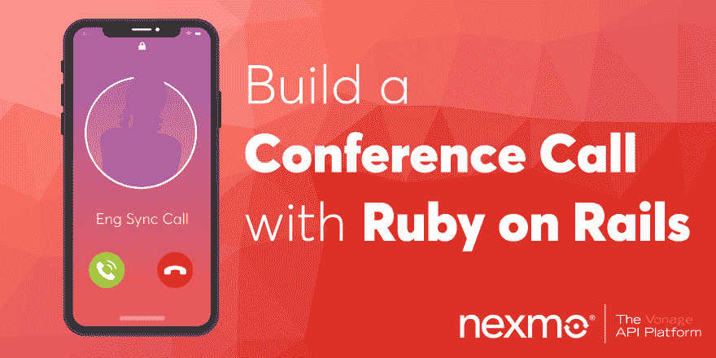
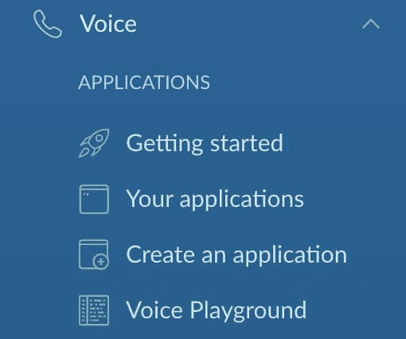
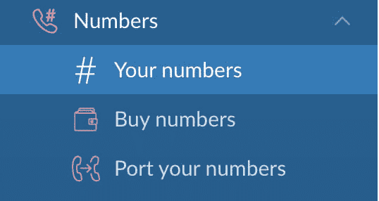

# 用 Rails 构建一个电话会议应用

> 原文：<https://dev.to/vonagedev/build-a-conference-call-app-with-rails-51j1>

[](https://res.cloudinary.com/practicaldev/image/fetch/s--6YeV72vF--/c_limit%2Cf_auto%2Cfl_progressive%2Cq_auto%2Cw_880/https://www.nexmo.com/wp-content/uploads/2019/05/ruby-conference-call.png)

在本演练中，我们将创建一个利用 Nexmo Voice API 的 Ruby on Rails 电话会议应用程序。在 Nexmo 文档中，电话会议也被称为*对话*，我们将互换使用这些术语。

您可以在 [GitHub](https://github.com/nexmo-community/nexmo-rails-conference-call) 上找到该示例的完整工作代码。

## 先决条件

要完成本教程，您需要一个 [Nexmo 帐户](https://dashboard.nexmo.com/sign-up)。如果您还没有，请立即注册。

此外，您还需要:

*   [Ruby on Rails](https://rubyonrails.org/)
*   向外界公开我们的 Rails 应用程序

## 用 Ruby on Rails 创建电话会议

我们将完成以下任务，使用 Nexmo Voice API 创建电话会议(“对话”):

1.  创建 Rails 应用程序
2.  对外公开我们的应用程序，以便 Nexmo 可以与之通信
3.  设置我们的 Nexmo 帐户，购买一个 Nexmo 电话号码，并创建一个 Nexmo 语音应用程序
4.  创建 Rails 控制器和路线

### 创建一个 Rails 应用

从命令行执行以下命令:

```
$ rails new rails-conference-call --database=postgresql 
```

Enter fullscreen mode Exit fullscreen mode

上述命令将创建一个新的 Rails 应用程序，将 PostgreSQL 作为其默认数据库。

接下来，让我们将 gem 依赖项安装到应用程序中。我们通过从终端运行`bundle install`来做到这一点。此时，我们也可以从终端运行`rake db:migrate`来设置数据库。在本教程中，我们不会使用数据库来保存数据，但是如果您愿意，可以将该特性添加到您自己的应用程序中。

此时，我们将设置 ngrok 以获取我们的外部可访问 URL，Nexmo 将使用它与我们的应用程序进行通信。

### 暴露应用程序

有几种方法可以让我们的本地开发服务器从外部访问，但是最简单的方法之一是使用 ngrok。你可以阅读[这篇文章](https://www.nexmo.com/blog/2017/07/04/local-development-nexmo-ngrok-tunnel-dr/)来获得关于 ngrok 如何工作的更详细的解释。然而，出于我们的目的，我们只需要让它运行并复制它提供给我们的 URL。

为了启动 ngrok，打开一个新的终端窗口，从命令行执行以下命令:

```
$ ngrok http 3000 
```

Enter fullscreen mode Exit fullscreen mode

现在，您将在终端窗口中看到一个 ngrok 日志记录界面。靠近界面顶部是以`Forwarding`开头的一行，包含两个 URL。第一个是外部可访问的 ngrok URL，以`ngrok.io`结尾，后跟`http://localhost:3000`，这是您的本地开发服务器。现在，当您或 Nexmo 联系到`ngrok.io` URL 时，它会将其转发到您的本地服务器。

确保将`ngrok.io` URL 复制到安全的地方。我们将在下一步设置 Nexmo 帐户、电话号码和语音应用程序时使用它。

### 用电话号码和语音应用程序创建一个 Nexmo 帐户

为了让我们的语音应用程序工作，我们需要一个 Nexmo 帐户，一个 Nexmo 提供的电话号码，一个 Nexmo 应用程序，最后，我们需要将我们的应用程序链接到我们的电话号码。

您可以免费创建一个 Nexmo 帐户，作为额外奖励，您的帐户将获得 2 欧元，以开始使用您的新应用程序。在您的网络浏览器中导航至[https://dashboard.nexmo.com/sign-up](https://dashboard.nexmo.com/sign-up)，并完成注册步骤。完成后，您将进入 Nexmo 控制面板。

从左侧菜单中，点击`Voice menu`项。您将在`APPLICATIONS`下看到以下四个选项:

[](https://res.cloudinary.com/practicaldev/image/fetch/s--Rss8Lq0g--/c_limit%2Cf_auto%2Cfl_progressive%2Cq_auto%2Cw_880/https://www.nexmo.com/wp-content/uploads/2019/04/voice-menu-options.png)

点击`Create an application`选项，您将被引导到一个页面，在这里您可以设置一个新的 Nexmo 应用程序。

用以下内容完成表格:

*   `Application name`文本字段输入`conference-call-demo`
*   `Event URL`文本字段输入您的 ngrok URL: `https://[ngrok url here]/event`
*   `Answer URL`文本字段再次输入您的 ngrok URL:`https://[ngrok url here]/webhooks/answer`

完成后，点击蓝色的`Create Application`按钮。

现在，您已经创建了一个 Nexmo 语音应用程序。我们的下一步是购买一个 Nexmo 电话号码，并将其链接到该应用程序。

在 Nexmo 仪表板上，点击左侧菜单上的`Numbers`菜单项。您将看到出现三个选项:

[](https://res.cloudinary.com/practicaldev/image/fetch/s--cSQE6jWE--/c_limit%2Cf_auto%2Cfl_progressive%2Cq_auto%2Cw_880/https://www.nexmo.com/wp-content/uploads/2019/04/numbers-menu-options.png)

点击`Buy numbers`选项，你将被引导到一个页面，在这里你可以选择一个国家，功能，类型，以及你想要的四位数字。

[](https://res.cloudinary.com/practicaldev/image/fetch/s--J-A1q3kQ--/c_limit%2Cf_auto%2Cfl_progressive%2Cq_auto%2Cw_880/https://www.nexmo.com/wp-content/uploads/2019/04/buy-numbers-menu.png)

出于我们的目的:选择您当前所在的国家，以便您可以拨打本地电话；选择`Voice`选择功能，选择手机或座机类型。您不需要为`Number`文本字段输入任何内容。当你点击`Search`，你会看到一个电话号码列表。

点击橙色`Buy`按钮选择一个，在确认提示中再次点击橙色`Buy`按钮。

一旦你拥有了这个号码，你现在就可以将它链接到你的`conference-call-demo`语音应用程序。为此，单击电话号码旁边的齿轮图标，您将看到以下菜单:

[](https://res.cloudinary.com/practicaldev/image/fetch/s--AM3-qyyy--/c_limit%2Cf_auto%2Cfl_progressive%2Cq_auto%2Cw_880/https://www.nexmo.com/wp-content/uploads/2019/05/edit-numbers-conference-call.png)

从下拉列表中选择`conference-call-demo`应用程序，并点击蓝色`Ok`按钮。您的 Nexmo 电话号码现在已链接到您的语音应用程序，并准备好通过语音代理接受和转发呼入电话。

在准备运行我们的应用程序之前，我们的最后一步是定义我们的 Rails 控制器动作和路由。

### 创建 Rails 控制器和路线

继续在`/app/controllers/`中创建一个名为`conference_controller.rb`的控制器文件。在控制器内部，我们将定义一个控制器动作。该动作将包含用于创建电话会议的 [Nexmo 呼叫控制对象(NCCO)](https://developer.nexmo.com/voice/voice-api/ncco-reference) 指令。

```
# conference_controller.rb

class ConferenceController < ApplicationController
    skip_before_action :verify_authenticity_token

    def answer
        render json: [
                {
                    :action => 'talk',
                    :text => 'Welcome to the Nexmo powered conference call'
                },
                {
                    :action => 'conversation',
                    :name => 'nexmo-conversation'
                }
            ].to_json
    end

    def event
    end
end 
```

Enter fullscreen mode Exit fullscreen mode

上述`#answer`方法中定义的 NCCO 指令包含两个动作:

1.  用一个`talk`动作欢迎来电者
2.  将主叫方置于电话会议中，也称为`conversation`。

NCCO 的第二个动作中的`conversation`的名称就是在这里定义的。它可以被称为任何东西，一旦它被初始定义，所有后续的调用者都可以被定向到它。此外，所有其他 [NCCO `conversation`选项](https://developer.nexmo.com/voice/voice-api/ncco-reference#conversation)都可以通过引用`conversation`名称为该电话会议定义。

最后，我们需要在`routes.rb`中定义路由，这样我们的 Rails 应用程序就知道将 Nexmo `GET`请求定向到哪里，以及将应用程序从 Nexmo API 接收的状态更新定向到`POST`哪里。继续打开`/config/routes.rb`并添加以下内容:

```
# routes.rb

get '/webhooks/answer', to: 'conference#answer'
post '/event', to: 'conference#event' 
```

Enter fullscreen mode Exit fullscreen mode

您会注意到，`GET`和`POST`请求的路径与我们在 Nexmo 仪表板中设置 Nexmo 语音应用程序时提供的 URL 相同。

我们的应用程序已经可以运行了！恭喜你！

### 运行应用程序

要运行你的应用程序，你只需要从命令行执行以下命令:

```
$ rails s 
```

Enter fullscreen mode Exit fullscreen mode

这将启动您的 Rails 服务器。在另一个终端窗口中，确保 ngrok 也在运行。现在，拨打您的 Nexmo 电话号码，您将听到您的应用程序对您说:“欢迎参加 Nexmo 电话会议”。您可以通过向其他人提供电话号码来邀请他们加入您的电话会议。

## 进一步阅读

如果您有兴趣探索和阅读更多内容，请考虑以下内容:

*   [Nexmo 呼叫控制对象参考指南](https://developer.nexmo.com/voice/voice-api/ncco-reference)
*   [Nexmo 语音 API 概述](https://developer.nexmo.com/voice/voice-api/overview)
*   [将呼叫者连接到会议中](https://developer.nexmo.com/voice/voice-api/code-snippets/connect-callers-into-a-conference)
*   [记录一段对话](https://developer.nexmo.com/voice/voice-api/code-snippets/record-a-conversation)