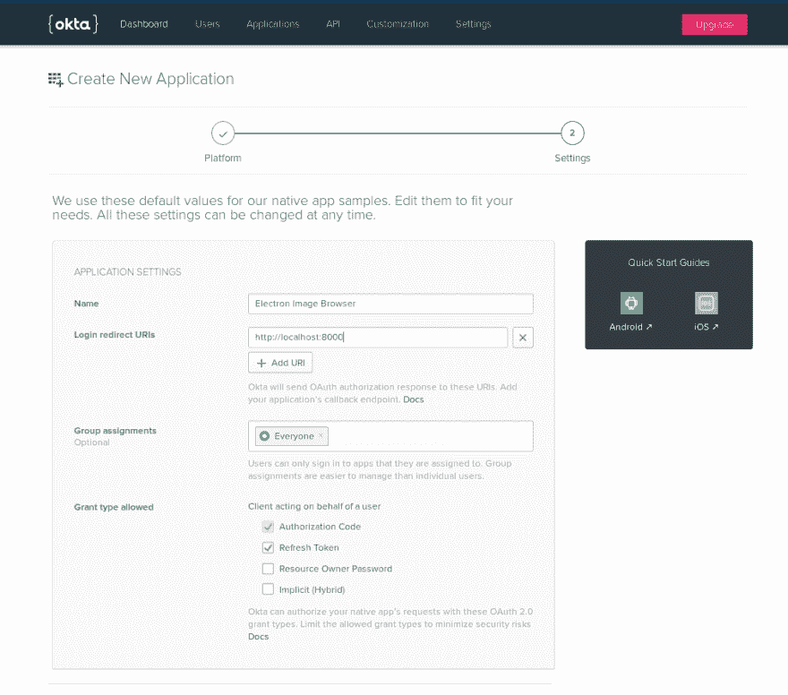

# 用角度和电子构建桌面应用程序

> 原文：<https://dev.to/oktadev/build-a-desktop-application-with-angular-and-electron-47ma>

所以，你已经学习了所有的网络技术，包括 JavaScript、HTML 和 CSS。当然，web 技术的优势在于相同的软件可以在许多不同的平台上使用。但是这种优势伴随着许多问题。Web 应用程序必须在浏览器中运行，与操作系统的互操作性有限。直接访问操作系统的特性通常是桌面应用程序的领域。它们在自己的进程中运行，可以很容易地添加到 dock 或 start 菜单中。如果您可以使用您作为 web 开发人员所熟悉的工具来开发桌面应用程序，那不是很好吗？这就是电子发挥作用的地方。

## 什么是电子？

Electron 是围绕 Chromium web 浏览器的 JavaScript 包装器。一个电子程序由两个独立的 JavaScript 线程组成。在节点内运行的外部线程，可以访问节点的操作系统库，如文件系统和进程库。然后有一个 JavaScript 线程在浏览器窗口中运行。该线程具有 web 应用程序的常见限制。外部线程和浏览器线程可以通过 electronic 提供的进程间通信(IPC)功能进行通信。Chromium 是由 Google 开发的开源网络浏览器，为 Chrome 浏览器提供了基础。它带有一个强大的 JavaScript 引擎，使得运行所有类型的现代网络应用成为可能。您可以将电子应用程序想象成普通的 web 应用程序。

在本教程中，我将向你展示如何使用电子和角度开发一个桌面应用程序。该应用程序将是一个简单的图像浏览器。Angular 将提供用户界面并处理用户交互。主要过程将是访问文件系统和读取目录内容。此外，我将向您展示如何使用 Okta 进行身份验证。

## 脚手架角形电子 App

我将从用户界面开始。我有时将应用程序的这一部分称为客户端，因为它与 web 客户端应用程序相似。希望您对 JavaScript 和 Node 有所了解。我假设您已经安装了 Node 和`npm`命令行工具。客户端将基于角度。为此，您还需要 Angular 命令行工具。打开终端，输入命令:

```
npm install -g @angular/cli@7.3.6 
```

这将安装全局`ng`命令。如果您在一个类似 Unix 的系统上，Node 将全局命令安装在一个只有超级用户可以写的目录中。在这种情况下，您必须使用`sudo`运行上面的命令。要创建新的 Angular 应用程序，请导航到您选择的目录并发出以下命令。

```
ng new ImageBrowser --routing --style=css 
```

这将创建一个目录`ImageBrowser`，并用基本角度应用程序对其进行初始化。要使用电子图书馆，你需要先安装它。在终端中，导航到`ImageBrowser`目录并运行该命令。

```
npm install --save electron@4.1.0 
```

## 构建角形应用

应用程序将使用一个服务来封装与节点进程的进程间通信。该服务是使用命令行创建的，如下所示。

```
ng generate service images 
```

这应该会创建一个新文件`src/app/images.service.ts`。打开该文件，并将以下代码粘贴到其中。

```
import { Injectable } from '@angular/core';
import { BehaviorSubject } from 'rxjs';
const electron = (<any>window).require('electron');

@Injectable({
  providedIn: 'root'
})
export class ImagesService {
  images = new BehaviorSubject<string[]>([]);
  directory = new BehaviorSubject<string[]>([]);

  constructor() {
    electron.ipcRenderer.on('getImagesResponse', (event, images) => {
      this.images.next(images);
    });
    electron.ipcRenderer.on('getDirectoryResponse', (event, directory) => {
      this.directory.next(directory);
    });
  }

  navigateDirectory(path) {
    electron.ipcRenderer.send('navigateDirectory', path);
  }
} 
```

使用看起来有些奇怪的 require 语句`const electron = (<any>window).require('electron');`导入电子浏览器库，电子浏览器通过`window`全局变量使其自身对浏览器端 JavaScript 可用。因为 TypeScript 编译器不知道这一点，所以在访问`require`函数之前，`window`必须被强制转换为`any`。Electron 为渲染器提供了实现进程间通信的`ipcRenderer`对象。`ipcRenderer.on`用于注册 IPC 消息的监听器。在这个应用程序中，您正在收听的是`getImagesResponse`和`getDirectoryResponse`，前者将接收一组图像 URL，后者将接收一组目录名。为了向节点应用程序发送一个导航到不同目录的请求，使用了`ipcRenderer.send`。

`images`和`directory`数组被发送到一个`BehaviorSubject`。通过这种方式，观察者可以获得任何更新。这些观察者将在图像浏览器组件中定义。通过在终端中调用`ng`命令来创建这个组件。

```
ng generate component browser 
```

现在，打开`src/app/browser/browser.component.ts`并将下面的代码粘贴到文件中。

```
import { Component, OnInit, ChangeDetectorRef } from '@angular/core';
import { ImagesService } from '../images.service';

@Component({
  selector: 'app-browser',
  templateUrl: './browser.component.html',
  styleUrls: ['./browser.component.css']
})
export class BrowserComponent implements OnInit {
  images: string[];
  directory: string[];

  constructor(private imageService: ImagesService, private cdr: ChangeDetectorRef) { }

  ngOnInit() {
    this.imageService.images.subscribe((value) => {
      this.images = value;
      this.cdr.detectChanges();
    });

    this.imageService.directory.subscribe((value) => {
      this.directory = value;
      this.cdr.detectChanges();
    });
  }

  navigateDirectory(path) {
    this.imageService.navigateDirectory(path);
  }
} 
```

`BrowserComponent`订阅`ImagesService`的`images`和`directory`。注意，Angular 的变化检测策略看不到由电子 IPC 调用触发的变化。因此，需要调用`ChangeDetectorRef.detectChanges()`来告诉 Angular 用任何可能发生的数据变化来更新视图。接下来，打开`src/app/browser/browser.component.html`并为浏览器组件创建模板。

```
<div class="layout">
  <div class="navigator">
    <ul>
      <li *ngFor="let dir of directory">
        <a (click)="navigateDirectory(dir)">{{dir}}</a>
      </li>
    </ul>
  </div>
  <div class="thumbnails">
    <div *ngFor="let img of images" class="image">
      
    </div>
  </div>
</div> 
```

这个模板只是在一个图像网格旁边显示一个目录列表。当单击目录链接时，应用程序请求导航到该目录。浏览器也应该在`src/app/browser/browser.component.css`中获得一些样式。

```
.layout { display: flex; }

.navigator {
    width: 300px;
    overflow: auto;
    flex-grow: 0;
    flex-shrink: 0;
    border-right: 1px solid #EEEEEE;
}

.navigator ul { list-style: none; }

.navigator a {
  cursor: pointer;
  font-family: "Courier New", monospace;
  font-size: 14px;
}

.thumbnails {
    flex-grow: 1;
    display: flex;
    flex-wrap: wrap;
}

.thumbnails .image {
    width: 25%;
    flex-shrink: 0;
    height: 200px;
    padding: 8px;
    box-sizing: border-box;
}

.thumbnails img {
    width: 100%;
    height: 100%;
    object-fit: cover;
} 
```

要将浏览器组件显示为应用程序的主要组件，请修改`src/app/app-routing.module.ts`以导入该组件，并将其作为主路由包含在`routes`数组中。

```
import { BrowserComponent } from './browser/browser.component';

const routes: Routes = [
  { path: '', component: BrowserComponent }
]; 
```

接下来，打开`src/app/app.component.html`，删除除路由器出口外的所有内容。

```
<router-outlet></router-outlet> 
```

最后，打开`src/app/app.component.ts`并修改内容以匹配下面的代码。

```
import { Component, OnInit } from '@angular/core';
import { ImagesService } from './images.service';

@Component({
  selector: 'app-root',
  templateUrl: './app.component.html',
  styleUrls: ['./app.component.css'],
})
export class AppComponent implements OnInit {
  title = 'Image Browser';

  constructor(private imageService: ImagesService) {}

  ngOnInit(): void {
    this.imageService.navigateDirectory('.');
  }
} 
```

应用程序组件通过加载当前目录的内容来初始化影像服务。这就完成了应用程序的客户端部分。如您所见，除了影像服务通过 IPC 调用进行通信之外，这是一个典型的 Angular 应用程序。您可以像任何其他 web 应用程序一样扩展这个应用程序，使用多个路由或对其他 web 服务的 HTTP 调用。

## 创建您的电子申请

电子申请将被放入它自己的目录中。对于较大的应用程序，您可能会将应用程序的两个部分完全分开保存在不同的文件夹中。为了简单起见，在本教程中，电子应用程序将在我们的应用程序目录的子目录中实现。在`ImageBrowser`目录中，创建一个新目录`electron`。将角度应用程序中的`tsconfig.json`复制到这个目录中。打开新的`tsconfig.json`，将输出目录修改为`"outDir": "./dist"`，将模块分辨率修改为`"module": "commonjs"`。还要加上设置`"skipLibCheck": true`。现在创建一个新文件`electron/main.ts`并将下面的代码粘贴到其中。

```
import { app, BrowserWindow, ipcMain } from "electron";
import * as path from "path";
import * as url from "url";
import * as fs from "fs";

let win: BrowserWindow;

function createWindow() {
  win = new BrowserWindow({ width: 800, height: 600 });

  win.loadURL(
    url.format({
      pathname: path.join(__dirname, `/../../dist/ImageBrowser/index.html`),
      protocol: "file:",
      slashes: true
    })
  );

  win.webContents.openDevTools();

  win.on("closed", () => {
    win = null;
  });
}

app.on("ready", createWindow);

app.on("activate", () => {
  if (win === null) {
    createWindow();
  }
});

// Quit when all windows are closed.
app.on('window-all-closed', () => {
  // On macOS it is common for applications and their menu bar
  // to stay active until the user quits explicitly with Cmd + Q
  if (process.platform !== 'darwin') {
    app.quit()
  }
});

function getImages() {
  const cwd = process.cwd();
  fs.readdir('.', {withFileTypes: true}, (err, files) => {
      if (!err) {
          const re = /(?:\.([^.]+))?$/;
          const images = files
            .filter(file => file.isFile() && ['jpg', 'png'].includes(re.exec(file.name)[1]))
            .map(file => `file://${cwd}/${file.name}`);
          win.webContents.send("getImagesResponse", images);
      }
  });
}

function isRoot() {
    return path.parse(process.cwd()).root == process.cwd();
}

function getDirectory() {
  fs.readdir('.', {withFileTypes: true}, (err, files) => {
      if (!err) {
          const directories = files
            .filter(file => file.isDirectory())
            .map(file => file.name);
          if (!isRoot()) {
              directories.unshift('..');
          }
          win.webContents.send("getDirectoryResponse", directories);
      }
  });
}

ipcMain.on("navigateDirectory", (event, path) => {
  process.chdir(path);
  getImages();
  getDirectory();
}); 
```

不要被你在这里看到的大量内容吓倒。我会一步一步地告诉你这个文件。

在文件的顶部，声明了一个全局变量`win`。在下面的函数`createWindow()`中，该变量被赋予一个新的`BrowserWindow`。`BrowserWindow`是电子的申请窗口。它被称为浏览器窗口，因为它实际上是一个简单的 Chromium 浏览器，可以托管您的 Angular 应用程序。在`win`被创建后，用`win.loadURL()`将内容载入其中。路径应该指向编译好的 Angular app 的`index.html`。

第`win.webContents.openDevTools()`行打开 Chromium 内部的开发工具。这应该仅用于开发。但它允许你使用你可能从 Chrome 浏览器中熟悉的全套开发者工具。

接下来，一个事件处理程序被添加到窗口中，当窗口关闭时它被激活，将变量`win`设置为`null`。稍后，当应用程序再次被激活时，可以检查`win`并创建一个新窗口。这是在`app.on("activate", ...)`处理器中完成的。

通过调用`app.on("ready", createWindow)`向`ready`事件注册`createWindow`函数。`window-all-closed`事件表示所有窗户都已关闭。在大多数平台上，这会终止应用程序。但是，在 macOS 上，关闭窗口通常不会终止应用程序。

两个函数`getImages`和`getDirectory`执行相似的操作。它们都读取当前目录并过滤其内容。`getImages`选择所有以`.png`或`.jpg`结尾的文件，并为每个文件创建一个完整的 URL。然后，它将结果发送到`getImagesResponse` IPC 通道。这将由应用的角度部分的`ImagesService`接收。`getDirectory`非常相似，但是它只选择目录并将结果发送给`getDirectoryResponse`。注意，文件系统的`fs.readdir`没有返回父目录的条目。所以当当前目录不是根目录时，`..`条目被手动添加到列表中。

最后，添加一个 IPC 监听器来监听`navigateDirectory`事件。这个侦听器更改当前目录，然后从新目录中检索所有图像和目录。

要运行完整的应用程序，您可以将以下脚本添加到您的`package.json`中。

```
"electron":  "ng build --base-href ./ && tsc --p electron && electron electron/dist/main.js" 
```

这个脚本首先构建角度应用程序，然后是电子应用程序，最后启动电子。您可以通过调用以下命令来运行它。

```
npm run electron 
```

如果您做的一切都正确，应用程序应该编译，然后您应该看到一个窗口弹出，让您浏览目录和查看其中的图像。

## 为您的 Angular 电子桌面应用添加认证

您可能希望限制注册用户对桌面应用程序的访问。 [Okta](https://developer.okta.com/) 允许您快速设置安全认证，并拥有完全的用户控制。这意味着您可以自由决定谁可以使用您的应用程序，谁不可以。

首先，你必须在 Okta 注册一个[免费开发者账户。在浏览器中导航至`https://developer.okta.com`，点击登录链接，填写接下来出现的表格，然后点击`Get Started`按钮。完成注册流程后，您可以导航至 Okta 仪表盘。在顶部菜单中选择`Applications`，创建你的第一个应用程序。为此，点击绿色按钮“添加应用程序”。](https://developer.okta.com/signup/)

在接下来出现的屏幕上，选择`Native`并点击`Next`。下一个屏幕允许您编辑设置。登录重定向 URI 是成功登录后接收身份验证令牌的位置。这应该与应用程序中的重定向 URI 相匹配。在本例中，将其设置为`http://localhost:8000`。完成后，点击`Done`按钮。出现的屏幕将为您提供一个客户端 ID，您需要将它粘贴到您的应用程序中。

[](https://res.cloudinary.com/practicaldev/image/fetch/s--JjElMUI6--/c_limit%2Cf_auto%2Cfl_progressive%2Cq_auto%2Cw_880/https://developer.okta.com/assets-jekyll/blog/angular-electron-browser/new-native-app-ca3272ef83adf09ddc57168f0dd2c8ecb7ae63471e324a9426a167cbb8509175.png)

我将使用谷歌的 AppAuth 库，它允许通过 OIDC 和 OAuth 2.0 认证。您可以使用以下命令安装该库。

```
npm install --save @openid/appauth@1.2.2 
```

Google 提供了一个如何集成 AppAuth 和 electronic 的例子。为了简化您的工作，您可以将身份验证流用于您自己的应用程序。将 [`flow.ts`](https://raw.githubusercontent.com/googlesamples/appauth-js-electron-sample/master/flow.ts) 示例的内容复制到您的`electron`文件夹中的`flow.ts`文件中。在文件顶部附近，找到以下几行。

```
/* an example open id connect provider */
const openIdConnectUrl = "https://accounts.google.com";

/* example client configuration */
const clientId =
  "511828570984-7nmej36h9j2tebiqmpqh835naet4vci4.apps.googleusercontent.com";
const redirectUri = "http://127.0.0.1:8000";
const scope = "openid"; 
```

用以下内容替换它们。

```
const openIdConnectUrl = 'https://{yourOktaDomain}/oauth2/default';
const clientId = '{yourClientId}';
const redirectUri = 'http://localhost:8000';
const scope = 'openid profile offline_access'; 
```

为了简化示例，用`const log = console.log;`替换记录器的导入`import { log } from "./logger";`。现在，再次打开`electron/main.ts`。在文件的顶部，从`flow.ts`导入一些类。

```
import { AuthFlow, AuthStateEmitter } from './flow'; 
```

然后，在同一文件的底部添加以下代码片段。

```
const authFlow = new AuthFlow();

authFlow.authStateEmitter.on(
    AuthStateEmitter.ON_TOKEN_RESPONSE, createWindow
);

async function signIn() {
  if (!authFlow.loggedIn()) {
    await authFlow.fetchServiceConfiguration();
    await authFlow.makeAuthorizationRequest();
  }
} 
```

函数`signIn()`将检查用户是否登录，如果没有，则发出授权请求。当用户成功登录时,`authStateEmitter`将收到一个`ON_TOKEN_RESPONSE`。然后它将调用`createWindow`来启动应用程序。为了调用`signIn`方法，将应用程序的`ready`事件的处理程序改为如下。

```
app.on('ready', signIn); 
```

试一试，运行下面的命令。

```
npm run electron 
```

您的默认网络浏览器应该会打开，并要求您登录您的 Okta 帐户。成功登录后，图像浏览器应用程序将会打开。

[](https://res.cloudinary.com/practicaldev/image/fetch/s--rAWD9XNN--/c_limit%2Cf_auto%2Cfl_progressive%2Cq_auto%2Cw_880/https://developer.okta.com/assets-jekyll/blog/angular-electron-browser/image-browser-0e7c923237f6b7e70746102b382dec45740f7cc6f802e216382ff252d59684e2.png)

## 了解更多关于角和电子的知识

在本教程中，我已经向你展示了如何创建一个带有角度和电子的桌面应用程序。使用 Google 的 AppAuth 库添加了 Okta 的认证控制。Electron 使得使用当前的 web 技术和创建本地桌面应用程序变得简单明了。电子公司使用 Chromium 浏览器运行网络客户端。浏览器由节点进程控制。要了解有关电子、角度和认证的更多信息，请访问以下链接。

*   [更深入地了解电子认证流程](https://developer.okta.com/blog/2018/09/17/desktop-app-electron-authentication)
*   [构建您的第一个带角度的 PWA](https://developer.okta.com/blog/2019/01/30/first-angular-pwa)
*   [了解如何为任何网页添加认证](https://developer.okta.com/blog/2018/06/08/add-authentication-to-any-web-page-in-10-minutes)
*   [了解 Angular 7 的更多新功能](https://developer.okta.com/blog/2018/12/04/angular-7-oidc-oauth2-pkce)

本教程的代码可在 GitHub 上获得，一如既往，在评论中留下你的问题或反馈，或者在 Twitter 上联系我们 [@oktadev](https://twitter.com/oktadev) 。