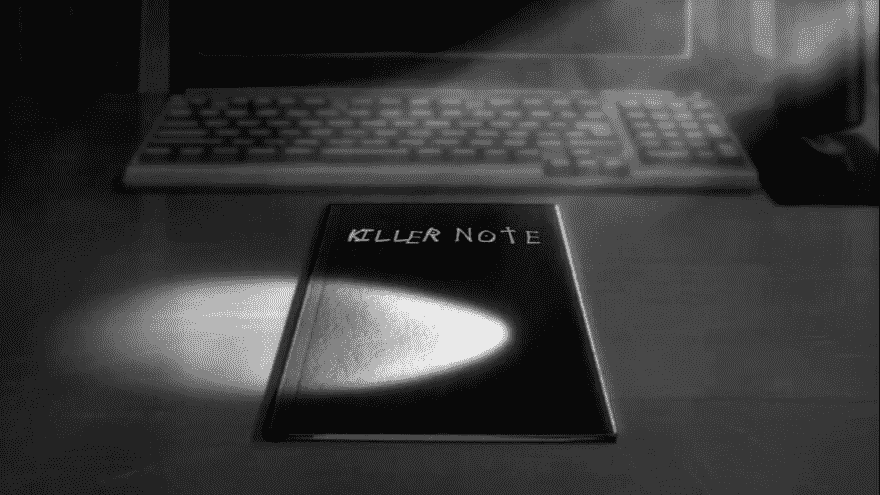

# 建立一个黑仔笔记系统

> 原文：<https://dev.to/kevcui/build-a-killer-note-taking-system-2b5n>

[](https://res.cloudinary.com/practicaldev/image/fetch/s--SadYDxUP--/c_limit%2Cf_auto%2Cfl_progressive%2Cq_auto%2Cw_880/https://thepracticaldev.s3.amazonaws.com/i/k9g5yk2nsb7vfgz12msc.jpg)

谚语说，“最苍白的墨水胜过最好的记忆”。做笔记当然是知识学习、信息收集和保留的重要组成部分。在快速变化的数字时代，笔、墨水和纸可能无法再完成记笔记的重要工作。那么，如今什么是杀手级的笔记系统呢？

### 我的要求？

我的梦想系统必须是*简单*、*高效*和*灵活*:

*   知道在哪里以及如何毫不犹豫地写笔记
*   找到正确的笔记，轻松高效地回滚到旧的更改
*   将笔记转换为其他格式，轻松灵活地分享

### 造吧！

#### 备注格式

我喜欢用 markdown 做笔记。为什么降价？

*   这是干净的写作和阅读
*   它很高效，几乎就像写纯文本一样
*   转换成任何其他格式都很灵活

#### 记笔记&机构 app

我喜欢在终端中做任何事情，所以自然地，Vim 是我最好的笔记编辑器。

为了组织笔记，一开始，我为不同的笔记设置了不同的文件夹。但是和我想要的不太接近。特别是，搜索笔记不是一件简单的事情，它需要`find`或`grep`一段时间。然后我写了一个方便的脚本 [pynote](https://github.com/KevCui/pynote) 来帮助组织笔记，它起作用了，而且只在“它起作用”的级别...最近，我切换到 Vim 的惊人的[符号速度，一个将著名的](https://github.com/alok/notational-fzf-vim)[符号速度](http://notational.net/)移植到 Vim 的插件。整个记笔记的体验从来没有变得这么流畅过！💆

#### 注版本控制系统

很简单。Git 是我能想到的唯一合理的选择。`¯\_(ツ)_/¯`

`git init`，进行音符修改，`git add`，`git commit`或`git revert`...所有花里胡哨的版本控制的东西在我手底下都已经很熟悉了。

#### 注意自动备份系统

Google Drive？OneDrive？Dropbox？不，默认情况下它们不是真正的 Git 兼容的。然而，我受到了 Git 支持的开源文件同步应用程序 [SparkleShare](https://github.com/hbons/SparkleShare) 的启发，它添加文件更改并自动将其推送到 Github 或 GitLab。

我可以通过使用一个简单的脚本来实现相同的功能。这个想法是在后台运行 [fswatch](https://github.com/emcrisostomo/fswatch) 并持续监控文件变化。当文件发生更改时，fswatch 将触发 Git 命令来自动添加和推送更改。

下面是 Bash 脚本的一个片段:

```
#!/usr/bin/env bash
...
function notesync() {
  fswatch -r -0 -d "$1" -e '\.git' -m "inotify_monitor" --event=Created --event=Updated --event=Removed | xargs -0 -n 1 zsh -c "source ~/.zshrc; cd $1; git add -A; git commit -m 'Update file'; git push" &
}
notesync "<folder_path>"
notesync "<another_folder_path>"
... 
```

**fswatch 部分**是监控文件变化，过滤出正确的文件变化事件，并发出信号:

```
fswatch -r -0 -d "$1" -e '\.git' -m "inotify_monitor" --event=Created --event=Updated --event=Removed | ... & 
```

*   -r:递归监视子目录
*   -0:传递 NUL 作为分隔符(不知道为什么需要它.....)
*   -d:要监视的目录，目标文件夹中装满了便笺
*   -e:输出匹配正则表达式的路径，这里我不想在`.git`中发生任何变化时触发 Git 命令
*   -m: monitor，键入`fswatch -M`查看可用的监视器，所有可用监视器的更多细节:[此处](https://emcrisostomo.github.io/fswatch/doc/1.14.0/fswatch.html/Monitors.html#Available-Monitors)
*   - event:根据事件标志过滤事件，主要使用与文件更改相关的事件，所有可用的事件:[此处](https://emcrisostomo.github.io/fswatch/doc/1.14.0/fswatch.html/Invoking-fswatch.html#Event-Flags-1)
*   &:最后但并非最不重要的一点是，不要在最后忘记它，因为它提供了在后台运行 fswatch 命令和分离进程的能力

**xargs 部分**是从 fswatch 获取信号并执行具体命令:

```
... | xargs -0 -n 1 ... 
```

*   -0:输入项以 null 结束，而不是空白(不知道为什么需要它...)
*   -n:最大参数，`1`它是

**zsh 命令部分**是运行 Git 命令:

```
... zsh -c "source ~/.zshrc; cd $1; git add -A; git commit -m 'Update file'; git push" ... 
```

*   zsh -c:执行`zsh`中的以下命令
*   来源~/。zshrc:我所有的 SSH 密钥都在`.zshrc`文件中声明，这个命令将从`.zshrc`文件中加载配置。否则，删除 Git 存储库的请求可能会被拒绝
*   git add -A...:Git 命令添加更改并推送到远程存储库。一些优化思路:1) `git pull`首先，万一是共享库；2)在提交消息中放置一些特定的文本，可能还包括文件名

#### Sumup

这是我的杀手笔记系统。简单、高效、灵活:

```
Note format: Markdown
Note taking & organization app: Vim + Notational Velocity for Vim
Note version-control system: Git
Note auto backup system: fswatch + GitHub 
```

到目前为止，我对这个系统很满意。我不仅喜欢用它来记录我不可告人的秘密，还喜欢在日常工作中与同事分享笔记，比如用于[探索性测试](https://kevcui.github.io/2017/04/17/how-i-do-exploratory-testing/)的笔记。哦，我差点忘了，猜猜我现在用什么写这篇博文？

你的笔记系统是什么样子的？和我分享你的好主意？