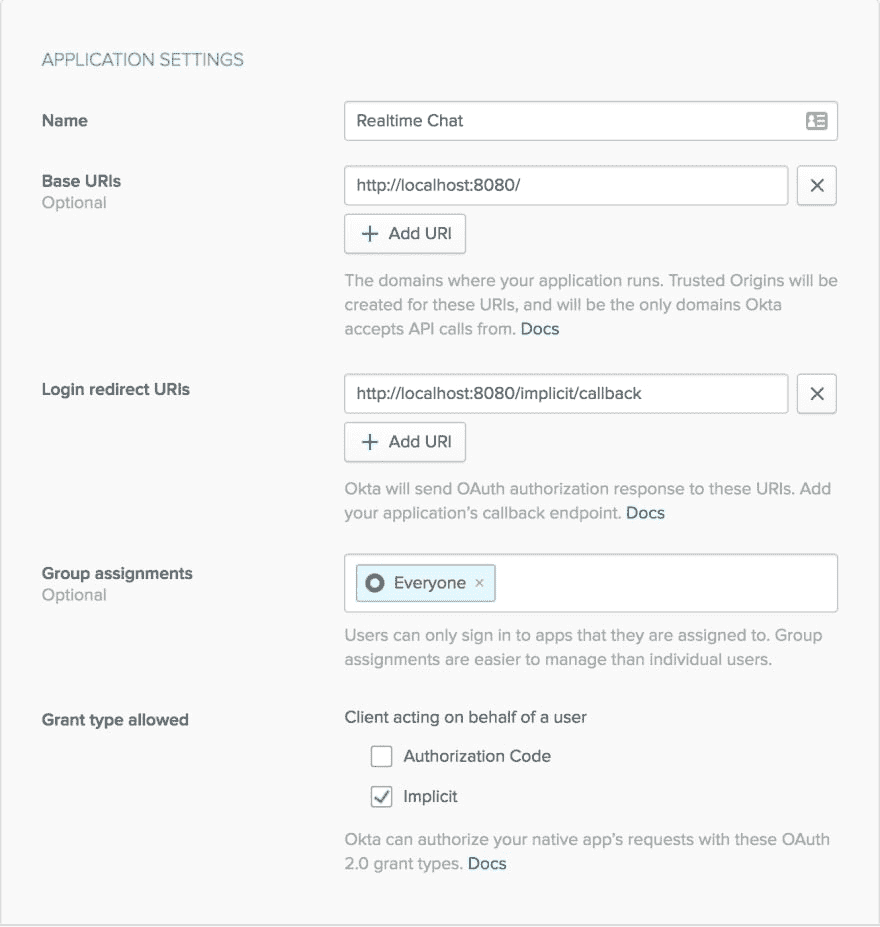
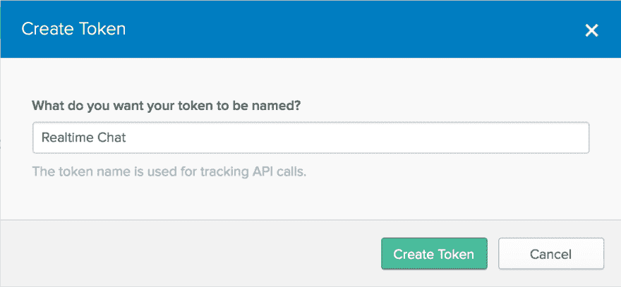

# 用 TypeScript 构建 Node.js API

> 原文：<https://dev.to/oktadev/build-a-node-js-api-with-typescript-5ek9>

JavaScript 已经成为越来越强大的语言，不再仅仅出现在浏览器中。服务器端 JavaScript 变得非常重要。然而，JavaScript 的一个主要特点是*不是*，它是一种强类型语言。明确函数参数或对象和类属性的类型有助于防止代码中出现错误。例如，如果您确切地知道需要将什么类型的值传递给 API 调用，这也有助于使代码更容易理解。

如果你同时喜欢 JavaScript 和强类型语言，那么你很幸运。TypeScript 是 JavaScript 的超集，为定义类型提供了一些额外的语法。今天我将向您展示如何使用 TypeScript 为实时聊天应用程序编写一个简单的 API。问题是消息会在短时间后过期，并从服务器和客户端被删除，所以如果你想保持对话，你必须注意。我还将向您展示如何使用 React 创建一个简单的前端来与 API 交互。您还将使用 [Okta](https://developer.okta.com/signup/) 来添加用户认证，这样您就不会只有一堆匿名消息。

## 设置你的 TypeScript + Node.js 服务器

如果您还没有安装节点，那么您需要先安装。这是本教程唯一真正的先决条件。要查看您是否安装了它，请尝试在终端中键入`node --version`。您将希望得到类似于`v8`或更高的响应。如果出现错误，您可能需要安装它。我推荐通过 [nvm](https://github.com/creationix/nvm) 安装。安装应该是这样的:

```
curl -o- https://raw.githubusercontent.com/creationix/nvm/v0.34.0/install.sh | bash 
```

但是如果这不起作用，去[文档](https://github.com/creationix/nvm#installation-and-update)看看如何让它为你的系统运行起来。

运行 Node 后，为您的聊天服务器创建一个新目录，然后使用`npm`为您创建一个 package.json 文件:

```
mkdir real-time-chat
cd real-time-chat
npm init -y 
```

编辑`package.json`文件，使`"main"`条目显示为`"dist/index.js"`。然后编辑`"scripts"`条目，得到如下脚本:

```
"scripts": {
  "prebuild": "tslint -c tslint.json -p tsconfig.json --fix",
  "build": "tsc",
  "prestart": "npm run build",
  "start": "node .",
  "dev": "ts-node-dev src/index.ts",
  "test": "echo \"Error: no test specified\" && exit 1"
} 
```

您还需要安装一些依赖项:

```
npm install express@4.16.4
npm install --save-dev typescript@3.3.3333 ts-node-dev@1.0.0-pre.32 tslint@5.13.1 @types/node@11.11.3 @types/express@4.16.1 
```

您需要为 typescript 创建一些配置文件。创建一个`tslint.json`文件:

```
{  "defaultSeverity":  "error",  "extends":  [  "tslint:recommended"  ]  } 
```

和一个`tsconfig.json`文件:

```
{  "compilerOptions":  {  "module":  "commonjs",  "esModuleInterop":  true,  "allowSyntheticDefaultImports":  true,  "target":  "es6",  "noImplicitAny":  true,  "moduleResolution":  "node",  "sourceMap":  true,  "outDir":  "dist",  "baseUrl":  ".",  "paths":  {  "*":  [  "node_modules/*"  ]  }  },  "include":  [  "src/**/*"  ],  "exclude":  [  "src/client"  ]  } 
```

现在 TypeScript 配置已经准备好了，创建一个新文件夹`src`和一个新文件`src/index.ts` :

```
import express from "express";

const app = express();
const port = 8080 || process.env.PORT;

app.get("/", (req, res) => {
  res.send("Hi!");
});

app.listen(port, () => {
  // tslint:disable-next-line:no-console
  console.log(`server started at http://localhost:${port}`);
}); 
```

如果你现在用`npm run dev`运行代码，你应该在`http://localhost:8080`得到一个网站，上面写着`Hi!`。还没什么特别的。

## 为你的 Node.js + TypeScript API 设置一个 React 前端

另一个优秀的开发工具是 Parcel。它为前端提供了一种非常简单的捆绑 JavaScript 或 TypeScript 代码的方法，因此您可以使用熟悉的`import`语法并使用`npm`安装软件包，但最终您的客户只能得到一个缩减为他们所需代码的捆绑包。

要用 React 进行设置，需要添加以下依赖项:

```
npm install react@16.8.5 react-dom@16.8.5
npm install --save-dev parcel-bundler@1.12.3 @types/parcel-bundler@1.10.2 @types/react@16.8.8 @types/react@16.8.2 @babel/core@7.3.4 @babel/preset-env@7.3.4 
```

在`src/client` :
中为您的客户端代码创建一个新文件夹

```
mkdir src/client 
```

您将需要第二个配置文件来让 TypeScript 知道客户端应该为 web 而不是为 Node 打包。创建一个新文件`src/client/tsconfig.json`

```
{  "compilerOptions":  {  "lib":  [  "es6",  "dom"  ],  "allowSyntheticDefaultImports":  true,  "jsx":  "react",  "module":  "es6",  "target":  "es6",  "moduleResolution":  "node",  "sourceMap":  true,  "outDir":  "../../dist",  "baseUrl":  ".",  "paths":  {  "*":  [  "../../node_modules/*"  ]  }  },  "include":  [  "./**/*"  ]  } 
```

然后创建一个新文件`src/client/index.html` :

```
<!doctype html>
<html>
  <head>
    Real-Time Chat
  </head>
  <body>
    <main id="root"></main>
    <script src="./index.tsx"></script>
  </body>
</html> 
```

然后，您需要创建上面提到的`src/client/index.tsx`文件。

```
import React from "react";
import ReactDOM from "react-dom";

import App from "./App";

ReactDOM.render(
  <App />,
  document.getElementById("root"),
); 
```

以及`src/client/App.tsx` :

```
import React from "react";

export default () => <div>Hello world</div>; 
```

现在您已经设置了客户端，您需要告诉 Express 如何使用 Parcel 提供内容。编辑您的`src/index.ts`文件:

```
// These should be at the top of the file
import Bundler from "parcel-bundler";
import path from "path";

// replace the call to app.get with:
const bundler = new Bundler(path.join(__dirname, "../src/client/index.html"));
app.use(bundler.middleware()); 
```

经过这些修改，您的`src/index.ts`现在应该是这样的:

```
import express from "express";
import Bundler from "parcel-bundler";
import path from "path";

const app = express();
const port = 8080 || process.env.PORT;

const bundler = new Bundler(path.join(__dirname, "../src/client/index.html"));
app.use(bundler.middleware());

app.listen(port, () => {
  // tslint:disable-next-line:no-console
  console.log(`server started at http://localhost:${port}`);
}); 
```

## 用套接字发送和接收消息。超正析象管(Image Orthicon)

对于实时应用程序，套接字。IO 使得在服务器和任何连接的客户端之间来回发送消息变得容易。它使用 WebSockets 保持连接打开，因此消息是即时的，但在 WebSockets 不可用的情况下，它确实会退回到轮询。您需要为此添加一些新的依赖项:

```
npm install immutable@4.0.0-rc.12 socket.io@2.2.0 socket.io-client@2.2.0 uuid@3.3.2
npm install --save-dev @types/socket.io@2.1.2 @types/uuid@3.4.4 sass@1.17.3 
```

### 设置后端

要设置后端，创建一个新文件`src/socket.ts` :

```
import { Server, Socket } from "socket.io";
import uuid from "uuid/v4";

const messageExpirationTimeMS = 10 * 1000;

export interface IUser {
  id: string;
  name: string;
}

const defaultUser: IUser = {
  id: "anon",
  name: "Anonymous",
};

export interface IMessage {
  user: IUser;
  id: string;
  time: Date;
  value: string;
}

const sendMessage = (socket: Socket | Server) =>
  (message: IMessage) => socket.emit("message", message);

export default (io: Server) => {
  const messages: Set<IMessage> = new Set();

  io.on("connection", (socket) => {
    socket.on("getMessages", () => {
      messages.forEach(sendMessage(socket));
    });

    socket.on("message", (value: string) => {
      const message: IMessage = {
        id: uuid(),
        time: new Date(),
        user: defaultUser,
        value,
      };

      messages.add(message);

      sendMessage(io)(message);

      setTimeout(
        () => {
          messages.delete(message);
          io.emit("deleteMessage", message.id);
        },
        messageExpirationTimeMS,
      );
    });
  });
}; 
```

这可能很难理解，所以我将分解成几个部分。

这里您定义了类型，在 TypeScript 中称为接口。当您没有用户信息时，您还会创建一个默认用户(稍后您将通过身份验证添加该用户)。

```
export interface IUser {
  id: string;
  name: string;
}

const defaultUser: IUser = {
  id: "anon",
  name: "Anonymous",
};

export interface IMessage {
  user: IUser;
  id: string;
  time: Date;
  value: string;
} 
```

下一个函数实际上返回了另一个函数。这种模式在函数式编程中很常见。这样做并不是绝对必要的，但会使一些事情在以后变得更加清晰(主观上)。

```
const sendMessage = (socket: Socket | Server) =>
  (message: IMessage) => socket.emit("message", message); 
```

这里您导出了一个接受套接字的函数。IO 服务器并添加了一些监听器。这使用 es6 `Set`来跟踪消息。这将便于以后删除它们，而不必搜索整个数组。

当客户端连接到服务器时，它会在您添加了监听器的地方触发回调，就像下面的`io.on("connection", listener)`一样。当服务器接收到一个`getMessages`信号时，它会将当前所有的消息发送给客户端。客户端需要在完成连接后发送该消息。

当客户端发送一条消息时，这条消息被添加到消息的`Set`中，它有一个惟一的 ID、当前的时间戳，目前只有默认的匿名用户。然后，它将该消息发送给所有连接的客户端。

为了在设定的时间段后删除消息，设置为 10 秒的超时(您可以通过编辑`messageExpirationTimeMS`来调整该数字)将从消息的`Set`中删除该消息，并向所有客户端发送消息以通过 ID 删除该消息。实际删除消息将由客户端决定，但是由于消息已经从`Set`中删除，新的客户端将不会收到该消息。

```
export default (io: Server) => {
  const messages: Set<IMessage> = new Set();

  io.on("connection", (socket) => {
    socket.on("getMessages", () => {
      messages.forEach(sendMessage(socket));
    });

    socket.on("message", (value: string) => {
      const message: IMessage = {
        id: uuid(),
        time: new Date(),
        user: defaultUser,
        value,
      };

      messages.add(message);

      sendMessage(io)(message);

      setTimeout(
        () => {
          messages.delete(message);
          io.emit("deleteMessage", message.id);
        },
        messageExpirationTimeMS,
      );
    });
  });
}; 
```

您现在需要初始化`src/index.ts`中的套接字。添加以下导入:

```
import http from "http";
import SocketIOServer from "socket.io";

import initializeSocketIO from "./socket"; 
```

在创建了`app`变量之后，添加以下内容:

```
const server = new http.Server(app);
const io = SocketIOServer(server);

initializeSocketIO(io); 
```

然后把`app.listen`改成`server.listen`。

```
// this was `app.listen`
server.listen(port, () => {
  // tslint:disable-next-line:no-console
  console.log(`server started at http://localhost:${port}`);
}); 
```

您的完整的`src/index.ts`文件现在应该看起来像这样:

```
import express from "express";
import http from "http";
import Bundler from "parcel-bundler";
import path from "path";
import SocketIOServer from "socket.io";

import initializeSocketIO from "./socket";

const app = express();
const server = new http.Server(app);
const io = SocketIOServer(server);
const port = 8080 || process.env.PORT;

const bundler = new Bundler(path.join(__dirname, "../src/client/index.html"));

initializeSocketIO(io);
app.use(bundler.middleware());

server.listen(port, () => {
  // tslint:disable-next-line:no-console
  console.log(`server started at http://localhost:${port}`);
}); 
```

### 设置前端

您的服务器现在已经准备就绪。接下来，您需要为客户机创建几个新组件来与套接字进行交互。

创建一个`src/client/NewMessage.tsx`组件，允许您向服务器发送新消息:

```
import React, { SyntheticEvent, useState } from "react";
import { Socket } from "socket.io";

interface IProps {
  socket: Socket;
}

const NewMessage = ({ socket }: IProps) => {
  const [value, setValue] = useState("");
  const submitForm = (e: SyntheticEvent) => {
    e.preventDefault();
    setValue("");

    socket.emit("message", value);
  };

  return (
    <form onSubmit={submitForm}>
      <input
        autoFocus
        value={value}
        onChange={(e: SyntheticEvent<HTMLInputElement>) => {
          setValue(e.currentTarget.value);
        }}
      />
    </form>
  );
};

export default NewMessage; 
```

这建立了一个简单的表单，这样当你点击`Enter`时就会触发表单提交。然后您可以劫持那个，`preventDefault`来阻止表单刷新页面，将值发送到服务器，并将输入重置为空字符串。一些类型的脚本贯穿始终，以确保您得到您所期望的。

您还需要一种显示消息的方式。创建一个新的`src/client/MessageList.tsx`组件:

```
import { Map } from "immutable";
import React, { SyntheticEvent, useEffect, useState } from "react";

import "./MessageList.scss";

import { IMessage } from "../socket";

const MessageList = ({ socket }) => {
  const [messages, setMessages] = useState(Map());

  useEffect(() => {
    const messageListener = (message: IMessage) => {
      setMessages((prevMessages) => prevMessages.set(message.id, message));
    };

    const deleteMessageListener = (messageID: string) => {
      setMessages((prevMessages) => prevMessages.delete(messageID));
    };

    socket.on("message", messageListener);
    socket.on("deleteMessage", deleteMessageListener);
    socket.emit("getMessages");

    return () => {
      socket.off("message", messageListener);
      socket.off("deleteMessage", deleteMessageListener);
    };
  }, [socket]);

  return (
    <div className="message-list">
      {messages
        .toSet()
        .sortBy((message: IMessage) => message.time)
        .map((message: IMessage) => (
          <div
            key={message.id}
            className="message-list--message-container"
            title={`Sent at ${new Date(message.time).toLocaleTimeString()}`}
          >
            <span className="message-list--message">{message.value}</span>
            <span className="message-list--user">{message.user.name}</span>
          </div>
        )).toArray()
      }
    </div>
  );
};

export default MessageList; 
```

上面的组件使用来自[的不可变](https://immutable-js.github.io/immutable-js/)的`Map`来确保在设置一个值时返回一个新的`Map`。这将使 React 检测到状态发生了变化，以便呈现新数据。为了得到`prevMessages`，使用`setMessages`的功能版本是很重要的。否则，您将使用`messages`作为闭包，它将继续尝试将值设置为原来的`Map`，这意味着您将只能看到一条消息。

当使用`useEffect`时，您可以返回一个将在清理期间运行的函数。这将从套接字中删除侦听器，因此即使在组件被卸载后，这些函数也不会被调用。注意作为第二个参数传递给`useEffect` ( `useEffect(addListeners, [socket])`)的`[socket]`也很重要。这告诉它只在数组中的一个值改变时更新，这意味着它只在传入新的套接字时运行。如果没有这些，您将删除侦听器并在每次渲染时读取它们，然后发送一条消息来获取新消息，并且您将陷入永无止境的循环中。

我还添加了一些基本样式，使它看起来更容易阅读。你需要用下面的内容创建一个新的文件`src/client/MessageList.scss`(但是你可以随意调整它以满足你的需要……目前还没什么新奇的东西):

```
.message-list {
  max-width: 500px;
  width: 100%;

  .message-list--message-container {
    display: flex;
    font-size: 14px;
    justify-content: space-between;
    align-items: center;

    .message-list--user {
      font-size: 1.1em;
      font-weight: bold;
      justify-content: flex-end;
    }

    .message-list--message {
      flex: 1;
      display: flex;
      justify-content: flex-start;
      padding-right: 10px;
    }
  }
} 
```

现在将这些添加到你的应用中，编辑`src/client/App.tsx`如下:

```
import React from "react";
import io from "socket.io-client";

import MessageList from "./MessageList";
import NewMessage from "./NewMessage";

const socket = io(location.origin);

export default () => (
  <div>
    <MessageList socket={socket} />
    <NewMessage socket={socket} />
  </div> ); 
```

## 给你的 Node.js + TypeScript API 添加用户认证

现在，您应该能够连接到您的服务器并发送实时发布的消息。您可以连接多个人，他们都应该收到所有的消息，并且他们应该在 10 秒钟后为所有客户端删除。

然而，最大的缺失是所有用户都是“匿名”的。你可以让用户简单地添加他们的名字，但这并不能保证他们就是他们所说的那个人。相反，您可以使用 Okta 添加用户认证，以便于管理和验证用户。

[Okta](https://developer.okta.com/) 是一种云服务，允许开发者创建、编辑和安全存储用户账户和用户账户数据，并将它们与一个或多个应用程序连接。

如果你还没有，那么[注册一个永远免费的开发者账户](https://developer.okta.com/signup/)。登录你的开发者控制台，导航到**应用**，然后点击**添加应用**。选择**单页 App** ，然后点击**下一步**。你可以保持所有设置不变，只需将应用程序的名称改为有意义的名称。设置应该如下所示:

[](https://res.cloudinary.com/practicaldev/image/fetch/s--gam0Xyf_--/c_limit%2Cf_auto%2Cfl_progressive%2Cq_auto%2Cw_880/https://developer.okta.com/assets-jekyll/blog/node-typescript/create-new-application-settings-1696072a5fe917fd13d5091f08eeccc19b142111267715073e0e9b34b2444868.png)

点击 **Done** 保存你的 app，然后复制你的**客户端 ID** 并作为变量粘贴到你的项目根目录下名为`.env`的文件中。这将允许您在代码中访问该文件，而无需在源代码管理中存储凭据。您还需要添加您的组织 URL(不带`-admin`后缀)。文件最终应该是这样的:

```
OKTA_ORG_URL=https://{yourOktaDomain}
OKTA_CLIENT_ID={yourClientId} 
```

Okta 提供了一个 API，允许您查找用户信息，以及其他许多信息。Okta 还有一个节点库，让它变得非常简单。为了让您的应用程序通过 Okta 认证，以便您可以查找用户信息，例如他们的姓名，您需要一个 API 令牌。在您的仪表板上，从标题中的 **API** 下拉列表中选择**令牌**。点击**创建令牌**，并给它起一个有意义的名字。这一次它会给你一个令牌——如果你丢失了它，你需要重新创建一个。

[](https://res.cloudinary.com/practicaldev/image/fetch/s--oC2Mddgo--/c_limit%2Cf_auto%2Cfl_progressive%2Cq_auto%2Cw_880/https://developer.okta.com/assets-jekyll/blog/node-typescript/create-token-bad23cdc0a4bc1da8c09ff869333e93d92c7f98939c4a0bf43e58ce5b5dfad8f.png)

继续将它作为`OKTA_TOKEN`添加到您的`.env`文件中，这样它现在看起来就像这样:

```
OKTA_ORG_URL=https://{yourOktaOrgUrl}
OKTA_CLIENT_ID={yourClientId}
OKTA_TOKEN={yourToken} 
```

### 添加服务器端认证

为了让您的服务器读取环境变量，您需要使用`dotenv`。你还需要安装 [Okta SDK](https://developer.okta.com/code/nodejs/) 和一个 JWT 验证器来确保用户发送的令牌是有效的。安装这些依赖项:

```
npm install dotenv@7.0.0 @okta/jwt-verifier@0.0.14 @okta/okta-sdk-nodejs@2.0.0
npm install --save-dev @types/dotenv@6.1.0 
```

您首先需要设置`dotenv`。在您的`src/index.ts`文件的顶部，添加以下内容。在你的代码中，首先应该确保你的代码的其余部分可以从`.env` :
访问你的环境变量

```
import dotenv from "dotenv";
dotenv.config(); 
```

在撰写本文时，Okta 没有为他们的模块提供任何类型，所以当您试图使用它们时，TypeScript 会抱怨。您只需要创建一个新文件并声明模块。用以下内容创建一个新文件`src/global.d.ts`:

```
declare module "@okta/jwt-verifier";
declare module "@okta/okta-sdk-nodejs"; 
```

在`src/socket.ts`中，你需要导入几个新的包:

```
import OktaJwtVerifier from "@okta/jwt-verifier";
import okta from "@okta/okta-sdk-nodejs"; 
```

然后你也需要配置这些:

```
const jwtVerifier = new OktaJwtVerifier({
  clientId: process.env.OKTA_CLIENT_ID,
  issuer: `${process.env.OKTA_ORG_URL}/oauth2/default`,
});

const oktaClient = new okta.Client({
  orgUrl: process.env.OKTA_ORG_URL,
  token: process.env.OKTA_TOKEN,
}); 
```

现在在您的`export default`函数中，在调用`io.on("connection", connectionHandler)`之前，添加以下中间件:

```
 const users: Map<Socket, IUser> = new Map();

  io.use(async (socket, next) => {
    const { token = null } = socket.handshake.query || {};
    if (token) {
      try {
        const [authType, tokenValue] = token.trim().split("  ");
        if (authType !== "Bearer") {
          throw new Error("Expected a Bearer token");
        }

        const { claims: { sub } } = await jwtVerifier.verifyAccessToken(tokenValue);
        const user = await oktaClient.getUser(sub);

        users.set(socket, {
          id: user.id,
          name: [user.profile.firstName, user.profile.lastName].filter(Boolean).join("  "),
        });
      } catch (error) {
        // tslint:disable-next-line:no-console
        console.log(error);
      }
    }

    next();
  }); 
```

这将检查套接字握手，看是否有一个`token`连接。如果有，它将使用`jwtVerifier`来确保它是一个有效的令牌。如果是，那么它将获取用户的信息，以便获得他们的名字。最后，它将用户添加到一个 es6 `Map`中，以便稍后可以通过`socket`查找用户。

现在，在我们设置`user: defaultUser`的地方，您可以输入实际的用户:

```
const message: IMessage = {
  // ...
  user: users.get(socket) || defaultUser,
}; 
```

当套接字断开连接时，您还需要添加一个监听器来清理用户`Map`。在连接处理程序的末尾，添加以下内容:

```
socket.on("disconnect", () => {
  users.delete(socket);
}); 
```

### 添加客户端认证

为了在客户端上设置身份验证，您还需要一些软件包。添加以下内容:

```
npm install @okta/okta-react@1.2.0 react-router@5.0.0 react-router-dom@5.0.0 
```

Okta 使用 React 路由器处理路由并确保安全。您需要将`App`组件包装在`Router`和`Security`包装器中，然后将其呈现为`Route`。您还需要添加一条`ImplicitCallback`路线，以便 Okta 知道您在浏览器中验证后该做什么。编辑您的`src/client/index.tsx`文件，如下所示:

```
import { ImplicitCallback, Security } from "@okta/okta-react";
import React from "react";
import ReactDOM from "react-dom";
import { BrowserRouter as Router, Route } from "react-router-dom";

import App from "./App";

ReactDOM.render(
  <Router>
    <Security
      issuer={`${process.env.OKTA_ORG_URL}/oauth2/default`}
      client_id={process.env.OKTA_CLIENT_ID}
      redirect_uri={`${window.location.origin}/implicit/callback`}
    >
      <Route path="/" exact component={App} />
      <Route path="/implicit/callback" component={ImplicitCallback} />
    </Security>
  </Router>,
  document.getElementById("root"),
); 
```

您还可以创建一个新的 React 挂钩来帮助进行身份验证。这将要求您传入一个`auth`变量，该变量将用于确定用户是否经过身份验证，找出关于用户的信息，并获得访问令牌。这些内容随后被传递回 React 组件供用户使用。创建一个新文件`src/client/auth.ts` :

```
import { useEffect, useState } from "react";

export const useAuth = (auth) => {
  const [authenticated, setAuthenticated] = useState(null);
  const [user, setUser] = useState(null);
  const [token, setToken] = useState(null);

  useEffect(() => {
    auth.isAuthenticated().then((isAuthenticated) => {
      if (isAuthenticated !== authenticated) {
        setAuthenticated(isAuthenticated);
      }
    });
  });

  useEffect(() => {
    if (authenticated) {
      auth.getUser().then(setUser);
      auth.getAccessToken().then((accessToken) => {
        setToken(accessToken ? `Bearer ${accessToken}` : null);
      });
    } else {
      setUser(null);
      setToken(null);
    }
  }, [authenticated]);

  return [authenticated, user, token];
}; 
```

在您的`src/client/App.tsx`文件中，您需要使用`useAuth`钩子来获取关于用户的信息，包括令牌。然后，每当令牌改变时，您都需要用一个新的套接字重新连接到后端。你还需要用 Okta 的`withAuth`高阶组件包裹`App`,以获得`auth`作为道具。这将允许您创建按钮来让用户登录或退出。编辑您的`src/client/App.tsx`文件，如下所示:

```
import { withAuth } from "@okta/okta-react";
import { Map } from "immutable";
import React, { SyntheticEvent, useEffect, useState } from "react";
import io from "socket.io-client";

import { useAuth } from "./auth";
import MessageList from "./MessageList";
import NewMessage from "./NewMessage";

export default withAuth(({ auth }) => {
  const [authenticated, user, token] = useAuth(auth);
  const [socket, setSocket] = useState(null);

  useEffect(() => {
    const newSocket = io(location.origin, token && { query: { token } });
    setSocket(newSocket);
    return () => newSocket.close();
  }, [token]);

  return socket && (
    <div>
      {user ? (
        <div>
          Signed in as {user.name}
          <button onClick={() => auth.logout()}>Sign out</button>
        </div>
      ) : (
        <div>
          Not signed in
          <button onClick={() => auth.login()}>Sign in</button>
        </div>
      )}
      <MessageList socket={socket} />
      <NewMessage socket={socket} />
    </div>
  );
}); 
```

您现在应该能够再次运行`npm run dev`并实时发送消息，查看发送消息的用户！

## 了解关于 Node.js、TypeScript 和安全认证的更多信息

我希望您现在已经为您的下一个项目(无论大小)准备好了使用 TypeScript 所需的构件。这只是多了一点设置，但给你更强大的代码。如果想看最终的代码样本做参考，可以在 GitHub 上找到[。](https://github.com/oktadeveloper/okta-node-express-typescript-react-example)

关于 Okta 与 Node、TypeScript 或 React 一起使用的更多示例，请查看其他一些帖子，或者浏览 [Okta 开发者博客](https://developer.okta.com/blog/)。

*   [使用 TypeScript 构建一个带有 Express 的节点 API](https://developer.okta.com/blog/2018/11/15/node-express-typescript)
*   [如果不是打字稿，就不性感](https://developer.okta.com/blog/2019/02/11/if-it-aint-typescript)
*   [使用 TypeScript 和 OAuth 2.0 构建并测试 React 原生应用](https://developer.okta.com/blog/2018/11/29/build-test-react-native-typescript-oauth2)
*   [用 Angular 和 Node](https://developer.okta.com/blog/2018/10/30/basic-crud-angular-and-node) 构建一个基本的 CRUD App
*   [用 Node 和 OAuth 2.0 构建一个简单的 REST API](https://developer.okta.com/blog/2018/08/21/build-secure-rest-api-with-node)

如果你对这篇文章有任何问题，请在下面添加评论。更多精彩内容，请在 Twitter 上关注 [@oktadev](https://twitter.com/oktadev) ，或者订阅[我们的 YouTube 频道](https://www.youtube.com/channel/UC5AMiWqFVFxF1q9Ya1FuZ_Q)。