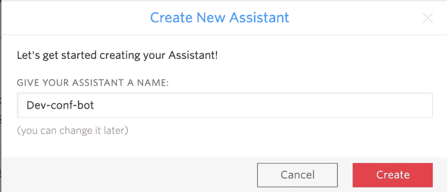
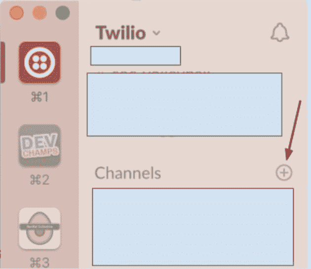
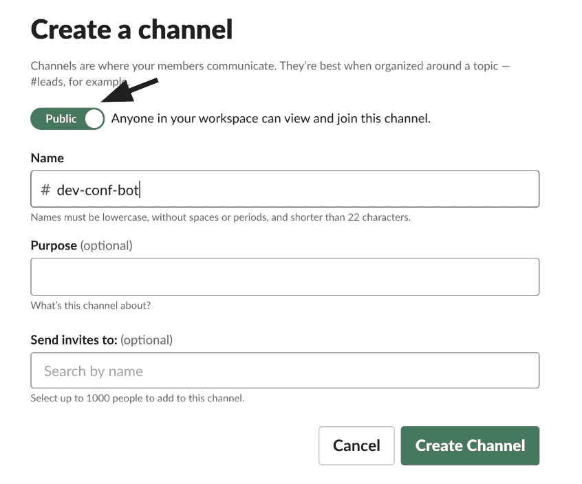
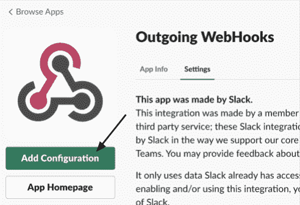
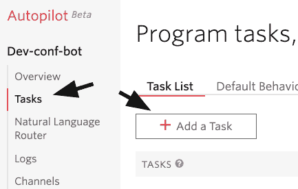
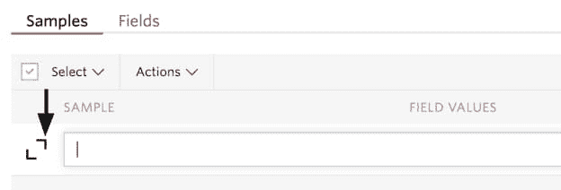
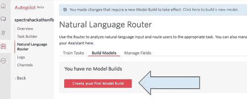

# 用 Twilio 自动驾驶仪制作一个 Slackbot

> 原文：<https://dev.to/twilio/build-a-slackbot-with-twilio-autopilot-4922>

这个循序渐进的教程将介绍如何用 [Twilio Autopilot](https://twilio.com/autopilot?_ga=2.137509301.467146528.1556315939-490892850.1551553023) 构建这样一个 [Slackbot](https://www.twilio.com/docs/autopilot/tutorials/hello-slack) 。

[](https://www.youtube.com/watch?v=0eEVZAUT8Ow)

## 设置

在开始之前，你需要一个 Twilio 帐户来制作一个 Twilio 自动驾驶机器人。一旦你有了这些，首先要做一个自动驾驶助手。

1.  进入自动驾驶控制台，点击“创建新助手”
2.  给它起个名字，然后点击“创建”。在这种情况下，我想制作一个 Slackbot 来处理活动赞助，所以我放了“Dev-conf-bot”。
    [](https://res.cloudinary.com/practicaldev/image/fetch/s--VG6Hs3M2--/c_limit%2Cf_auto%2Cfl_progressive%2Cq_auto%2Cw_880/https://s3.amazonaws.com/com.twilio.prod.twilio-doimg/F0XbmWkZs-_kbW0-5Um6ubkfugUMftnxaNkLrnCy-Ch97.width-1000.png) 
    要让你的自动驾驶助手成为一个 Slackbot，你必须做到三点。

3.  制作一个新的公共松弛频道。首先点击 Slack 客户端左侧栏中“频道”旁边的加号按钮。
    [](https://res.cloudinary.com/practicaldev/image/fetch/s--s9mAKCfp--/c_limit%2Cf_auto%2Cfl_progressive%2Cq_auto%2Cw_880/https://s3.amazonaws.com/com.twilio.prod.twilio-doimg/Screen_Shot_2019-05-04_at_8.28.15_PM.width-1000.png) 
    然后，命名通道。确保它是公开的，如下所示，然后单击“创建频道”。
    [T8】](https://res.cloudinary.com/practicaldev/image/fetch/s--J9FJcYrd--/c_limit%2Cf_auto%2Cfl_progressive%2Cq_auto%2Cw_880/https://s3.amazonaws.com/com.twilio.prod.twilio-doimg/zaVfc2IuQTACwp0Nu1cMSkiW-5ZLX3Vdqb_eK_0yaeHyn.width-1000.png)

4.  *在 Slack 中创建一个新的出站 webhook 集成*,将包含消息细节的 POST 请求发送到您选择的 URL。在本例中，它是*https://. slack . com/apps/manage/custom-integrations*。从“客户集成”页面中，单击“出站 Webhooks”。如果你没有看到这个选项，在搜索框中搜索“外向 Webhooks”，就像这样:
    [](https://res.cloudinary.com/practicaldev/image/fetch/s--uN-tIBEd--/c_limit%2Cf_auto%2Cfl_progressive%2Cq_auto%2Cw_880/https://s3.amazonaws.com/com.twilio.prod.twilio-doimg/6LTdEW4XF6F70J5Q4n__51CFQvcBWnLyosqIYBwKhHSbp.width-1000.png) 
    选择它，然后点击它下面的绿色“添加配置”按钮。
    [](https://res.cloudinary.com/practicaldev/image/fetch/s--thS3Y1Bu--/c_limit%2Cf_auto%2Cfl_progressive%2Cq_auto%2Cw_880/https://s3.amazonaws.com/com.twilio.prod.twilio-doimg/green.width-500.png)

然后在“添加配置”页面上，点击靠近页面底部的绿色“添加出站 WebHooks 集成”按钮。向下滚动到标题为集成设置的部分。选择您为 bot 创建的公共频道的名称。
[T3】](https://res.cloudinary.com/practicaldev/image/fetch/s---q0ZQ0b---/c_limit%2Cf_auto%2Cfl_progressive%2Cq_auto%2Cw_880/https://s3.amazonaws.com/com.twilio.prod.twilio-doimg/mSmLE2Q3-U032Q-UC5v7nOiIonZodORB7c_nmDKF5Eyrk.width-1000.png)

暂时将触发词字段和 URL 字段留空(你可以在本页底部阅读更多关于触发词的内容)——我们很快就会看到！
[T3】](https://res.cloudinary.com/practicaldev/image/fetch/s--5Cv24FTm--/c_limit%2Cf_auto%2Cfl_progressive%2Cq_66%2Cw_880/https://s3.amazonaws.com/com.twilio.prod.twilio-docs/original_images/soon.gif)

给你的机器人一个自定义名称(即。“Devnet Conf Bot”，在这种情况下)，每次 Bot 在通道中回复时，用户都会看到它。你也可以为你的 Slackbot 选择一个自定义图像或表情符号。

1.  *将您助手的自定义 webhook 添加到 Slack URLs 字段*。webhook 看起来像 https://channels.autopilot.twilio.com/v1/的*//slack 的*。替换为您在[控制台](http://twilio.com.console/?_ga=2.174330279.467146528.1556315939-490892850.1551553023)中找到的 Twilio 帐户 SID 这里:接下来，将您的放入您的[自动驾驶助手列表](http://twilio.com/console/autopilot/list?_ga=2.174330279.467146528.1556315939-490892850.1551553023) : 

在 webhook URL 中替换你的个人 SID 后:*[https://channels.autopilot.twilio.com/v1/](https://channels.autopilot.twilio.com/v1/)//slack*。然后把它粘贴在 URL 部分下面的触发字回到即将发出的 Webhooks 页面这里:
[](https://res.cloudinary.com/practicaldev/image/fetch/s--r__bwNED--/c_limit%2Cf_auto%2Cfl_progressive%2Cq_auto%2Cw_880/https://s3.amazonaws.com/com.twilio.prod.twilio-doimg/PJODxede2iOGIP1jrOSyVFo823BGALY-LCgDj7WgA-mOX.width-1000.png)

现在去你做的公共频道说“嗨”，你应该会得到一个回应说“这是你的新任务”。
[T3】](https://res.cloudinary.com/practicaldev/image/fetch/s--7ko6Re7t--/c_limit%2Cf_auto%2Cfl_progressive%2Cq_auto%2Cw_880/https://s3.amazonaws.com/com.twilio.prod.twilio-doimg/g3JOTS2bEqssmMYEgZmg5yVqeBtaPq0_v-WreE61nSrN_.width-1000.png)

你的 Slackbot 准备好了，现在让我们定制这个自动驾驶机器人。您当然可以编辑`Hello_world`任务来返回您想要的任何文本！

[](https://res.cloudinary.com/practicaldev/image/fetch/s--D20W790q--/c_limit%2Cf_auto%2Cfl_progressive%2Cq_66%2Cw_880/https://s3.amazonaws.com/com.twilio.prod.twilio-docs/original_images/excitedgirl.gif)

## 构建 Slackbot

转到你的[自动驾驶控制台](https://www.twilio.com/console/autopilot)，点击上面你刚做的助手，然后点击左边面板的“任务”，接着点击“添加任务”。
T3T5】

给你的任务起个名字——我把我的命名为“活动赞助”。点击“训练”按钮右侧的“程序”。用下面的代码替换这段代码，向用户提问，并收集他们的输入。使用 [Autopilot 的内置字段类型](https://www.twilio.com/docs/autopilot/built-in-field-types)，这个 Slackbot 将期待来自用户的某些类型的响应。然后，如果他们发送的回答不是名字、号码、城市等，它会要求他们再试一次。，这取决于他们对答案的期望。

```
{
    "actions": [
                {
                        "collect": {
                                "name": "event_sponsorship",
                                "questions": [
                                        {
                                                "question": {
                                                        "say": "What is the event name?"
                                                },
                                                "name": "event_name"
                                        },
                                        {
                                                "question": {
                                                        "say": "What evangelist would you like there?"
                                                },
                                                "name": "devangel_name",
                                                "type": "Twilio.FIRST_NAME"
                                        },
                                        {
                                                "question": {
                                                        "say": "What's your email?"
                                                },
                                                "name": "user_email",
                                                "type": "Twilio.EMAIL"
                                        },
                                        {
                                                "question": {
                                                        "say": "What is the event start date?"
                                                },
                                                "name": "event_start_date",
                                                "type": "Twilio.DATE"
                                        },
                                        {
                                                "question": {
                                                        "say": "What city is the event located?"
                                                },
                                                "name": "event_location",
                                                "type": "Twilio.CITY"
                                        },
                                        {
                                                "question": {
                                                        "say": "What is the anticipated number of developers?"
                                                },
                                                "name": "anticipated_developers_num",
                                                "type": "Twilio.NUMBER"
                                        },
                                        {
                                                "question": {
                                                        "say": "Will there be alcohol at the event?"
                                                },
                                                "name": "alcohol",
                                                "type": "Twilio.YES_NO"
                                        }
                                ],
                                "on_complete": {
                                        "redirect": "task://hello_world"
                                }
                        }
                }
        ]
} 
```

Enter fullscreen mode Exit fullscreen mode

点击“保存”。在本博客系列的第二部分中，Slackbot 在将输入保存到 MongoDB 数据库后会有不同的响应。现在，Slackbot 将重定向到`Hello_world`任务，重新开始。您可以定制该任务中的文本，以与您的 Slackbot 相关联。
现在，您可以一次添加多个训练样本来触发“event _ supportation”任务。回到任务列表，点击右边的“训练”按钮，然后点击下面的“展开”按钮，让你一次粘贴多行。
T3T5】

对于本教程，您可以使用下面的样本或自己的一些！大写在这里不重要。

```
help
support this event
i want to sponsor an event
i have an event i want sponsored
let's sponsor this event
could we sponsor this conference
sponsor this meetup
sponsor a hackathon
how can we support this event
i'd like to support this event 
```

Enter fullscreen mode Exit fullscreen mode

每个任务至少要有十个样本，这样您的助手就有足够的数据来将用户输入正确地映射到任务。现在点击右边的红色加号按钮。

在对自动驾驶助手做了所有这些改变之后，我们需要创建一个新的模型。转到自然语言路由器下的 *Build Models* 选项卡，创建一个名为“v0.1”的新模型构建。
[](https://res.cloudinary.com/practicaldev/image/fetch/s--5gYVc6wJ--/c_limit%2Cf_auto%2Cfl_progressive%2Cq_auto%2Cw_880/https://s3.amazonaws.com/com.twilio.prod.twilio-doimg/YoMbWDKDDD03wEK1y9-7tpYZ0EWL_FiPz4RPipS5TYyfyc.width-500.png) 
现在测试这个机器人，看看它会不会要求你输入正确的信息，比如说，一个数字、一个日期或者一个“是/否”的答案。
[](https://www.youtube.com/watch?v=0eEVZAUT8Ow)

## 接下来是什么

[](https://res.cloudinary.com/practicaldev/image/fetch/s--tsTQ1P6g--/c_limit%2Cf_auto%2Cfl_progressive%2Cq_auto%2Cw_880/https://s3.amazonaws.com/com.twilio.prod.twilio-docs/original_images/GwL4OwLKBHjMBN8H_hSFZ7Dn6oWN9-31mMGZUhgK757RDHU5aHEWsLQtq1FmHjuu3YyA3UNeVt3oOQ) 
是的，用 Twilio Autopilot 打造一个 Slackbot 真的是那么容易。请继续关注下一篇关于使用 Twilio 自动驾驶仪、函数和 MongoDB 通过 Slackbot 收集表单响应的博文。让我知道你想在评论或网上建立什么样的 Slackbot！

*   电子邮件:[lsiegle@twilio.com](mailto:lsiegle@twilio.com)
*   推特: [@lizziepika](https://twitter.com/lizziepika)
*   GitHub: [伊丽莎白·西格](https://github.com/elizabethsiegle)