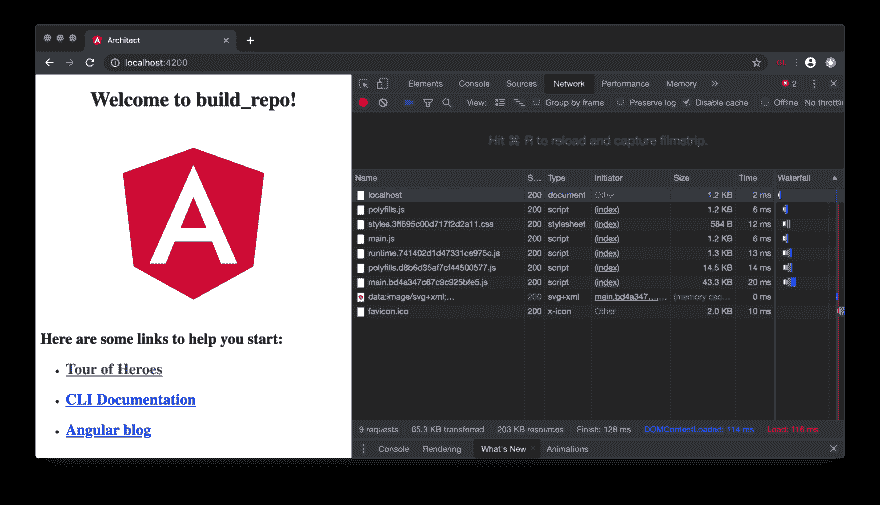
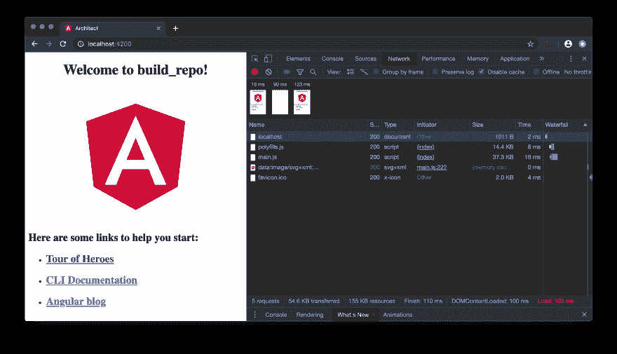

# 像建筑师一样塑造棱角(第 1 部分)

> 原文：<https://dev.to/steveblue/build-angular-like-an-architect-part-1-3ph2>

我🤓在构建工具上。

自从 Angular 2 发布以来，我一直在尝试不同的方法来构建应用程序。大多数开发人员不需要担心他们的应用程序是如何构建的，因为@angular/cli 让这变得非常容易。cli 隐藏了所有的复杂性，这是有充分理由的。工程师需要专注于实现特性和缺陷修复。让我们面对现实吧。构建复杂的企业应用程序很困难。将所有的部分放在一起可能需要大量的工作，更不用说让构建工具做像代码分割应用程序这样的事情了。

在像建筑师一样构建 Angular(第 1 部分)中，我们简要地看一下为什么有人想要编写一个定制 Angular 构建，以及我们是如何做到这一点的。然后，我们使用@angular-devkit/architect 包中提供的 API 搭建一个新的构建器，用 RxJS Observables 编写构建代码，并学习如何用捆绑了 angular 和 Closure 编译器而不是 Webpack 的新生产构建来扩展@angular/cli。

你可以在这个 Github 库中查看代码[。](https://github.com/steveblue/architect)

### 我们是怎么到这里的？

自从@angular/cli 迁移到 webpack 之后，就很难与其他构建工具集成并保留 cli 的优势。只做了一些努力来扩展 cli。nx 就是一个例子，它在 monorepo 中实现了更快的开发，只增量地构建已经改变的代码。cli 有时与 webpack 紧密结合，导致 webpack 本身的定制非常笨拙。

[](https://i.giphy.com/media/JGF7ctowtLGak/giphy.gif)

在 Angular 6 之前，您可以使用`ng eject`弹出 webpack 配置来定制它。

随着 Angular 6 的发布，当完全重写@angular/cli 抽象出该工具的某些部分时，这个 API 就被弃用了。cli 变成了@angular-devkit 的包装器。运行一个`ng`命令仅仅意味着您正在触发运行“构建者”的“架构师”目标。这种抽象使得 nx 这样的工具成为可能。

API 的有用部分如下:

*   构建器使您能够用 TypeScript 和 RxJS 编写自定义构建
*   Architect 允许您定义运行构建器的目标
*   Architect CLI 提供了一种在工作空间中测试构建器的方法

高级用户可以通过编写构建器并使用 Architect 建立执行构建器的目标来定制工具，从而提供定制的 webpack 配置。如果你这样做了，你就冒着破坏 API 的风险，而 API 将在 Angular 8 中变得稳定。@angular-devkit/architect 被认为是实验性的，直到[像这样的提交](https://github.com/angular/angular-cli/commit/e41e10d313ad49e632ed1f9d6e7e563b3eb2fd09)进入 Github 上的@angular/cli 库。

# @ angular-dev kit/architect 稳！

这是一个改变游戏规则的原因。@angular/cli 正在变得可扩展。

[](https://i.giphy.com/media/kVRBvsiOyBM8o/giphy.gif)

构建器允许我们扩展 Angular CLI 来做我们以前认为不可能的事情！

这里有几个例子说明如何用构建器扩展 CLI。

*   用 Jest 代替 Karma 运行单元测试
*   用 TestCafe 代替 Selenium 和量角器执行 e2e 测试
*   使用 Webpack 之外的工具优化生产捆绑包
*   使用自定义节点服务器
*   提供自定义 Webpack 配置，如[@ angular-devkit/build-web pack](https://github.com/angular/angular-cli/tree/master/packages/angular_devkit/build_webpack)

当使用 Builder API 时，我们获得了所有这些开箱即用的精彩特性/行为！

*   RxJS 可观测量
*   (音乐)可设定的
*   可试验的
*   记录器
*   进度跟踪
*   错误报告者
*   调度程序

在本教程中，我们将通过编写一个使用 Closure 编译器优化应用程序的构建器来构建 Angular。

## 进入闭包编译器

@angular/cli 依赖 webpack 和 terser 来捆绑和优化 JavaScript。这些工具做得非常好，但是还有一个工具做得更好。

Closure Compiler 是 Google 使用的一个工具，用于优化生产用的 JavaScript。来自官网:

> 闭包编译器是一个让 JavaScript 下载和运行更快的工具。它不是从源语言编译成机器码，而是从 JavaScript 编译成更好的 JavaScript。它解析你的 JavaScript，分析它，删除死代码，重写并最小化剩下的代码。它还检查语法、变量引用和类型，并警告常见的 JavaScript 陷阱。

在 ng-conf 2017 上，Angular 团队宣布 AOT 编译器与 Angular 4 中的闭包编译器兼容。AOT 编译器将 TypeScript 类型的批注转换为 JSDoc 样式的批注，闭包编译器可以解释这些批注。您可以使用编译器标志解锁此功能。在幕后，一个名为 tsickle 的工具转换注释。这个特性将使 Angular 在 Google 得到广泛采用，在 Google，团队被要求用 Closure 编译器优化 JavaScript。

[](https://i.giphy.com/media/3SBi8gMf8BqBG/giphy.gif)

Angular 社区正在 ng-conf 2017 上围绕 webpack 集会，然而我自然对 Closure Compiler 很好奇。在开发会议上，你可能会发现我在听一个报告，在笔记本电脑上打字，尝试一些我刚刚学到的东西。在 ng-conf 中，我编写了一个概念证明，可以将 Angular 与闭包编译器捆绑在一起。结果令人印象深刻。

## 我扔给 Closure 编译器的每一个包都比 Webpack 和 Uglify 优化得更好(也更简洁)。

[](https://i.giphy.com/media/l3q2DgSFjbAyseViM/giphy.gif)

Angular 必须提前构建(AOT)和提前编译代码。闭包编译器必须处于 ADVANCED_OPTIMIZATIONS 模式，以确保尽可能最小的包。使用@ angular-dev kit/build-optimizer 也无妨。当新的 Ivy 编译器最终版(Angular 9)时，我们会看到更好的优化，但现在我们有 AOT 编译器。

Angular 社区非常幸运，Angular 与 Closure 编译器兼容，但是由于 Angular CLI 只支持 Webpack，所以采用的速度很慢。没有多少其他库或框架能够声称能够生成用 Closure 编译器完全优化的包。React 团队放弃了在优化 JavaScript 的最激进模式下支持 Closure Compiler。

您必须对 JavaScript 进行大量注释才能获得 ADVANCED_OPTIMIZATIONS 的全部回报，这是 Closure 编译器中的一种模式，在实现最高可能的压缩方面非常积极。Angular 本身已经被注释了，按照 Angular 包格式构建的库也是兼容的。这是因为开发人员已经用 TypeScript 编写了 Angular 代码，AOT 编译器会将我们的类型转换成闭包编译器可以解释的注释。如果你维护一个类型安全的应用程序，你将得到一个高度优化的闭包编译器包！

现在我们可以用 Architect API 扩展 Angular CLI 来构建 Closure 编译器，这样应该会更容易被采用。让我们弄清楚如何在 CLI 中将应用程序与闭包编译器捆绑在一起！

## 如何用 Architect CLI 构建 Angular

在下一节中，我们将看到构建一个构建器所需的基本文件，以及将一个简单的 Angular 应用程序与 Closure 编译器捆绑在一起所需的架构师目标。本节介绍的概念可以扩展到任何构建者。在某种程度上，我不会惊讶地看到一个使搭建一个建设者更容易的示意图，但现在我们将自己创建文件。

### [T1】简介](#intro)

首先让我们概述一下构建 Angular 的步骤。

| 步骤 | 描述 | 工具 |
| --- | --- | --- |
| 编制 | 提前编译应用程序 | @ angular/编译器 |
| 使最优化 | 移除不必要的编译副产品 w/(可选) | @ angular-dev kit/build _ optimizer |
| 处理环境 | 使用 cli 提供的环境(可选) | 丙酸纤维素 |
| 捆 | 捆绑和破坏 AOT 编译的代码 | 谷歌闭包编译器 |

要为生产构建 Angular 应用程序，我们需要使用@angular/compiler-cli。如果我们手动这样做，我们将使用`ngc`命令调用编译器。

```
ngc -p src/tsconfig.app.json 
```

Enter fullscreen mode Exit fullscreen mode

这将在 out-tsc 目录中输出 AOT 编译的应用程序，与 cli 在生产版本中默认放置它的位置一致。因为在 src/tsconfig.app.json : `"outDir": "../out-tsc",`中`outDir`就是这样配置的

我们可以在与@ angular-dev kit/build-optimizer 捆绑之前优化应用程序。这个包删除了编译器吐出的一些不必要的代码，比如我们在开发中使用的装饰器。

@angular/cli 有这个环境的概念，工程师可以`import { environment } from './environment'`。`environment`是为每个环境配置的对象。为了使自定义构建对@angular/cli 友好，我们也应该支持这个 API。基本上需要发生的是 out-tsc 目录中的`environment.js`的内容需要用`environment.${env}.js`换出。

为了捆绑 Closure 编译器，我们需要一个新的配置文件:closure.conf。Closure Compiler 是一个 Java 应用程序，分布在 google-closure-compiler-java 包中。Closure Compiler 也提供了 JavaScript API，但实际上我发现 Java 实现更可靠。

[](https://i.giphy.com/media/l3q2K5jinAlChoCLS/giphy.gif)

为了手动运行闭包编译器应用程序，我们可以在命令行上使用参数。

```
java -jar ${jarPath} --flagFile ${confFile} --js_output_file ${outFile} 
```

Enter fullscreen mode Exit fullscreen mode

就是这样！在本教程中，我们将关注强制步骤 1 和 4，运行 AOT 编译器并使用闭包编译器优化单个包。

在《像建筑师一样构建 Angular 》(第 2 部分)中，我们使用@ Angular-dev kit/Build-optimizer 添加了环境并进一步优化了包。如果你想先睹为快，请查看 Github 库。

### 入门

使用`next`版本在全球范围内安装最新的 cli 和 architect 软件包。稳定的 Architect CLI 仅在最新版本中可用。

架构师开发依赖于节点> 10.14.1。使用`which node`检查您正在运行的节点版本，并相应地更新节点。

```
npm i -g @angular/cli@next @angular-devkit/core@next @angular-devkit/architect@next @angular-devkit/architect-cli@next 
```

Enter fullscreen mode Exit fullscreen mode

使用@angular/cli 创建新的应用程序工作区。

```
ng new build_repo 
```

Enter fullscreen mode Exit fullscreen mode

我们将应用程序称为 build_repo。

如果您还没有安装它，也可以从 Oracle 下载并安装[最新的 Java SDK。现在您可以运行闭包编译器 Java 应用程序了。](https://www.oracle.com/technetwork/java/javase/downloads/jdk8-downloads-2133151.html)

在项目工作区中安装闭包编译器和 tsickle。

```
npm i google-closure-compiler tsickle --save-dev 
```

Enter fullscreen mode Exit fullscreen mode

### 构建 _ 工具

在项目的根目录下创建一个名为“build_tools”的新目录。

让我们回顾一下根目录中应该有的文件。

| 文件 | 描述 |
| --- | --- |
| 构建工具 | 编码构建人员的工作空间 |
| angular.json | 角度应用工作空间配置 |

在 build_tools 目录中创建几个新文件。下面是每个文件的功能描述。

| 文件 | 描述 |
| --- | --- |
| package.json | 安装依赖项，为生成器提供上下文 |
| tsconfig.json | typescript 项目配置 |
| builders.json | 此包中可用的构建器的模式 |
| src/closure/schema.json | 闭包编译器生成器的模式 |
| src/close/index . ts | 闭包编译器生成器的根文件 |
| src/索引. ts | 构建器包源的根文件 |

在 build_tools 目录下制作一个 package.json。该文件应该类似于下面的示例。

### package.json

```
{  "name":  "build_tools",  "version":  "1.0.0",  "description":  "",  "main":  "src/index.js",  "scripts":  {  "test":  "echo \"Error: no test specified\" && exit 1"  },  "author":  "",  "license":  "MIT",  "devDependencies":  {  "@angular-devkit/architect":  "^0.800.0-beta.10",  "@angular-devkit/core":  "^8.0.0-beta.10",  "@types/node":  "^11.12.1"  },  "builders":  "builders.json"  } 
```

Enter fullscreen mode Exit fullscreen mode

package.json 是@angular/cli 建立 builders.json 的位置以及安装开发构建器所需的依赖项所必需的。

在 build_tools 目录下运行`npm install`。

在 src 目录中创建新的 index.ts 文件。在这里导出来自 src/closure/index.ts.
的所有内容

```
export * from './closure'; 
```

Enter fullscreen mode Exit fullscreen mode

在 build_tools 目录下创建一个新的 builder.json 文件。

### builders.json

这个文件介绍了这个包中可用的构建器的模式。

builders.json 建立了架构师需要指向每个构建器的目标。在这个例子中，目标被称为“closure ”,它指向位于的构建器。/src/closure/index.js '并且构建器的架构位于'。/src/closure/schema.json。

```
{  "$schema":  "@angular-devkit/architect/src/builders-schema.json",  "builders":  {  "closure":  {  "implementation":  "./src/closure/index",  "class":  "./src/closure",  "schema":  "./src/closure/schema.json",  "description":  "Build a Closure app."  }  }  } 
```

Enter fullscreen mode Exit fullscreen mode

### [T1】src/closure/schema . JSON](#srcclosureschemajson)

说到模式，我们也可以为闭包编译器生成器声明模式。构建器模式为构建器建立面向外部的 API。

英寸/src/closure/schema.json 我们定义了一个工程师需要在其工作空间 angular.json 中提供的两个必需属性:`tsConfig`和`closureConfig`。这两个属性映射到每个配置文件的路径:用于用 AOT 编译器构建 Angular 的 tsconfig.json 和用于捆绑应用程序的 closure.conf。

```
{  "$schema":  "http://json-schema.org/schema",  "title":  "Closure Compiler Builder.",  "description":  "Closure Compiler Builder schema for Architect.",  "type":  "object",  "properties":  {  "tsConfig":  {  "type":  "string",  "description":  "The path to the Closure configuration file."  },  "closureConfig":  {  "type":  "string",  "description":  "The path to the Closure configuration file."  },  },  "additionalProperties":  false,  "required":  [  "tsConfig",  "closureConfig"  ]  } 
```

Enter fullscreen mode Exit fullscreen mode

### 构建器 API 简介

src/closure/index.ts 是构建器逻辑所在的位置。

构建器是用 TypeScript 编码的。我们需要使用的 API 主要由@angular-devkit/architect 和 node 提供。编码构建器令人惊叹的地方在于，语法对于编写 Angular 应用程序的人来说是非常熟悉的。构建者大量使用来自 rxjs 的可观察模式。

首先，让我们设置我们的导入。

将被传递到构建过程的每一步。

`BuilderOutput`是在过程结束时，从可观察的事物中最终返回的东西。

`createBuilder`是一个我们调用来创建一个构建器实例的方法。构建者有一个 API，可以实现日志记录、进度跟踪和构建计划。

我们将使用 rxjs 中的`Observable`、`of`、`catchError`、`mapTo`和`concatMap`。

`exec`、`normalize`、`readFileSync`从标准节点包(分别为 child_process、path、fs)导入。这些工具将允许我们像在命令行(“exec”)上输入命令一样执行命令，通过`normalize`等方法实现跨平台的文件路径处理，并且`readFileSync`使我们能够同步读取文件。

```
import { BuilderContext, BuilderOutput, createBuilder } from '@angular-devkit/architect/src/index2';
import { Observable, of } from 'rxjs';
import { catchError, mapTo, concatMap } from 'rxjs/operators';
import { exec } from 'child_process';
import { normalize } from 'path';
import { readFileSync } from 'fs'; 
```

Enter fullscreen mode Exit fullscreen mode

接下来，在 build_tools/src/closure 中创建一个名为 schema.interface.ts 的新文件，并为 TypeScript 声明一个镜像我们之前创建的 json-schema 的接口。有很多方法可以使用 json-schema 代替 TypeScript 接口，但是为了简单起见，我们只将模式声明为一个接口。

```
export interface ClosureBuilderSchema {
  tsConfig: string;
  closureConfig: string;
} 
```

Enter fullscreen mode Exit fullscreen mode

导入新模式。

```
import { ClosureBuilderSchema } from './schema.interface'; 
```

Enter fullscreen mode Exit fullscreen mode

接下来为构建器和执行构建的回调函数声明一个导出。

```
export function executeClosure(
  options: ClosureBuilderSchema,
  context: BuilderContext
): Observable<BuilderOutput> {
  return of(context).pipe(
    mapTo({ success: true }),
    catchError(error => {
      context.reportStatus('Error: ' + error);
      return [{ success: false }];
    }),
  );
}

export default createBuilder<Record<string, string> & ClosureBuilderSchema>(executeClosure); 
```

Enter fullscreen mode Exit fullscreen mode

`executeClosure`带两个参数:`options`和`context`。

| 争吵 | 描述 |
| --- | --- |
| 选择 | 从 angular.json 传入的选项 |
| 语境 | 当前正在执行的构建器的上下文 |

`executeClosure`返回一个 rxjs `Observable`。

如果构建成功，`mapTo`通过`{success: true}`在终端显示反馈。

如果构建过程中的任何一步出错，就会调用`catchError`。

### 编译项目源

在 build_tools 目录中添加一个 tsconfig.json，这样我们就可以编译刚刚编写的 TypeScript。

```
{  "compileOnSave":  false,  "buildOnSave":  false,  "compilerOptions":  {  "baseUrl":  "",  "rootDir":  ".",  "target":  "es2018",  "module":  "commonjs",  "moduleResolution":  "node",  "noEmitOnError":  true,  "noImplicitAny":  false,  "removeComments":  false,  "resolveJsonModule":  true,  "esModuleInterop":  true,  "skipLibCheck":  true,  "strictNullChecks":  true,  "declaration":  true  },  "lib":  [  "es2018"  ],  "typeRoots":  [  "./node_modules/@types"  ],  "types":  [  "node",  "json-schema"  ],  "include":  [  "./src/**/*.ts"  ],  "exclude":  [  "./src/closure/schema.interface.ts"  ]  } 
```

Enter fullscreen mode Exit fullscreen mode

在 build_tools 目录中使用`tsc`命令来构建项目。

```
tsc -p tsconfig.json 
```

Enter fullscreen mode Exit fullscreen mode

或者，您也可以运行 watcher 来构建每个文件更改。

```
tsc -p tsconfig.json --watch 
```

Enter fullscreen mode Exit fullscreen mode

现在项目建好了！

为了简单起见，这个例子中的文件是就地编译的，但是我们可以通过在`compilerOptions`上设置`outDir`参数来解决这个问题。我们还需要将任何 schema.json 和 package.json 复制到一个分发文件夹中。

### 配置 angular.json

回到我们搭建的项目的工作区，配置 angular.json。我们需要告诉项目将我们刚刚创建的 ClosureBuilder 指向哪里。

在“architect”配置中创建一个名为“closure_build”的新属性。

将新的“closure_build”对象的“builder”属性设置为“”。/build_tools:closure。

。/build _ tools,“closure”是因为我们的 Architect 项目的 package.json 就在那里，而“closure”是因为我们想要运行名为“closure”的构建器。我们配置了位于'的 builders.json。/build_tools'。如果。/build_tools '目录已发布，我们通过可以替换的 npm 安装包。/build_tools”以及包名。

在“closure”对象上创建另一个属性，并将其命名为“options”。在这个对象中，为 angular 项目配置闭包配置(我们还没有完成)和 tsconfig 的路径。

完成后 angular.json 应该是这样的。

```
"architect":  {  "closure_build":  {  "builder":  "./build_tools:closure",  "options":  {  "closureConfig":  "closure.conf",  "tsConfig":  "src/tsconfig.app.json"  }  }  ... 
```

Enter fullscreen mode Exit fullscreen mode

使用我们之前全局安装的@angular-devkit/architect-cli 包，通过向命令`architect`传递工作区名称(build_repo)和我们刚刚在 angular.json 中建立的目标(closure_build)来测试构建器正在工作。

```
architect build_repo:closure_build 
```

Enter fullscreen mode Exit fullscreen mode

建筑师应该在终端打印成功。您应该会看到类似这样的内容。

```
SUCCESS
Result: {
    "success": true,
    "target": {
        "project": "build_repo",
        "target": "closure_build"
    }
} 
```

Enter fullscreen mode Exit fullscreen mode

### 这到底是怎么回事？

Architect CLI 允许我们在工作区中测试构建器是否正常工作。`architect`命令相当于任何典型@angular/cli 工作空间中的`ng run`。我们看到成功的原因是，构建器所做的只是将我们创建的可观察对象映射到中的成功消息。/build _ tools/src/closure/index . ts

```
return of(context).pipe(
  mapTo({ success: true }),
  catchError(error => {
    context.reportStatus('Error: ' + error);
    return [{ success: false }];
  }),
); 
```

Enter fullscreen mode Exit fullscreen mode

我们仍然需要对我们的构建进行编码，但是至少我们知道脚手架是有效的！

为了继续测试构建运行，在`build_tools`目录中运行`tsc -p tsconfig.json --watch`。
在项目的根目录下，在每次增量构建 typescript 后运行`architect build_repo:closure_build`。

## 用 RxJS Observables 和 Node.js 编码构建器

之前我们已经确定 ClosureBuilder 将使用返回 RxJS 可观察值的`executeClosure`方法执行构建。这种方法有一个我们应该考虑的问题。可观察对象是异步的，但是构建通常有一组必须同步运行的指令。当然，在异步执行构建任务的用例中，可观测量会派上用场。我们将在以后的文章中探讨异步用例。现在我们只需要执行一系列步骤。为了用 RxJS 执行同步任务，我们使用了`concatMap`操作符，例如:

```
 return of(context).pipe(
    concatMap( results => ngc(options, context)),
    concatMap( results => compileMain(options, context)),
    concatMap( results => closure(options, context) ),
    mapTo({ success: true }),
    catchError(error => {
      context.reportStatus('Error: ' + error);
      return [{ success: false }];
    }),
  ); 
```

Enter fullscreen mode Exit fullscreen mode

在上面的例子中，AOT 编译器将执行，然后是格式化`main.js`的步骤，最后是执行 Closure 编译器来捆绑和优化应用的步骤。

@angular/cli 团队显然认为，任何编写 angular 应用程序的人都应该熟悉编写构建器的代码。同构的粉丝为 API 神魂颠倒！

因为这个观点，我们有一个问题，然而这是一个容易解决的问题。

问题:

node . js 承诺。

建设者❤️ RxJS 可观。

解决方案 1:

RxJS 可观察值与承诺可互操作。

`of(new Promise())`是一个东西。RxJs 将为我们在幕后将承诺转化为可观察到的东西。

解决方案 2:

我们可以将基于承诺的工作流转化为可观察的工作流。

考虑这个例子，我们将使用 Node.js `exec`方法调用 AOT 编译器。`ngc`方法返回一个`Observable`。

在`Observable`回调中，我们传递给观察者。程序运行 exec，执行`ngc -p tsconfig.app.json`命令，就像我们在终端中输入它一样。

如果 AOT 编译导致错误，我们调用`observer.error()`。

如果 AOT 编译成功，我们称之为`observer.next()`。

```
export function ngc(
  options: AbstractBuilderSchema | RollupBuilderSchema | ClosureBuilderSchema,
  context: BuilderContext
): Observable<{}> {

    return new Observable((observer) => {

        exec(normalize(context.workspaceRoot +'/node_modules/.bin/ngc') +
             ' -p ' + options.tsConfig,
             {},
             (error, stdout, stderr) => {
              if (stderr) {
                  observer.error(stderr);
              } else {
                  observer.next(stdout);
              }
        });

    });

} 
```

Enter fullscreen mode Exit fullscreen mode

当上述方法被插入到`executeClosure`中的可观察地图操作符中时，该步骤将运行！

```
 return of(context).pipe(
    concatMap( results => ngc(options, context)), 
```

Enter fullscreen mode Exit fullscreen mode

让我们看几个用 Closure 编译器构建应用程序的构建步骤的例子。

我们之前在概念层面上概述了构建步骤，但是让我们更详细地再看一遍。

### 角度编译器

Angular 是提前用 AOT 编译器为生产而构建的。AOT 编译会产生更小的包，比 JIT 更安全，对我们的例子来说最重要的是，可以与闭包编译器一起工作！AOT 编译器使用一个叫做 tsickle 的工具来翻译 TypeScript 类型的注释。

为了配置 AOT 编译器输出注释闭包编译器需要在 ADVANCED_OPTIMIZATIONS 模式下优化的内容，我们在角度工作空间 tsconfig.app.json 中添加了两个配置选项

```
"angularCompilerOptions":  {  "annotationsAs":  "static fields",  "annotateForClosureCompiler":  true  } 
```

Enter fullscreen mode Exit fullscreen mode

回到 build _ tools/src/closure/index . ts，导入`exec`以便我们可以执行 AOT 编译器，导入`normalize`以便我们使用的任何路径都是跨平台兼容的，这意味着在 Windows 上运行构建的用户也可以使用我们的脚本。

```
import { exec } from 'child_process';
import { normalize } from 'path'; 
```

Enter fullscreen mode Exit fullscreen mode

做一个名为 ngc 的新函数，给它两个自变量:`options`和`context`。在我们的示例中，每个构建步骤都将采用这两个参数。`options`是用户通过 angular.json 传入的选项，而`context`提供了当前`BuilderContext`上我们可以使用的方法。我们将在第 2 部分详细介绍其中的一些方法。

现在我们返回一个调用`exec`的`Observable`，在我们的工作空间中传递一个到`ngc`的绝对路径，然后使用`-p`参数传递一个类型脚本配置。

```
 export function ngc(
  options: AbstractBuilderSchema | RollupBuilderSchema | ClosureBuilderSchema,
  context: BuilderContext
): Observable<{}> {

  return new Observable((observer) => {

    exec(`${normalize(context.workspaceRoot +'/node_modules/.bin/ngc')} -p ${options.tsConfig}`,
          {},
          (error, stdout, stderr) => {
          if (stderr) {
              observer.error(stderr);
          } else {
              observer.next(stdout);
          }
    });

  });

} 
```

Enter fullscreen mode Exit fullscreen mode

如果我们把这个操作加入到`executeClosure`函数中。

```
 return of(context).pipe(
    concatMap( results => ngc(options, context)), 
```

Enter fullscreen mode Exit fullscreen mode

构建项目。

```
tsc -p tsconfig.json 
```

Enter fullscreen mode Exit fullscreen mode

在 Angular 工作区中，我们应该能够在运行 Architect CLI 后看到一个名为`out-tsc`的新目录。

```
architect build_repo:closure_build 
```

Enter fullscreen mode Exit fullscreen mode

这个目录将被扩展名为`ngfactory.js`的 AOT 编译代码填充。我们所有的应用程序逻辑都被编译到这些文件中。

如果我们仔细观察提前编译的代码，我们会发现 out-tsc/src/main.js 中 Angular 应用程序的入口点有问题

```
platformBrowserDynamic().bootstrapModule(AppModule) 
```

Enter fullscreen mode Exit fullscreen mode

入口点仍然引用 out-tsc/src/app/app.module.js 中的`AppModule`。我们需要我们的应用程序使用 out-TSC/src/app/app . module . ngfactory . js 中提前编译的`AppModuleNgFactory`进行引导。

@angular/cli 会在我们运行`ng serve`或`ng build`时自动为我们处理这个问题，因为我们正在编写一个自定义构建，所以我们需要自己转换 main.js。

### 格式 main.js

我们需要一种方法从磁盘读取源文件`main.ts`，找到并替换文件内容的一部分，编译类型脚本，然后将转换后的文件写入磁盘。

幸运的是，typescript 已经是项目的一个依赖项。我们可以把它导入到 build _ tools/src/closure/index . ts 中。

对于所有的文件管理任务，我们在 fs 中有一些方便的 Node.js 函数(`readFileSync`、`writeFile`和`readFile`)。

```
import * as ts from 'typescript';
import { readFileSync, writeFile, readFile } from 'fs'; 
```

Enter fullscreen mode Exit fullscreen mode

这个操作比上一个例子稍微复杂一点，但是格式是一样的。在`compileMain`函数中，我们再次返回一个可观察值。从磁盘中读取 main.ts 源文件，替换文件的内容，然后使用我们配置的 tsconfig 中的编译器选项传输内容，最后将文件写入磁盘的 out-tsc 目录中，替换 AOT 编译器最初输出的文件。

```
export function compileMain(
  options: AbstractBuilderSchema | RollupBuilderSchema | ClosureBuilderSchema,
  context: BuilderContext
): Observable<{}> {

  return new Observable((observer) => {

      const inFile = normalize(context.workspaceRoot+'/src/main.ts');
      const outFile = normalize('out-tsc/src/main.js');
      const tsConfig = JSON.parse(readFileSync(join(context.workspaceRoot, options.tsConfig), 'utf8'));

      readFile(inFile, 'utf8', (err, contents) => {

          if (err) observer.error(err);

          contents = contents.replace(/platformBrowserDynamic/g, 'platformBrowser');
          contents = contents.replace(/platform-browser-dynamic/g, 'platform-browser');
          contents = contents.replace(/bootstrapModule/g, 'bootstrapModuleFactory');
          contents = contents.replace(/AppModule/g, 'AppModuleNgFactory');
          contents = contents.replace(/.module/g, '.module.ngfactory');

          const outputContent = ts.transpileModule(contents, {
            compilerOptions: tsConfig.compilerOptions,
            moduleName: 'app'
          })

          writeFile(outFile, outputContent.outputText, (err) => {
              if (err) observer.error(err);
              observer.next(outputContent.outputText);
          });

      });

  });
} 
```

Enter fullscreen mode Exit fullscreen mode

将`compileMain`方法添加到管道。

```
return of(context).pipe(
  concatMap( results => ngc(options, context) ),
  concatMap( results => compileMain(options, context) ),
} 
```

Enter fullscreen mode Exit fullscreen mode

构建项目。

```
tsc -p tsconfig.json 
```

Enter fullscreen mode Exit fullscreen mode

运行 Architect CLI。

```
architect build_repo:closure_build 
```

Enter fullscreen mode Exit fullscreen mode

out-tsc/src/main.js 中的文件应该在`platformBrowser`上调用一个`bootstrapModuleFactory`方法，并传入`AppModuleNgFactory`。

```
platformBrowser().bootstrapModuleFactory(AppModuleNgFactory) 
```

Enter fullscreen mode Exit fullscreen mode

现在我们的包的入口点已经为 AOT 编译正确格式化了，我们可以运行闭包编译器了。

### 闭包编译器

为了使用 Closure 编译器进行构建，我们首先需要在 Angular 工作空间的根目录中编写一个名为 closure.conf 的配置文件。

### closure.conf

closure.conf 文件以下列方式配置闭包编译器:

*   为构建设置可选参数(-编译级别，-创建源映射等)
*   声明依赖项和外部文件(- js 和- externs)
*   源文件的位置(AOT 编译的应用程序在/out-tsc 目录中)
*   包的入口点(- entry_point)
*   用于解析节点程序包的选项(- module_resolution，- package_json_entry_names)

这个特殊的 closure.conf 适用于 angular 包~ 8 . 0 . 0-beta 10 .

```
--compilation_level=ADVANCED_OPTIMIZATIONS
--language_out=ECMASCRIPT5
--variable_renaming_report=closure/variable_renaming_report
--property_renaming_report=closure/property_renaming_report
--create_source_map=%outname%.map

--warning_level=QUIET
--dependency_mode=STRICT
--rewrite_polyfills=false
--jscomp_off=checkVars

--externs node_modules/zone.js/dist/zone_externs.js

--js node_modules/tslib/package.json
--js node_modules/tslib/tslib.es6.js

--js node_modules/rxjs/package.json
--js node_modules/rxjs/_esm2015/index.js
--js node_modules/rxjs/_esm2015/internal/**.js
--js node_modules/rxjs/operators/package.json
--js node_modules/rxjs/_esm2015/operators/index.js

--js node_modules/@angular/core/package.json
--js node_modules/@angular/core/fesm2015/core.js

--js node_modules/@angular/common/package.json
--js node_modules/@angular/common/fesm2015/common.js

--js node_modules/@angular/platform-browser/package.json
--js node_modules/@angular/platform-browser/fesm2015/platform-browser.js

--js node_modules/@angular/forms/package.json
--js node_modules/@angular/forms/fesm2015/forms.js

--js node_modules/@angular/common/http/package.json
--js node_modules/@angular/common/fesm2015/http.js

--js node_modules/@angular/router/package.json
--js node_modules/@angular/router/fesm2015/router.js

--js node_modules/@angular/animations/package.json
--js node_modules/@angular/animations/fesm2015/animations.js

--js node_modules/@angular/animations/browser/package.json
--js node_modules/@angular/animations/fesm2015/browser.js

--js node_modules/@angular/platform-browser/animations/package.json
--js node_modules/@angular/platform-browser/fesm2015/animations.js

--js out-tsc/**.js

--module_resolution=node
--package_json_entry_names jsnext:main,es2015
--process_common_js_modules

--entry_point=./out-tsc/src/main.js 
```

Enter fullscreen mode Exit fullscreen mode

有了 closure.conf，我们就可以在 build _ tools/src/closure/index . ts 中编写一个函数来执行我们之前安装的 google-closure-compiler-java 包中的 Java 应用程序。

在这个例子中，我们从`BuilderContext`开始。我们引用当前的`target`和`project`，根据 angular.json.
中的配置来配置最终包的输出位置

```
export function closure(
   options: ClosureBuilderSchema,
   context: BuilderContext
): Observable<{}> {

  return new Observable((observer) => {

    const target = context.target ? context.target : { project: 'app' };
    const jarPath = options.jarPath ? options.jarPath : join('node_modules', 'google-closure-compiler-java', 'compiler.jar');
    const confPath = options.closureConfig;
    const outFile = `./dist/${target.project}/main.js`;

    exec(`java -jar ${jarPath} --flagfile ${confPath} --js_output_file ${outFile}`,
        {},
        (error, stdout, stderr) => {
          if (stderr.includes('ERROR')) {
            observer.error(error);
          }
          observer.next(stdout);
        });
    })
} 
```

Enter fullscreen mode Exit fullscreen mode

将新的`closure`函数添加到`executeClosure`中的管道。

```
 return of(context).pipe(
  concatMap( results => ngc(options, context) ),
  concatMap( results => compileMain(options, context) ),
  concatMap( results => closure(options, context) )
} 
```

Enter fullscreen mode Exit fullscreen mode

构建项目。

```
tsc -p tsconfig.json 
```

Enter fullscreen mode Exit fullscreen mode

运行 Architect CLI。

```
architect build_repo:closure_build 
```

Enter fullscreen mode Exit fullscreen mode

# 伟大的斯科特！

[](https://i.giphy.com/media/3o7aCRBQC8u5GaW092/giphy.gif)

## @angular/cli 正在用闭包编译器优化一个 bundle！

让我们来分析一下在一场年代之战中创建的捆绑包。

### Webpack 与闭包编译器

[](https://res.cloudinary.com/practicaldev/image/fetch/s--4LJZGvBt--/c_limit%2Cf_auto%2Cfl_progressive%2Cq_auto%2Cw_880/https://thepracticaldev.s3.amazonaws.com/i/oc2vdqxqoxv76c0dhbxo.png)

Webpack 和 Terser 捆绑优化了 app ~43.3Kb(gzipped)。

[](https://res.cloudinary.com/practicaldev/image/fetch/s--oV3rbSXt--/c_limit%2Cf_auto%2Cfl_progressive%2Cq_auto%2Cw_880/https://thepracticaldev.s3.amazonaws.com/i/r00tdlcrbumb4lfvzcmo.png)

Closure 编译器捆绑优化了 app ~37.3Kb (gzipped)。

# ~束尺寸减少 14%

对于这个简单的应用程序来说，这个包要小 14%!在这个规模上，这 14%可以带来实实在在的变化。这些估计包括用@ angular-dev kit/build-optimizer 进行的优化，并使用 gzip 压缩。我见过其他应用程序，Closure Compiler 使捆绑包比同样的应用程序缩小了 20%。

使用闭包编译器代替 Webpack 还有其他优点。Closure 提供了关于潜在危险漏洞的警告。这有助于保持 web 应用程序的安全性。Closure Compiler 还以有趣的方式优化了 JavaScript，对实际代码进行了转换，使其在浏览器中的运行更加高效。

## 结论

在《像建筑师一样构建 Angular 》(第 1 部分)中，我们研究了如何编写一个构建器并使用 Architect CLI 执行构建。我们扩展了@angular/cli 来优化带有闭包编译器的产品包。

Github 上有[像建筑师一样构建 Angular 的源代码。](https://github.com/steveblue/architect)

依我拙见，@angular-devkit/architect 是自 schematics 发布以来 Angular CLI 最大的改进。Angular CLI 变得如此可扩展，它甚至可以构建任何 JavaScript 项目，而不仅仅是 Angular。我们现在可以扩展 cli 来执行我们可以想象的任何任务！对于 Angular CLI 团队来说，这是一个惊人的壮举！

[](https://i.giphy.com/media/1ylQyCK1qZ63vn0lS0/giphy.gif)

在[像建筑师一样构建 Angular(第 2 部分)](https://dev.to/steveblue/build-angular-like-an-architect-part-2-208l)中，我们看看 angular-devkit/build-optimizer，弄清楚如何实现环境。

## 你怎么看？

你对新建筑师 CLI 有什么看法？

如何看待@angular/cli 变得可扩展？