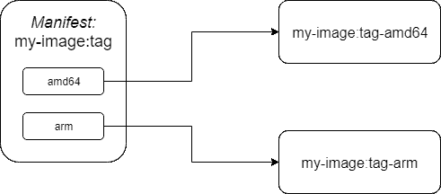

# 在 Travis 上建立多拱码头形象

> 原文：<https://dev.to/zeerorg/build-multi-arch-docker-images-on-travis-5428>

*阅读我的[博客](https://blog.zeerorg.site/post/multi-arch-docker-travis)上的帖子 T3*

许多人将应用程序作为 docker 映像发布，以便它们可以在容器中运行。Docker 拥有对多种架构的一流支持，如果你试图在你的应用中增加对不同平台的支持，你可能会遇到自动化这个过程的问题。难点在于 travis 和 circle 等大多数托管 CI 服务只提供 amd64 环境。

但是有些项目确实为不同的架构提供了不断更新的 docker 映像，而且它们不是手动更新的。让我们来看看 golang 的官方 docker 图片( [repo](https://github.com/docker-library/golang) )，在 README 中你会看到他们使用了 Travis、Appveyor 和 Jenkins。Jenkins 用于构建 arm 映像，但它是一个自托管服务，因此不是我们的目标。另一种方法是使用[无人机云](https://cloud.drone.io/)作为 ci 服务，因为他们有 arm 服务器，可以用来构建 docker 映像。但是如果你不想改变目前的 CI 服务，你**就要**倒霉了。

## 您不需要物理 ARM 服务器

如果有 [`binfmt_misc`](https://www.kernel.org/doc/html/v4.18/admin-guide/binfmt-misc.html) 支持，可以在 amd64 linux 机器上运行为 ARM 编译的程序。它本质上允许你运行一个程序，而不用担心它是为哪个架构而构建的。`binfmt_misc`在 ubuntu 中默认没有，但是使用 docker 添加它真的很容易。

1.  将`dist: xenial`设置为`.travis.yml`因为我发现默认的 travis 发行版 ubuntu precise 上的 binfmt_misc 挂载出错。
2.  将以下块添加到 travis 配置中:

```
 before_install:
     - sudo docker run --privileged linuxkit/binfmt:v0.6 
```

这个命令将 binfmt_misc 挂载到 os `/proc/sys/fs`目录。现在我们的构建服务器有了超能力。

## 使用 Buildkit 构建 docker 图像

Buildkit 是一个用于构建容器图像的工具包，它被用于 docker 和许多其他地方，并被宣传为非常快。它有一个客户端-服务器架构，你需要启动服务器，然后使用客户端与之交互。有一个奇妙的[演示](https://asciinema.org/a/GYOx4B88r272HWrLTyFwo156s)由[托尼斯·蒂吉](https://github.com/tonistiigi)制作的多拱码头工人图像。

我们的过程将是这样的，首先我们将启动 buildkit 服务器作为一个容器进程，然后我们将把 buildkit 的命令行前端的`buildctl`二进制文件复制到我们的`/usr/bin`目录，然后我们将设置`BUILDKIT_HOST`环境变量。最后，before_install 块将是这样的:

```
before_install:
  - sudo docker run --privileged linuxkit/binfmt:v0.6
  - sudo docker run -d --privileged -p 1234:1234 --name buildkit moby/buildkit:latest --addr tcp://0.0.0.0:1234 --oci-worker-platform linux/amd64 --oci-worker-platform linux/armhf
  - sudo docker cp buildkit:/usr/bin/buildctl /usr/bin/
  - export BUILDKIT_HOST=tcp://0.0.0.0:1234 
```

我们指定`--addr`给 buildkit 服务器，将它绑定到指定的端口和地址，我们还给出`--oci-worker-platform`参数，告诉 buildkit 服务器我们的机器可以用来为这些平台创建映像。

## 建筑图像

我们现在终于可以编写脚本来构建图像了。

```
PLATFORM=arm # equivalent to armhf
DOCKERFILE_LOCATION="./Dockerfile.armhf"
DOCKER_USER="someone"
DOCKER_IMAGE="some_server"
DOCKER_TAG="latest"

buildctl build --frontend dockerfile.v0 \
        --frontend-opt platform=linux/${PLATFORM} \
        --frontend-opt filename=./${DOCKERFILE_LOCATION} \
        --exporter image \
        --exporter-opt name=docker.io/${DOCKER_USER}/${IMAGE}:${TAG}-${PLATFORM} \
        --exporter-opt push=true \
        --local dockerfile=. \
        --local context=. 
```

这个命令有几个选项，我们将逐一介绍

1.  `--frontend dockerfile.v0`指定 buildkit 使用哪个前端，也有一个`gateway.v0`前端，但我们将坚持使用 dockerfile。
2.  `--frontend-opt`，用于将参数传递给 fronend 使用。
    *   `platform`指定我们想要为其构建映像的平台，这些在[这里列出](https://github.com/containerd/containerd/blob/a69a0b0192f647aff8730e493f2da622eb0fd13d/platforms/platforms.go#L88)。
    *   `filename`指定 Dockerfile 的文件名，等同于 docker build 的`-f`参数。
3.  `--exporter image`指定要使用的导出插件，还有`oci`和`local`。
    *   `name`是将 docker 图像推送至的注册表的 url。
    *   `push`可以设置为`true`来推送已经建立的 docker 图片。

## 推单-最后一步多拱

容器清单是包含关于容器映像的数据的文件。我们可以创建一个清单，它指向不同架构的映像，这样当在特定架构上使用映像时，docker 会自动提取所需的映像。

[](https://res.cloudinary.com/practicaldev/image/fetch/s--w5etfg89--/c_limit%2Cf_auto%2Cfl_progressive%2Cq_auto%2Cw_880/https://zeerorgprocessedblog.blob.core.windows.net/photos/container-manifest.png)

创建清单是一个实验性的 Docker-cli 特性，您应该更新 Docker。将以下行添加到. travis.yml

```
addons:
  apt:
    packages:
      - docker-ce 
```

首先我们创建清单，然后我们注释清单，最后进行推送。对于这个例子，让我们假设用户是“某人”, docker 图像是带有标签“最新”的“我的图像”,即图像是“某人/我的图像:最新”, PLATFORM_1 和 PLATFORM_2 是两个不同的平台，我们需要为其创建多拱图像。命令看起来像这样:

```
export DOCKER_CLI_EXPERIMENTAL=enabled

docker manifest create someone/my-image:latest \
            someone/my-image:latest-${PLATFORM_1} \
            someone/my-image:latest-${PLATFORM_2}

docker manifest annotate someone/my-image:latest someone/my-image:latest-${PLATFORM_1} --arch ${PLATFORM_1}
docker manifest annotate someone/my-image:latest someone/my-image:latest-${PLATFORM_2} --arch ${PLATFORM_2}

docker manifest push someone/my-image:latest 
```

现在，您已经成功地自动创建和推送了多架构 docker 映像。

## 总结要点

我给 [cron-connector](https://github.com/zeerorg/cron-connector) 添加了多拱支持，并且能够移除 armhf 特定的配置文件以及自动推送 armhf 图像。你可以在这里找到我的承诺[。此外，疯狂的道具](https://github.com/zeerorg/cron-connector/commit/9c219366fd1898c9a7749fda55b0d36cf6a67e15) [Johannes Würbach](https://github.com/johanneswuerbach) 谁是 Grafana PR [#14617](https://github.com/grafana/grafana/pull/14617) 是我拿起`binfmt_misc`的一部分，并建立一个工具包团队，创造一个非常好的软件。