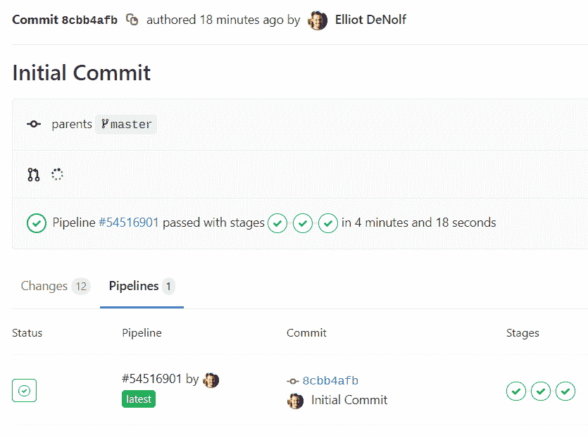

# 建造。使用 GitLab CI 的. NET 核心应用

> 原文：<https://dev.to/denolfe/build-net-core-applications-using-gitlab-ci-448c>

> 最初发布在我的博客上，网址为[https://elliotdenolf . com/posts/build-net-core-applications-using-git lab-ci](https://elliotdenolf.com/posts/build-net-core-applications-using-gitlab-ci)
> 
> 已为更新。网络 5

GitLab CI 能够利用任何 docker 容器来构建和部署应用程序。这使得它成为一个非常灵活的工具。本文将介绍如何为. NET 核心应用程序构建 GitLab CI 管道。

## 创建基本应用

首先，让我们使用 dotnet CLI 构建我们的基本应用程序和测试套件。为您的项目创建一个新目录，并执行以下命令:

```
mkdir MyApp MyApp.Tests
cd MyApp
dotnet new webapi
cd ../MyApp.Tests
dotnet new nunit
cd ..
dotnet new sln
dotnet sln add **/*.csproj 
```

Enter fullscreen mode Exit fullscreen mode

我们现在已经构建了一个基本的应用程序和测试套件，可以在我们的管道中使用。

在我们继续之前，这里是我们简化的项目结构:

```
.
|-- MyApp
| |-- MyApp.csproj
| |-- Program.cs
| `-- Startup.cs
|-- MyApp.Tests
| |-- MyApp.Tests.csproj
| `-- UnitTest1.cs
`-- MyApp.sln 
```

Enter fullscreen mode Exit fullscreen mode

## 创建管道

GitLab CI 是通过在项目的根目录下有一个`.gitlab-ci.yml`文件来驱动的。现在创建此文件。我们将放入这个文件的第一件事是我们的基本图像

```
image: mcr.microsoft.com/dotnet/sdk:5.0 
```

Enter fullscreen mode Exit fullscreen mode

这是微软官方的 dotnet 核心图像。它包括最新的。NET Core SDK，它提供了构建应用程序所需的一切。运行这个映像的容器将是我们的脚本运行和应用程序代码克隆的地方。也可以更改版本以构建以前的 dotnet 版本。

接下来，我们定义我们的阶段。我们将构建 3 个不同的阶段:构建、测试和发布。这些是通过添加这个块来添加的:

```
stages:
  - build
  - test
  - release 
```

Enter fullscreen mode Exit fullscreen mode

现在我们的阶段已经设置好了，我们可以添加构建步骤，并将它们与我们定义的阶段相关联。我们只是碰巧希望构建和测试阶段各有一个单独的步骤。

让我们添加将通过 dotnet CLI 构建的构建步骤:

```
build:
  stage: build
  script:
    - dotnet build 
```

Enter fullscreen mode Exit fullscreen mode

顶级值可以命名为您喜欢的任何名称。如果每个阶段只有一个步骤，让它们保持相同的名称会使事情变得简单。然而，`stage`值必须指定上面列出的阶段之一。这就是 GitLab CI 如何知道在哪个阶段运行这个步骤。

如果构建阶段成功，我们希望运行我们的单元测试。以下块将通过 dotnet CLI 运行测试命令:

```
test:
  stage: test
  script:
    - dotnet test 
```

Enter fullscreen mode Exit fullscreen mode

发布步骤将比前一步更复杂，因为我们将使用 dotnet publish 命令来捕获生成的工件。这是发布块:

```
release:
  stage: release
  only:
    - master
  artifacts:
    paths:
      - publish/
  script:
    - dotnet publish -c Release -o ../publish MyApp/MyApp.csproj 
```

Enter fullscreen mode Exit fullscreen mode

让我们来分解这个步骤的每一部分。

*   `only`部分指定这个步骤将*仅*在我们的主分支上运行。这是为了避免为特征分支生成工件
*   工件路径指向我们想要的输出目录
*   `dotnet publish`命令输出到项目根目录下的`publish`目录中。在发布之前记下与指定的`csproj`文件相关的`../`,因为 dotnet publish 命令输出，所以我们希望工件输出到根目录下的一个目录。

我们完整的`.gitlab-ci.yml`文件现在应该是这样的:

```
image : mcr.microsoft.com/dotnet/sdk:5.0

stages:
  - build
  - test
  - release

build:
  stage: build
  script:
    - dotnet build

test:
  stage: test
  script:
    - dotnet test

release:
  stage: release
  only:
    - master
  artifacts:
    paths:
      - publish/
  script:
    - dotnet publish -c Release -o ../publish MyApp/MyApp.csproj 
```

Enter fullscreen mode Exit fullscreen mode

如果我们提交这段代码并导航到 GitLab 存储库中的 CI/CD -> Pipelines，我们将能够看到为提交而运行的管道。如果成功，每一步都将有一个绿色的勾号，工件将可供下载。如果出现故障，将会显示一个红色的 X，单击它可以查看更多详细信息。

[](https://res.cloudinary.com/practicaldev/image/fetch/s--W8juP4dA--/c_limit%2Cf_auto%2Cfl_progressive%2Cq_auto%2Cw_880/https://elliotdenolf.com/media/pipeline-1.png)

除了我提供的步骤之外，还可以添加额外的步骤，但是它们会根据您的环境而有很大的不同。这个应用程序可以很容易地放到 Docker 映像中，并推送到 GitLab 映像注册中心或您的 Kubernetes 集群。然而，这本身就足以构成一整篇文章。现在，您已经有了基本的 CI 渠道。NET 核心应用！

### 链接

*   **[本例源代码为](https://github.com/denolfe/blog-code-samples/tree/master/posts/build-net-core-using-gitlab-ci)**
*   [GitLab CI](https://docs.gitlab.com/ee/ci/)
*   [点网 CLI 文档](https://docs.microsoft.com/en-us/dotnet/core/tools/?tabs=netcore2x)