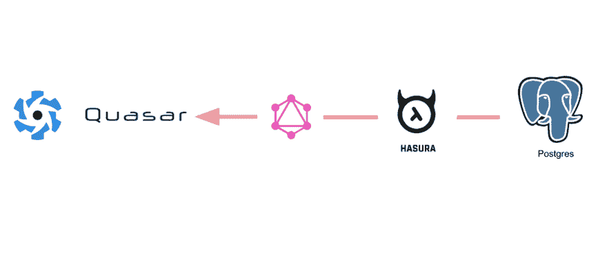

# 利用 Quasar 框架和 GraphQL 构建响应迅速的跨平台 Vue 应用

> 原文：<https://dev.to/hasurahq/build-responsive-cross-platform-vue-apps-with-quasar-framework-and-graphql-59a1>

**TL；**
博士使用单个代码库构建响应式 spa、SSR 应用、pwa、混合移动/电子应用，其中 [Quasar 框架](https://quasar-framework.org/)由 Vue.js 提供支持，GraphQL APIs 基于 postgres 使用 Hasura GraphQL 引擎。

即时设置。教程/样板文件👉[类星体-框架-vue-图表 ql](https://github.com/hasura/graphql-engine/tree/master/community/sample-apps/quasar-framework-vue-graphql)

[](https://res.cloudinary.com/practicaldev/image/fetch/s--d_LIW1Yl--/c_limit%2Cf_auto%2Cfl_progressive%2Cq_auto%2Cw_880/https://thepracticaldev.s3.amazonaws.com/i/5u2yyjpepe3amacqqvlr.png)

## 类星体框架

Quasar Framework 是一个高性能的全前端堆栈，允许开发人员维护一个单一的代码库来构建不同类型的应用程序(SPA、SSR、Hybdrid 等)。它由 Vue.js 提供支持，但自带一套内置的 [web 组件](https://quasar-framework.org/components/)，可以导入这些组件来快速构建应用程序的界面。

## 有类星体的宇宙

Hasura 是一个[开源](https://github.com/hasura/graphql-engine)引擎，为您提供新的或现有 Postgres 数据库上的实时 graph QL API，内置支持拼接自定义 graph QL API 和在数据库更改时触发 webhooks。

Hasura GraphQL 非常适合构建跨平台应用的工作流程。所有客户端(移动应用程序/电子应用程序)都使用由同一组权限和授权控制的同一组 API，并且可以利用 Postgres 的功能。Quasar 通过一个代码库和一个来自 Hasura 的通用 GraphQL API 提供了无限的可能性，从而简化了开发工作流程。

现在让我们来看看一个简单的作者/文章博客应用程序的一些实现细节:

## 插件

Quasar 允许用户定义应用程序插件，这些插件可用于在根 Vue 实例实例化之前运行代码。

```
quasar new plugin apollo 
```

Enter fullscreen mode Exit fullscreen mode

我们在`src/plugins/apollo.js`中定义了阿波罗插件，并用 Hasura GraphQL API 端点创建了**阿波罗客户端**。

在这个示例应用程序中，我们利用这个插件将 Apollo props 注入 Vue prototype。所以在**里面。vue** 文件，我们可以利用**这个。$apollo** 来执行任何 graphql 特定的动作。
我们可以通过修改 **quasar.conf** 并在插件列表中添加 **apollo** 来配置 quasar 添加新插件，如下:

```
module.exports = function (ctx) {
  return {
    // app plugins (/src/plugins)
    plugins: [
      'apollo'
    ],
  }
} 
```

Enter fullscreen mode Exit fullscreen mode

在布局中，我们定义了一个列出作者的布局抽屉，并使用了一个简单的 GraphQL 查询来获取作者。

```
<script>
import { openURL } from 'quasar'
import gql from 'graphql-tag'

const authorQuery = gql`
  query {
    author {
      id
      name
    }
  }`
export default {
  name: 'MyLayout',
  data () {
    return {
      leftDrawerOpen: this.$q.platform.is.desktop
    }
  },
  methods: {
    openURL,
    fetchArticles (item) {
      this.$router.push('/author/' + item.id)
    }
  },
  apollo: {
    // Simple query that will update the 'author' vue property
    author: authorQuery
  }

}
</script> 
```

Enter fullscreen mode Exit fullscreen mode

这仍然是你用 Vue.js 应用程序编写的相同类型的代码，用 **vue-apollo** 进行 GraphQL 查询。但不同之处在于,`<template>`quasar 提供了类似原生的组件来构建混合应用。

作者列表呈现在一个`<q-layout-drawer>`上，它会像每个类星体布局组件一样自动响应。Quasar 带有各种布局、按钮、表单组件等，您可以快速开始创建一个原生的应用程序。

## 建立目标

Quasar 要求你指定应用的模式`spa|ssr|pwa|cordova|electron`和目标`cordova|electron`(如果是混合应用)。您还可以指定主题，如材料、ios 等，这将为每个组件适当地应用样式。

点击阅读更多关于构建目标[的信息](https://quasar-framework.org/guide/app-build-commands.html)

我已经把样板和教程放在一起，这样你就可以快速开始了！
在 [github](https://github.com/hasura/graphql-engine/tree/master/community/sample-apps/quasar-framework-vue-graphql) 上查看。