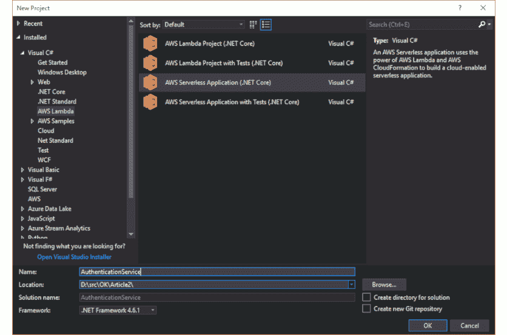
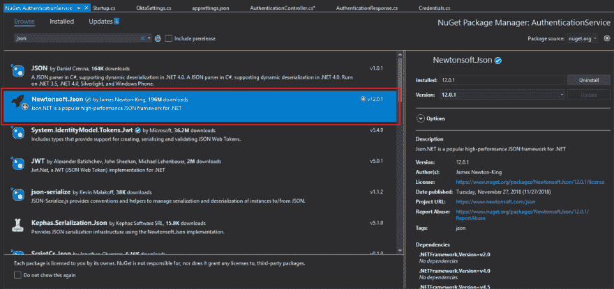
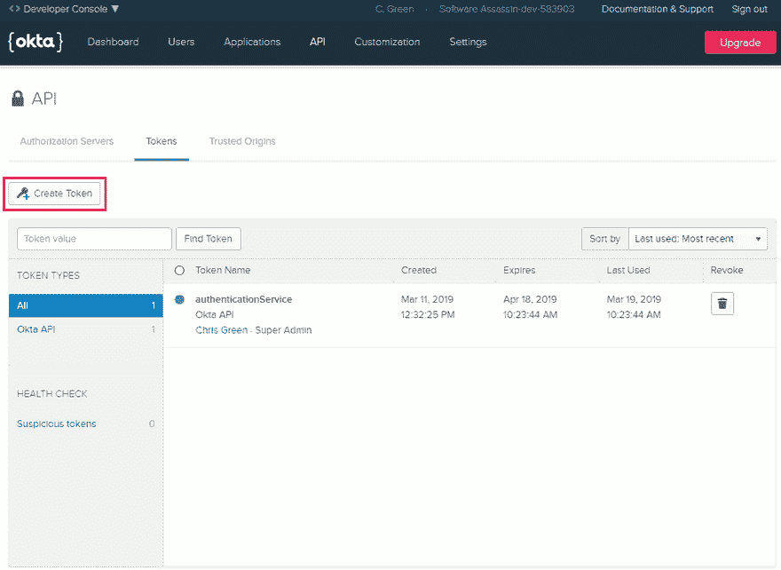
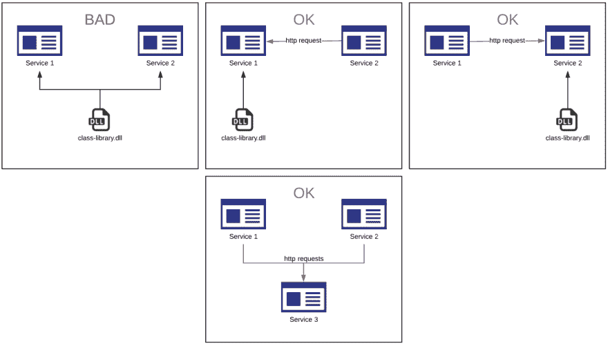
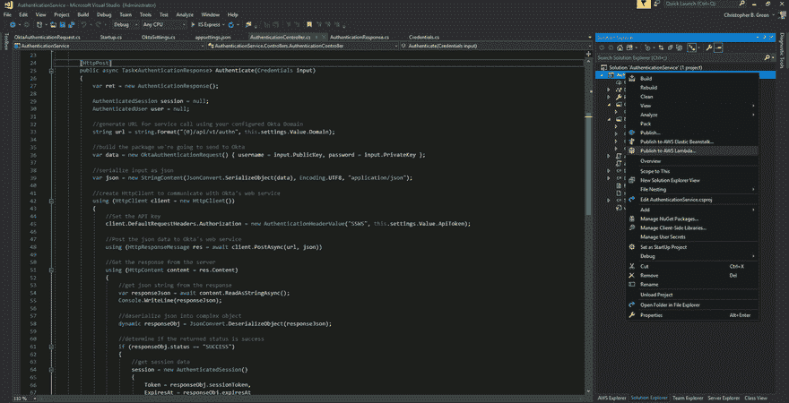

# 借助 AWS Lambda 和 ASP.NET 核心构建安全的微服务

> 原文：<https://dev.to/oktadev/build-secure-microservices-with-aws-lambda-and-asp-net-core-1efk>

微服务构建起来很有趣，并为我们提供了一种可扩展的途径来克服困扰单片应用程序的紧密耦合依赖性问题。

这篇文章将带你构建一个用 C#编写的 AWS Lambda 微服务。NET Core 2.1，并且用 JSON 进行通信。我们在这里汇集了多种令人兴奋的技术——微服务、通过 AWS Lambda 的无服务器 API，以及使用 Okta 简单方便的身份提供商进行身份认证。这些技术中的每一项都值得一篇深入的文章，因此这些主题有很多内容可以讨论。这篇文章旨在提供一个实现这三个目标的起点。这很简单，任何人都可以跟着做。它还将保持一个干净的、基本的实现，如果需要的话，您可以很容易地扩展它。

让我们直接开始构建我们的第一个微服务——身份认证服务。

按照本教程，你需要做一些事情。

*   Visual Studio 2017:如果没有，可以[免费下载 Visual Studio 社区](https://visualstudio.microsoft.com/downloads)。

*   AWS 账户:如果你还没有，你可以[在这里](https://aws.amazon.com/)创建一个。

## 打造您的 ASP.NET 核心微服务

创建新的 **AWS 无服务器应用程序(。【T1 网核心)】项目如下所示。如果你没有这个选项，你需要安装[Visual Studio 的 AWS 工具包](https://aws.amazon.com/visualstudio/)。**

[](https://res.cloudinary.com/practicaldev/image/fetch/s--gB6232-1--/c_limit%2Cf_auto%2Cfl_progressive%2Cq_66%2Cw_880/https://developer.okta.com/assets-jekyll/blog/netcore-microservice/file-new-lambda-4e79951521cf63ebf57fba5d7640c8f917fb04b01e7dc48f36953cd8e0ac76c2.gif)

您还需要安装 **Newtonsoft。Json** 包如下图所示。

[](https://res.cloudinary.com/practicaldev/image/fetch/s--c8bDaytT--/c_limit%2Cf_auto%2Cfl_progressive%2Cq_auto%2Cw_880/https://developer.okta.com/assets-jekyll/blog/netcore-microservice/install-newtonsoft-json-c0faaa90a99be0d61b4cd4c9a3f1e3ba6e2547f3c94cdb9a397ce48d527a3e87.png)

微服务架构在可扩展性方面尤其强大。每个组件都被隔离在自己的可执行文件或 web 服务中。这意味着组件可以在专用硬件上运行，特定的功能可以比 ESB(企业服务总线)更精确地扩展和缩减。这使得 [AWS Lambda](https://aws.amazon.com/lambda/) 成为托管您的新微服务的补充介质。Lambda 是一个高度可扩展的无服务器托管解决方案。

## 为您的 ASP.NET 微服务配置认证

对于这个例子，您需要一个 Okta 开发者帐户。如果你还没有，你可以注册一个[免费开发者账户](https://developer.okta.com/signup/)。

你还需要一个 Okta ApiToken。出于安全原因，ApiTokens 只显示一次，所以一旦生成就要确保它的安全。登录你的 Okta 开发者账号，点击主菜单中的 **API** ，然后进入**令牌**。在**令牌**屏幕上，点击页面左上角的**创建令牌**。为您的令牌命名，然后单击**创建令牌**。

此时，Okta 将生成您的 ApiToken 并显示在屏幕上。这个值最终将被放在 **appSettings.json** 中，但是现在，将它复制到某个地方以备后用。

[](https://res.cloudinary.com/practicaldev/image/fetch/s--TrelNCWS--/c_limit%2Cf_auto%2Cfl_progressive%2Cq_66%2Cw_880/https://developer.okta.com/assets-jekyll/blog/netcore-microservice/api-token-17e191306d4f794b585f0d8e7ebf945562fd1503ce35273e188f1754e64a5522.gif)

## 确定您的 ASP.NET 核心微服务的范围

微服务提供的效用是依赖性的松散耦合。服务内部的一切都是紧密耦合的。外面的一切都是松散耦合的。在尝试确定您的微服务应该有多大时，请记住这一点。您不希望您的服务发展到这样一个地步:您编写的类库是一个以上“微服务”的紧密耦合的依赖项

遵循这一规则，微服务可以提供非常深的功能池，它总是可以变得更深，但很少会变得更宽。

[](https://res.cloudinary.com/practicaldev/image/fetch/s--NUXdNZ5M--/c_limit%2Cf_auto%2Cfl_progressive%2Cq_auto%2Cw_880/https://developer.okta.com/assets-jekyll/blog/netcore-microservice/microservice-diagram-1a78b099d69e1ebbd70e1857c1cf2fcf20f2a4569df7b107085b380d2fade30c.png)

## 为您的 ASP.NET 核心微服务创建对象

在项目的根文件夹中，创建一个名为 **Model** 的文件夹。在该文件中，您需要创建以下模型对象。首先创建所有这些对象是最容易的，这样当我们开始编写逻辑时，用于传输数据的对象就已经存在了。

#### OktaSettings

`OktaSettings`对象将用于存储您的 Okta 域和 API 令牌，该令牌支持对您的 Okta 帐户进行编程访问。注意，这些成员——`Domain`和`ApiToken`——与标题为`Okta`的 **appSettings.json** 文件中的属性相匹配。当程序启动时，配置文件将被读取，值将被存储在内存中，然后可通过`IOptions<OktaSettings>`访问。

```
namespace AuthenticationService.Model
{
    public class OktaSettings
    {
        public string Domain { get; set; }
        public string ApiToken { get; set; }
    }
} 
```

#### OktaAuthenticationRequest

这个类用于在`https://{yourOktaDomain}/api/v1/authn`向 Okta 认证 API 发送数据。这个类的一个实例将被传递给 Okta，同时将`username`和`password`提供给我们的认证服务。这个调用告诉我们登录是否成功。

有关 Okta 认证 API 的更多信息，包括 HTTP 请求的 postman 示例，请点击[这里](https://developer.okta.com/docs/api/resources/authn)。

```
namespace AuthenticationService.Model
{
    public class OktaAuthenticationRequest
    {
        public string username { get; set; }
        public string password { get; set; }
    }
} 
```

#### 凭证

我们的`AuthenticationController`会暴露一个单独的动作——`Authenticate`。该方法接受单个输入- `Credentials`。`Credentials`用于将需要认证的用户名和密码传递给我们的微服务。

```
namespace AuthenticationService.Model
{
    public class Credentials
    {
        public string PublicKey { get; set; }
        public string PrivateKey { get; set; }
    }
} 
```

让您的微服务保持小型，只有一个控制器和一个动作，这对依赖于您的新微服务的系统的下游有好处。在微服务驱动的平台上，灾难是隔离的。如果一项服务关闭，其余的服务和应用程序的无关功能仍将运行。当您的团队着手解决生产问题时，应用程序受影响的部分可以显示一条友好的消息，通知用户停机。如果服务逻辑和应用程序逻辑紧密耦合，那么整个应用程序都会被服务拖垮。

#### 认证响应

就像`Credentials`用于向`Authenticate`动作传递数据一样，`AuthenticationResponse`用于从`Authenticate`动作返回数据。它将告诉调用您的微服务的客户端调用是否成功，否则将返回一个错误消息。

如果成功，您还将定义`User`和`Session`成员。

```
using System;

namespace AuthenticationService.Model
{
    public class AuthenticationResponse
    {
        public bool WasSuccessful { get; set; }
        public string Message { get; set; }

        public AuthenticatedSession Session { get; set; }
        public AuthenticatedUser User { get; set; }
    }
} 
```

#### 认证会话

如果用户成功通过身份验证，则使用`AuthenticatedSession`类封装用户会话的详细信息。这将用于将该数据返回给调用您的微服务的客户端。

```
using System;

namespace AuthenticationService.Model
{
    public class AuthenticatedSession
    {
        public string Token { get; set; }
        public string ExpiresAt { get; set; }
    }
} 
```

#### 认证用户

与`AuthenticatedSession`非常相似，`AuthenticatedUser`被用来封装用户的详细信息，如果他们被成功认证的话。这将用于将数据返回给调用我们微服务的客户端。

```
using System;

namespace AuthenticationService.Model
{
    public class AuthenticatedUser
    {
        public string Id { get; set; }
        public DateTime PasswordChanged { get; set; }
        public string Login { get; set; }
        public string FirstName { get; set; }
        public string LastName { get; set; }
        public string Locale { get; set; }
        public string TimeZone { get; set; }
    }
} 
```

## 为 ASP.NET 核心微服务加载配置

在启动时，我们需要处理配置文件，这样我们就可以访问配置好的 Okta 域和 ApiToken。为此，在`Startup.cs`文件的`ConfigureServices`方法的底部添加以下几行。这告诉. net core 配置细节在哪里，并给它我们的`OktaSettings`类，用于访问配置设置。

```
// Okta configuration
services.Configure<OktaSettings>(Configuration.GetSection("Okta"));
services.AddOptions(); 
```

## 向您的 ASP.NET 核心微服务添加认证步骤

下一步是通过调用 Okta 的认证 API 来实现认证。将名为**authenticationcontroller . cs**的文件添加到您的**控制器**文件夹中。然后粘贴下面的代码:

```
using System;
using System.Threading.Tasks;
using System.Net.Http;
using Newtonsoft.Json;
using System.Net.Http.Headers;
using System.Text;

using Microsoft.Extensions.Options;
using Microsoft.AspNetCore.Mvc;

using AuthenticationService.Model;

namespace AuthenticationService.Controllers
{
    [Route("api/[controller]/[action]")]
    public class AuthenticationController : Controller
    {
        private IOptions<OktaSettings> settings;
        public AuthenticationController(IOptions<OktaSettings> settings)
        {
            this.settings = settings;
        }

        [HttpPost]
        public async Task<AuthenticationResponse> Authenticate(Credentials input)
        {
            var ret = new AuthenticationResponse();

            AuthenticatedSession session = null;
            AuthenticatedUser user = null;

            //generate URL for service call using your configured Okta Domain
            string url = string.Format("{0}/api/v1/authn", this.settings.Value.Domain);

            //build the package we're going to send to Okta
            var data = new OktaAuthenticationRequest() { username = input.PublicKey, password = input.PrivateKey };

            //serialize input as json
            var json = new StringContent(JsonConvert.SerializeObject(data), Encoding.UTF8, "application/json");

            //create HttpClient to communicate with Okta's web service
            using (HttpClient client = new HttpClient())
            {
                //Set the API key
                client.DefaultRequestHeaders.Authorization = new AuthenticationHeaderValue("SSWS", this.settings.Value.ApiToken);

                //Post the json data to Okta's web service
                using (HttpResponseMessage res = await client.PostAsync(url, json))

                //Get the response from the server
                using (HttpContent content = res.Content)
                {
                    //get json string from the response
                    var responseJson = await content.ReadAsStringAsync();
                    Console.WriteLine(responseJson);

                    //deserialize json into complex object
                    dynamic responseObj = JsonConvert.DeserializeObject(responseJson);

                    //determine if the returned status is success
                    if (responseObj.status == "SUCCESS")
                    {
                        //get session data
                        session = new AuthenticatedSession()
                        {
                            Token = responseObj.sessionToken,
                            ExpiresAt = responseObj.expiresAt
                        };

                        //get user data
                        user = new AuthenticatedUser()
                        {
                            Id = responseObj._embedded.user.id,
                            Login = responseObj._embedded.user.login,
                            Locale = responseObj._embedded.user.locale,
                            TimeZone = responseObj._embedded.user.timeZone,
                            FirstName = responseObj._embedded.user.firstName,
                            LastName = responseObj._embedded.user.lastName
                        };
                    }
                }
            }

            //return results of the operation packaged in a AuthenticationResponse object
            var wasSuccess = session != null && user != null;
            return new AuthenticationResponse()
            {
                WasSuccessful = wasSuccess,
                Message = wasSuccess ? "Success" : "Invalid username and password",

                Session = session,
                User = user
            };
        }
    }
} 
```

您可能会注意到，该类的构造函数接受了一个`IOptions<OktaSettings>`实例。`OktaSettings`就是你在`Model`文件夹中定义的用来存储 Okta 配置设置的类。

您添加到 **Startup.cs** 的配置代码使`IOptions<OktaSettings>`能够被识别。Net Core 和框架会在类初始化时自动提供输入。这使您可以访问 **appSettings.json** 中的 Okta 配置设置。

动作已经被很好地注释了，以帮助你理解每一行是做什么的。以下是该操作所经历的高级步骤:

创建一个`OktaAuthenticationRequest`实例，将提供的用户名和密码传递给 Okta 的身份验证服务 JSON 对数据进行编码。创建一个`HttpClient`实例来与 Okta 通信，并使用 ApiTokenPosts 将 JSON 编码的数据发送到 Okta 并等待响应。反序列化 JSON 响应流，并评估返回的状态是否为`"SUCCESS"`。如果登录不成功，它将为`WasSuccess`返回`false`，为`Message`返回`"Invalid username and password"`。如果成功，它返回`WasSuccess`的`true`，并返回 Okta 提供的会话和用户数据。

## 为您的微服务添加配置管理

您对服务的所有配置都可以在 **appSettings.json** 文件中找到。遵循最佳实践，您将希望配置每个环境以指向 Okta 的不同实例。这隔离了每个环境，因此一个环境中的测试不会干扰另一个环境中的测试。它帮助你熟悉你的 Okta 设置，这样当你配置 Okta 和你的软件时，你可以深思熟虑。它提供了预演部署和配置的机会。在将您的解决方案投入生产时，所有这些都是您不想跳过的有用步骤。

你必须从你的 Okta 帐户填充以下设置。

```
 "Okta":  {  "Domain":  "https://{yourOktaDomain}",  "ApiToken":  "{yourApiToken}"  } 
```

## 部署您的 Lambda 微服务

[](https://res.cloudinary.com/practicaldev/image/fetch/s--AtEQvxzd--/c_limit%2Cf_auto%2Cfl_progressive%2Cq_66%2Cw_880/https://developer.okta.com/assets-jekyll/blog/netcore-microservice/deploy-lambda-6b7043c3e7ae23c34f6b1e43dea8e0372e69389b8c2eaa4a37b621f926e681bc.gif)

将新的微服务部署为 Lambda 函数非常简单。AWS Toolkit for Visual Studio 将为您创建云组件。要部署您的微服务，在 Solution Explorer 中，右键单击您的 web 服务项目，并选择 **Publish to AWS Lambda** 。

点击**账户资料旁边的小人图标，使用**。在弹出的窗口中，您可以使用“default”作为配置文件名。您需要输入访问密钥信息。要在 AWS 中创建访问密钥，请在 AWS 仪表板的右上角点击您的帐户名称，然后选择**我的安全凭证**。展开**访问键**部分，点击**创建新的访问键**。在弹出窗口中，会有一个显示访问密钥 ID 和秘密访问密钥的链接。您可以在 Visual Studio 的部署窗口中输入它们，或者下载 keyfile 并单击**从 csv 文件导入…** 来导入它。

然后，你需要提供一个名为的**栈。这可以是您想命名的任何名称，向导将在创建 AWS 资源时使用它作为自动生成的组件名称的前缀。您还可以提供您希望代码部署到的 **S3 存储桶**。您可以点击**新建…** 按钮创建一个 S3 桶来使用。点击**发布**开始部署。**

如果您的云资源尚未创建，publish 将为您创建。在发布过程中，模式窗口将会消失，一个部署选项卡将会出现在您的 IDE 中。一旦选项卡中显示的状态显示为 **UPDATE_COMPLETE** ，您的部署就完成了。

复制 **AWS 无服务器 URL** ，用它来测试你的微服务。你的 URL 可能看起来像我的如下所示:`https://25ayfn7ecl.execute-api.us-east-2.amazonaws.com/Prod`。

这意味着我们的`authenticate`动作的 URL 看起来像:`https://25ayfn7ecl.execute-api.us-east-2.amazonaws.com/Prod/api/authentication/authenticate`。

打开 Postman 并投递到上述 URL，同时发送以下表单数据:

*   PublicKey = {您的用户名}
*   PrivateKey = {您的密码}

如果您得到了如下的回复，那么您就可以开始了！

```
{  "wasSuccessful":  true,  "message":  "Success",  "session":  {  "token":  "2011129scHesxiG6Psr1ZCtdADBEJ1iBMr_KtTnaeSV4ZJvpP03BOP_",  "expiresAt":  "03/19/2019 18:32:20"  },  "user":  {  "id":  "00uitftb3egstVhnQ0h7",  "passwordChanged":  "0001-01-01T00:00:00",  "login":  null,  "firstName":  null,  "lastName":  null,  "locale":  null,  "timeZone":  null  }  } 
```

## ASP.NET 芯微服务生产的后续步骤和注意事项

如果你要把它投入生产，你肯定要有一个 SSL 证书。选择像 AWS 或 GoDaddy 这样的认证机构，并查看他们的 SSL 产品。购买您的 SSL 并将其安装在您的 web 服务器或 AWS 帐户上。

身份验证是关于验证客户端的身份。另一方面，授权是在你知道你在和谁打交道，并且你想知道他们有权限访问什么之后，你有时会做的事情。如果您的授权逻辑**简单**，那么向这个现有的微服务添加另一个控制器和动作可能是合适的。如果你的逻辑比较复杂，那么就应该放到一个新的微服务里。然后，可以向新的微服务传递会话令牌(从我们今天构建的认证微服务返回)和数字资源的身份，它将返回对该资源的访问级别。

## 了解更多 ASP.NET 核心和微服务

你可以在 GitHub 上找到完整的源代码[在这里](https://github.com/oktadeveloper/okta-aspnetcore-microservice-example)。祝编码愉快！

有关使用 ASP.NET 核心和微服务的其他示例，请查看以下链接:

*   [API 和微服务最佳实践(视频)](https://www.okta.com/video/oktane18-developer-api-and-microservice-best-practices/)
*   [使用 Spring Security 和 OAuth 2.0 保护 Spring 微服务架构](https://developer.okta.com/blog/2018/02/13/secure-spring-microservices-with-oauth)
*   [用 OAuth2.0 和 JHipster 开发微服务架构](https://developer.okta.com/blog/2018/03/01/develop-microservices-jhipster-oauth)
*   [Okta 的认证 API 文档，带有针对 HTTP 请求的 Postman 示例](https://developer.okta.com/docs/reference/api/authn/)
*   [马丁·福勒-微服务(视频)](https://www.youtube.com/watch?v=2yko4TbC8cI&feature=youtu.be)

如果你有任何问题，请在下面的评论区发表。别忘了在推特上关注我们，在 T2 的 YouTube 上查看我们的视频！