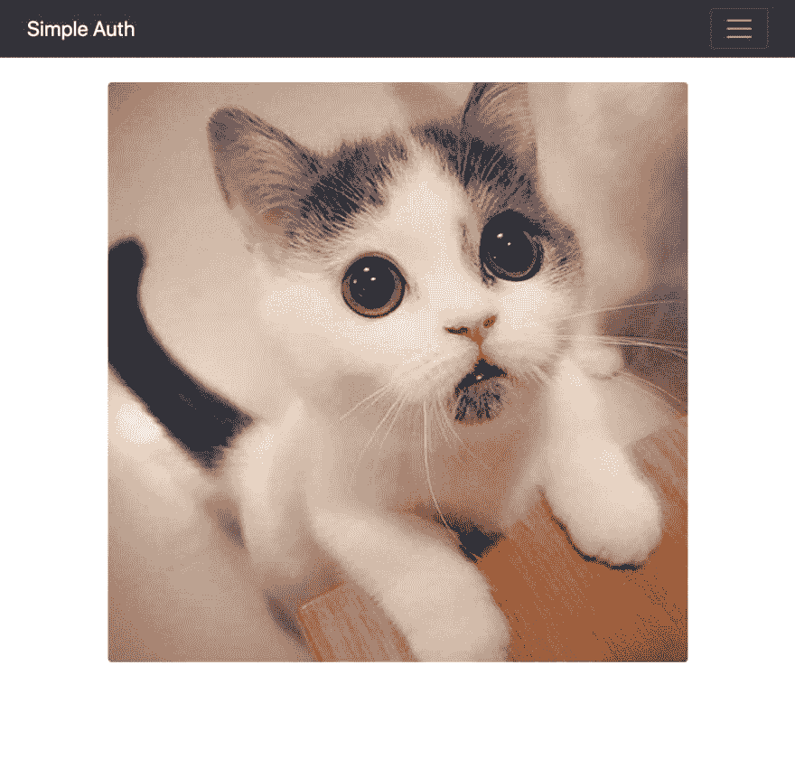
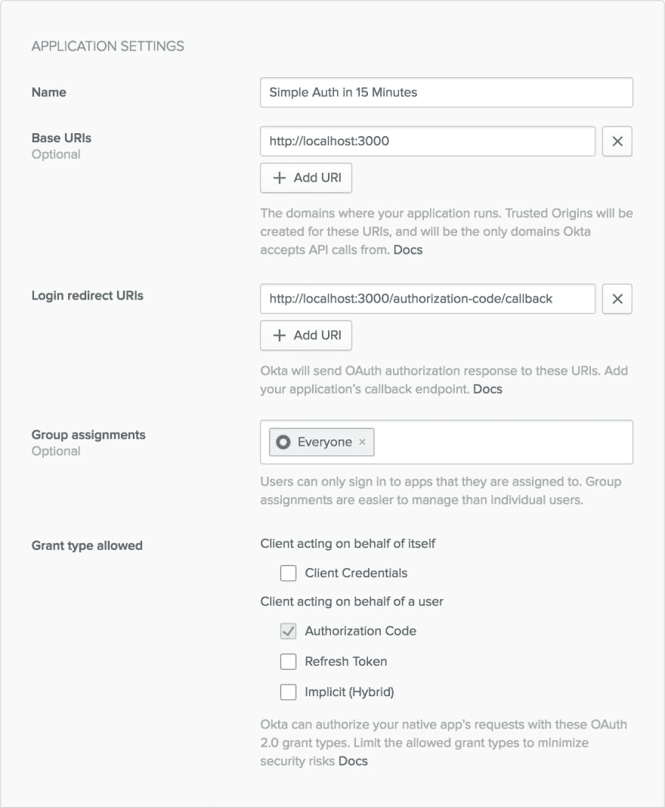
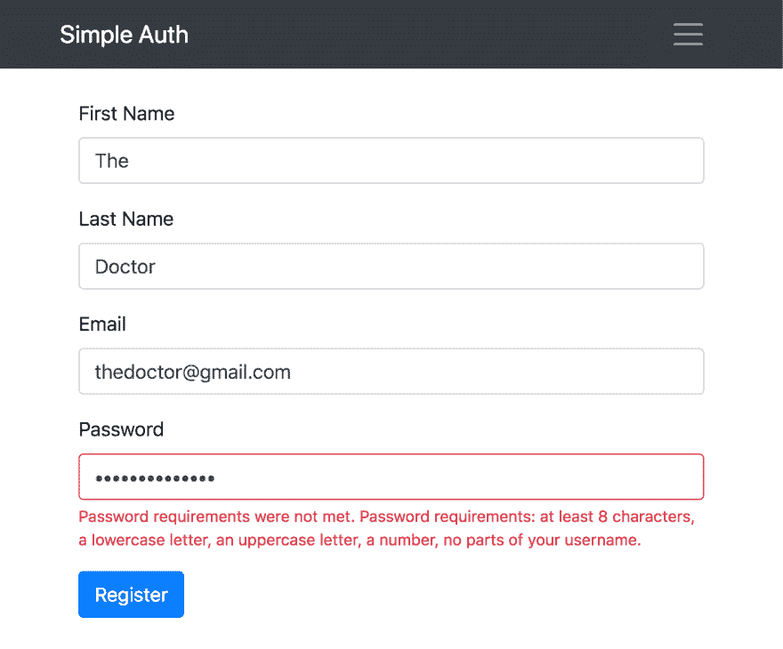
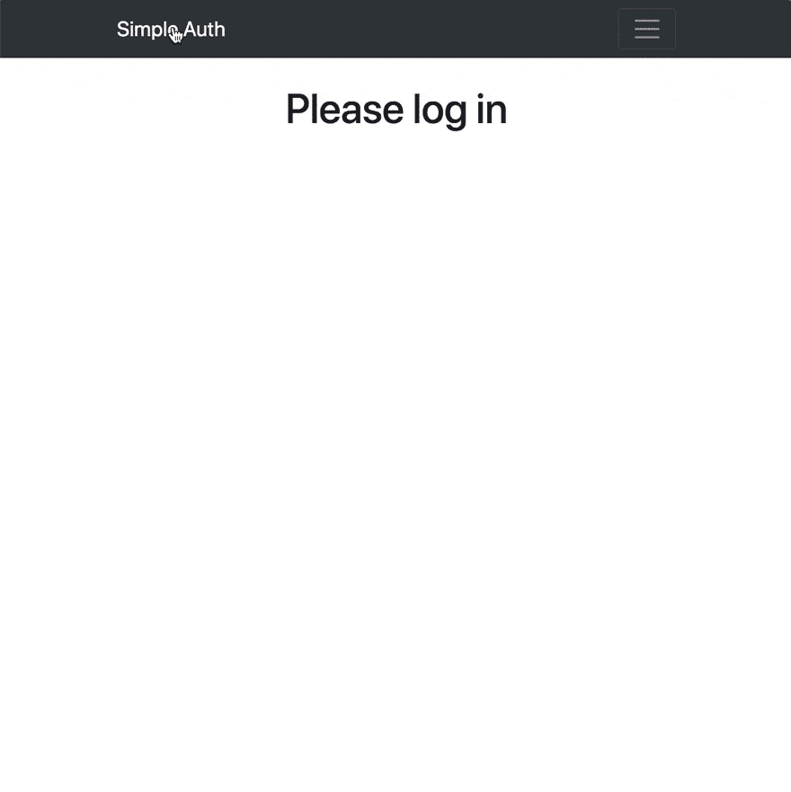

# 在 15 分钟内在 Express 中构建简单的身份验证

> 原文：<https://dev.to/oktadev/build-simple-authentication-in-express-in-15-minutes-4l58>

构建带有用户认证的网页可能是一个巨大的痛苦。您通常需要建立某种数据库来管理用户，即使您没有将数据库用于任何其他用途。然后你需要存储他们的密码散列，你几乎需要一个互联网安全的学位来知道这样做最安全的方法。

如果我告诉你没必要这么复杂呢？使用 [Okta](https://developer.okta.com/) 和 Express，我将向您展示如何真正快速地建立一个具有安全用户认证的网站，而不需要单独的数据库。您需要的一切都可以部署在任何可以运行 Node 的地方。

## 在 Express 中创建新应用

在 Express 中创建一个新的应用程序并不需要很多代码。您需要建立您的项目结构并安装一些依赖项，这可以通过几个命令来完成:

```
mkdir new-project
cd new-project
npm init -y
npm install express@4.16.4 hbs@4.0.1
npm install --save-dev nodemon@1.18.4 standard@12.0.1 
```

编辑你的`package.json`的`"scripts"`部分，如下所示:

```
"scripts":  {  "start":  "nodemon .",  "test":  "standard"  }, 
```

现在创建一个新文件`index.js`:

**index.js**

```
const express = require('express');
const path = require('path');

const app = express();

app.set('views', path.join(__dirname, 'views'));
app.set('view engine', 'hbs');

app.use(express.urlencoded({ extended: true }));
app.use('/static', express.static('public'));

// @TODO add auth middleware
// @TODO add registration page
// @TODO add logout route

app.use('/', require('./routes/index'));

const port = process.env.PORT || 3000;
app.listen(port, () => console.log(`App listening on port ${port}`)); 
```

做几个新文件夹:

```
mkdir -p public/images routes views 
```

在`publimg/greeting.jpg`中放置一个有趣的问候图片，您将使用它来问候用户。

Express 允许使用模板引擎。您已经在上面设置了手柄(hbs ),所以现在您可以创建几个视图。一个是包含基本标记的 HTML 框架，另一个是你的主页(`index`视图)。

**views/layout.hbs**

```
<!doctype html>
<html lang="en">
  <head>
    <!-- Required meta tags -->
    <meta charset="utf-8">
    <meta name="viewport" content="width=device-width, initial-scale=1, shrink-to-fit=no">

    <!-- Bootstrap CSS -->
    <link rel="stylesheet" href="https://stackpath.bootstrapcdn.com/bootstrap/4.1.3/css/bootstrap.min.css" integrity="sha384-MCw98/SFnGE8fJT3GXwEOngsV7Zt27NXFoaoApmYm81iuXoPkFOJwJ8ERdknLPMO" crossorigin="anonymous">

    Simple Auth in 15 Minutes
  </head>
  <body>
    <nav class="navbar navbar-expand-lg navbar-dark bg-dark">
      <div class="container">
        <a class="navbar-brand" href="/">Navbar</a>
        <button class="navbar-toggler" type="button" data-toggle="collapse" data-target="#navbarNavAltMarkup" aria-controls="navbarNavAltMarkup" aria-expanded="false" aria-label="Toggle navigation">
          <span class="navbar-toggler-icon"></span>
        </button>
        <div class="collapse navbar-collapse" id="navbarNavAltMarkup">
          <div class="navbar-nav">
            {{!-- @TODO add auth links --}}
          </div>
        </div>
      </div>
    </nav>
    <main class="container pt-4">{{{body}}}</main>

    <!-- Optional JavaScript -->
    <!-- jQuery first, then Popper.js, then Bootstrap JS -->
    <script src="https://code.jquery.com/jquery-3.3.1.slim.min.js" integrity="sha384-q8i/X+965DzO0rT7abK41JStQIAqVgRVzpbzo5smXKp4YfRvH+8abtTE1Pi6jizo" crossorigin="anonymous"></script>
    <script src="https://cdnjs.cloudflare.com/ajax/libs/popper.js/1.14.3/umd/popper.min.js" integrity="sha384-ZMP7rVo3mIykV+2+9J3UJ46jBk0WLaUAdn689aCwoqbBJiSnjAK/l8WvCWPIPm49" crossorigin="anonymous"></script>
    <script src="https://stackpath.bootstrapcdn.com/bootstrap/4.1.3/js/bootstrap.min.js" integrity="sha384-ChfqqxuZUCnJSK3+MXmPNIyE6ZbWh2IMqE241rYiqJxyMiZ6OW/JmZQ5stwEULTy" crossorigin="anonymous"></script>
  </body>
</html> 
```

这个`layout`将为每个视图渲染，用特定的视图替换`{{{body}}}`标签。

现在您可以创建`index`视图了。这将只显示您放入`publimg/greeting.jpg`的图像:

**views/index.hbs**

```
<div class="d-flex justify-content-center">
  
</div> 
```

要告诉主页在渲染时使用该文件，您还需要创建一个路由器。你已经在你的应用程序的`index.js`文件中`require` d `routes/index.js`了，所以现在你只需要创建那个文件:

**routes/index.js**

```
const express = require('express');
const router = express.Router();

router.get('/', (req, res) => {
  res.render('index');
});

module.exports = router; 
```

对`res.render('index')`的调用告诉 Express 使用渲染`index.hbs`视图，并将结果返回给客户端。您也可以在某些上下文中传递，但这里还不需要。

现在，您可以使用以下命令运行您的服务器(当您做出更改时，服务器将重新加载，您只需刷新页面):

```
npm start 
```

前往`http://localhost:3000`查看您的问候。

[](https://res.cloudinary.com/practicaldev/image/fetch/s--RFV7Scdo--/c_limit%2Cf_auto%2Cfl_progressive%2Cq_auto%2Cw_880/https://developer.okta.com/assets-jekyll/blog/express-auth/greeting-70b2950ac0c6e2dffc3a047726e425824d273b9ef776a53e4f385cf4cd5c59fe.png)

## 向您的 Express 应用程序添加身份验证

您现在有了一个简单的 web 服务器，它有一个主页和一个可爱的问候图像。我承诺向您展示的下一步是添加安全的用户认证。这就是 Okta 发挥作用的地方。Okta 是一种云服务，允许开发人员创建、编辑和安全存储用户帐户和用户帐户数据，并将它们与一个或多个应用程序连接。我们的 API 使您能够:

*   [认证](https://developer.okta.com/product/authentication/)和[授权](https://developer.okta.com/product/authorization/)您的用户
*   存储用户数据
*   执行基于密码的[社交登录](https://developer.okta.com/authentication-guide/social-login/)
*   通过[多重身份验证](https://developer.okta.com/use_cases/mfa/)保护您的应用
*   还有更多！查看我们的[产品文档](https://developer.okta.com/documentation/)

如果你还没有，那么[注册一个永远免费的开发者账户](https://developer.okta.com/signup/)。

你需要保存一些信息，以便在应用程序中使用。在应用程序的根目录下创建一个名为`.env`的新文件。在其中，输入您的组织 URL。

```
HOST_URL=http://localhost:3000
OKTA_ORG_URL=https://{yourOktaOrgUrl} 
```

您还需要一个随机字符串作为会话的应用程序密码。您可以使用下面的命令来生成它:

```
npm install -g uuid-cli
echo "APP_SECRET=`uuid`" >> .env 
```

接下来，登录你的 Okta 开发者控制台，导航到**应用**，然后点击**添加应用**。选择**网页**，然后点击**下一步**。

[](https://res.cloudinary.com/practicaldev/image/fetch/s--07WgO8GA--/c_limit%2Cf_auto%2Cfl_progressive%2Cq_auto%2Cw_880/https://developer.okta.com/assets-jekyll/blog/express-auth/create-new-application-settings-844d90537789773d73905c6633f2773cb685bc09f2813bc7812e640f10188057.png)

创建应用程序后，您进入的页面有更多信息需要保存到您的`.env`文件中。复制客户端 ID 和客户端密码。

```
OKTA_CLIENT_ID={yourClientId}
OKTA_CLIENT_SECRET={yourClientSecret} 
```

在撰写本文时，默认的应用程序创建页面不允许您添加注销重定向 URI，但是您可以在创建应用程序后添加一个。创建应用程序后，点击**编辑**，然后在**注销重定向 URIs** 旁边点击**添加 URI** 。添加`http://localhost:3000`的注销重定向 URI，点击**保存**。

您需要从 Okta 获得的最后一条信息是一个 API 令牌。在您的开发者控制台中，导航到**API**->-**令牌**，然后点击**创建令牌**。您可以有许多令牌，所以只需给这个令牌起一个提醒您其用途的名称，如“15 分钟验证”。你会得到一个你现在只能看到的令牌。如果您丢失了令牌，您必须重新创建一个。也将此添加到`.env`中。

```
OKTA_TOKEN={yourOktaAPIToken} 
```

### 将认证中间件添加到您的 Express 应用程序

Okta 提供了一些中间件，可以给你用户是否注册的信息。默认情况下，它还会在`/login`为您提供一个登录页面。添加以下依赖项:

```
npm install dotenv@6.1.0 express-session@1.15.6 @okta/oidc-middleware@1.0.2 @okta/okta-sdk-nodejs@1.2.0 
```

在您的`index.js`页面中，用下面的代码替换`// @TODO add auth middleware`注释:

```
app.use(
  require('express-session')({
    secret: process.env.APP_SECRET,
    resave: true,
    saveUninitialized: false
  })
);

const { ExpressOIDC } = require('@okta/oidc-middleware');
const oidc = new ExpressOIDC({
  issuer: `${process.env.OKTA_ORG_URL}/oauth2/default`,
  client_id: process.env.OKTA_CLIENT_ID,
  client_secret: process.env.OKTA_CLIENT_SECRET,
  redirect_uri: `${process.env.HOST_URL}/authorization-code/callback`,
  scope: 'openid profile'
});

app.use(oidc.router); 
```

此外，确保将以下内容添加到`index.js`的最顶端。为了加载您的环境变量，它需要在任何其他代码之前出现，所以它应该是文件的第一行:

```
require('dotenv').config(); 
```

### 创建注册页面

您现在应该能够通过转到`/login`登录。这将把你重定向到你的 Okta 开发者页面，在你登录后，你将被重定向回主页。

对于还没有注册的人，他们需要一个注册页面。在撰写本文时，Okta 还没有提供现成的注册页面，但是您可以很快地创建一个。为您的路线创建新视图:

**views/register.hbs**

```
<form method="post">
  {{#each fields}}
    <div class="form-group">
      <label>{{this.label}}</label>
      <input
        required
        name="{{this.name}}"
        type="{{this.type}}"
        class="form-control {{#if this.error}}is-invalid{{/if}}"
        value="{{this.value}}"
      />
      <div class="invalid-feedback">{{this.error}}</div>
    </div>
  {{/each}}
  <button type="submit" class="btn btn-primary">Register</button>
</form> 
```

你还需要一条新路线:

**routes/register.js**

```
const okta = require('@okta/okta-sdk-nodejs');
const express = require('express');

const router = express.Router();

const client = new okta.Client({
  orgUrl: process.env.OKTA_ORG_URL,
  token: process.env.OKTA_TOKEN
});

// Take the user to the homepage if they're already logged in
router.use('/', (req, res, next) => {
  if (req.userContext) {
    return res.redirect('/');
  }

  next();
});

const fields = [
  { name: 'firstName', label: 'First Name' },
  { name: 'lastName', label: 'Last Name' },
  { name: 'email', label: 'Email', type: 'email' },
  { name: 'password', label: 'Password', type: 'password' }
];

router.get('/', (req, res) => {
  res.render('register', { fields });
});

router.post('/', async (req, res) => {
  const { body } = req;

  try {
    await client.createUser({
      profile: {
        firstName: body.firstName,
        lastName: body.lastName,
        email: body.email,
        login: body.email
      },
      credentials: {
        password: {
          value: body.password
        }
      }
    });

    res.redirect('/');
  } catch ({ errorCauses }) {
    const errors = {};

    errorCauses.forEach(({ errorSummary }) => {
      const [, field, error] = /^(.+?): (.+)$/.exec(errorSummary);
      errors[field] = error;
    });

    res.render('register', {
      errors,
      fields: fields.map(field => ({
        ...field,
        error: errors[field.name],
        value: body[field.name]
      }))
    });
  }
});

module.exports = router; 
```

为了将这些联系在一起，在您的根文件`index.js`中，确保将`// @TODO add registration page`注释替换为以下内容:

```
app.use('/register', require('./routes/register')); 
```

您现在可以让用户注册了。如果他们遇到错误，将显示导致错误的字段。

[](https://res.cloudinary.com/practicaldev/image/fetch/s--Q-VBOLYs--/c_limit%2Cf_auto%2Cfl_progressive%2Cq_auto%2Cw_880/https://developer.okta.com/assets-jekyll/blog/express-auth/register-fe650273d12718c6af20cfe464c09a66a365afb85d46da4ec7607fba4474f0af.png)

### 添加注销路线

在撰写本文时，Okta 的中间件没有提供默认的`/logout`路线。幸运的是，添加一个非常简单。在您的`index.js`文件中，将`// @TODO add logout route`注释替换为:

```
app.get('/logout', (req, res) => {
  if (req.userContext) {
    const idToken = req.userContext.tokens.id_token;
    const to = encodeURI(process.env.HOST_URL);
    const params = `id_token_hint=${idToken}&post_logout_redirect_uri=${to}`;
    req.logout();
    res.redirect(
      `${process.env.OKTA_ORG_URL}/oauth2/default/v1/logout?${params}`
    );
  } else {
    res.redirect('/');
  }
}); 
```

如果您已登录，这将使令牌无效并删除用户的会话。然后，它会将你重定向回主页。如果你没有登录，它只会带你回到主页。

### 在您的快递应用程序中添加新路线的链接

为了更容易地向用户展示这些路线，您可以添加一些按钮。您需要向视图公开用户上下文，以了解用户是否登录，这样您就知道要显示哪些按钮，并可能问候用户。

在`routes/index.js`中，用以下内容替换`res.render('index')`行:

**routes/index.js**

```
const { userContext } = req;
res.render('index', { userContext }); 
```

同时，您还可以阻止用户看到您的问候语，除非他们已经登录。将您的`views/index.hbs`文件更改为以下内容:

**views/index.hbs**

```
{{#if userContext}}
  <h1 class="text-center">Hi {{userContext.userinfo.given_name}}!</h1>
  <div class="d-flex justify-content-center">
    
  </div>
{{else}}
  <h1 class="text-center">Please log in</h1>
{{/if}} 
```

现在添加按钮。在`views/layout.hbs`中，用以下内容替换`{{!-- @TODO add auth links --}}`注释:

**views/layout.hbs**

```
{{#if userContext}}
  <a class="nav-item nav-link" href="/logout">Log out</a>
{{else}}
  <a class="nav-item nav-link" href="/login">Log in</a>
  <a class="nav-item nav-link" href="/register">Register</a>
{{/if}} 
```

检查最终产品，以确保它的工作

[](https://res.cloudinary.com/practicaldev/image/fetch/s--30dDQELr--/c_limit%2Cf_auto%2Cfl_progressive%2Cq_66%2Cw_880/https://developer.okta.com/assets-jekyll/blog/express-auth/login-flow-e91caac413491164155cc8f6fb3558b307cdf00599ac9bb95b20e3e11dc6e68e.gif)

## 了解更多关于 Node、Express 和 Okta 的信息

就是这样！在短短几分钟内，你从一个空的文件夹到一个安全的网站，用户注册和登录。你甚至不需要建立一个数据库！如果想看最终的代码样本做参考，可以在 GitHub 上找到[。](https://github.com/oktadeveloper/okta-node-express-15-minute-auth-example)

如果您想了解更多关于 Node 和 Express 的信息，请查看 Okta 开发者博客上的其他帖子:

*   [通过实例构建并理解 Express 中间件](https://developer.okta.com/blog/2018/09/13/build-and-understand-express-middleware-through-examples)
*   [建立并理解一个简单的 Node.js 网站，并进行用户认证](https://developer.okta.com/blog/2018/08/17/build-and-understand-user-authentication-in-node)
*   [用 Node 和 OAuth 2.0 构建一个简单的 REST API](https://developer.okta.com/blog/2018/08/21/build-secure-rest-api-with-node)
*   [使用 Passport.js 和 OpenID Connect 建立安全节点认证](https://developer.okta.com/blog/2018/05/18/node-authentication-with-passport-and-oidc)
*   [使用 OAuth 2.0 客户端证书保护节点 API](https://developer.okta.com/blog/2018/06/06/node-api-oauth-client-credentials)

如果你对这篇文章有任何问题，请在下面添加评论。更多精彩内容，请在 Twitter 上关注 [@oktadev](https://twitter.com/oktadev) ，就像我们在脸书关注[，或者订阅](https://www.facebook.com/oktadevelopers/)[我们的 YouTube 频道](https://www.youtube.com/channel/UC5AMiWqFVFxF1q9Ya1FuZ_Q)。