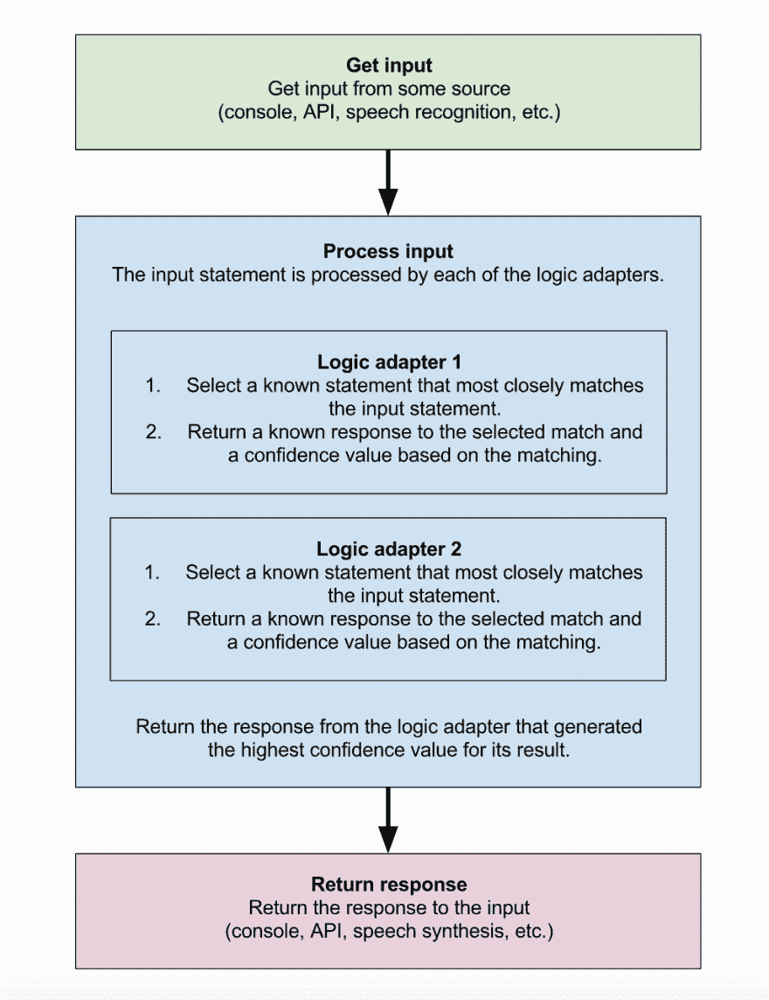

# 在 5 分钟内构建您的第一个聊天机器人

> 原文：<https://dev.to/sahilrajput/build-your-first-chatbot-in-5-minutes--15e3>

我在网上搜索“如何建立一个聊天机器人？”我发现了[聊天机器人](https://chatterbot.readthedocs.io/en/stable/)，这是一个机器学习、对话引擎，用于创建聊天机器人

### 聊天机器人如何工作

[](https://res.cloudinary.com/practicaldev/image/fetch/s--VvoBDkoz--/c_limit%2Cf_auto%2Cfl_progressive%2Cq_auto%2Cw_880/https://user-images.githubusercontent.com/20112458/48929710-3ce62b80-ef11-11e8-822b-bfff0167c2c6.png)T3】

<center>*Image source: [ChatterBot](https://chatterbot.readthedocs.io/en/stable/#process-flow-diagram)*</center>

在这篇文章中，我们将看到如何用 ChatterBot 在 5 分钟内创建一个聊天机器人。

## 我们开始吧

先安装聊天机器人

```
pip install ChatterBot 
```

创建一个文件`chat.py`

```
#import ChatBot
from chatterbot import ChatBot 
```

用你选择的名字创建一个新的聊天机器人(我用的是“Candice”)。

```
bot = ChatBot('Candice') 
```

你的机器人已经创建好了，但是在这一点上你的机器人没有任何知识，为此你必须用一些数据来训练它。
`Also, by default the ChatterBot library will create a sqlite database to build up statements of the chats.`

### 训练你的机器人

```
#import ListTrainer
from chatterbot.trainers import ListTrainer

bot.set_trainer(ListTrainer)
# Training 
bot.train(['What is your name?', 'My name is Candice'])
bot.train(['Who are you?', 'I am a bot, created by you' ]) 
```

你的机器人现在接受了两种陈述的训练。当你问你的机器人“你叫什么名字”时，它会回答“我叫坎迪斯”。

你也可以在多个语句上训练它，比如

```
bot.train(['Do you know me?', 'Yes, you created me', 'No', 'Sahil?', 'No idea']) 
```

正如你所看到的，很难在每一条语句上训练机器人。因此，我们将使用`ChatterBotCorpusTrainer`在大数据集上训练我们的机器人。

```
from chatterbot.trainers import ChatterBotCorpusTrainer
# Create a new trainer for the chatbot
trainer = ChatterBotCorpusTrainer(bot)

# Train the chatbot based on the english corpus
trainer.train("chatterbot.corpus.english")

# Get a response to an input statement
chatbot.get_response("Hello, how are you today?") 
```

或者你可以下载你的语言的[数据集，用你的语言训练你的机器人。](https://github.com/gunthercox/chatterbot-corpus/tree/master/chatterbot_corpus/data)

我下载了[英语数据集](https://github.com/sahil-rajput/FileTransfer/files/2609894/english.zip)，我们可以这样训练我们的机器人

```
for files in os.listdir('./english/'):
    data=open('./english/'+files,'r').readlines()
    bot.train(data) 
```

`NOTE: Make sure the dataset and the program file is on same folder, otherwise edit the path.`

### 聊天功能

```
# To exit say "Bye"
while True:
        # Input from user
    message=input('\t\t\tYou:')
        #if message is not "Bye"
    if message.strip()!='Bye':
        reply=bot.get_response(message)
        print('Candice:',reply)
        # if message is "Bye"
    if message.strip()=='Bye':
        print('Candice: Bye')
        break 
```

要运行它，请转到终端

```
python chat.py 
```

它会先训练你的机器人，然后你就可以开始聊天了。

#### 源代码

```
#import libraries
from chatterbot import ChatBot
from chatterbot.trainers import ListTrainer
import os

#Create a chatbot
bot=ChatBot('Candice')
bot.set_trainer(ListTrainer)

#training on english dataset
for files in os.listdir('./english/'):
    data=open('./english/'+files,'r').readlines()
    bot.train(data)

#chat feature
while True:
    message=input('\t\t\tYou:')
    if message.strip()!='Bye':
        reply=bot.get_response(message)
        print('Candice:',reply)
    if message.strip()=='Bye':
        print('Candice: Bye')
        break 
```