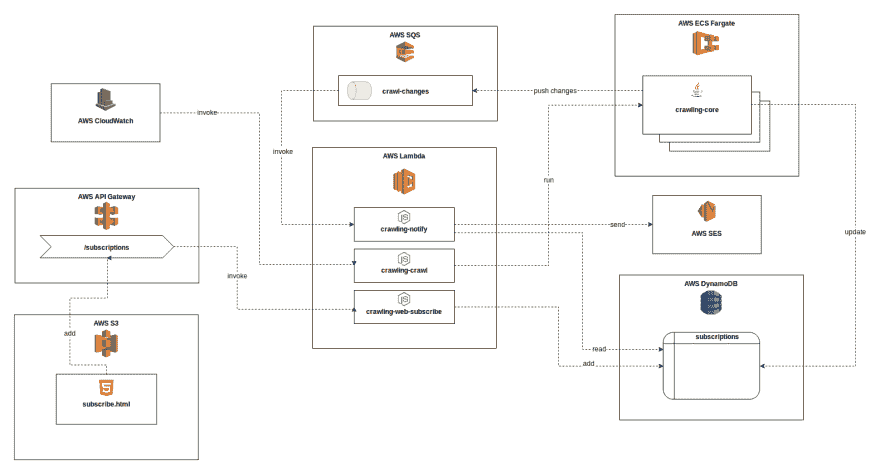

# 使用 8 种不同的 AWS 服务构建云原生 web scraper

> 原文：<https://dev.to/n1try/building-a-cloud-native-web-scraper-using-8-different-aws-services-1862>

听起来有点过了，对吧？确实是。显然，你不需要一大堆云服务来构建一个简单的网络抓取器，尤其是已经有很多这样的服务了。然而，这描述了我通过构建一个简单而有用的应用程序来探索 AWS 上的云原生开发的个人旅程。

# 目标

我想建立的是一个完全在云基础设施上运行的网络抓取器。更准确地说，我想使用 [Selenium WebDriver](https://www.seleniumhq.org/projects/webdriver/) 构建一个 scraper，因为它不仅能够抓取静态 HTML 页面，还能够抓取动态的、基于 JavaScript 的单页面应用程序。考虑到这个需求，一个简单的包含[请求](http://docs.python-requests.org/en/master/)或 [urllib](https://docs.python.org/3.7/library/urllib.html#module-urllib) 的 Python 脚本已经不够了。相反，你至少需要一个无头浏览器(比如 Firefox、Chrome 或过时的 [PhantomJS](http://phantomjs.org/) )。

## 示例用例

为了更好地理解我一直在构建的东西，想象下面的用例。你是一名学生，你的大学提供了一个基于 JavaScript 的网站，考试结果一出来就公布在网站上。要检索您的结果，您需要输入您的学生 id，并从下拉列表中选择一个部门。你对自己最近一次考试的成绩很好奇，但是因为你很懒，你不想每天手动查看网站。这就是一个完全过度设计的网络刮刀发挥作用的地方。

## 要求

这里有一些关于应用程序应该能够做什么(以及如何做)的注释——只是为了更好地理解。

*   不同的抓取任务在 Java 中预定义为 WebDriver 脚本。
*   用户可以为预定义的爬网作业添加订阅。它们将导致定期(例如每 24 小时)以特定参数(例如由 Selenium 填充的表单输入字段值)执行特定的爬行任务。
*   当为某个任务(对应于某个网页)添加订阅时，用户提供他们的电子邮件地址，一旦 scraper 检测到变化，就会收到通知。
*   网站的状态保存在相应订阅的 Dynamo 项中，并与 scraper 运行时检索到的最新状态进行比较。

# 建筑

下面您可以看到所有组件和相应 AWS 服务的高级概述，以及组件之间的基本交互。请注意，该图并不是合适的 UML，但是它应该有助于获得整体架构的概念。第一眼看上去有点花哨。)

 
( [点击查看大图](https://ferdinand-muetsch.img/crawlbuddy2.png))

## AWS 服务

使用的云服务有:

*   用于执行无状态任务的无服务器节点功能
*   **AWS Fargate** 作为按需 Docker 容器运行时来执行运行时间更长、资源更密集的任务
*   **AWS DynamoDB** 作为无模式数据存储来管理订阅和网站状态
*   **AWS SQS** 作为组件间通信的异步消息传递通道并触发 Lambdas
*   **AWS S3** 托管一个静态 HTML 页面，包含一个用于通过 UI 添加新订阅的表单
*   **AWS API 网关**为添加新订阅提供 HTTP 端点。它由“前端”端脚本调用，随后触发 Lambda 向 Dynamo 添加新订阅。
*   AWS CloudWatch 以类似 crontab 的方式定期触发 Fargate 上 scraper 的执行
*   当情况发生变化时，AWS SES 会发送电子邮件通知

## 组件

让我们简单看一下这几个组件在做什么。

## 爬行-核心

这实质上是整个应用程序的核心部分，实际的刮刀/爬行器。我将它实现为一个 **Java** 命令行应用程序，它依赖 WebDriver 来动态地与网页交互。

该程序本身负责执行实际的爬行任务，通过将任务结果与数据库中的最新状态进行比较来检测更改，更新数据库项，并可能将更改通知消息推送到队列中。

抓取任务被定义为扩展`AbstractTask`类的 Java 类。例如，您可以创建子类`AmazonPriceTask`和`ExamsResultsTask`。在实现这些类的时候，你需要为爬行脚本定义输入参数(例如，你的学号将被填入大学网站上的搜索表单),并在 WebDriver 执行的`run()`方法中定义一系列命令。

`crawling-core`是作为独立的 Java 命令行应用程序开发的，其中要执行的任务的名称(例如`EXAM_RESULT_TASK`)和输入参数(例如`VAR_STUDENT_ID`、`VAR_DEPARTMENT_NAME`)作为运行参数或环境变量提供。

除了打包成简单 JAR 的 Java 程序，我们还需要一个浏览器，WebDriver 可以用它来浏览 web。我决定在无头模式下使用 Firefox。最终，JAR 和 Firefox 二进制文件一起打包成基于[selenium/standalone-Firefox](https://hub.docker.com/r/selenium/standalone-firefox/)的 Docker 映像，并推送到 **AWS ECR** (AWS 的容器注册表)。

为了执行一个抓取任务，例如我们的`ExamsResultsTask`， **AWS Fargate** 将从注册表中取出最新的 Docker 映像，从中创建一个新的容器，将所需的输入参数设置为环境变量，并最终运行 entrypoint，这是我们的 JAR 文件。

## λ爬行-爬行

...是一个用 **NodeJS** 编写的非常简单的 Lambda 函数，负责启动一个爬行作业。它通过一个**云观察**事件定期触发。首先，它从 Dynamo 获取所有的爬行任务。爬网任务是任务名称和一组输入参数的唯一组合。之后，它请求 Fargate 为每个任务启动一个新的新实例`crawling-core`,并传递包含在数据库项中的输入参数。

## λ抓取-通知

...是另一个 Lambda，它位于我们爬行过程的一次迭代的最后。它通过`crawling-changes` **SQS** 队列中的消息调用，负责向订户发送通知电子邮件。它从调用事件中读取更改信息，包括任务名称、订阅者的电子邮件地址和任务的输出参数(例如，您的考试成绩)，并编写一个电子邮件消息，最终通过简单的电子邮件服务( **SES** )发送出去。

## λ爬行-网络-订阅

我们三个 Lambdas 中的最后一个与爬行本身没有直接关系。相反，它用于处理想要添加新订阅的用户发送的 HTTP 请求。由一个名为`subscribe.html`的 HTML 页面上的简单脚本发起，一个帖子被发送到 **API 网关**中的`/subscriptions`端点，然后被转发到`crawling-web-subscribe`，最终作为一个新条目被添加到 Dynamo 数据库的`subscriptions`表中。

# 好了，凉了。现在呢？

正如我之前提到的，这个项目对我来说更像是一个学习的场所，而不是一个合理的 web scraper 架构。尽管这个脚本实际上应该是相当可扩展的，但是您可以毫不费力地构建一个 scraper 脚本。然而，我学到了很多关于云开发和 AWS 的知识，我真的很喜欢事情可以如此简单，以及所有这些不同的组件如何很好地一起工作。也许我能够鼓励你们当中缺乏云经验的开发人员也开始尝试 AWS(或其他云提供商),我希望你们喜欢我的(非常自然地写的)文章。