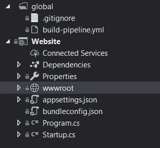
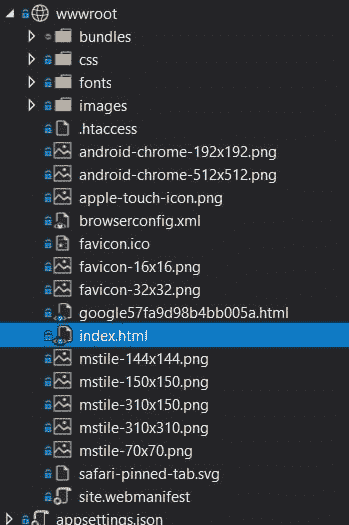

# 构建以 ASP.NET 为核心的扁平化网站

> 原文：<https://dev.to/turnersoftware/building-a-flat-website-with-aspnet-core-1jaa>

截至昨晚，我为我正在打造的产品 BrandVantage 开通了网站。我为这个网站感到非常自豪，我自己设计并建造了它，还设计了标志。这一切都发生在[我也离职](https://dev.to/turnerj/i-left-my-job-today-f1a)一周多之后！

我在一篇评论中稍微提到了 BrandVantage 关于[的内容，但是这篇文章，以及即将发布的其他各种文章，是要谈论开发和技术，而不是我试图向你推销它。当我开始寻找产品的时候，我可能会发布相关的帖子！🙂](https://dev.to/turnerj/comment/8mlf)

这个新网站，以及[我的个人网站](https://turnerj.com/)和[我公司的网站](https://www.turnersoftware.com.au/)(都是不久前发布的)都是非常相似的:一个单页、扁平的 HTML，带有缩小的 CSS。

我喜欢有这样一个平面网站，因为它是托管不可知论者。这些网站我已经建成，而 ASP.NET 核心项目的代码，他们部署到 PHP 托管。这篇文章的其余部分解释了这个设置。

## 基地项目

我用的是 Visual Studio，每个项目都是一样的，一个空的 ASP.NET 核心网站项目。

[](https://res.cloudinary.com/practicaldev/image/fetch/s--HEWvhpc4--/c_limit%2Cf_auto%2Cfl_progressive%2Cq_auto%2Cw_880/https://thepracticaldev.s3.amazonaws.com/i/ucj71u7t59rzo59ui7tk.jpg)

为了让实际的项目在开发中工作，您需要将您的`Startup.cs`更新为类似下面的内容:

```
public class Startup
{
    public void Configure(IApplicationBuilder app, IHostingEnvironment env)
    {
        if (env.IsDevelopment())
        {
            app.UseDeveloperExceptionPage();
            app.UseBrowserLink();
        }

        app.UseDefaultFiles(new DefaultFilesOptions
        {
            DefaultFileNames = new List<string> { "index.html" }
        });

        app.UseStaticFiles();
    }
} 
```

Enter fullscreen mode Exit fullscreen mode

你要确保你有`UseStaticFiles`并设置你的索引文件为默认文件，否则它不会像你期望的那样工作。

## 站点根

[](https://res.cloudinary.com/practicaldev/image/fetch/s--jB82w2wT--/c_limit%2Cf_auto%2Cfl_progressive%2Cq_auto%2Cw_880/https://thepracticaldev.s3.amazonaws.com/i/5iclmdc6knt6e0tdv9mc.jpg) 
这个设置真的是回到了基础，我没有使用 ASP.NET 核心本身的任何特殊功能，也没有一些我要导出到平面 HTML 的 Razor 模板。它实际上只是一个我手工构建的文件。

我确实尝试过将一个站点从 CSHTML 导出到普通 HTML，但是对于一个单页面站点来说，这似乎有点太复杂了。将来我可能会重新考虑这个问题，但是现在，一个平面的 HTML 页面对我来说是完美的。

## 捆绑和缩小

我的设置依赖于 Nuget 包 [BuildBundlerMinifier](https://www.nuget.org/packages/BuildBundlerMinifier) ,它允许通过简单地构建代码库来缩小 CSS，就像你做任何其他事情一样。NET 代码库。

它使用了一个 JSON 文件，对我来说类似于:

```
[  {  "outputFileName":  "wwwroot/bundles/site.min.css",  "inputFiles":  [  "wwwroot/css/normalize.css",  "wwwroot/css/layout.css",  "wwwroot/css/product-hunt.css",  "wwwroot/css/responsive.css",  "wwwroot/css/compatibility.css"  ],  "sourceMap":  true  },  {  "outputFileName":  "wwwroot/fonts/font-awesome/bundles/fontawesome.min.css",  "inputFiles":  [  "wwwroot/fonts/font-awesome/css/fontawesome.min.css",  "wwwroot/fonts/font-awesome/css/light.min.css"  ]  }  ] 
```

Enter fullscreen mode Exit fullscreen mode

bundler/minifier 确实支持 JavaScript，但是除了 Google Analytics 和一个产品搜索脚本，我的网站上没有任何 JS。

你可以在我的站点根目录截图中看到有一个`bundles`文件夹，它是由这个过程创建的，但是我已经把它从 Git 中排除了。

因为我的站点是平面 HTML，所以我需要直接引用捆绑文件，如下所示:

```
 <link href="/bundles/site.min.css" rel="stylesheet" />
</head>
<body>
    <link href="fonts/font-awesome/bundles/fontawesome.min.css" rel="stylesheet" /> 
```

Enter fullscreen mode Exit fullscreen mode

> 一个在`head`中，一个在`body`中的原因是稍微增加了对更快页面加载的感知。

这种全平面 HTML 方法的一个缺点是，这些捆绑的文件不能动态重新生成。这意味着每次我想查看 CSS 变化时，我都需要重新构建。对于主要的工作，我可能会手动返回到非缩小的 CSS，只是为了使开发更容易。不过，理想情况下，您应该让它在修改时自动生成——这是许多其他工具提供的，但我的设置中还没有。

如果我使用 CSHTML，我实际上可以引用两者，并使用标记助手来定义我运行的环境。这也是我将来可能会考虑的事情。

## 连续交货

你可能已经注意到在第一张截图中有一个厚脸皮的`build-pipeline.yml`文件，这是 Azure DevOps Pipelines 使用的，允许我自动进行构建和部署设置。

我的文件是这样的:

```
resources:
- repo: self
queue:
  name: Hosted VS2017

steps:
- task: DotNetCoreInstaller@0
  inputs:
    version: '2.2.101'

- task: DotNetCoreCLI@2
  displayName: 'dotnet  build'

- task: ArchiveFiles@2
  displayName: 'Archive  src/Website/wwwroot'
  inputs:
    rootFolderOrFile: src/Website/wwwroot
    includeRootFolder: false
    archiveType: 7z
    archiveFile: '$(Build.ArtifactStagingDirectory)/website.7z'

- task: PublishBuildArtifacts@1
  displayName: 'Publish  Artifact:  Web'
  inputs:
    ArtifactName: Web 
```

Enter fullscreen mode Exit fullscreen mode

我不是 Azure DevOps 管道方面的专家，但以上是我为自己工作的内容。首先，它安装特定版本的。NET 核心，这样我就有了一个稳定一致的环境(作为。已经安装了 NET Core)。然后我运行一个构建，它实际上只是运行缩小过程。接下来的两个任务是获取数据以打包部署管道的构建所必需的。

在进行这个设置时，Azure 不支持管道部署端的完整 YML 配置，所以我不能向您展示这一点。简单来说，它的功能是:

*   等待来自主分支的新构建包(允许我使用其他分支进行开发，而不用担心部署它们)
*   打开藏物
*   使用 FTPS，将所有更改部署到我的主机

## 结论

也许不是最伟大或最有成效的设置，但对我来说非常好。不过，我可以强烈地说，我是多么喜欢自动化部署——那东西太棒了！