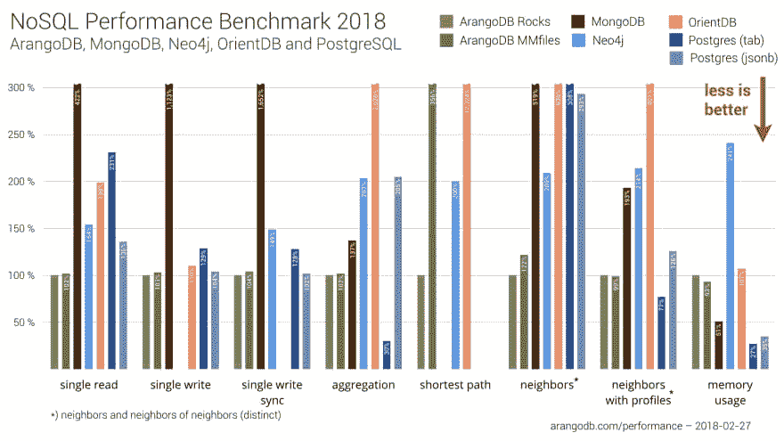
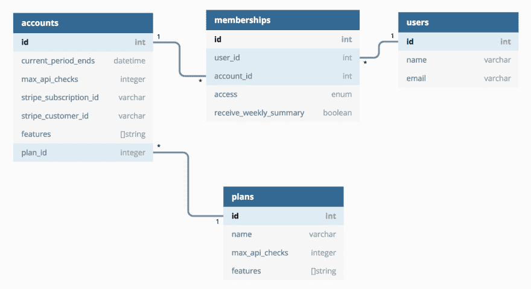
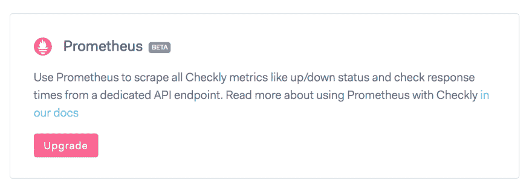

# 构建多租户 SaaS 数据模型

> 原文：<https://dev.to/checkly/building-a-multi-tenant-saas-data-model-ac0>

这是对 Checkly 底层的基本多租户 SaaS 数据模型的一种破坏。用户，账户，计划，诸如此类的东西。当建立这个的时候，我发现在大量的开发者和创业博客中很难找到任何可靠的信息；大多数只是在实施细节上含糊其辞。

# PostgreSQL，Mongo 还是 DynamoDB？

简短版:Postgres。这绝对是一项了不起的工程。在 Heroku 上运行它，它就能工作，这让我感觉像是某个头发花白的精英 Spetsnatz 突击队在支持我。

长版本:在另一个世界里，我会完全在 AWS DynamoDB 上实现 Checkly。完全托管的网络秤，让您高枕无忧...—当您希望将重点放在客户而不是数据库管理上时，database 带给您的感觉棒极了。

所以我试着把一个 SaaS 模型放进 DynamoDB。那次练习是如此的不成功，以至于我现在都觉得好笑。主键和范围键的局限性使得它非常不适合这个用例。AWS 有一篇关于如何实现这种事情的文章。我从未见过比这更好的“硬塞”的例子。

那 MongoDB 呢？

这实际上是可行的。仍然没有实际的关系，但 Mongo 有办法做到这一点。遗憾的是，我的大脑无法适应 MongoDB 查询语言:我发现事实上 Node.js 驱动程序 Mongoose 一片混乱，尤其是文档。此外，我知道我要做大量的指标汇总(平均值、百分位数等)。)和 Mongo 的聚合功能非常少。

DynamoDB 和 MongoDB 是完全有效的产品。只是不要把它用在任何相关的事情上。震惊了。

此外，Postgres 非常灵活，即使有太多的数据和高读/写流量。

Postgres 的聚合和内存使用都是班上最好的。它在其他工作负载的基准测试中也一直处于前 3 名[https://www . arang odb . com/WP-content/uploads/2018/02/UPDATE-Benchmark-2018.001 . JPEG](https://www.arangodb.com/wp-content/uploads/2018/02/UPDATE-Benchmark-2018.001.jpeg)
所以 Postgres 就是这样。向前！

# 单、多租户数据库

在我们深入实际的数据模型之前有一个短暂的插曲。既然我们已经选择了 Postgres，那么我们如何在最高的实现级别处理客户划分呢？

有几个选择:

一个租户，一个数据库:每个租户都有自己的数据库实例。100%分离。如果您预期客户会有非常高的安全性要求，或者预期需要为特定客户扩展您的部分平台，请考虑 Salesforce like size。一个数据库，每个客户一个模式:一个数据库，每个客户一个单独的模式。为每个模式复制表。这使得将特别多的用户迁移到更高规格的机器变得容易。由于利用了 DBMS 的内置安全模型，它甚至更加安全。
一个数据库，一个模式:只有一个模式保存所有的表和每个租户的“帐户 ID”。这是我们为 Checkly 选择的模型，因为上述所有问题都适用于 Checkly。预期的使用模式和存储需求也没有那么大

# 账户&用户

Checkly 和许多其他典型的 B2B 重点 SaaS 的结构如下:

用户属于一个帐户，有时也称为组织。
一个账户可以有多个用户，用户可以在多个账户之间切换。如果向代理机构或更大的组织提供产品，其中一个客户实际上可以“拥有”多个帐户，这就特别有趣。
账户有关联的设置、偏好和资源。它们适用于与该帐户关联的每个用户。
用户可以为每个关联账户设置个人偏好。
用户可以对每个账户拥有特定的访问权限。
为了实现这一点，我们使用以下数据模式:

让我们仔细检查每张桌子，指出有趣的地方:

## 1。用户

用户表非常简单。它保存了我们从社交登录(在我们的例子中是 Google & Github)或电子邮件注册中收集的基本信息。请注意，这里没有密码字段。为此我们使用 Auth0。

## 2。会员资格

成员资格表模拟用户及其帐户之间的多对多关系。最重要的位是:

访问控制:访问字段是一个 enum，它将一个可能的用户角色保存为字符串常量，即:READ_ONLY、READ_WRITE、ADMIN 或 OWNER。这些角色的实际执行是在 API 中完成的，但那是以后的事情了。每个帐户的用户偏好:receive_weekly_summary 字段是用户可能想要切换每个帐户的特定设置的例子。

## 3。帐目

这是肉的位置。accounts 表的主键在许多其他表中被引用为外键。发票、仪表盘、团队邀请等。所有都引用帐户表。

除了作为整个应用程序中几乎所有资源的根之外，accounts 表还有三个主要功能:

### 订阅&计费周期

我们需要跟踪付款是否以某种方式进行。在示例中，您可以看到条带客户 id、条带订阅 id 和当前周期结束字段。当用户注册付费计划时，我们使用 Stripe webhooks 来填充这些字段。在随后的每个计费周期，我们的 API 都会收到另一个 webhook 调用，我们会删除 current_period_ends 日期字段。

请注意，如果因为任何原因没有钱进来，日期永远不会被取消。我们代码的其余部分使用这个字段来检查它是否应该允许用户与产品保持交互，以及它是否应该执行后台工作。

### 计划限额

客户可以订阅的每个计划都有相关的数量限制。在我们的例子中，这些是像支票数量，队友数量，每月发送的短信数量。这方面的上限记录在示例中的 max_api_checks 等字段中。这些限制是在订购和更改为更高/更低计划时设置的。更多信息请见下文。

### 计划功能切换

计划也可以有非基于数量的差异。例如，我们开发人员计划中的人员无权访问安装和拆卸脚本。这些本质上是基于您订阅的计划的功能切换。

为了对此建模，我们使用字符串数组类型的 features 字段，这是 Postgres 中一个非常好的特性。它包含一组字符串常量，如 SMS_ALERTS、SETUP_TEARDOWN 和 PROMETHEUS。每个常量都与一个特性相关联，我们使用它们来加强后端 API 中的限制，并向用户显示一个很好的提示，即一个特性只有在升级后才可用。

当一个特性不在特性数组中时显示升级按钮
时髦的提示👉我们实际上取消了当前周期结束日期+一些额外的宽限期。如果监控因恼人但良性的卡问题而关闭，将会很糟糕。

# 月计划&订阅

这可能看起来不直观，但是在 plans 表和 accounts 表之间存在非常弱的关系，您可能已经注意到每个表中 max_api_checks 和 features 字段的重复。

这两个字段都描述了计划限额，并且在创建帐户时，我们主动将值从计划表复制到帐户表。这使得调整特定的客户请求变得更加容易。

想要一个 API 检查稍微多一点的定制计划？我们可以做到。只需更新具体账户行，按 Stripe 调整月价格即可。想让一小部分用户访问新功能吗？只需更新这些帐户的功能数组。稍后向所有客户推广。谁需要复杂的功能切换框架？

那么，在这种情况下，什么是订阅呢？好问题，因为它在这个模型中没有直接表示。从最直接的意义上来说，它是 invoice . payment _ succeeded Stripe web hook，它进来告诉我们订阅 ID 为 Y 的客户 ID X 刚刚支付了费用。

其他一切都是分离的:每月/每年的实际价格、计费间隔、您获得的功能和适用的容量限制。这种分离允许你在价格和计划的具体组成上做更多的实验。实际上，除了在[https://checklyhq.com/pricing](https://checklyhq.com/pricing)页面上的一些标记，整个 Checkly 应用程序对价格一无所知。

这篇文章之前发表在 [Checkly 博客](https://blog.checklyhq.com)上

