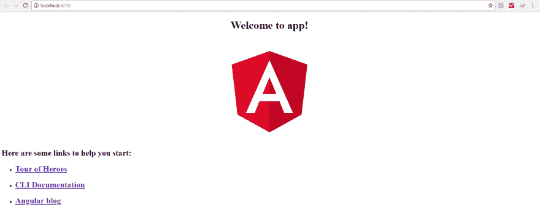

# 用 Angular 构建渐进式 Web 应用程序—第 1 部分

> 原文：<https://dev.to/enniob/building-a-progressive-web-app-with-angular-part-1-54kb>

如果你不知道什么是渐进式网络应用程序(PWA ),我希望这篇教程能给你一个关于 PWA 的介绍，并让你明白它们是如何工作的，以及为什么开发 PWA 应用程序是一个好主意。

出于本教程的目的，我将使用最新版本的 [Angular](https://angular.io) 。

## 什么是 PWA？

PWA 是一个 web 应用程序，当用户在移动设备上查看您的网站时，它使用现代 web 开发技术为用户提供类似应用程序的体验。

## 为什么要构建渐进式的 Web App？

PWA 应用程序为您的网站用户提供了过去只有原生应用程序才能提供的功能。以下是 PWA 应用程序中可用的一些功能:

*主屏幕图标
*离线模式
*网页推送通知
*等等

这里有一个[链接](https://whatwebcando.today/)到一个网站，给你一个目前可用于 PWA 应用的功能列表。

我希望这能给你一个简短的 PWA 概述，以及为什么我们应该开始关注它。让我们创建第一个 PWA。

* * *

首先让我们安装 Angular。

`npm install -g @angular/cli`

一旦完成，我们就可以开始新的项目了

`ng new my-first-pwa --skip-tests --style scss`

如果您不熟悉 Angular CLI，这里有[文档链接](https://angular.io/cli)。我建议看一看它，因为现在使用 Angular CLI 可以做很多事情。无论哪种方式，下面是所用命令的简要说明:

* `ng new`创建一个新的角度应用程序
* `my-first-pwa`这是应用程序名称，所以可以随意更改为你想要的名称
* `--skip-tests`该命令将跳过规格文件
* `--style scss`这将使样式文件扩展名为 scss。

你现在有你的角度应用。为了预览您的应用程序，您需要运行 ng serve -o，这将构建您的应用程序并在浏览器中打开它。

它应该是这样的:

现在让我们将应用程序设为 PWA。幸运的是，Angular 使得将 Angular 应用程序转换成 PWA 变得很容易。我们需要做的就是安装一个名为`@angular/pwa`的包，这将添加所有的文件并将你的应用程序设置为 PWA。所以让我们开始吧！

`ng add @angular/pwa`

这应该只需要几秒钟。我们现在可以测试我们的应用程序，看看发生了什么变化。

首先，我们需要构建我们的项目

`ng build --prod`

不幸的是`ng server`不支持服务人员，我们需要设置一个 HTTP 服务器来测试我们的服务人员。

运行以下命令安装 http-server。

`npm install -g http-server`

完成后，将目录切换到您的 dist 文件夹`cd dist/my-first-pwa`和`run http-server -p 8080`

在您的浏览器上转到以下 URL `http://127.0.0.1:8080`。您应该会看到默认的角度应用程序。

但是我如何检查我的 PWA 是否正常工作？要做到这一点，打开你的浏览器开发工具，点击网络，并检查离线。

现在刷新你的浏览器。请注意，在 network 选项卡上，所有文件都是从 ServiceWorker 加载的，并且您的网站加载了所有内容和图像。这意味着所有的资源都是从服务工作者的缓存中加载的。这只是公共福利援助计划的众多好处之一。

就是这样！正如您所看到的，Angular 使得创建新的应用程序并将其设置为 PWA 变得非常容易。在下一篇教程中，我将向您展示如何配置 Firebase，以便您可以托管您的应用程序，对应用程序进行更改，通知用户应用程序的更新，并更新服务人员，以便在应用程序下次运行时加载正确的文件。

这里有一个[链接](https://github.com/enniob/1stpwatutorial)到我的 github 库，里面有教程文件。