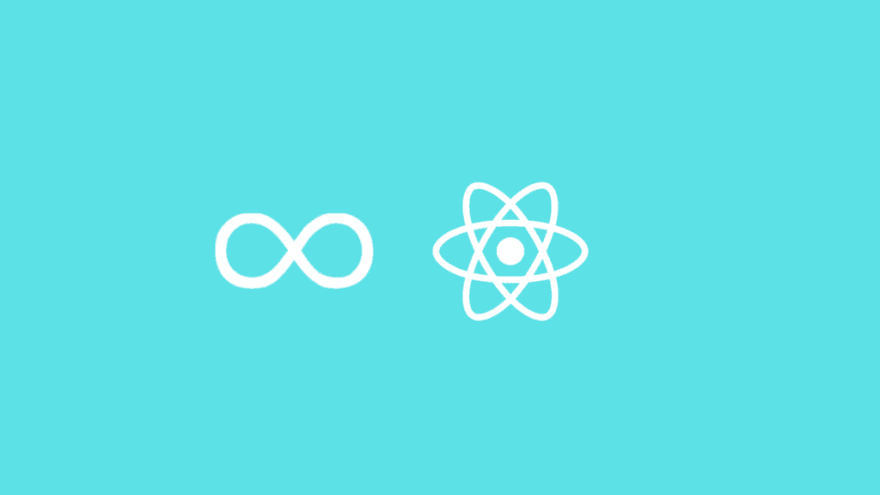
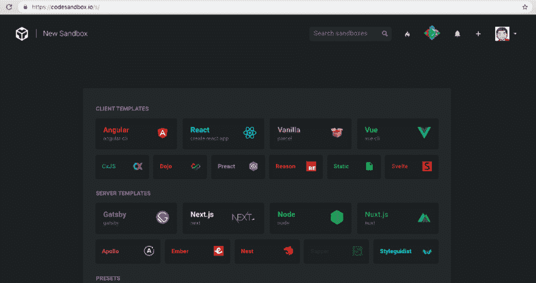
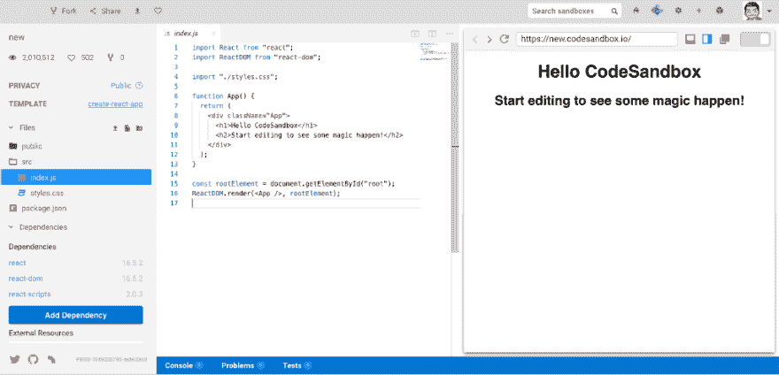
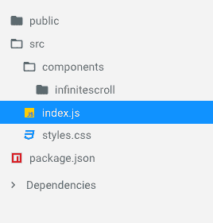
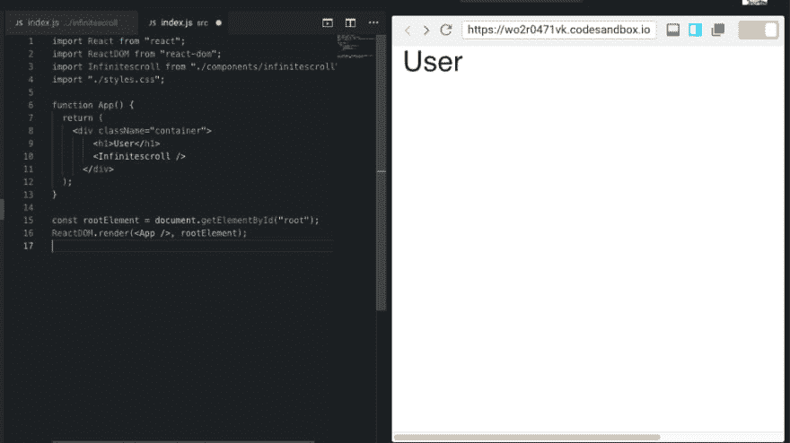
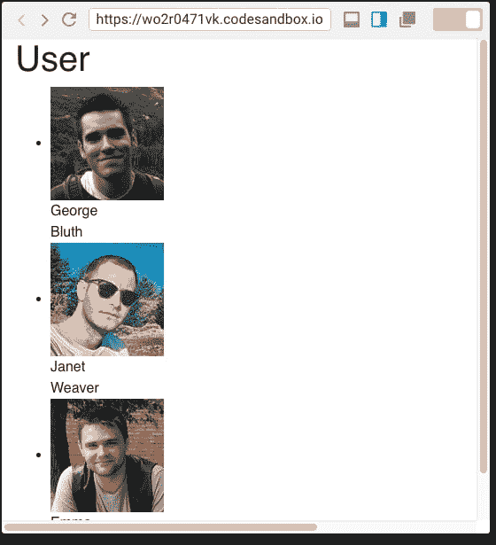
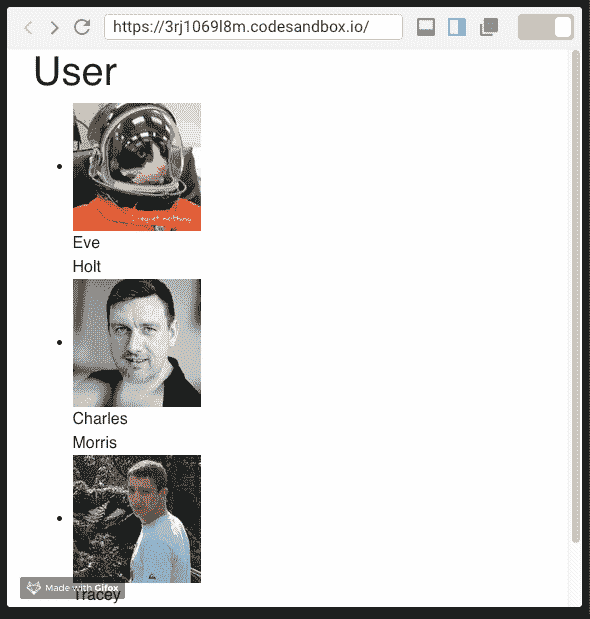
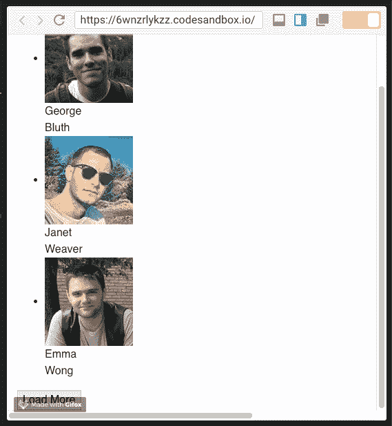
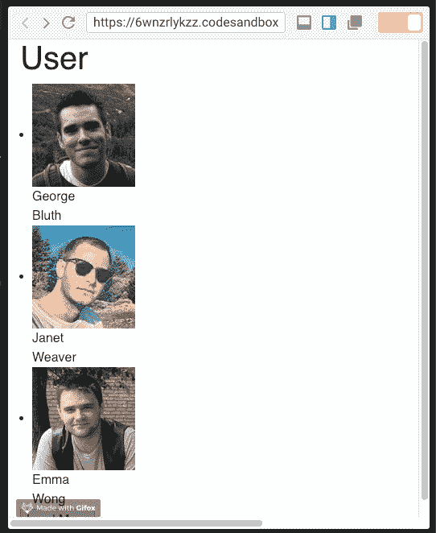

# 从头开始构建 React Infinite Scroller 组件

> 原文：<https://dev.to/kris/building-a-react-infinite-scroller-component-from-scratch-1042>

[](https://res.cloudinary.com/practicaldev/image/fetch/s--QXaluCLf--/c_limit%2Cf_auto%2Cfl_progressive%2Cq_auto%2Cw_880/https://cdn-images-1.medium.com/max/1024/1%2AJqp3y1JpVCUYs7cK04v9gg.png)

我们都知道伟大的内容发现体验，我们可以滚动和滚动，发现更多的项目，人和照片。当构建我们的 web 或移动应用程序时，我们经常希望给我们的用户提供这种良好的体验。

在本教程中，我们将用纯 JavaScript 构建一个 react infinite scroll，并将其嵌入到 ReactJS 组件中。

有了这个组件，我们可以实现一些了不起的事情:

1.  从 JSON 格式的 API 获取数据
2.  将数据注入 DOM 元素
3.  使用 addEventListener 绑定到 scroll 事件，并使用通用 API 处理分页
4.  使用内部状态存储和追加数据
5.  计算膨胀容器的底部

所以，让我们一步一步来。

*   提示:使用像[钻头](https://github.com/teambit/bit)这样的工具将你的组件变成可重复使用的乐高积木。创建收藏，共享您的组件，在任何地方使用它们，并与您的团队一起更快地构建。试试看。

[位共享和构建代码组件](https://bitsrc.io)

#### 我们开始吧

使用代码沙箱通过 create-react-app 启动项目。

[](https://res.cloudinary.com/practicaldev/image/fetch/s--sYr4b8ZS--/c_limit%2Cf_auto%2Cfl_progressive%2Cq_auto%2Cw_880/https://cdn-images-1.medium.com/max/1024/1%2AAX7IHZDEMk-hiJ1YpEw26g.png)

您将看到编辑器和输出浏览器。

[](https://res.cloudinary.com/practicaldev/image/fetch/s--qTh5SqvW--/c_limit%2Cf_auto%2Cfl_progressive%2Cq_auto%2Cw_880/https://cdn-images-1.medium.com/max/1024/1%2A5lxvliOAej3u7anS_ueJZw.png)

创建一个组件结构使用的是下面的一个。

[](https://res.cloudinary.com/practicaldev/image/fetch/s--_tgspgnz--/c_limit%2Cf_auto%2Cfl_progressive%2Cq_auto%2Cw_880/https://cdn-images-1.medium.com/max/268/1%2Af5NAErCIEuNmDwbK1F-Mzw.png)

### 从 API 获取数据并在滚动组件中使用

导入必要的库。

```
import React from 'react'

import fetch from 'isomorphic-fetch' 
```

使用[同构-获取](https://github.com/matthew-andrews/isomorphic-fetch)轻松获取数据。

创建一个类无穷小

```
class Infinitescroll extends React.Component {
   render() {
     return <div />;
   }
 }
export default Infinitescroll; 
```

将其包含在 Index.js 中

```
import React from "react";
import ReactDOM from "react-dom";
import Infinitescroll from "./components/infinitescroll";
import "./styles.css"; 
```

还有，在 index.js.

```
function App() {
  return (
     <div className="container">
       <h1>User</h1>
       <Infinitescroll />
     </div>
   );
}
const rootElement = document.getElementById("root");
ReactDOM.render(<App />, rootElement); 
```

结果应该是:

[](https://res.cloudinary.com/practicaldev/image/fetch/s--k-B0Aktx--/c_limit%2Cf_auto%2Cfl_progressive%2Cq_auto%2Cw_880/https://cdn-images-1.medium.com/max/1024/1%2AUyYx5U02Qu2GUZtLqvS-JA.png)

现在，创建一个状态变量来存储来自 API:
的数据

```
state = {
  data: [],
  per: 3,
  page: 1,
  total\_pages: null,
}; 
```

使用函数从 API 中获取数据

```
loadUser = () => {
   const { per, page, data } = this.state;
   const url = `https://reqres.in/api/users? per_page=${per}&page=${page}`;
      fetch(url)
     .then(response => response.json())
     .then(json =>
      this.setState({
           data: son.data,
           scrolling: false,
           total\_pages: json.total\_pages
     })
  );
}; 
```

并渲染:

```
render() {
     return (
       <ul>
       {this.state.data.map(data => (
          <li key={data.id}>
            <div>
               <div>
                  
               </div>
               <div>{data.first\_name}</div>
               <div>{data.last\_name}</div>
            </div>
          </li>
       ))}
      </ul>
  );
} 
```

在页面加载时呈现组件——这可以使用 componentWillMount 来实现。

```
componentWillMount() {
   this.loadUser();
} 
```

结果是:

[](https://res.cloudinary.com/practicaldev/image/fetch/s--g3Ewwj8O--/c_limit%2Cf_auto%2Cfl_progressive%2Cq_auto%2Cw_880/https://cdn-images-1.medium.com/max/560/1%2AzkcBIS-RWKf-FfXYDN2cOA.png)

### 加载更多数据

因此，在加载下一个滚动页面之前，我们需要加载更多的数据。

添加一个名为 prevState 的新状态变量来获取下一页值并调用 loadUser。

```
loadMore = () => {
    this.setState(
      prevState => ({
        page: prevState.page + 1,
        scrolling: true
      }),
      this.loadUser
    );
  }; 
```

单击“加载更多”按钮调用此函数。

```
<div>
        <ul>
          {this.state.data.map(data => (
            <li key={data.id}>
              <div>
                <div>
                  
                </div>
                <div>{data.first\_name}</div>
                <div>{data.last\_name}</div>
              </div>
            </li>
          ))}
        </ul>
        <button
          onClick={e => {
            this.loadMore();
          }}
        >
          Load More
        </button>
      </div> 
```

结果…

[](https://res.cloudinary.com/practicaldev/image/fetch/s--4x8pu6zr--/c_limit%2Cf_auto%2Cfl_progressive%2Cq_66%2Cw_880/https://cdn-images-1.medium.com/max/590/1%2A7_Igv3yM9RekKoHp8sotGg.gif)

这很棒，但是我们有一个问题:旧数据被新数据取代了。

要解决这个问题，请将新的响应追加到旧数据中。

```
fetch(url)
      .then(response => response.json())
      .then(json =>
        this.setState({
          data: [...data, ...json.data],
          scrolling: false,
          total\_pages: json.total\_pages
        })
     ); 
```

结果…

[](https://res.cloudinary.com/practicaldev/image/fetch/s--U_m6M6PQ--/c_limit%2Cf_auto%2Cfl_progressive%2Cq_66%2Cw_880/https://cdn-images-1.medium.com/max/569/1%2AdRbbvjzVR0jchxonYmYl7g.gif)

嗯，它工作得很好！

### 用滚动事件触发 loadMore

对于最后一部分，在滚动事件上触发 loadMore。

第一，最后

*   with getQuerySelector. Calculate the element offset to get current page offset. If page offset is greater than the Offset of last item that means scrollbar is near the last offset. This should trigger loadMore.

    ```
    handleScroll = () => { 
      var lastLi = document.querySelector("ul.container > li:last-child");
      var lastLiOffset = lastLi.offsetTop + lastLi.clientHeight;
      var pageOffset = window.pageYOffset + window.innerHeight;

      if (pageOffset > lastLiOffset) {
           this.loadMore();
      }
    }; 
    ```

    将滚动侦听器绑定到滚动处理程序。

    ```
    componentWillMount() {
        this.loadUser();
        this.scrollListener = window.addEventListener("scroll", e => {
          this.handleScroll(e);
        });
      } 
    ```

    结果是:

    [](https://res.cloudinary.com/practicaldev/image/fetch/s--AeSQjrSK--/c_limit%2Cf_auto%2Cfl_progressive%2Cq_66%2Cw_880/https://cdn-images-1.medium.com/max/542/1%2A7cNUrvZ8I_hC4LNvyJtmdw.gif)

    太好了！就是这样。您的组件现在已经准备好了！您现在可以使用[位](https://github.com/teambit/bit)与您的团队共享它，将它添加到您的组件集合中，并在任何地方使用它。

    ### 快速回顾

    在这篇文章中，我们学习了如何实现一个 React 无限滚动组件。

    首先，我们学习了如何从 API 获取数据，并呈现它。使用 loadMore 和 handleScroll，我们计算了滚动条的位置。每当滚动条靠近窗口底部时，获取更多数据并将其附加到现有数据，然后呈现组件。

    希望你喜欢这篇文章，请随时评论和提问！你也可以给我留几个👏如果你喜欢的话。干杯！

    ### 了解更多

    *   [在 React 中加快开发的 5 种工具](https://blog.bitsrc.io/5-tools-for-faster-development-in-react-676f134050f2)
    *   [2019 年你应该知道的 11 个 React UI 组件库](https://blog.bitsrc.io/11-react-component-libraries-you-should-know-178eb1dd6aa4)
    *   [如何在项目和应用之间共享 React UI 组件](https://blog.bitsrc.io/how-to-easily-share-react-components-between-projects-3dd42149c09)

    * * *