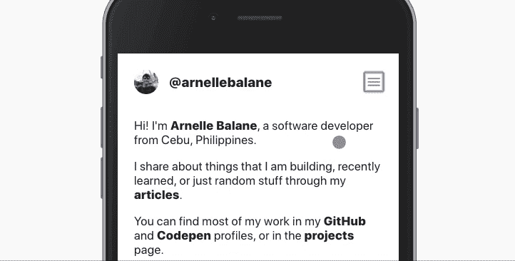

# 使用 React 挂钩构建站点导航菜单

> 原文：<https://dev.to/arnellebalane/building-a-site-navigation-menu-using-react-hooks-2j5e>

[](https://res.cloudinary.com/practicaldev/image/fetch/s--0l2Qz07R--/c_limit%2Cf_auto%2Cfl_progressive%2Cq_auto%2Cw_880/https://cdn-images-1.medium.com/max/1024/1%2ArDNK3gJdGg9ZAqVnCzQGZA.jpeg)

我目前正在学习 React，因为我通过构建东西学得更好，所以我决定用它来重建我的个人网站。这仍然是一项正在进行中的工作，但有一个组件我觉得很有意思:网站的导航菜单。

[](https://res.cloudinary.com/practicaldev/image/fetch/s--qkLKbAOy--/c_limit%2Cf_auto%2Cfl_progressive%2Cq_66%2Cw_880/https://cdn-images-1.medium.com/max/722/1%2A4AHKB02_rrQsvPFNsubevA.gif)

只是一个简单的菜单，我对它只有两个要求:

1.  用户需要能够将其状态切换为打开或关闭
2.  当用户导航到不同的页面时，它应该关闭

# 初始设置

我最初构建了站点的静态版本，由顶级的`App`组件、`Header`组件和`Menu`组件组成。`App`组件看起来像这样:

```
// App.jsx

import Header from './Header.jsx';

function App(props) {
    const isMenuOpen = false;

    return (
        <div>
            <Header isMenuOpen={isMenuOpen} />

            {/\* Other stuff \*/}
        </div>
    );
} 
```

如代码片段所示，`App`组件有一个`isMenuOpen`变量，它将其作为`isMenuOpen`道具传递给`Header`。`Header`依次将同一个`isMenuOpen`道具传递给`Menu`。该变量的值控制`Menu`是显示还是隐藏。

# `isMenuOpen`组件状态

最初，`isMenuOpen`只是一个变量，我手动更改它的值来更新 UI。这对于应用程序的初始静态版本来说是可以的，但我真的不希望在实际的应用程序中出现这种情况。我希望组件跟踪这个变量，修改它的值以响应用户操作(例如，单击切换菜单按钮)，并根据它的新值重新呈现 UI。

为了实现这一点，我需要让`isMenuOpen`成为`App`组件的实际状态。通常这是通过将`App`从功能组件转换成类组件来完成的。这是因为功能组件不能有状态，而类组件可以。如果我遵循这种方法，`App`组件将变成:

```
// App.jsx

class App extends React.Components {
    constructor(props) {
        super(props);
        this.state = {
            isMenuOpen: false
        };
        this.handleToggleMenu = this.handleToggleMenu.bind(this);
    }

    handleToggleMenu() {
        this.setState(state => ({
            isMenuOpen: !state.isMenuOpen
        }));
    }

    render() {
        return (
            <div>
                <Header 
                    isMenuOpen={this.state.isMenuOpen} 
                    onToggleMenu={this.handleToggleMenu}
                />

                {/\* Other stuff \*/}
            </div>
        );
    }
} 
```

我本可以这样做，但是碰巧我最近从文档中读到了关于 [React Hooks](https://reactjs.org/docs/hooks-intro.html) 的内容。

React Hooks 让我们无需使用类组件就可以访问状态和生命周期方法等特性(事实上，它们应该只在功能组件中使用)。看起来我有机会在导航菜单中使用 React Hooks，所以我决定尝试一下。

## 确保使用正确的 React 版本

在撰写本文时，React Hooks 仍在预览中，仅在**React v 16 . 8 . 0-α0**中可用。我必须更新相应的包来使用正确的版本:

```
npm install react@16.8.0-alpha.0 react-dom@16.8.0-alpha.0 
```

## 使用`useState`钩子

安装了正确版本的`react`和`react-dom`后，我现在可以开始使用 React 钩子了。因为我想在我的功能性`App`组件中使用状态，所以我使用了 React 的内置 [`useState`](https://reactjs.org/docs/hooks-state.html) 钩子。

```
import {useState} from react; 
```

然后用它来初始化`isMenuOpen`状态:

```
function App(props) {
    const [isMenuOpen, setIsMenuOpen] = useState(false);
} 
```

`useState`钩子接受一个参数，该参数是设置状态的初始值，并返回一个包含两个内容的数组:当前状态值和用于更新状态值的函数。

就这样，我现在有了一个反应性的`isMenuOpen`状态，代码中只有非常小的变化。我能够在我的组件中使用状态，同时保持它作为一个功能组件。事实上，对我来说，这看起来还是有点像我只是从组件的静态版本中声明了`isMenuOpen`变量。完整的`App`组件现在看起来像这样:

```
// App.jsx

function App(props) {
    const [isMenuOpen, setIsMenuOpen] = useState(false);

    return (
        <div className={style.wrapper}>
            <Header
                isMenuOpen={isMenuOpen}
                onToggleMenu={() => setIsMenuOpen(!isMenuOpen)}
            />

            {/\* Other stuff \*/}
        </div>
    );
} 
```

# 检测页面导航

此时，当点击`Header`组件内的菜单按钮时，导航菜单已经打开和关闭。我需要做的下一件事是确保当一个菜单项被点击时关闭它。否则，即使导航到下一页，菜单也会继续覆盖该页。

我使用 React Router 将 URL 路由到特定的页面组件。为了检测页面导航，我首先需要从`App`组件访问 React Router 使用的`history`对象。这是通过将`App`包装在`withRouter`高阶组件中实现的，该组件通过`history`作为`App`的道具之一。

```
// App.jsx

import {withRouter} from 'react-router-dom';

function App(props) {
    const history = props.history;

    // Other stuff
}

export default withRouter(App); 
```

`history`对象有一个`.listen()`方法，它接受一个回调函数，每次当前位置改变时都会调用这个函数。订阅这些更改通常在组件的`componentDidMount`生命周期方法中完成(在`componentWillUnmount`中取消订阅)，这需要一个类组件，并将使`App`看起来像这样:

```
// App.jsx

class App extends React.Component {
    // constructor(props)
    // handleToggleMenu()

    componentDidMount() {
        this.unlisten = this.props.history.listen(() => {
            this.setState({
                isMenuOpen: false
            });
        });
    }

    componentWillUnmount() {
        this.unlisten();
    }

    // render()
} 
```

但是同样，我不想把我的`App`组件转换成类组件。而且我刚刚读到有一个内置的 React 钩子可以完全实现这种模式，所以我决定用它来代替。

## 使用`useEffect`钩子

在一个组件的`componentDidMount`中注册一些东西，然后在`componentWillUnmount`中取消注册，这种模式很常见，它被抽象成自己的 React 钩子，即 [`useEffect`](https://reactjs.org/docs/hooks-effect.html) 钩子。

```
import {useEffect} from 'react'; 
```

`useEffect`钩子接受一个函数，该函数包含通常在`componentDidMount`(和`componentDidUpdate`)生命周期方法中运行的代码；在我的例子中，这段代码会监听当前历史位置的变化，并在发生变化时关闭菜单。

```
// App.jsx

function App(props) {
    useEffect(() => {
        props.history.listen(() => {
            setIsMenuOpen(false);
        });
    });

    // Other stuff
} 
```

我们还可以返回一个包含代码的函数，这些代码通常会在`componentWillUnmount`生命周期方法中运行；在我的情况下，停止监听当前历史位置的变化。调用`history.listen()`已经返回了这样的函数，所以我可以马上返回它。

```
// App.jsx

function App(props) {
    useEffect(() => {
        return props.history.listen(() => {
            setIsMenuOpen(false);
        });
    });

    // Other stuff
} 
```

这些都是让`App`组件关闭页面导航中的导航菜单所需的更改。无需将其转换为类组件并设置生命周期方法。所有相关的代码都位于彼此非常接近的位置，而不是被分离在组件代码中的不同位置。

# 最终`App`分量

在应用了所有这些更改之后，`App`组件，连同在页面导航上关闭的有状态导航菜单，现在看起来像这样:

```
// App.jsx

import {useState, useEffect} from 'react';
import {withRouter} from 'react-router-dom';
import Header from './Header.jsx';

function App(props) {
    const [isMenuOpen, setIsMenuOpen] = useState(false);

    useEffect(() => props.history.listen(() => {
        setIsMenuOpen(false);
    }));

    return (
        <div>
            <Header
                isMenuOpen={isMenuOpen}
                onToggleMenu={() => setIsMenuOpen(!isMenuOpen)}
            />

            {/\* Other stuff \*/}
        </div>
    );
}

export default withRouter(App); 
```

我甚至可以为这样的功能创建一个通用的 React 挂钩，以防我需要在其他地方再次使用它。我们可以使用这些内置的 React 钩子来构建更多的钩子。但是我想我会把它留到我真正需要的时候。

# 总结

在这篇文章中，我介绍了如何使用 React 钩子创建我的站点的导航菜单。我们使用内置的`useState`钩子来跟踪菜单的打开/关闭状态，使用内置的`useEffect`钩子来监听当前位置的变化(以及在组件将要被移除之后的清理)。在应用了更改之后，我们最终得到了一个有自己状态的功能组件。

这是我第一次在东西上使用 React 钩子，到目前为止，我完全享受这种体验。我认为与使用具有许多生命周期方法的类组件相比，代码更具可读性，也更容易理解，因为我不需要查看多个单独的地方来理解组件的功能。相反，所有相关的功能都在一个地方定义。此外，如果我们愿意，我们可以从内置的钩子中构建定制的、更复杂的钩子，并在我们的应用程序中重用这些功能。我真的很期待以后多使用 React Hooks。

# 资源

*   [引入挂钩](https://reactjs.org/docs/hooks-intro.html)

感谢阅读这篇文章！欢迎留下你的评论，让我知道你的想法。我也写一些其他的文章，做一些关于很酷的网络内容的演示。你可以在[我的博客](http://blog.arnellebalane.com/)和[我的 GitHub 简介](https://github.com/arnellebalane/)上查看它们。祝您愉快！🦔

* * *