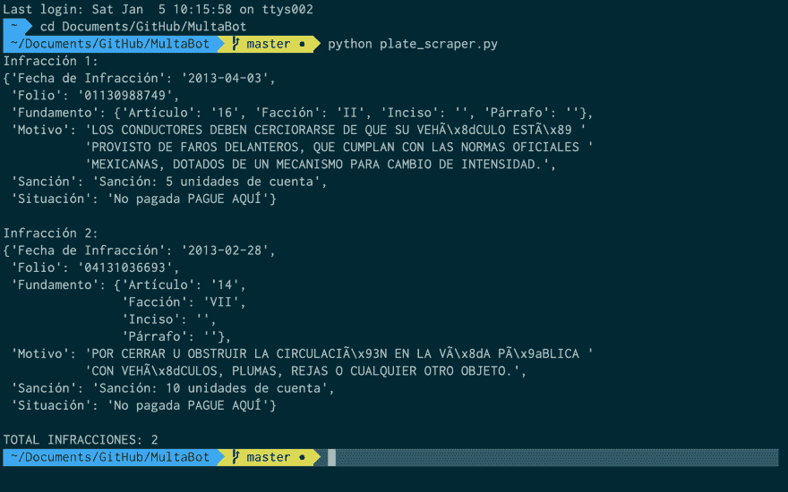

# 用 Python 构建流量精细刮刀

> 原文：<https://dev.to/rodolfoferro/building-a-traffic-fine-scraper-with-python-2j76>

<small>*要以更好的格式看这篇文章，请查看[我的博客](https://rodolfoferro.xyz/traffic-fine-scraper/)。*</small>

## 动机

前几天，我想起了 2017 年 6 月我去墨西哥城的时候(为了参加第一届[墨西哥之夜](https://rodolfoferro.xyz/pythondaymx/)的活动)，我在那里的时候，我的一个[朋友](https://twitter.com/JMireles_)在他家招待了我。事情是这样的，在我逗留期间，我们讨论了建立一些有用的东西，所以我们决定建立一个网站，让墨西哥城的车主能够核实他们的交通罚款。

网址如下:[http://www . multasdetransito . com . MX/infracciones/df-distrito-federal](http://www.multasdetransito.com.mx/infracciones/df-distrito-federal)

您可能已经注意到，如果您打开了该站点，它包含一个输入来记下汽车牌照，从中您可以搜索与该牌照相关的交通(如果有的话)。

我的朋友告诉我，只有一小部分墨西哥城居民知道这个网站，所以创建一些他们可以更容易地查阅这些信息的东西可能是有用的。

在这之后，我想:*“伙计，今天我举办了一个关于如何在 30 分钟内为 PythonDay 建立一个 TwitterBot 的研讨会，如果我们建立一个 TwitterBot，在站点中输入模板，然后自动从中抓取信息，会怎么样？”*。他答应了。有了这个，我们建立了 [MultaBot](https://twitter.com/MultaBot/with_replies) 一个推特机器人，用来读取汽车牌照和刮交通罚款。

我们开始这个项目是作为一个私人项目，但是前几天我被我大学的法律、政治和政府部门的邀请去做一个关于自动化如何对未来的工作有用的技术演讲，不仅对技术行业的人有用，对政治家和律师也有用。当我想起这件事时，我认为这将是一个很好的例子，所以我想在它的基础上进行改进，并以这个例子脚本结束，现在我想与你分享。

## 实验

我将解释整个代码，所以你会明白每一步都发生了什么。首先，我将导入 [Selenium](https://selenium-python.readthedocs.io/) 和 Python [数据漂亮打印机](https://docs.python.org/3/library/pprint.html) :

```
 1 from selenium import webdriver
 2 from pprint import pprint 
```

Enter fullscreen mode Exit fullscreen mode

Selenium 将允许我们自动控制网络浏览器，所以我们的想法是使用它自动打开网站，输入汽车牌照，在加载交通罚款后，提取并解析它们以用于`pprint`输出。

在这之后，我创建了一个函数来启动浏览器，并从车牌上抓取信息。如果`verbose`设置为`True`，该功能将打印每笔交通罚款的明细:

```
 5 # Browser opener function:
 6 def launch_browser(placa, verbose=False):
 7     # Browser launch with chromedriver:
 8     browser = webdriver.Chrome()
 9
10     # Set url and open it on Chrome: 11     url = 'http://www.multasdetransito.com.mx/infracciones/df-distrito-federal'
12     browser.get(url)
13
14     # Search plate: 15     multas = busca_placa_df(browser, placa, verbose)
16
17     # Close browser: 18     browser.quit()
19     return multas 
```

Enter fullscreen mode Exit fullscreen mode

在这个函数中，我设置了要抓取的 url，然后我调用了名为`busca_placa_df`的函数(这意味着 *search_plate_df* ， *df* 在西班牙语中代表联邦区)，然后我关闭并退出了为这个搜索打开的浏览器。

然后，我构建了输入数据然后抓取交通罚款的主函数:

```
22 # Plate finder function: 23 def busca_placa_df(browser, placa, verbose=False):
24     # Find ID and input test data: 25     browser.find_element_by_id('plate').clear()
26     browser.find_element_by_id('plate').send_keys(placa)
27
28     # Look for button and click it: 29     browser.find_element_by_xpath('//*[@id="request"]/div[2]/div/a').click()
30
31     # Search result and return it: 32     resultado = browser.find_element_by_id("secciones")
33     if resultado.text == "INFRACCIONES":
34         resultado = "¡No tienes adeudos!"
35     else:
36         resultado = resultado.text
37
38         # Search infraction tables: 39         if verbose:
40             infractions = browser.find_elements_by_id("tablaDatos")
41             if len(infractions):
42                 for index, infraction in enumerate(infractions):
43                     raw_data = infraction.text.split('\n')
44                     folio, fecha = raw_data[1].split(' ')[0:2]
45                     situation = ' '.join(raw_data[1].split(' ')[2:])
46                     motive = ' '.join(raw_data[2].split(' ')[1:])
47                     items = raw_data[3] + ' , '
48                     its = [item.split(' ')[-1] for item in items.split(', ')]
49                     art, fac, par, inc = its[:4]
50                     sanc = raw_data[4]
51
52                     data_dict = {
53                         'Folio': folio,
54                         'Fecha de Infracción': fecha,
55                         'Situación': situation,
56                         'Motivo': motive,
57                         'Fundamento': {
58                             'Artículo': art,
59                             'Facción': fac,
60                             'Párrafo': par,
61                             'Inciso': inc,
62                         },
63                         'Sanción': sanc
64                     }
65                     print("Infracción {}:".format(index + 1))
66                     pprint(data_dict)
67                     print()
68 
69     return resultado 
```

Enter fullscreen mode Exit fullscreen mode

如您所见，在第`24-26`行中，我用来自 HTML 源代码的`id=plate`清除了输入字段中的数据，然后输入我想要查找的汽车牌照，之后我通过其 XPath 查找按钮并单击它(第`28-29`行)。

我现在想知道搜索的结果，为此我在响应的 HTML 中查找带有`id=secciones`的元素(第`31-32`行)，并首先通过查看结果文本是否只有`"INFRACCIONES"`来验证它是否有任何债务，如果有，我返回一条消息说 t 没有债务(第`33-34`行)。在另一种情况下，在`35-36`行中，我保存了包含文本的结果(指定了车牌的交通罚款数量)。

如果`verbose`标志打开，那么刮刀将获得每个交通罚款的所有信息(行`38-40`)。为此，它将在 HTML 中查找带有`id=tablaDatos`的元素，该元素包含每个交通罚款的所有信息，如果它不为空(行`41`，它将迭代每个交通罚款，然后提取它们的所有信息(行`42-50`)。我现在使用`pprint`(第`52-67`行)和返回结果(第`69`行)构建一个包含响应的 dict，以一种很好的方式服务它。

为了测试这个脚本，我用一个演示车牌调用了函数`launch_browser`(恰好有两个交通罚款)并打印出结果(行`72-74` ):

```
72 if __name__ == '__main__':
73     multas = launch_browser('MKJ3940', True)
74     print(multas) 
```

Enter fullscreen mode Exit fullscreen mode

如果您在脚本中运行它，您会得到类似这样的输出(注意，它打印了我提到的 2 笔交通罚款😝):
[T3】](https://res.cloudinary.com/practicaldev/image/fetch/s--39Gj8uI8--/c_limit%2Cf_auto%2Cfl_progressive%2Cq_auto%2Cw_880/https://rodolfoferro.xyz/assets/posts/plate_scraper.png)

## 结论

一开始，我们认为这只是一个晚上一起工作的有趣项目*——就像一个迷你黑客马拉松——*最终成为一个有用的项目，可能对墨西哥城的公民有所帮助。

正如你所看到的，Python 有一些工具可以以非常酷的方式帮助自动化一些事情。我的意思是，如果您按照提供的那样运行脚本，您应该会看到一个浏览器窗口自动打开，然后文本被单独写入输入字段，结果被单独显示出来。**这不是真的很牛逼吗？**

请在评论中告诉我你用 Selenium 和 Python 构建了什么！💻🐍🤙🏼