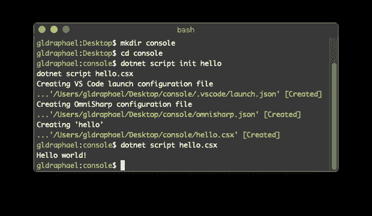

# 使用 dotnet-script 的 C#脚本

> 原文：<https://dev.to/galdin/c-scripts-using-dotnet-script-3b1k>

你知道 python 人员如何在一个`.py`文件中写一些代码，然后用`python3 filename.py`运行它，而不需要经历 C#用户必须经历的“新项目”和“`public static void main`仪式吗？C#也可以写脚本——这是我一年前学的。

罗斯林使 C#脚本成为可能。如果你感兴趣的话，2016 年 1 月 MSDN 有一篇马克·米歇尔斯的博客，标题是 T2 的 C#脚本。

我真正着迷的工具是 [dotnet-script](https://github.com/filipw/dotnet-script) ，这是一个跨平台的工具。NET Core 全球工具，通过 omnisharp 对 VS 代码提供全面的智能感知支持，涵盖了您的实验需求的大多数用例。

## 先决条件

1.  。NET Core SDK 2.1+
2.  VS 代码
3.  VS 代码的官方 C#扩展

## 安装

首先确保你有最新版本的。从[dot.net](https://dot.net)安装的 NET Core SDK。最低要求是。网芯 2.1。

安装`dotnet-script`最简单的方法是将其作为一个全局工具安装:

```
dotnet tool install --global dotnet-script 
```

Enter fullscreen mode Exit fullscreen mode

你现在应该可以运行`dotnet script --version`了，它应该会打印出`dotnet-script`工具的版本。

## 你好世界

1.  创建一个新目录来存储您的所有脚本。
2.  初始化一个新脚本。
3.  快跑。

```
mkdir console
cd console
dotnet script init hello
dotnet script hello.csx 
```

Enter fullscreen mode Exit fullscreen mode

*   init 命令创建一个`.csx` (C#脚本)文件，以及一个用于智能感知的`omnisharp.json`文件和一个用于调试支持的 VS 代码`launch.json`文件。
*   使用`dotnet script filename`运行 csx 脚本。

[](https://res.cloudinary.com/practicaldev/image/fetch/s--EnuA0tOn--/c_limit%2Cf_auto%2Cfl_progressive%2Cq_auto%2Cw_880/https://gldraphael.com/conteimg/2019/04/dotnet-script-screenshot.png)

生成的`hello.csx`文件有以下内容:

```
#!/usr/bin/env dotnet-script

Console.WriteLine("Hello world!"); 
```

Enter fullscreen mode Exit fullscreen mode

第一行是*nix 用户必须熟悉的 shebang。这意味着我们可以像`./hello.csx`一样运行它，而且它会正常工作！(也适用于 windows，但是你需要先使用`dotnet script register`将`.csx`文件与 dotnet-script 关联起来。)

## 另一个快速的例子

控制台应用程序的一个典型用例是试验新的库，而`dotnet-script`是完成这项工作的完美工具。假设我正在学习无状态的 T2 图书馆。我是这样做实验的:

1.  使用`dotnet script init stateless`创建一个新脚本。
2.  使用`code .`打开 VS 代码中的文件夹。
3.  使用 roslyn `#r`指令导入 nuget 包。
4.  去他们的 GitHub 页面复制一些示例代码。
5.  如果需要，使用`Cmd+.`(或`Ctrl+.`)添加 using 语句。
6.  使用 F5 在 VS 代码中调试。

这是我的`stateless.csx`文件:

```
#!/usr/bin/env dotnet-script
#r "nuget: Stateless, 4.2.1"

// Copied from: https://github.com/dotnet-state-machine/stateless/blob/dev/example/OnOffExample/Program.cs
using Stateless;

const string on = "On";
const string off = "Off";
const char space = ' ';

// Instantiate a new state machine in the 'off' state
var onOffSwitch = new StateMachine<string, char>(off);

// Configure state machine with the Configure method, supplying the state to be configured as a parameter
onOffSwitch.Configure(off).Permit(space, on);
onOffSwitch.Configure(on).Permit(space, off);

Console.WriteLine("Press <space> to toggle the switch. Any other key will exit the program.");

while (true)
{
    Console.WriteLine("Switch is in state: " + onOffSwitch.State);
    var pressed = Console.ReadKey(true).KeyChar;

    // Check if user wants to exit
    if (pressed != space) break;

    // Use the Fire method with the trigger as payload to supply the state machine with an event.
    // The state machine will react according to its configuration.
    onOffSwitch.Fire(pressed);
} 
```

Enter fullscreen mode Exit fullscreen mode

对于使用 VS 代码进行开发的新手，请注意:

*   如果智能感知在 3 之后不工作，或者在 5 之后没有可用的代码操作，您可能需要通过:`Cmd+Shift+P`->-`Omnisharp: Restart Omnisharp`重新启动 omnisharp。更多信息见 [filipw/dotnet-script#424](https://github.com/filipw/dotnet-script/issues/424) 。
*   运行应用程序时，您很可能会看到以下错误:“当应用程序没有控制台或控制台输入被重定向时，无法读取键。”因为 VS 代码默认使用不支持控制台输入的调试控制台。您可以通过向`.vscode/launch.json`添加一个`"console": "integratedTerminal"`属性，将其配置为使用集成终端来改变这一点。更多信息[这里](https://github.com/OmniSharp/omnisharp-vscode/blob/master/debugger-launchjson.md#console-terminal-window)。

就是这样。如果你问我，我认为它是非常光滑的。

* * *

我喜欢`dotnet-script`的是:

1.  所有与*相关的*代码，包括所需的 nuget 包，都可以存在于一个文件中。
2.  全面可靠的智能感知。
3.  调试器支持。
4.  没有`public static void main`或`.csproj`文件。