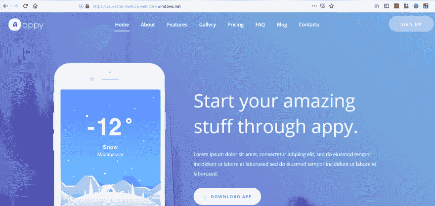
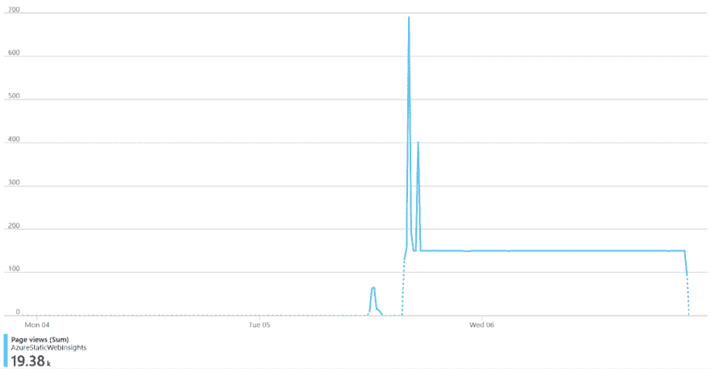
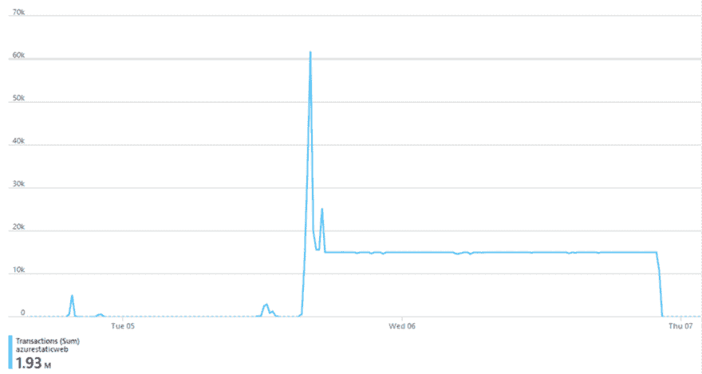
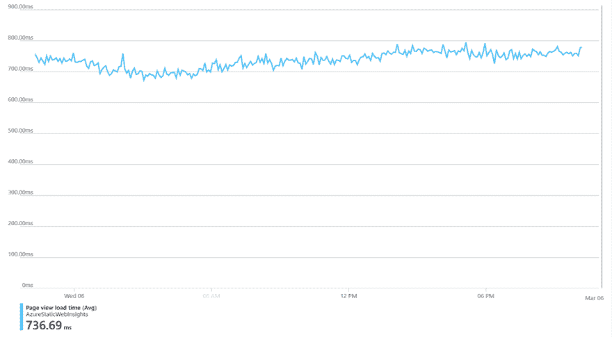
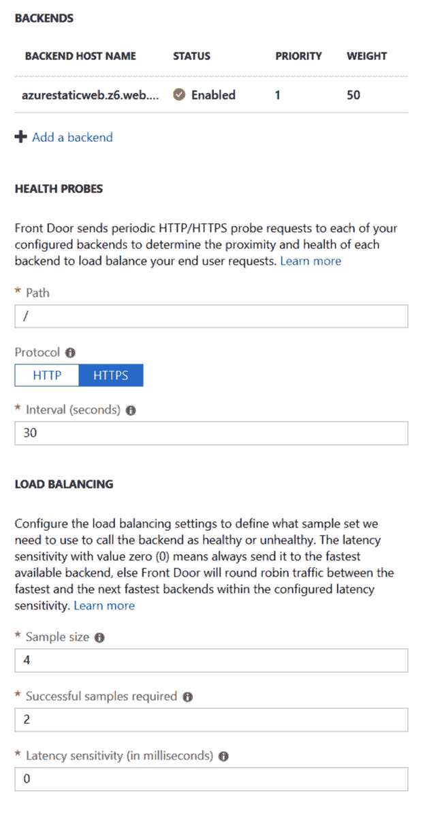
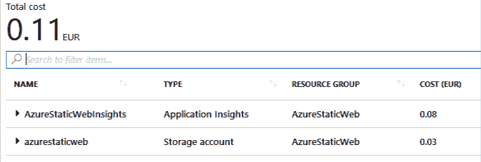

# 一个 Azure 静态网站真的可以这么便宜吗？

> 原文：<https://dev.to/foppenma/can-a-azure-static-website-really-be-this-cheap-4l7m>

那么我为什么要换成 Azure 静态网站呢？如果这个便宜很多，也有局限性，对吗？让我们来测试一下。

## 什么事？

不久前，微软宣布 Azure 静态网站全面上市。这意味着你可以在 blob 存储中托管你的网站文件，并从那里托管你的网站。你可以在这里阅读全部内容:[微软公告](https://azure.microsoft.com/nl-nl/blog/static-websites-on-azure-storage-now-generally-available/)

## 我在做什么？

对于这个测试，我们需要一个实际的网站，我们能够加载和产生一些网页浏览量。我从 Colorlib 得到了一个免费的模板，名为 Appy。你可以去 https://azurestaticweb.z6.web.core.windows.net/的[或者在 Colorlib 看演示来浏览它。](https://azurestaticweb.z6.web.core.windows.net/)

因为我不想花太多时间来制作一个新的网站，所以我把这个模板“按原样”部署到我的 blob 存储帐户中。这可以通过简单地将所有文件复制到名为“$web”的 blob 文件夹中来完成。它应该已经存在，因为它是在存储帐户中启用静态网站功能后自动创建的。接下来是在页面上生成一个负载。

## 让我们产生一些页面视图

为了了解我们主办方式的成本，我们将制作一些页面视图。为此，需要设置一个简单的 Selenium 测试来完成以下任务:

*   启动一个零缓存的新 Firefox 窗口
*   浏览到[https://azurestaticweb.z6.web.core.windows.net/](https://azurestaticweb.z6.web.core.windows.net/)
*   点击“博客”
*   点击“联系人”

其他菜单选项将被省略，因为它们都是不产生任何负载的单页导航项目。这个序列产生三个页面视图。我们真正想知道的是，从那以后，我们从 blob 存储中获得了多少文件。Firefox network monitor 报告称，一次页面浏览相当于请求获取 54 个文件。当然这个要看你的网站是怎么搭建的。

在这个初始调用之后，我将 selenium 测试放入一个循环中，让它连续运行 3 天以上。

## 表现如何？

以上都很好，但是在更重的负载下表现如何呢？让我们看看我从 application insights 获得的下图。

**过去 3 天的页面浏览量**

**过去 3 天 blob 存储上的事务数量**

**整个页面的平均加载次数(加载了全部 54 个文件)**

正如你可能已经注意到的，开始时有一个巨大的峰值。这是我的 selenium 测试中的一个打字错误，导致它每分钟产生 700 次页面浏览。虽然大多数页面视图的加载时间不到 1 秒，但对于如此多的页面视图，有时会出现长达 2 秒的峰值。

## 我们能做些什么来改善这一点？

从存储的角度来看，我认为它能够很好地处理所有的页面浏览。尤其是因为这些数据没有被缓存。在保持低成本的同时，我们有几个加快速度的选择:

*   重定向高速缓存
*   Cloudflare 缓存
*   Azure Blob 存储 CDN
*   蓝色前门

前两个选项一开始看起来不错，但是 Redis 缓存的起价是 16 美元/月，这有点违背了低成本托管的目的。而 Cloudflare 是免费的，但需要购买自定义域。

使用第三个选项，可以用 CDN 中的版本替换所有文件。虽然我认为这是可能的自动化，只是没有那么直截了当。

最后，在我看来可能是最好的选择是蓝色的前门。虽然它仍然是在预览中，但它确实工作得很好！预览版中的定价是每 GB 8 美分。更多详情，可以看一下[这里](https://azure.microsoft.com/nl-nl/pricing/details/frontdoor/)。正如你在上面的测试结果中看到的，20k 的页面浏览量对于这个模板网站来说大约是 1gb。

## 使用天蓝色前门

首先你需要创建 Azure 前门资源。添加资源时，有一个如下所示的配置步骤

有三个步骤:

**前端网址**
这是你的用户正在浏览的网址。这里有一个使用自定义域的选项。

**后端池**
在后端池中，你可以指定一个前端 URL 所指向的资源。您可以在一个资源池中添加多个资源。负载平衡器将在它们之间切换。这使得可以在不同的地理区域创建多个存储帐户，并且前门负载平衡器会自动将您路由到最近的资源，以减少加载时间。

**路由规则**
路由规则是前端 URL 和后端池之间的粘合剂。路由规则包括许多设置，其中之一就是缓存。这将减少 blob 存储的负载。

完成这些步骤后，您的静态网站将在几分钟内在新的*.azurefd.net 域上可用。对我来说，这就是 https://azurestaticweb.azurefd.net/。请记住，Azure 静态网站已经非常快了，Azure 前门只是减少加载时间或扩展应用程序的一个选项。现在，让我们继续 Azure 静态网站特性。

## 有哪些局限性？

没有服务器运行您的代码，因此**不可能**执行以下操作:

*   安装类似 Node.js 的东西
*   部署您的 ASP.net web 应用程序

什么**是**可能:

*   使用 Html、CSS 和 Javascript
*   使用反应堆或角度
*   使用 web 程序集
*   使用 Azure 函数作为你的服务器端/后端

## 最后，这 20k 的页面浏览量，1gb 的传输量，差不多 200 万的交易量，到底值多少钱？

因为实际上只有 blob 存储成本，所以你会看到类似这样的东西。

请注意，与 Azure 静态 Web 主机相比，Application insights“非常昂贵”。但是平心而论，3 美分(美元的话 3.12 美分)非常便宜！这种托管解决方案非常便宜，同时还提供了很多可能性。因此，你可以使用 Azure 函数作为后端，例如连接到数据库。

感谢阅读！