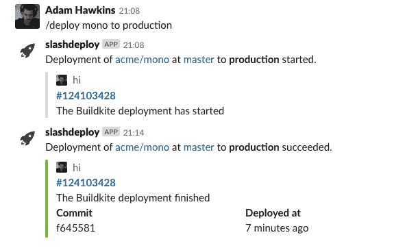
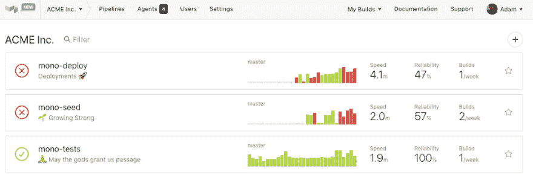
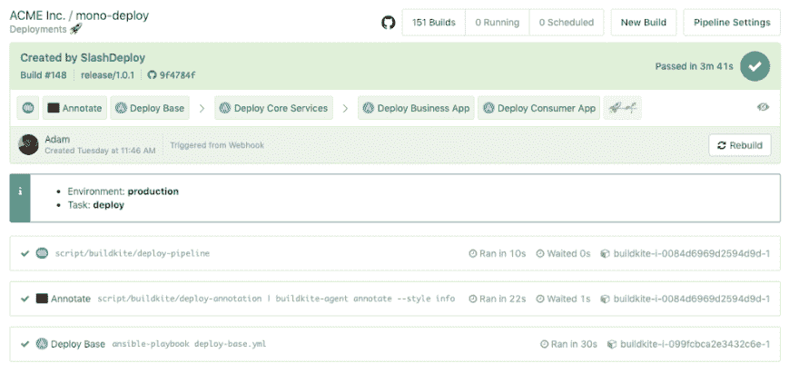

# 带有 Slack 和 Buildkite 的 CD ChatOps

> 原文：<https://dev.to/ahawkins/cd-chatops-with-slack--buildkite-55c2>

[Buildkite](https://buildkite.com/) 是我首选的部署管道系统。我更喜欢 Buildkite，因为我可以在自己的基础设施上运行代理。这意味着我可以用 IAM 控制 AWS 访问，甚至可以用更快的管道烘焙所有依赖关系的 ami。

Buildkite 管道可以从 [GitHub 部署](https://developer.github.com/v3/guides/delivering-deployments/)中触发。唯一的问题是为触发部署创建一个好的 UI。我最近开始使用 [SlashDeploy](https://getslashdeploy.com/) (相同的名字，但没有联系)从 Slack 触发部署 ChatOps 风格。它是这样工作的。

## 通过时差聊天

[](https://res.cloudinary.com/practicaldev/image/fetch/s--acpTcUJE--/c_limit%2Cf_auto%2Cfl_progressive%2Cq_auto%2Cw_880/https://cdn-images-1.medium.com/max/800/0%2AAQCajLErTwTYcdV7.png)

SlashDeploy 将`/deploy`命令添加到 Slack。`/deploy`有用是因为它是一个小而锋利的工具。它*仅*触发 GitHub 部署。这是与其他系统的一个明显的集成点。这意味着`/deploy`可以与任何部署管道集成。`/deploy`和 BuildKite 配合得特别好，因为`/deploy`直接映射到 Buildkite 管道。`/deploy`还可以指定 Github 部署任务(如迁移、播种或激活维护)，这些任务可以在 Buildkite 内部处理，以触发其他管道。另外，所有这些都发生在空闲时间，所以任何人都可以`/deploy APP`或`/deploy APP with TASK`。

## 构建部署管道

[](https://res.cloudinary.com/practicaldev/image/fetch/s--BnzXj-Ns--/c_limit%2Cf_auto%2Cfl_progressive%2Cq_auto%2Cw_880/https://cdn-images-1.medium.com/max/1000/0%2AIviGFW52G23iHipQ.png)
*build kite 管道概述。*

我更喜欢持续部署，并在需要时选择触发手动部署。`/deploy`支持两种场景。`/deploy`被配置为如果在`.slashdeploy.yml` :
中测试通过，则触发我的目标分支的自动部署

```
version: 1
environments:
  production:
    # Important to everyone see how to deploy
    respond_in_channel: true
    # For notifications
    channel: ops
    checks:
      - buildkite/mono-tests
    auto_deploy:
      # auto deploy master
      ref: refs/heads/master 
```

我使用定制的管道脚本来处理特定的部署环境和任务。这是部署管道的入口点。Buildkite 管道可以在更大的管道中触发其他管道。这里有一个例子。

`production`部署不调用种子管道，但是`dev`部署调用种子管道。团队成员也可以调用`/deploy app with seed`。在这种情况下，部署任务被设置为`seed`。默认值为`deploy`。我的管道脚本检查这两个值，然后通过`buildkite pipeline upload`加载相关的管道文件。这里有一个骨架:

```
#!/usr/bin/env bash

set -euo pipefail

main() {
    local environment="${BUILDKITE_GITHUB_DEPLOYMENT_ENVIRONMENT?required}"
    local task="${BUILDKITE_GITHUB_DEPLOYMENT_TASK?required}"

    local pipeline=".buidlkite/${environment}-${task}.yml"

    if [ -f "${pipeline}" ]; then
        buildkite pipeline upload "${pipeline}"
    else
        echo "Cannot handle ${envrionment}/${task} invocation!" 1>&2
        return 1
    fi
}

main "$@" 
```

这种方法通过将每个环境/任务映射到特定的[管道文件](https://buildkite.com/docs/pipelines/defining-steps)来保持简单。管道也可能[触发其他管道](https://buildkite.com/docs/pipelines/trigger-step)，比如:

```
- label: ':rocket: :seedling:'
    trigger: mono-seed
    build:
      commit: "${BUILDKITE_COMMIT?}"
      branch: "${BUILDKITE_BRANCH?}"
      env:
        BUILDKITE_GITHUB_DEPLOYMENT_ENVIRONMENT: "${BUILDKITE_GITHUB_DEPLOYMENT_ENVIRONMENT?}"
        BUILDKITE_GITHUB_DEPLOYMENT_TASK: "${BUILDKITE_GITHUB_DEPLOYMENT_TASK?}" 
```

最后，我使用 [Buildkite 注释](https://buildkite.com/docs/agent/v3/cli-annotate)用环境和任务装饰管道 UI。否则，该信息会被几次点击所隐藏。滚动管道视图以查找相关版本时，这很有用。这是一个带有注释的生产部署的屏幕截图。

[](https://res.cloudinary.com/practicaldev/image/fetch/s--R5_JKYg2--/c_limit%2Cf_auto%2Cfl_progressive%2Cq_auto%2Cw_880/https://cdn-images-1.medium.com/max/1000/0%2A3XxW_PEp73NrCcad.png) 
*生产部署带注释和一个跳过的步骤。*

添加注释需要添加一个带有关联脚本的额外管道步骤。Buildkite 注释是降价的。在单独的文件中处理空白敏感字符串和环境变量替换更容易。以下是相关的代码片段:

```
# the pipeline step:
steps:
  - label: ':console: Annotate'
    command: script/buildkite/deploy-annotation | buildkite-agent annotate --style info

# The annotation script:
#!/usr/bin/env bash

set -euo pipefail

cat <<EOF
- Environment: **${BUILDKITE_GITHUB_DEPLOYMENT_ENVIRONMENT}**
- Task: **${BUILDKITE_GITHUB_DEPLOYMENT_TASK}**
EOF 
```

## 结论

[Buildkite](https://buildkite.com/) 一直是我首选的部署管道软件。现在`/deploy`结合专用的部署管道和 ChatOps 风格的 GitHub 部署触发器使设置比以往任何时候都更好。如果你正在构建一个新的部署管道，那么我强烈推荐 Buildkite(如果在 AWS 上运行，还有他们的[弹性栈](https://github.com/buildkite/elastic-ci-stack-for-aws))与 [SlashDeploy](https://www.getslashdeploy.com/) 一起使用 ChatOps 和 Deploy 触发器。这很简单，而且很有效——在软件中很难找到这种品质。