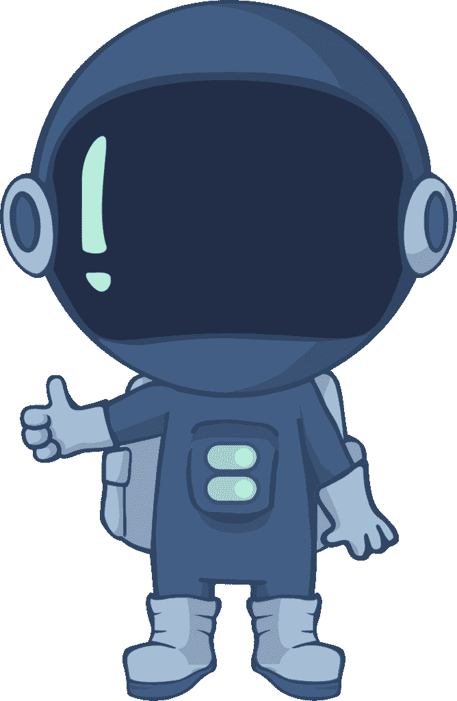

# 选择您自己的部署

> 原文：<https://dev.to/wiredferret/choose-your-own-deployment-11oe>

我喜欢人们理解一个概念时的那种顿悟时刻。这让我对这份工作充满了活力。在那里帮助人们了解一个抽象的概念如何让他们的具体生活变得更好，这是令人惊讶的回报。

正因为如此，我试着改变我演讲的所有部分，以确保人们感觉他们正在和我一起旅行，ala Nancy Duarte 在[引起共鸣](https://www.duarte.com/resonate/)。我想让你感觉你在和我一起旅行，就像我们一起学习，探索你感兴趣的东西。

这个游戏是作为一个会议谈话而诞生的。对于一个会议来说，接受一个没有固定长度或模式的演讲，完全由观众参与驱动，这是一个长期的赌注，但有几个人做到了，我非常感激。这个切换游戏是一个交互式的探索，展示了如何使用特性标记来使部署更加安全，并且不会有太大的改变。

现在我已经把会议草图展开成一个关于可爱的太空探险家的游戏，Toggle:

[切换游戏](https://wiredferret.github.io/Toggle/The%20Toggle%20Game)

我用[线](http://twinery.org/)做的。我将把它的深层细节留给 OpenSource.com 的文章，但这种体验非常简单，也非常愉快。你可以在 https://github.com/wiredferret/Toggle 的[找到来源。我留下了我所有愤怒和暴躁的提交信息供你欣赏，因为我喜欢在别人的提交信息中看到弧线。](https://github.com/wiredferret/Toggle)

如果你不想自己玩这个游戏，我有一个视频是关于多伦多 DevOpsDays 的人是如何玩的。

<figcaption>Choose Your Own Deployment Adventure, DevOpsDays Toronto</figcaption>