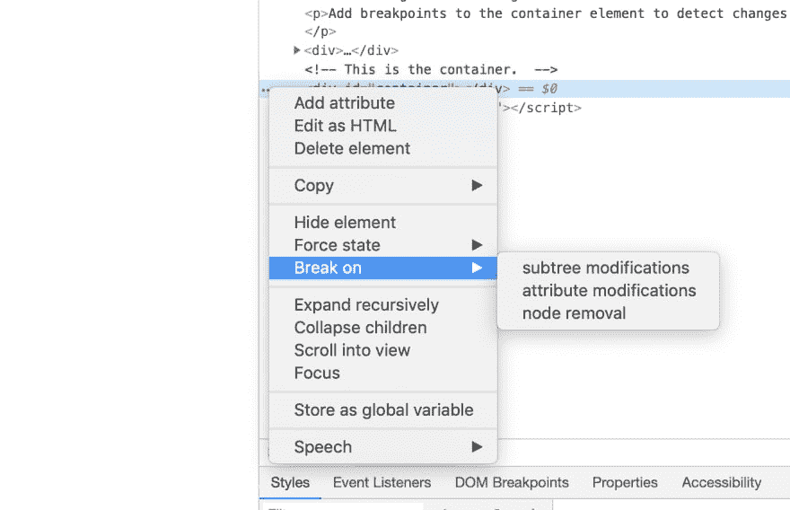

# Chrome DevTools:检测元素变化

> 原文：<https://dev.to/apvarun/chrome-devtools-detecting-element-changes-gh6>

Google chrome 附带了许多方便的工具，帮助 web 开发人员为用户/客户建立更好的体验。在过去的几年里，它增加了许多功能，迫使其他浏览器走上同样的道路。

本文将讨论如何在运行时检测 DOM 中元素的变化，主要是为了调试。这是关于 Chrome 开发工具有用工具的系列文章的第一篇。

# 元素面板

如您所知，元素面板是您可以看到 DOM(文档对象模式)中当前可用的元素的地方。

Chrome 允许监听 DOM 树中一个元素发生的三个特定事件。

*   属性值的添加/更新
*   元素的子元素(子树)的变化
*   删除节点(子元素)

## 如何添加监听器？

打开开发工具并选择 Elements 选项卡。在 DOM 节点列表中，选择需要添加侦听器的节点。

选择节点后，节点左侧会出现一个三点菜单。点击这些点将会打开一个带有一堆选项的上下文菜单。

现在，为了添加监听器，选择“Break on”选项，然后选择事件类型。一旦被选中，chrome 将监听该特定元素的变化，并在修改所选节点的代码行停止 JS 执行。

一旦命中断点，您将看到所有上下文信息和内存快照，这些信息可用于识别问题来源。

*预览(打破子树修改):*
[https://www.youtube.com/embed/WfWj3qzwJ1Y](https://www.youtube.com/embed/WfWj3qzwJ1Y)

如果你想自己尝试一下，去下面的回购处看看。它有视频中显示的文件。克隆回购，到处玩:)

## [apvarun](https://github.com/apvarun) / [学习工具](https://github.com/apvarun/learndevtools)

### 使用 DevTools 更好地调试

<article class="markdown-body entry-content container-lg" itemprop="text">

# 学习开发工具

用于学习在浏览器中使用开发人员工具的演练集合。在这里阅读更多

## 入门指南

访问[https://learndevtools.now.sh/](https://learndevtools.now.sh/)了解并尝试 devtools 的各种功能，帮助您提高工作效率。

## 贡献的

欢迎拉取请求。对于重大更改，请首先打开一个问题，讨论您希望更改的内容。

## 许可证

麻省理工学院

</article>

[View on GitHub](https://github.com/apvarun/learndevtools)

**直接链接:** [课程:探测元素更新](https://learndevtools.now.sh/docs/guides/elements/2.-detecting-element-updates/)