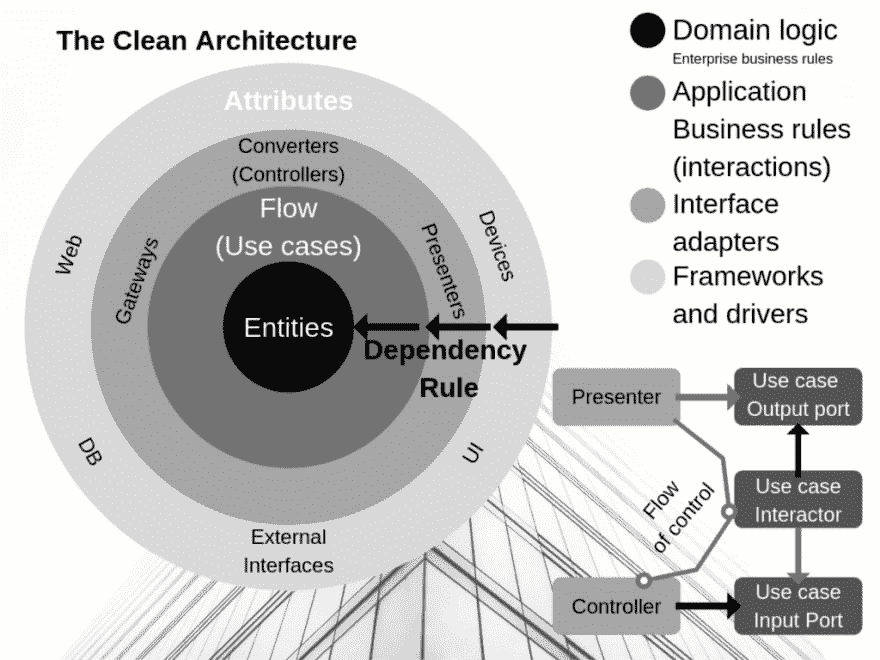
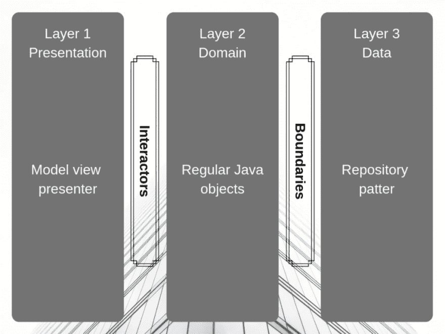
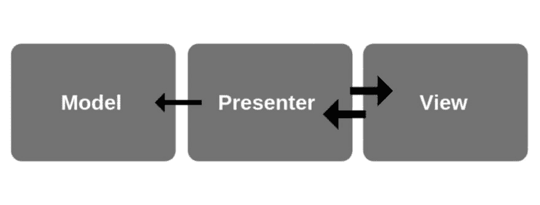
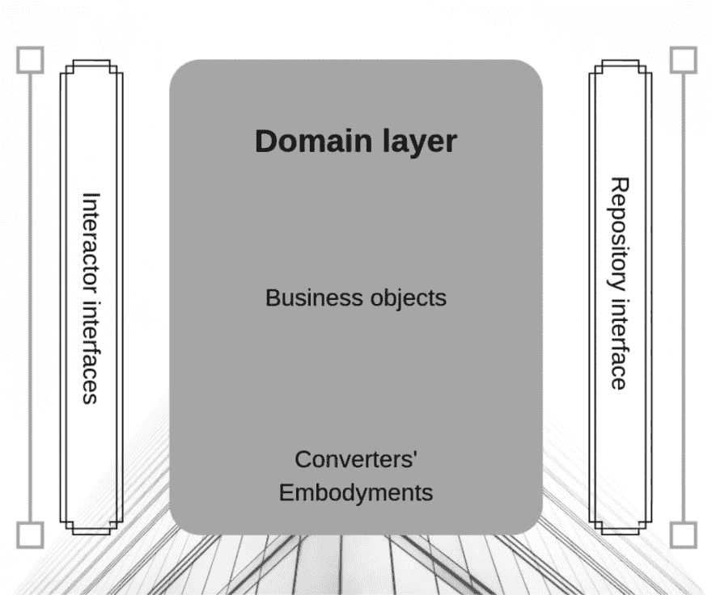
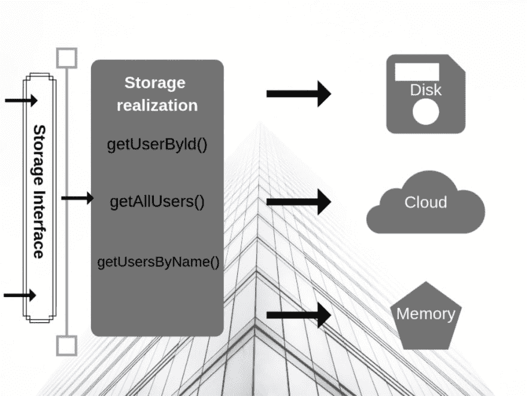

# Android 应用中的干净架构

> 原文：<https://dev.to/apium_hub/clean-architecture-in-android-applications-hoe>

尽管移动应用程序对用户来说看起来很简单，但是整洁的用户界面背后隐藏着很多复杂性。一个应用程序可以专注于任何任务，但它应该坚持一个基本要求——干净的架构。[脸书 app](https://freepps.top/apps/social/facebook) 就是这个概念的一个很好的例子。它是可持续的，并可根据市场变化或公司增长进行高度调整。这一切都归功于它对建筑的透彻理解。

## 了解基础知识:Android 中干净的架构

那么，什么是干净的建筑呢？它需要一套允许创建工作产品的开发方法:

*   它不依赖于任何框架、用户界面、第三方数据库或监管机构；
*   这有利于测试。

现在，简单看一下解释什么是源代码开发参与者以及他们如何相互依赖的规则。看圆圈来理解向量的概念。该方案可能有更多层，但这取决于具体情况。

以下描述将有助于理解该图像。

*   实体——它们是应用程序的业务元素；
*   流——这个词指的是实体间来回流动的数据流。流程由用例驱动；
*   转换器——这些是使信息格式最适合实体和流交互功能的方法。它们也被称为接口适配器；
*   属性——构建 UI 的东西:驱动程序、工具、框架和其他细节，包括与 API、数据库等的连接。

跟着箭头走，因为规则说外层支持内层，因为业务元素只能从外层接收数据。

## 示例模型

我对工作模型场景的想法感到困惑，我在 Freepps.top 的朋友帮助了我。想象一下这个应用程序，你可以在其中看到公司员工的名单。点击它们中的每一个都会打开一个新窗口，显示从云端请求的个人信息。在继续阅读时，请考虑这种情况。

## 多层建筑

重要的是要记住，商业规则应该意识不到任何外部环境。尽管如此，这些规则在测试过程中独立于外部的任何对象。

为了实现这个条件，我建议将整个项目分成 3 个独立的层。每一个都包含特定的目标，并且可以独立发挥作用。

请注意，每一层都被赋予了独特的数据模型属性。这就是为什么他们能够避免依赖。在最终代码中，您必须应用 data schemer 进行数据格式化。这将有助于防止不必要的模型交叉使用。

查看流程示意图，记住没有必要重新发明轮子:

## 第一层:演示

这一层包含驱动可视组件的协调器。所以，这就是图像生成(渲染)的地方。整个过程是由粒子和动作进行的，除了 UI 逻辑之外，它们实际上没有内部逻辑。一个展示可以基于模型-视图-展示者(MVP iOS)、模型-视图-控制器(MVC)或者[模型-视图-视图模型](https://dev.to/apium_hub/pure-model-view-presenter-in-android-1736) (MVVM)这样的模式。对于这些模式的进一步描述，请查看链接，因为我不能进入细节。

在表示层上计算和显示数据是由转换器完成的(见图 1)。他们是任务的执行者，这些任务出现在新的外部线条中，这些线条来自和指向 Android UI 的中心线条。

## 第二层:域

这个包含了所有的逻辑过程。您还可以在这里找到所有相关转换器的实施例(用例)。这是所有商业规则的地方。

从技术上来说，它是一段基本的 Java 代码，没有任何 Android 版本。因此，任何外部要素都只能在链接到业务对象时使用接口。

## 第三层:数据

用户存储实现在这里为应用程序所需的所有数据的转换提供了自己。此时，接口在前一层。实现使用特殊的存储(储存库)模式，目的是根据特定的当前环境选择适当的数据根。

这里有一个例子。一个随机的用户通过他的 id 被选择。在这种情况下，如果这个用户已经在磁盘缓存中列出，模式将选择缓存作为数据根。在其他情况下，数据是不存在的，因此应用程序的云将被请求带来所需的数据来使用它，并将其保存到硬件缓存中。

事实是，没有用户能够看到数据的原始来源。对他们来说是完全看不见的，他们其实也不在乎是来自硬件存储还是 app 的云端。只有一件事很重要:请求数据并交付给客户。就是这样。注意，有许多现成的经过测试的库可以完成这种任务，所以不要浪费时间构建新的库。

## 接近错误

这个问题没有明确的答案，所以我们 Freepps.top 将感谢您在评论中的建议。

主要的方法是应用回调，但是可能会出现数据存储的问题。那就是你可以应用回调 1 [onResponse()]或者 2 [onError()]的地方。

第二个变体包含名为“ErrorBundle”的特殊情况文件夹类。但是，这种方法可能会导致一些问题，因为在错误到达第一层的呈现阶段之前，回调的草稿可能会出现多次。结束代码可能变得不够可读。

## 测试一下

每一层都有自己的方法:

*   第一层-浓缩咖啡，谢谢！(用于 UI 测试)和 JUnit+mock(用于演示者)；
*   第二层——JUnit+mock ITO；
*   第 3 层–与第 2 层相同。

## 结论:Android 中干净的架构

Robert Martin 曾经说过，干净的架构不是关于使用框架，而是关于目的，这是完全正确的。同时，公平地说，任何事情都有多种实现方式。像您这样的创作者日复一日地处理大量的日常困难，所以本文中的方法肯定会使您的工作更快。你的应用会很方便:

*   要支持；
*   为了测试；

试着用这些建议来实现你的想法，给它一个好的强度测试，也许，找到一些改进。完美是无限的，但是不使用现有的东西是不可能的。记住你的反馈可以让境界变得更好！

## 作者简介

丹尼尔·克拉尔在 Freepps.top 的工作不仅仅是测试应用程序的功能，因为这是一条没有出路的路。这也是他经常利用业余时间去参加课程，开阔我编程视野的原因。

如果你有兴趣了解更多关于 Android 的干净架构，我强烈推荐你订阅我们的新闻简报。

Android 应用程序中的干净架构这个帖子最先出现在 T2 的 Apiumhub 上。