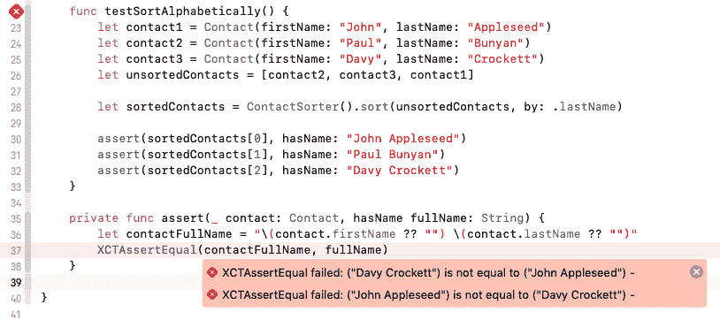
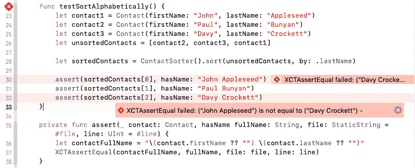

# 清理您的 Xcode 单元测试

> 原文：<https://dev.to/avery/clean-up-your-xcode-unit-tests-555e>

苹果针对 Xcode 的 XCTest 框架只提供了少数断言语句，而且几乎都是`XCTAssert`的琐碎变种。如果您发现自己在测试中一遍又一遍地调用`XCTAssertEqual`，请考虑编写自己的断言函数！结果你会发现你的测试代码更干净。

考虑下面的例子:我有一个未排序的联系人列表，我想确保他们按姓氏的字母顺序排序。

```
func testSortAlphabeticallyByLastName() {
    let contact1 = Contact(firstName: "John", lastName: "Appleseed")
    let contact2 = Contact(firstName: "Paul", lastName: "Bunyan")
    let contact3 = Contact(firstName: "Davy", lastName: "Crockett")
    let unsortedContacts = [contact2, contact3, contact1]

    let sortedContacts = ContactSorter().sort(unsortedContacts, by: .lastName)

    // Contact does not conform to Equatable, so we test each element separately
    XCTAssertEqual(sortedContacts[0].lastName, "Appleseed")
    XCTAssertEqual(sortedContacts[1].lastName, "Bunyan")
    XCTAssertEqual(sortedContacts[2].lastName, "Crockett")
} 
```

这是可以清理的。我不喜欢打给`XCTAssertEqual`的 3 个单独的电话，我也不喜欢我们比较的是姓氏而不是整个联系人。我们*可以*让`Contact`符合`Equatable`，但是对于这个练习，让我们试着不做。

首先，我想写一个函数，声明一个联系人有一个给定的名字。我可能会这样写。

```
func testSortAlphabeticallyByLastName() {
    let contact1 = Contact(firstName: "John", lastName: "Appleseed")
    let contact2 = Contact(firstName: "Paul", lastName: "Bunyan")
    let contact3 = Contact(firstName: "Davy", lastName: "Crockett")
    let unsortedContacts = [contact2, contact3, contact1]

    let sortedContacts = ContactSorter().sort(unsortedContacts, by: .lastName)

    assert(sortedContacts[0], hasName: "John Appleseed")
    assert(sortedContacts[1], hasName: "Paul Bunyan")
    assert(sortedContacts[2], hasName: "Davy Crockett")
}

private func assert(_ contact: Contact, hasName fullName: String) {
    let contactFullName = "\(contact.firstName ?? "")  \(contact.lastName ?? "")"
    XCTAssertEqual(contactFullName, fullName)
} 
```

只有一个问题。如果测试失败，Xcode 会高亮显示我的函数中的`XCTAssertEqual`行，而不是调用函数的那一行。这不是很有帮助。

[](https://res.cloudinary.com/practicaldev/image/fetch/s--QQHc8jRR--/c_limit%2Cf_auto%2Cfl_progressive%2Cq_auto%2Cw_880/https://thepracticaldev.s3.amazonaws.com/i/y6n4cph52c2bzocjuq0h.png)

您知道`XCTAssert`(及其派生)有文件和行号的参数吗？默认情况下，它们由调用者使用`#file`和`#line`值填充。我的`assert(_:hasName:)`函数可以捕捉这些值，并将它们传递给`XCTAssertEqual`，让 Xcode 高亮显示正确的违规行。

下面是我更新后的函数:

```
private func assert(_ contact: Contact, hasName fullName: String, file: StaticString = #file, line: UInt = #line) {
    let contactFullName = "\(contact.firstName ?? "")  \(contact.lastName ?? "")"
    XCTAssertEqual(contactFullName, fullName, file: file, line: line)
} 
```

这是结果:

[](https://res.cloudinary.com/practicaldev/image/fetch/s--NWDgMKl2--/c_limit%2Cf_auto%2Cfl_progressive%2Cq_auto%2Cw_880/https://thepracticaldev.s3.amazonaws.com/i/e9cx8s1x7dtj2w7a2dwe.png)

这已经好多了。然而，我更想把它清理干净。让我们从将这三个独立的断言整合成一个开始。

```
func testSortAlphabeticallyByLastName() {
    let contact1 = Contact(firstName: "John", lastName: "Appleseed")
    let contact2 = Contact(firstName: "Paul", lastName: "Bunyan")
    let contact3 = Contact(firstName: "Davy", lastName: "Crockett")
    let unsortedContacts = [contact2, contact3, contact1]

    let sortedContacts = ContactSorter().sort(unsortedContacts, by: .lastName)

    assert(sortedContacts, areNamed: [
        "John Appleseed", 
        "Paul Bunyan", 
        "Davy Crockett"])
}

private func assert(_ contacts: [Contact], areNamed names: [String], file: StaticString = #file, line: UInt = #line) {
    contacts.enumerated().forEach { (index, contact) in
        let name = names[index]
        assert(contact, hasName: name, file: file, line: line)
    }
}

private func assert(_ contact: Contact, hasName fullName: String, file: StaticString = #file, line: UInt = #line) {
    let contactFullName = "\(contact.firstName ?? "")  \(contact.lastName ?? "")"
    XCTAssertEqual(contactFullName, fullName, file: file, line: line)
} 
```

接下来，让我们为联系人初始化创建一个便利函数。我在这里没有测试接触初始化器，所以我们应该在测试体之外重构它。

```
func testSortAlphabeticallyByLastName() {
    let contact1 = makeContact(named: "John Appleseed")
    let contact2 = makeContact(named: "Paul Bunyan")
    let contact3 = makeContact(named: "Davy Crockett")
    let unsortedContacts = [contact2, contact3, contact1]

    let sortedContacts = ContactSorter().sort(unsortedContacts, by: .lastName)

    assert(sortedContacts, areNamed: [
        "John Appleseed", 
        "Paul Bunyan", 
        "Davy Crockett"])
}

private func makeContact(named name: String) -> Contact {
    let names = name.split(separator: " ")
    let firstName = String(names.first!)
    let lastName = String(names.last!)
    return Contact(firstName: firstName, lastName: lastName)
} 
```

让我们更进一步，将联系人姓名嵌入到一个函数中。

```
func testSortAlphabeticallyByLastName() {
    let unsortedContacts = makeContacts(named: [
        "Paul Bunyan",
        "Davy Crockett",
        "John Appleseed"])

    let sortedContacts = ContactSorter().sort(unsortedContacts, by: .lastName)

    assert(sortedContacts, areNamed: [
        "John Appleseed",
        "Paul Bunyan",
        "Davy Crockett"])
}

private func makeContacts(named names: [String]) -> [Contact] {
    return names.map(makeContact(named:))
} 
```

我觉得这不能再干净了！一个调用设置我们的数据，一个调用执行我们的代码，一个调用检查我们的工作。现在让我们添加一个按名字排序的测试。

```
func testSortAlphabeticallyByFirstName() {
    let unsortedContacts = makeContacts(named: [
        "Paul Bunyan",
        "Davy Crockett",
        "John Appleseed"])

    let sortedContacts = ContactSorter().sort(unsortedContacts, by: .firstName)

    assert(sortedContacts, areNamed: [
        "Davy Crockett",
        "John Appleseed",
        "Paul Bunyan"])
} 
```