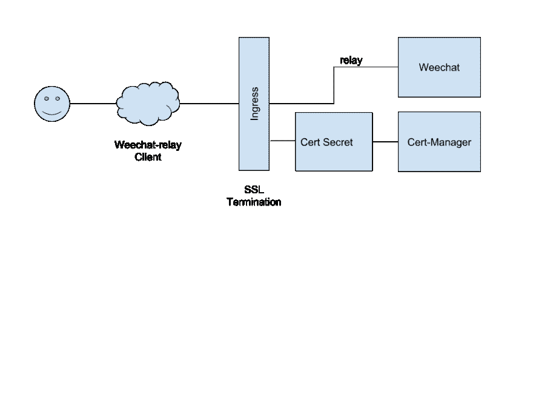
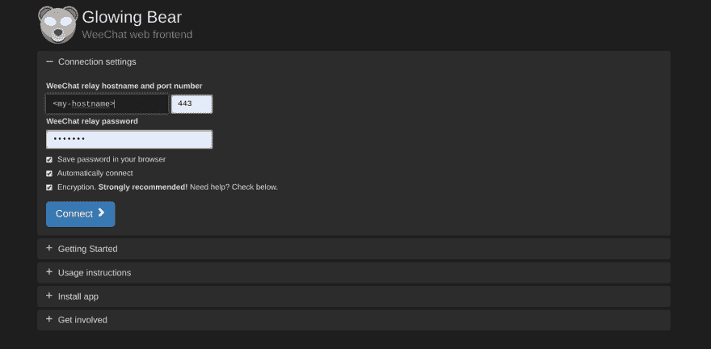

# Kubernetes 上带有 WeeChat 的云原生 IRC

> 原文：<https://dev.to/greghaynes/cloud-native-irc-with-weechat-on-kubernetes-9g3>

不久前，我放弃了使用基于终端的 IRC，开始使用结合了 WeeChat 中继协议的客户端。对于那些不熟悉的人来说，这是一个内置在 WeeChat 中的守护程序，它允许你的客户端像 IRC 保镖一样工作(类似于 ZNC)。使用它，我可以在台式机/笔记本电脑上切换到发光熊(一个基于网络的 IRC 客户端),在移动设备上切换到 weechat-android。现在，不需要终端，仅仅依靠 HTTP(确切地说是 WebSockets)和 TLS，我就可以将我的 IRC 迁移到 Kubernetes，在那里 vhosting 和 TLS 终止由入口控制器完成。这对于与我运行的各种其他服务共享资源(特别是公共 IP 和证书管理)有很大的好处。它也可以很容易地在任何 Kubernetes 提供商上运行。最后，这是我盘子里的另一个“宠物”,总是感觉很棒——现在我唯一关心的基础设施是我共享的 Kubernetes 集群的状态。

## 先决条件

为了实现这一点，我们需要一个 Kubernetes 集群，一台能够创建 docker 图像的计算机，以及一个 docker 注册表，我可以将图像上传到并提供给我的 Kubernetes 集群。为了让 vhosting 和 TLS(强烈推荐)工作，我使用了 ingress-nginx 和 cert-manager。这两者的设置超出了本指南的范围，并且可能因主机提供商而异。您的主机提供商也可以提供自己的入口控制器和证书管理，这对我们来说可能更容易和更好。

这是我们完成后的设置图:
[](https://res.cloudinary.com/practicaldev/image/fetch/s--opC5rsP_--/c_limit%2Cf_auto%2Cfl_progressive%2Cq_auto%2Cw_880/https://s3-us-west-2.amazonaws.com/greghaynes.dev.to/Weechat%2BK8s%2BDiagram.png)

在本指南中，我们还会提到一个包含 docker 文件的存储库，用于存放您的 WeeChat 配置等。因此，需要使用以下命令来克隆它。我们还假设用户已经 cd 到了这个存储库。

```
git clone https://github.com/greghaynes/k8s-weechat
cd k8s-weechat 
```

## WeeChat 配置

在我们克隆的存储库中，有一个 weechat 配置目录。这个目录被复制到我们的 docker 映像中，并指定 WeeChat 使用的配置文件。虽然这种方法有一些缺点(需要构建、推送、部署配置更改)，但对我来说这并不是一个主要问题，因为这种配置很少更改，而且还可以远程更新(使用/set)。

在这个目录中有一个`relay.conf`文件。这控制着我们的 WeeChat 中继的运行，这就是我们的客户端将如何连接。首先要注意的是为客户端连接指定密码的那一行。改变这一点是个好主意:

```
password = "" 
```

另一个重要的模块是我们指定中继端口/协议的地方:

```
[port]
weechat = 8001 
```

这指定我们将在端口 8001 上使用 weechat 协议。值得注意的是，我们这里没有启用 SSL，因为我们将在入口网关上终止 SSL。

如果您想要指定其他配置选项(比如 autoconnect 选项),您可以将 irc.conf 或其他配置文件复制到这个目录，它将被添加到我们映像中的 weechat 配置目录。

## Docker 图像

为了在 Kubernetes 中运行 weechat，我们将创建自己的 docker 映像来运行 weechat-headless(一个不产生控制台 UI 的替代 WeeChat 命令)。有几个 docker 文件是关于这个的，但它们都很小，这让我做了自己的，至少我有知识的好处。

在我们的示例存储库中，我们有以下 Dockerfile:

```
FROM alpine:edge

LABEL maintainer="greg@greghaynes.net"

ENV HOME /home/user

RUN ["apk", "add", "--no-cache", "weechat", "weechat-perl", "weechat-python", "weechat-aspell", "ca-certificates", "aspell-en", "python", "perl"]

RUN ["adduser", "-D", "-h", "$HOME", "user"]
RUN ["mkdir", "-p", "$HOME/.weechat"]
RUN ["chown", "-R", "user:user", "$HOME"]
ADD --chown=user:user weechat-config/* /home/user/.weechat/
WORKDIR $HOME

USER user

ENTRYPOINT weechat-headless 
```

如您所见，该映像基于 alpine 并安装了 weechat、一些额外的插件和依赖项，然后将我们的 WeeChat 配置目录复制到$HOME/.weechat 中。

然后构建这个映像，并使用下面的命令将其上传到 docker 注册表:

```
docker build -t <my-registry-url>/weechat .
docker push <my-registry-url>/weechat 
```

## Kubernetes 部署

现在我们有了 docker 映像，我们的 Kubernetes 部署就相对简单了。我们正在使用我们创建的副本数为 1 的映像创建部署(因为这不是我们可以横向扩展的应用程序)。我们还公开了端口 8001，因为这是我们的中继侦听的端口。此部署可在`k8s/deployment.yaml` :
的示例回购中找到

```
apiVersion: extensions/v1beta1
kind: Deployment
metadata:
  labels:
    app: weechat
  name: weechat
  namespace: weechat
spec:
  replicas: 1
  selector:
    matchLabels:
      app: weechat
  template:
    metadata:
      labels:
        app: weechat
    spec:
      containers:
        image: <my-registry-url>/weechat
        imagePullPolicy: Always
        name: weechat
        ports:
        - containerPort: 8001
          protocol: TCP 
```

确保将 image:行替换为您推送 docker 图像的 URL。然后我们用下面的命令来应用它:

```
kubectl apply -f k8s/deployment.yaml 
```

此时，Kubernetes 应该正在创建我们的 WeeChat 实例！您可以通过运行
来检查状态

```
kubectl get pods -n weechat 
```

## 久坐入口

为了让 ingress 和 TLS 工作，我们需要在我们的 Kubernetes 集群中安装 ingress-nginx 和 cert-manager。如果您使用的是托管服务，如果您查阅提供商的文档，可能会有更好的方法来执行此部分。

以下入口定义创建了 cert-manager 可以理解的入口控制器:

```
apiVersion: extensions/v1beta1
kind: Ingress
metadata:
  annotations:
    certmanager.k8s.io/acme-challenge-type: http01
    certmanager.k8s.io/issuer: <certmanager-issuer>
  name: weechat
  namespace: weechat
spec:
  rules:
  - host: <my-hostname>
    http:
      paths:
      - backend:
          serviceName: weechat
          servicePort: 8001
        path: /
  tls:
  - hosts:
    - <my-hostname>
    secretName: irc-cert 
```

请注意，需要使用您将用来从公共互联网访问您的 Kubernetes 集群的主机名进行更新。您还将在安装期间创建一个 certmanager-issuer，并且需要相应地更新该值。

## 连接

我们现在应该有一个公共的、SSL 安全的 weechat 中继在我们的 Kubernetes 上运行。最后一步是从客户端连接到这个。为此，我喜欢用发光的熊。您需要使用以下配置填写该站点，注意更新我的主机名和密码:

[](https://res.cloudinary.com/practicaldev/image/fetch/s--mqTzJWN_--/c_limit%2Cf_auto%2Cfl_progressive%2Cq_auto%2Cw_880/https://s3-us-west-2.amazonaws.com/greghaynes.dev.to/Glowing%2BBear%2BHomepage.png)

有了它，你就应该开始运行了！