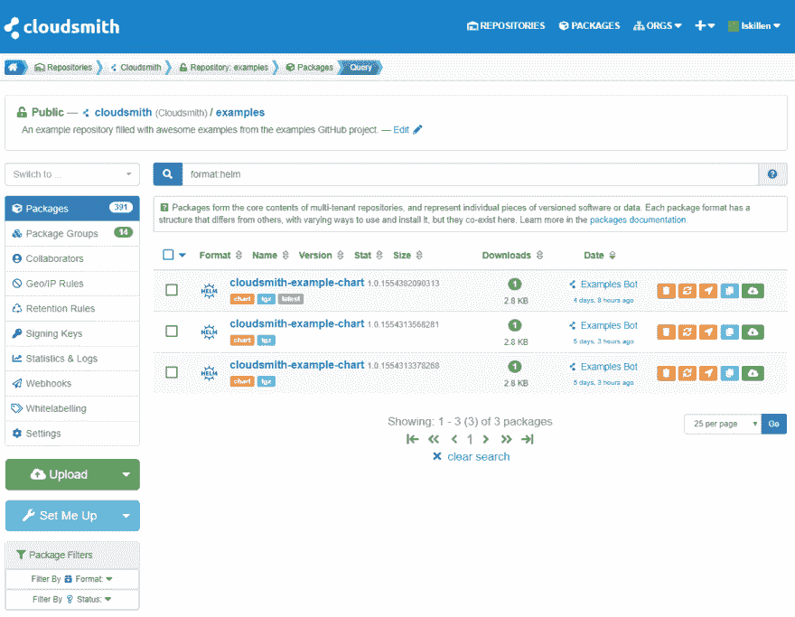

# Cloudsmith + Helm

> 原文：<https://dev.to/cloudsmith/cloudsmith-helm-m45>

TL；DR: Cloudsmith 提供公共和私有的舵库托管，以超快速和安全的方式交付您的舵图；与 Kubernetes (k8s)生态系统的终极整合。

## 圣盔——什么东西？

Kubernetes 已经迅速成为全世界开发和运营团队使用的最流行的容器编排平台之一。它是谷歌在 2014 年开源的，建立在多年学习在搜索巨头内部大规模部署容器的基础上。

尽管 Kubernetes 迅速流行，但部署和管理应用程序可能是一项复杂而艰巨的任务，通常需要操作员为正在部署的系统的各个部分编写和配置多个相互依赖的配置文件。随着我们的应用程序变得越来越复杂，越来越分散，管理它们的难度也越来越大。

Helm 最初由 Deis(后被微软收购)创建，是 Kubernetes 的一个包管理器，允许开发和运营团队轻松管理和部署这些日益复杂的云原生应用程序到他们的 Kubernetes 集群。Helm 允许您管理 Kubernetes 集群上的应用程序，就像使用`apt`或`yum`管理 Linux 服务器上的应用程序一样。

Helm 的工作方式是打包一组 YAML 定义以及必要的配置，以便以可重复的方式快速支持应用程序的所有组件。单个图表可以是简单的，也可以是复杂的，从单个容器到完整的分布式应用程序。Helm 将这些应用程序定义与用户提供的配置相结合，允许在需要的地方简单地覆盖配置，允许用户专注于软件交付，而不是配置他们需要运行的每个应用程序的细节。

Helm 软件包被称为“图表”,存储在“图表库”中。默认情况下，Helm 与“稳定的”图表库捆绑在一起，由 Google 免费托管。大多数公共图表都托管在这里，主要由供应商提供，他们将自己的软件打包供他人使用。

另请参见:

*   掌舵文档:[https://helm.sh/docs](https://helm.sh/docs)
*   kuble documentation:[https://kubrites . io/docs/](https://kubernetes.io/docs/)

## 头盔入门

使用 Helm 的主要要求是 Kubernetes 安装正常。Kubernetes 的安装超出了本文的范围，但是你可以从本地开始安装 [minikube](https://kubernetes.io/docs/setup/minikube/) 。

一旦[安装完毕](https://helm.sh/docs/using_helm/#installing-helm)，你就可以在你的集群上初始化头盔:

```
$ helm init 
```

这将安装 Helm 的服务器端组件 [Tiller](https://helm.sh/docs/glossary/#tiller) ，负责与 Kubernetes API 交互和管理状态。

然后，您可以根据需要运行其他舵命令。要查看所有可用的图表，您可以使用以下命令:

```
$ helm search
NAME                                            CHART VERSION   APP VERSION                     DESCRIPTION
stable/acs-engine-autoscaler                    2.2.2           2.1.1                           DEPRECATED Scales worker nodes within agent pools
stable/aerospike                                0.2.3           v4.5.0.5                        A Helm chart for Aerospike in Kubernetes
stable/airflow                                  2.4.0           1.10.0                          Airflow is a platform to programmatically author, schedul...
stable/ambassador                               2.0.1           0.52.0                          A Helm chart for Datawire Ambassador
stable/anchore-engine                           0.12.1          0.3.3                           Anchore container analysis and policy evaluation engine s...
stable/apm-server                               1.0.0           6.6.2                           The server receives data from the Elastic APM agents and ...
stable/ark                                      4.1.0           0.10.1                          A Helm chart for ark
... 
```

您应该会看到内置“稳定”存储库的完整列表，其中包含所有受支持的公共图表。您也可以从`helm` CLI 安装任何图表:

```
$ helm install stable/dokuwiki 
```

这指示 Tiller 从稳定的存储库中取出打包的图表，呈现其中包含的所有模板，并将它们应用到正在运行的集群。您可以使用常规的 Kubernetes CLI 工具检查应用程序的状态:

```
$ kubectl get pods
NAME                                                 READY     STATUS    RESTARTS   AGE
lopsided-cheetah-dokuwiki-85c96f777d-gskjn           1/1       Running   0          13d

$ kubectl get deployments
NAME                                 DESIRED   CURRENT   UP-TO-DATE   AVAILABLE   AGE
lopsided-cheetah-dokuwiki            1         1         1            1           13d 
```

或者使用`helm` CLI:
检查图表安装本身的状态

```
$ helm list
NAME                    REVISION        UPDATED                         STATUS          CHART                           APP VERSION             NAMESPACE
lopsided-cheetah        1               Mon Mar 25 17:16:56 2019        DEPLOYED        dokuwiki-4.2.0                  0.20180422.201901061035 default 
```

## 用 Cloudsmith 管理舵

如果只使用公共图表安装第三方应用，那么以上说明在大多数情况下足以入门。但是如果你想安装没有公共图表的软件，无论是你自己的还是第三方的，你可以创建自己的图表，并使用 Cloudsmith 托管它。

如果您正在创建自己的图表，您可以使用 Helm's starter 模板之一来为您快速搭建目录:

```
$ helm create my-chart-name 
```

这将创建一个包含构建图表所需的所有文件和文件夹的`my-chart-name`文件夹。您可以根据应用程序的需要调整模板，[图表模板开发人员指南](https://helm.sh/docs/chart_template_guide/)在构建您自己的图表时是一个非常有用的资源。

调整完模板后，您可以使用 CLI 创建一个图表包:

```
$ helm package my-chart-name 
```

成功打包图表并保存到:/home/me/my-chart-name-1.0 . tgz
构建完成后，您可以将图表推送到 Cloudsmith。首先，确保您已经安装了 Cloudsmith CLI 并配置了身份验证:

```
$ pip install cloudsmith-cli
$ export CLOUDSMITH_API_KEY=xxxxx 
```

然后，使用 Cloudsmith CLI 推送包:

```
$ cloudsmith push helm my-org/my-repo my-chart-name-1.0.tgz
Checking helm package upload parameters ... OK
Checking my-chart-name-1.0.tgz file upload parameters ... OK
Requesting file upload for my-chart-name-1.0.tgz ... OK
Creating a new helm package ... OK
Created: my-org/my-repo/my-chart-name-10tgz (...)

Synchronising my-chart-name-10tgz:  [####################################]  100%  Sync Completed / Fully Synchronised
Package synchronised successfully! 
```

推送后，您可以配置 Helm 从您的 Cloudsmith 资源库安装软件包:

```
$ helm repo add cloudsmith 'https://dl.cloudsmith.io/TOKEN/my-org/my-repo/helm/charts/'
$ helm repo update 
```

然后将您的应用程序安装到 Kubernetes:

```
$ helm install cloudsmith/my-chart-name 
```

[](https://res.cloudinary.com/practicaldev/image/fetch/s--vKG_p8pw--/c_limit%2Cf_auto%2Cfl_progressive%2Cq_auto%2Cw_880/https://thepracticaldev.s3.amazonaws.com/i/t1ybu8e24dh0wtvjgebn.PNG)

将舵图推送到 Cloudsmith 后，您会在存储库中看到类似这样的内容。

## 结论

Helm 是一个强大的工具，有助于管理在 Kubernetes 上部署和运行云原生应用程序的不断增长的复杂性。像其他包管理器一样，Helm 提供了一套健壮的工具，用于在其目标平台 Kubernetes 上安装、配置和管理应用程序。

Cloudsmith 为所有计划提供了功能全面的 Helm 存储库，无论您是为开源项目托管公共图表，还是为公司内部应用程序托管私有图表，都非常灵活。

您可以找到更多特定于上下文的信息，包括每个 Cloudsmith 存储库中详细的设置和集成说明。你可以在我们的[公共范例库](https://cloudsmith.io/~cloudsmith/repos/examples/setup/#formats-helm)中看到这个文档的例子。

为什么要等？立即在 [Cloudsmith](https://cloudsmith.io/l/helm-repository) 获得您的公共和私人 Helm 存储库。