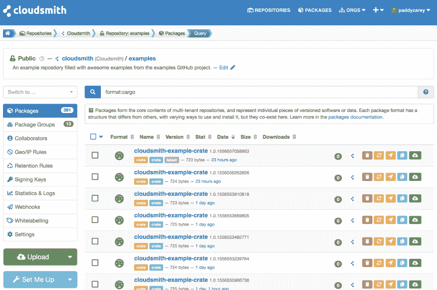

# Cloudsmith + Rust =世界上第一个私人货物登记服务

> 原文：<https://dev.to/cloudsmith/cloudsmith-rust-the-world-s-first-private-cargo-registry-service-2p18>

## 什么是铁锈？什么是货物？板条箱是什么？

Rust lang 或 Rust 是一种系统编程语言，由 Mozilla research 设计，旨在成为现有系统编程语言(如 C 和 C++)的更安全的替代语言，但仍然一样快。Rust 最初是由 Mozilla 工程师 Graydon Hoare 作为个人的副业项目启动的，但该公司很快就认可了它的承诺，并于 2009 年开始赞助该项目。

作为 Servo 项目的一部分，Rust 很快成为 Mozilla 努力提高浏览器技术性能和可靠性的关键部分。从那以后，Rust 的受欢迎程度和吸引力逐年增加，在过去的四年里，它在 Stack Overflow 的开发者调查中获得了令人垂涎的“最受欢迎的编程语言”的头名。

虽然 Rust 可能是最有名的低级系统语言，但同样的属性使它在接近金属的情况下工作也很有吸引力，这也使它在许多其他用例中很有吸引力。Rust 的内存安全、所有权语义、性能和全面的类型系统(等等)结合起来，使 Rust 成为许多工程领域中一个非常引人注目的选择。

无论您是在为嵌入式片上系统(SoC)、操作系统、网络浏览器布局引擎、网络应用程序、包管理服务(heh)编写设备驱动程序，还是为 WebAssembly 生态系统中使用的库编写设备驱动程序，Rust 都可以满足您的需求。

早期，Rust 社区意识到现代编程语言要想成功，它需要现代工具来配合。为此，Rust 社区中的各个团队都专注于工具开发，因此 Rust 现在被广泛认为在构建和包管理等领域拥有一流的工具；这是我们(Cloudsmith)认可、尊重和崇拜的东西。

因此 Rust 有自己的包管理器，叫做 [Cargo](https://github.com/rust-lang/cargo) 。Cargo 是构建、打包和配置 Rust 项目的一体化前端。它可以构建和运行您的代码(为`rustc`提供一个开发人员友好的接口)，并管理解析和获取任何所需的依赖项(在 Rust world 中也称为“crates”)。

Cargo 可以使用类似于`cargo install library`的命令，将远程注册表中的依赖项安装到本地项目中进行构建。直到 2019 年 4 月，你真正拥有的唯一选择是在 [crates.io](https://crates.io/) 的官方公共注册。Crates.io 由 Rust 团队维护，是 Rust 生态系统的默认公共注册表。随着 Rust 1.34 的[发布，Cargo 现在正式支持使用除 crates.io 之外的注册中心，这使得运行用于托管私有或内部 crates 的替代注册中心成为可能。](https://blog.rust-lang.org/2019/04/11/Rust-1.34.0.html)

运行/使用自己的注册中心有几个同样不可思议的原因:

*   在内部开发货物包，并私下与其他团队分享。
*   在组织的管道中分发和部署您自己的货物包。
*   将货物包装作为出售的软件进行分发(即可能是商业性的)。
*   对公共货物包装进行修改，但不公开重新发布。
*   镜像公共货物包裹，隔离不受控制的注册事件。
*   捕捉特定版本/发行版的依赖关系的确切状态。
*   控制(白名单/黑名单)贵组织允许的确切货物包裹。
*   跟踪您拥有/使用的货物包装的确切版本/发布。

因此，如果您对托管您自己的私人或内部板条箱带来的可能性感兴趣，那么这对您来说是一个难以置信的好消息:Cloudsmith 很自豪地提供世界上第一个商业可用的公共和[私人货物注册托管](https://cloudsmith.io/l/cargo-registry/)，以超快速和安全的方式交付您的 Rust 包，以及我们提供的所有常见企业级功能。

另请参见:

*   铁锈:[https://www.rust-lang.org](https://www.rust-lang.org)
*   Rust 编程语言:[https://doc.rust-lang.org/book/index.html](https://doc.rust-lang.org/book/index.html)
*   货物簿:[https://doc.rust-lang.org/cargo/index.html](https://doc.rust-lang.org/cargo/index.html)

## 在 Cloudsmith 设立私人货物登记处

Cloudsmith 和 Cargo 入门再简单不过了。首先，你需要一个 [Cloudsmith 账户](https://cloudsmith.io/user/signup/)和一个可以上传板条箱的仓库。其次，你需要确保你运行的是 Rust 1.34 或更高版本。

如果您需要安装 Rust，您可以使用 Rust toolchain 安装程序 [rustup](https://rustup.rs/) 。Rust 在大多数常用的开发平台上都有。

你可以像这样检查你当前安装的 Rust 和 Cargo 版本:

```
$ rustc --version
rustc 1.34.1 (fc50f328b 2019-04-24)
$ cargo --version
cargo 1.34.0 (6789d8a0a 2019-04-01) 
```

如果你看到类似上面的东西，你就准备好了！

## 将货物板条箱发布到 Cloudsmith

出于演示的目的，我们将使用由`cargo init`创建的最小板条箱。你可以这样初始化你的新货箱:

```
$ cargo init my-crate
     Created binary (application) package 
```

如果你看一下新箱子里面，你会看到几个文件:

```
$ tree my-crate/
my-crate/
├── Cargo.toml
└── src
    └── main.rs

1 directory, 2 files 
```

`main.rs`包含一个简单的“Hello World”程序，`Cargo.toml`包含您的机箱的所有配置和设置数据。出于我们的目的，我们可以让这两个文件保持原样。

我们可以使用`cargo`来构建我们的板条箱，并准备将其上传到 Cloudsmith:

```
$ cd my-crate/
$ cargo package --allow-dirty
warning: manifest has no description, license, license-file, documentation, homepage or repository.
See <http://doc.crates.io/manifest.html#package-metadata> for more info.
   Packaging my-crate v0.1.0 (/Users/cloudsmith/my-crate)
   Verifying my-crate v0.1.0 (/Users/cloudsmith/my-crate)
   Compiling my-crate v0.1.0 (/Users/cloudsmith/my-crate/target/package/my-crate-0.1.0)
    Finished dev [unoptimized + debuginfo] target(s) in 1.45s 
```

注意:我们在`cargo package`命令中使用`--allow-dirty`,因为我们还没有将新的板条箱提交给 git。在正常情况下，您只需调用货物包装，无需额外的标志。

默认情况下，Cargo 会在`target/package/`目录下吐出你打包好的板条箱。

```
$ ls -l target/package/
total 4
drwxr-xr-x 6 cloudsmith cloudsmith 192 Apr 30 16:09 my-crate-0.1.0
-rw-r--r-- 1 cloudsmith cloudsmith 673 Apr 30 16:09 my-crate-0.1.0.crate 
```

一旦建成，您可以使用 [Cloudsmith CLI](https://pypi.org/project/cloudsmith-cli/) 将板条箱推送到 Cloudsmith。我们还不支持用`cargo publish`推板条箱，但是我们会在未来的版本中增加支持(如果你需要，请告诉我们)。现在，使用 CLI。

首先，确保您已经安装了 Cloudsmith CLI 并配置了身份验证:

```
$ pip install cloudsmith-cli
$ export CLOUDSMITH_API_KEY=xxxxx 
```

然后，使用 CLI 来推动板条箱，其操作类似于`cargo publish`，但特定于 Cloudsmith:

```
$ cloudsmith push cargo my-org/my-repo target/package/my-crate-0.1.0.crate

Checking cargo package upload parameters ... OK
Checking my-crate-0.1.0.crate file upload parameters ... OK
Requesting file upload for my-crate-0.1.0.crate ... OK
Creating a new cargo package ... OK
Created: my-org/my-repo/my-crate-010crate (ffb4n20QxSYM)

Synchronising my-crate-010crate:  [####################################]  100%  Sync Completed / Fully Synchronised
Package synchronised successfully! 
```

您的存储库现在应该包含上传的板条箱。其中一个例子是我们的官方 Cloudsmith 示例库(这是我们上传示例的地方)，如下所示:

[](https://res.cloudinary.com/practicaldev/image/fetch/s--lX5xupkJ--/c_limit%2Cf_auto%2Cfl_progressive%2Cq_auto%2Cw_880/https://thepracticaldev.s3.amazonaws.com/i/drhf84gw0evilox0sv7l.png)

推动后，您的板条箱就可以安装货物了。

## 从 Cloudsmith 安装货物板条箱

首先，我们需要告诉 Cargo 如何访问注册表。为此，您需要在您的`.cargo/configfile`中添加以下条目(用授权令牌替换`TOKEN`，这是我们支持的一种只读身份验证令牌):

```
[registries]
cloudsmith = { index = "https://dl.cloudsmith.io/TOKEN/my-org/my-repo/cargo/index.git" } 
```

然后安装板条箱:

```
$ cargo install my-crate --registry cloudsmith
    Updating `https://dl.cloudsmith.io/TOKEN/my-org/my-repo/cargo/index.git` index
  Downloaded my-crate v0.1.0 (registry `https://dl.cloudsmith.io/TOKEN/my-org/my-repo/cargo/index.git`)
  Downloaded 1 crates (673 B) in 0.54s
  Installing my-crate v0.1.0 (registry `https://dl.cloudsmith.io/TOKEN/my-org/my-repo/cargo/index.git`)
   Compiling my-crate v0.1.0 (registry `https://dl.cloudsmith.io/TOKEN/my-org/my-repo/cargo/index.git`)
    Finished release [optimized] target(s) in 2.60s
  Installing /Users/cloudsmith/.cargo/bin/my-crate 
```

假设`~/.cargo/bin/my-crate`在你的`$PATH`上，那么你应该可以运行安装的程序:

```
$ my-crate
Hello, world! 
```

真的就这么简单，现在你已经从 Cloudsmith 上你自己的私人货物登记处私下采购了一箱货物。干得好！

## 结论

Rust 是一种令人兴奋的新编程语言，它有许多有趣的特性，非常适合在各种场景中使用。Cargo 提供了一套强大的工具，用于安装、配置和管理 Rust 项目的依赖项。

Cloudsmith 为所有计划提供了功能全面的货物注册，无论您是为公共或开源项目托管公共板条箱，还是为您公司的内部需求托管私人板条箱，都足够灵活。我们非常自豪能够通过首次(非官方)实现公共和私人货物注册来支持 Rust 生态系统。

您可以找到更多特定于上下文的信息，包括每个 Cloudsmith 存储库中详细的设置和集成说明。你可以在我们的[公共范例库](https://cloudsmith.io/~cloudsmith/repos/examples/setup/#formats-cargo)中看到这个文档的例子。

为什么要等？立即在 [Cloudsmith](https://cloudsmith.io/l/cargo-repository) 获得您的公共和私人货物注册。