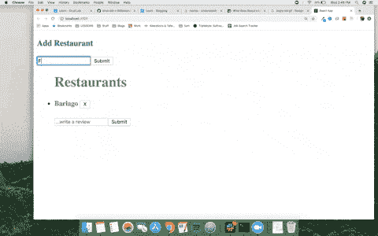
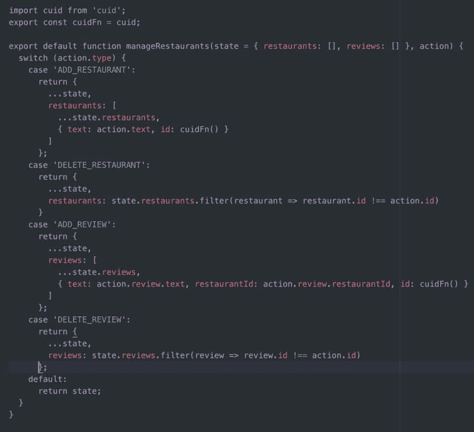
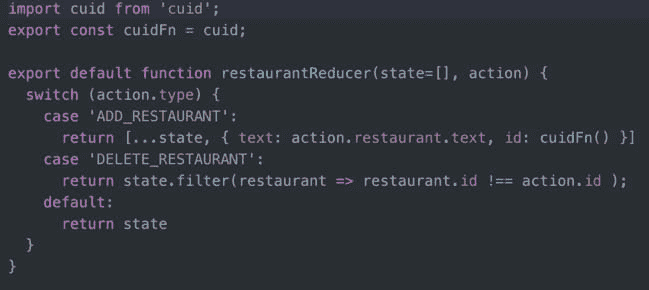
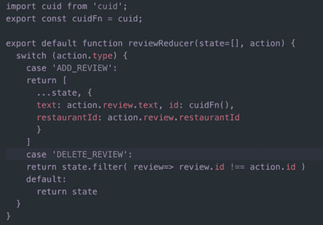
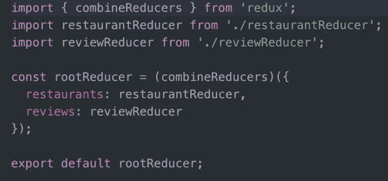

# 组合减速器

> 原文：<https://dev.to/kritirai/combining-reducers-9la>

我最近在[实验室](https://github.com/learn-co-students/crud-lab-v-000)工作，构建一个类似 [Yelp](https://www.yelp.com/) 的应用程序，使用 [React](https://reactjs.org/) 和 [Redux](https://redux.js.org/) 来添加和删除餐馆及其评论。

[](https://i.giphy.com/media/g07ZDk5uiij7mLoKvB/giphy.gif)

当我在实验室工作时，我发现我的 reducer 函数`manageRestaurants`很密集。因此，我很自然地试图将我的巨大的 reducer 函数分成两个子 reducer 函数，这样每个函数只负责一个资源的状态。使用[组合缩减器](https://github.com/reduxjs/redux/blob/master/docs/api/combineReducers.md)，我然后将子缩减器组合在一个父缩减器函数`rootReducer`中，这是传递给[商店](https://redux.js.org/api/store)的内容。这不仅使我的代码更干净，也更容易调试。

最后，我让应用程序在浏览器中工作，正如实验室所希望的那样，在我可以松一口气之前，我发现测试失败了。实验室只是希望我们创建一个 reducer 函数，并将所有 reducer 逻辑放在那里。啊！

[](https://i.giphy.com/media/c453ypM8rqm1a/giphy.gif)

不管怎样，我决定创建一个单独的[分支](https://github.com/kriti-rai/crud-lab-v-000/tree/combine-reducers)，在那里推出我干净而令人惊叹的代码，并恢复我的`master`分支，以通过测试。然而，在这样做的过程中，我意识到现在我对`combineReducers`是如何工作的有了更好的理解。另外，现在我已经看到了这两个场景，我可以利用这些知识和经验来决定什么时候我可以使用`combineReducers`。如果您只是使用一两个资源，也许您不太需要使用这个助手功能。然而，想象一个拥有多个资源的大型应用程序，很快你就会发现自己被许多 [switch](https://developer.mozilla.org/en-US/docs/Web/JavaScript/Reference/Statements/switch) 语句和一个拥有多个键值对的庞大状态所困扰。

## 用组合归纳器重构

先不说这些，让我们先来看看我的巨型减压器`manageRestaurants`,它维持着餐馆和评论的状态。

[](https://res.cloudinary.com/practicaldev/image/fetch/s--126EbgOF--/c_limit%2Cf_auto%2Cfl_progressive%2Cq_auto%2Cw_880/https://i.imgur.com/m8hAvrk.png%3F1)

现在，让我们把我们的巨型减速器分成两个子减速器函数，比如说`restaurantReducer`和`reviewReducer`。前者管理餐馆的状态，而后者管理评论的状态。

### 餐厅老板

[](https://res.cloudinary.com/practicaldev/image/fetch/s--THRc7gax--/c_limit%2Cf_auto%2Cfl_progressive%2Cq_auto%2Cw_880/https://i.imgur.com/WciVwon.png%3F1)

### 查看减速器

[](https://res.cloudinary.com/practicaldev/image/fetch/s--3HVNhQuR--/c_limit%2Cf_auto%2Cfl_progressive%2Cq_auto%2Cw_880/https://i.imgur.com/2brKdeA.png%3F1)

现在，这里是我们的`rootReducer`，在这里我们将调用我们的孩子 reducer 函数。注意，我们从`redux`进口了`combineReducers`。

### rootReducer

[](https://res.cloudinary.com/practicaldev/image/fetch/s--h5Q0dc5K--/c_limit%2Cf_auto%2Cfl_progressive%2Cq_auto%2Cw_880/https://i.imgur.com/nrx0Mr5.png%3F1)

这相当于写:

```
function rootReducer(state = {}, action) {
  return {
    restaurants: restaurantReducer(state.restaurants, action),
    reviews: reviewReducer(state.reviews, action),
  };
}; 
```

这基本上产生了与`manageRestaurants`相同的巨大的减速器功能，但是以一种更加抽象和清晰的方式。

## 结论

如果您的应用程序很大，并且有不止一两个资源，那么您最好将状态对象分割成多个片段，并使用一个单独的子 reducer 来操作状态的每个片段。然后可以使用`combineReducers`，一个由 *Redux* 借出的助手工具，在一个通常被命名为`rootReducer`的父 reducer 中，将状态片段组合起来。请记住，使用`combineReducer`可能不会有所帮助，如果你想知道引擎盖下发生了什么，因为它抽象了减速器被组合和一起工作的方式。因此，尝试在这两种情况下进行试验，以更好地理解减速器如何工作以及何时使用`combineReducers`。