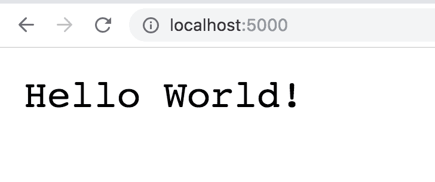
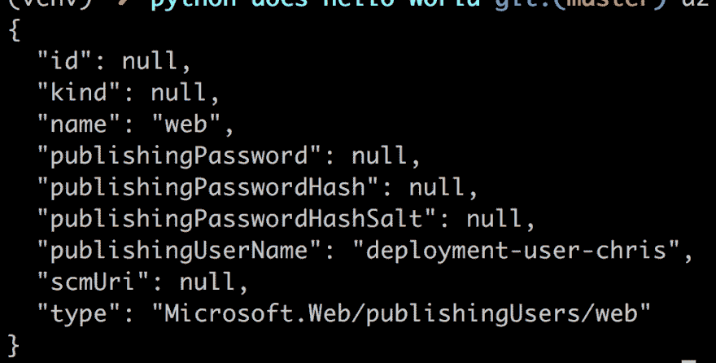
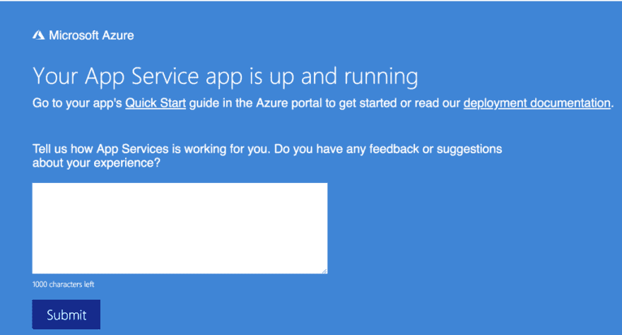
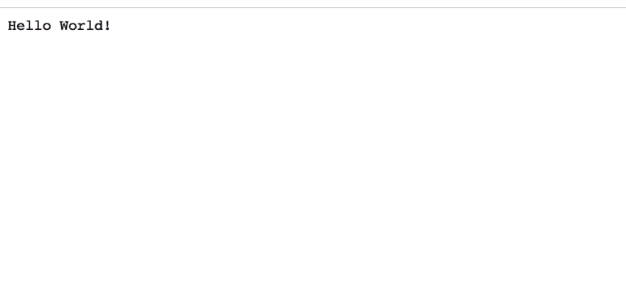
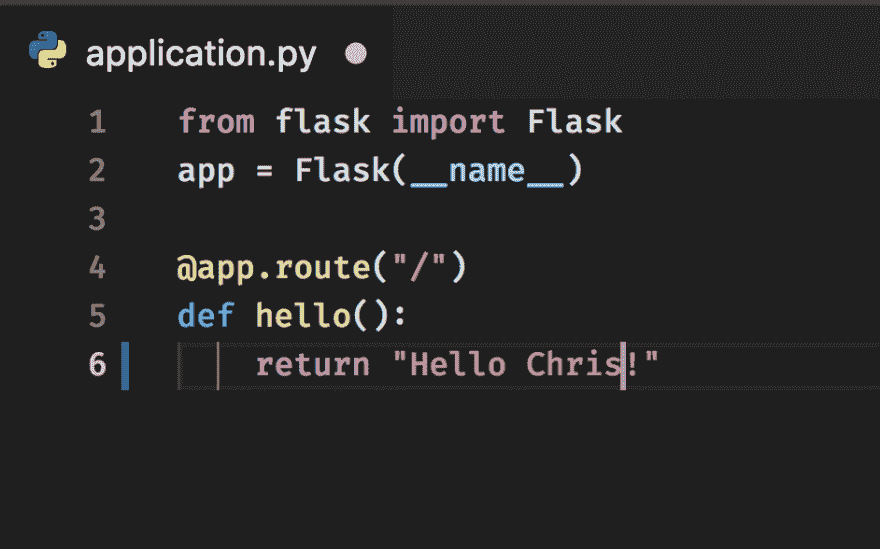
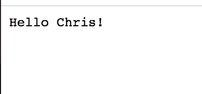

# 提交、推送、部署—微软 Azure 云中的 Git

> 原文：<https://dev.to/azure/commit-push-deploygit-in-the-microsoft-azure-cloud-297l>

### 提交、推送、部署——微软 Azure 云中的 Git

[](https://res.cloudinary.com/practicaldev/image/fetch/s--nyOQurAl--/c_limit%2Cf_auto%2Cfl_progressive%2Cq_auto%2Cw_880/https://cdn-images-1.medium.com/max/800/1%2AytQItLytgkJxIRChRrOF7A.jpeg)

在 [Twitter](https://twitter.com/chris_noring) 上关注我，很乐意接受您对主题或改进的建议/Chris

> 自从 Git 发布以来，我们就开始依赖它作为我们的默认版本控制工具，它已经成为事实上的标准，即使存在其他选择。Git 帮助我们管理我们的源代码，将它分成分支，甚至通过允许我们创建拉/合并请求，帮助我们与其他开发者在 GitHub 或 GitLab 等地方合作。如果当我们将应用程序迁移到云中时，Git 可以在那里帮助我们，这不是很好吗？

本文将涵盖以下内容:

*   **下载**一个示例应用程序，我们想重点了解使用 Git 的部署，所以我们将采用一些现成的代码
*   在本地运行应用程序只是为了确保它能工作，这是必须的，如果它能在本地工作，它至少有机会在云中工作
*   **配置一个部署用户**，这个部署用户是将 FTP 和本地 Git 部署到 web 应用程序所必需的
*   **创建一个资源组**，如果您需要一个新的逻辑分组来完成我们将要做的事情，
*   **创建一个服务计划**，我们将需要它来指定我们将如何为此收费，以及我们将创建什么样的容器
*   **创建 web 应用程序**，我们将需要运行一个命令来创建实际的 web 应用程序，我们需要在这里说明我们如何部署它，我们将选择 git deploy，更多信息请见下文
*   **访问**生成的网站，我们当然需要享受我们的劳动成果
*   **使用 git deploy 将源代码推送到站点**
*   **管理更新**，让我们了解如何更新我们的应用程序并推动变更，这种部署使用 Git 不是一次性的，我们可以随时更改代码并重新部署

### 为什么是云为什么是 Git？

如今，云几乎是开发者部署新应用的默认位置。原因有很多，比如它具有成本效益、可伸缩性、弹性，并且对安全性有一些很好的内置支持(尽管我们不能完全依赖云)。

Git 是一个我们很可能已经在使用的工具，当我们编码来管理我们的源代码时，尤其是当我们有许多开发人员维护相同的代码库时。将云计算和部署等技能添加到您的工具带上的最佳方式是使用您已经了解的技术。这就是，利用你已经知道的东西，加入一些云。希望你喜欢这篇文章:)

### 资源

在本文中，我们确实参考了一些文档页面，所以在这里，您可以了解更多:

*   [安装 Azure CLI](https://docs.microsoft.com/en-us/cli/azure/install-azure-cli?wt.mc_id=devto-blog-chnoring&view=azure-cli-latest) ，一切都需要 Azure CLI。Azure CLI 非常强大，可以让你在门户中执行几乎所有你能做的事情。
*   本地 Git 部署到 Azure 应用服务，这一页展示了如何使用 Git 将你的应用部署到 Azure，但也谈了一些关于 Azure DevOps build 的内容
*   Git 部署快速入门，这是一个比本文更快的版本。它的速度更快，因为它对资源组、应用服务计划使用了一些智能默认设置，并且它还使用了一种叫做 zip deploy 的东西，这是另一种类型的部署，而不是我们在这里描述的 git deploy

### 下载并运行一个示例应用程序

先来一个样例 app。最简单的方法是安装 Git(如果您还没有这样做的话),并从 GitHub 中获取示例项目:

```
git clone https://github.com/Azure-Samples/python-docs-hello-world cd python-docs-hello-world 
```

上面的应用程序是一个 Python 应用程序，使用库 Flask 为我们提供了一个 REST API。这个知识库给了我们什么？

```
application.py // this is where our application lives

requirements.txt // this is a list of libraries that needs to be installed for our app to work

.gitignore // just a file Git reads so it knows what files to NOT include when we push changes to the repo 
```

让我们来看看 application.py 以及它是如何为我们设置一些路线的:

```
// application.py

from flask import Flask

app = Flask(__name__)

@app.route("/")

def hello():

    return "Hello World!" 
```

上面的代码所做的是定义一个路由，它让方法 hello 处理提到的路由，并输出文本 Hello World，这是一个非常标准的短语，当你第一次使用新的编程语言或库时。

#### 本地运行 app

好了，现在我们对摆在我们面前的东西有了更多的了解。下一步是尝试在本地运行这个应用程序，然后再将它部署到云中。

要启动并运行 Python 应用程序，我们需要安装 Python 和它附带的依赖库。根据我们使用的操作系统(Windows、Linux 或 Mac ),相关说明会有所不同。如果你在 Mac 上，你已经安装了 Python。然而，您将需要软件包管理器 Pip，我们可以通过运行:
来获得它

```
sudo easy_install pip 
```

如果你是一个认真的 Python 开发者，那么看一下即将到来的链接是值得的。如果你不是，你只是为了 Git 和 Azure 而来，请随意跳过下面的段落。

> [http://flask.pocoo.org/docs/0.12/installation/#installation](http://flask.pocoo.org/docs/0.12/installation/#installation)

简而言之，它要求你安装一个叫做 virtualenv 的东西。它创建了不同的工作环境，所以如果你需要一个单独的 Python 版本或一些库的单独版本，这是前进的方向。

接下来我们需要做的是安装相关的库，我们通过在终端中调用下面的命令来完成这个任务:

```
sudo pip install -r requirements.txt 
```

快速浏览 requirements.txt 文件可以发现，我们有一些应用程序需要的依赖库。正如我们在下面看到的，这是我们的 API 框架 Flask 和一些支持库:

```
click==6.7
**Flask==1.0.2**
itsdangerous==0.24
Jinja2==2.10
MarkupSafe==1.0
Werkzeug==0.14.1% 
```

然后我们只需要设置环境变量 FLASK_APP 指向我们的启动文件 application.py，就像这样:

```
FLASK_APP=application.py 
```

接着是

```
python -m flask run 
```

这将在 [http://localhost:5000](http://localhost:5000) 启动我们的应用程序，如下所示:

[](https://res.cloudinary.com/practicaldev/image/fetch/s--xA45kZ28--/c_limit%2Cf_auto%2Cfl_progressive%2Cq_auto%2Cw_880/https://cdn-images-1.medium.com/max/728/1%2AhGlk3VUyGp1xeV-AwB_DRQ.png)

太好了，我们已经为下一步做好了准备，部署到云。

### 配置一个部署用户

要对 Azure 进行任何类型的部署，你都需要一个所谓的部署用户。这个部署用户需要有一个全球唯一的名称。

要创建我们的部署用户，我们需要使用命令 az webapp deployment。然后，我们需要在- user-name 标志后提供一个用户，在- password 标志后提供一个密码。密码长度至少需要 8 个字符，并且包含以下三个元素中的两个:字母、数字和符号。因此，我们需要运行的完整命令如下所示:

```
az webapp deployment user set --user-name <username> --password <password> 
```

下面是调用上述命令的一个例子。让我们将用户 deployment-user-chris 命名为 test1234。因此，我们的命令现在看起来像这样:

```
az webapp deployment user set --user-name deployment-user-chris --password test1234 
```

这应该会产生如下所示的输出:

[](https://res.cloudinary.com/practicaldev/image/fetch/s--FSeec8Qa--/c_limit%2Cf_auto%2Cfl_progressive%2Cq_auto%2Cw_880/https://cdn-images-1.medium.com/max/998/0%2AiucjsA0nGR-xCAQi.png)

上面的输出意味着我们的命令成功了，我们可以继续进行下一步。

### 创建资源组

资源组是一个逻辑分组，您可以将所有的东西放在其中，如数据库、服务计划、应用程序等等，我们几乎做任何事情都需要一个资源组。

您可以使用一个现有的资源组，也可以创建一个新的资源组，在这种情况下，您可以键入以下命令:

```
az group create \ 
--name [your name for a resource group] \ 
--location westeurope 
```

### 创建服务计划

Azure 中的应用服务计划为应用的运行定义了一组计算资源。这相当于更传统的 Web 托管中的服务场。服务计划附带一个定价层。定价层决定您获得的应用服务功能以及您为计划支付的费用。这里还有很多需要了解的，感兴趣的读者可以看看下面的[链接](https://docs.microsoft.com/en-us/azure/app-service/overview-hosting-plans?wt.mc_id=devto-blog-chnoring)来更详细地了解它是如何工作的。

对于本文来说，理解所有运行在 AppService 上的应用程序都需要一个服务计划作为先决条件就足够了。

创建服务计划的完整命令如下:

```
az appservice plan create --name [your name for an app service plan] --resource-group [you name for a resource group] --sku B1 --is-linux 
```

值 B1 意味着我们有一个基本的服务计划(相对便宜，所以你可以稍微测试一下)，而- is-linux 意味着我们将得到一个 linux 容器

我们使用上面的 appservice 命令和子命令 plan 来创建我们的服务计划。这也应该给我们一个 JSON 响应，返回 provisioningState 键的值为 successful

### 创建一个 web app

下面是创建 web 应用程序的命令。我们需要陈述资源组、定价计划、应用程序的名称、Python 的版本以及我们将如何部署它，即 git deploy:

```
az webapp create --resource-group [your name for a resource group] --plan [your name for a service plan] --name [your name for an app name] --runtime "PYTHON|3.7" --deployment-local-git 
```

对上述命令的一个评论是，应用程序名称需要是*全局唯一的*。

在 JSON 对此的回应中，我们寻找两条有趣的信息:

*   git 储存库的名称，查找名为 deploymentLocalGitUrl 的键。
*   公共 URL，查找名为 defaultHostName 的键

您所完成的是一个启用了 git 部署的空 web 应用程序。空的原因是因为我们还没有放任何代码进去。

### 访问网站

尽管我们还没有把任何代码放到我们的网站上，但是它仍然包含了一些我们可以访问的默认登陆页面。若要访问该网站，请转到 http://.azurewebsites.net

这将向您显示一个默认站点，如下所示:

[](https://res.cloudinary.com/practicaldev/image/fetch/s--otgLzdHb--/c_limit%2Cf_auto%2Cfl_progressive%2Cq_auto%2Cw_880/https://cdn-images-1.medium.com/max/1024/0%2AirQl4nvIsOjsqbh_.png)

这似乎行得通，太好了！好了，我们已经完成了大部分繁重的工作，现在是时候卷起袖子，打开指关节了，因为我们要让我们的网站变得生动起来。

[](https://res.cloudinary.com/practicaldev/image/fetch/s--bcbPyllH--/c_limit%2Cf_auto%2Cfl_progressive%2Cq_66%2Cw_880/https://cdn-images-1.medium.com/max/250/1%2AZmnH_QQQWKqELXLBluzexQ.gif)

### 将代码推送到网站

好了，最后一步是正确设置 git deploy 并推送代码，然后查看站点是否用您的代码进行了更新。我们已经通过键入以下命令设置了 git 部署:

```
git remote add azure <deploymentLocalGitUrl-from-create-step> 
```

现在是时候输入代码了，所以我们只需输入:

```
git push azure master 
```

这将提示您输入部署用户密码。只需键入它，您的部署正在进行中。

这将需要一点时间，所以去喝一杯热饮料:)它应该最终转储出一长串日志，以下列结尾:

[](https://res.cloudinary.com/practicaldev/image/fetch/s--GyB_k4mm--/c_limit%2Cf_auto%2Cfl_progressive%2Cq_auto%2Cw_880/https://cdn-images-1.medium.com/max/1024/0%2AWFwnNIgk3_tCPE1G.png)

这意味着您的应用已成功部署，现在您可以返回到您的应用 URL，您应该会看到以下内容:

[](https://res.cloudinary.com/practicaldev/image/fetch/s--4pKPjL3b--/c_limit%2Cf_auto%2Cfl_progressive%2Cq_auto%2Cw_880/https://cdn-images-1.medium.com/max/1024/0%2AZVmoqpTpca0mK-Xq.png)

现在，就是这么做的。现在，庆祝…:)

[](https://res.cloudinary.com/practicaldev/image/fetch/s--hXyzSWCG--/c_limit%2Cf_auto%2Cfl_progressive%2Cq_66%2Cw_880/https://cdn-images-1.medium.com/max/320/1%2AUcSn9pjTjMm4vRuiCYVxvg.gif)

### 管理变更和重新部署

这很容易，因为我们已经激活了 git deploy。让我们执行以下操作:

1.  对文件进行一些更改
2.  提交更改
3.  将代码发送到我们的远程分支机构

### 做出一些改变

让我们进入 application.py 并将其更改为:

[](https://res.cloudinary.com/practicaldev/image/fetch/s--e9SLNy51--/c_limit%2Cf_auto%2Cfl_progressive%2Cq_auto%2Cw_880/https://cdn-images-1.medium.com/max/942/0%2AeJQgObVAIT67iOEk.png)

### 提交更改

我们像在 git 中一样提交:

```
git commit -am "changed text" 
```

### 将代码推送到我们的遥控器

现在，让我们通过键入:
来推送至我们的远程分支

```
git push azure master 
```

这应该会生成一堆日志条目，并以部署成功结束。让我们通过访问我们的应用程序 url 来验证这一点:

[](https://res.cloudinary.com/practicaldev/image/fetch/s--fOCANRFT--/c_limit%2Cf_auto%2Cfl_progressive%2Cq_auto%2Cw_880/https://cdn-images-1.medium.com/max/398/0%2A0YRWRmr7AB_Uaonk.png)

那看起来不错:)

### 总结

我们已经了解了如何将应用部署到 Azure，甚至更新和重新部署。一篇文章就这么多。让我们简单看一下我们为此采取的步骤:

*   **下载了**一个样本 app。显然，在真实的场景中，我们会创建自己的代码，而不是像在这种情况下使用 Python 和 Flask 的示例应用程序
*   **创建了一个部署用户**,这是我们的部署所需要的。这也让我们选择部署类型，我们选择的是 git 部署。
*   **创建了一个资源组**。这为我们的应用程序创建了一个逻辑组。这是一个组，我们可以重用其他事情，如添加数据库或应用程序可能需要存在的其他东西。
*   **创建了服务计划**。这意味着我们决定如何为此付费，以及我们希望应用程序在什么样的容器中运行。
*   **创建网站本身**，或者更确切地说，是一个我们的应用程序可以生存的占位符。
*   使用 git 将我们的代码推送到新创建的网站。我们还展示了如何使用 git 来更新我们的网站和*重新部署*。

这教会了我们使用 Azure 开发 web 应用程序的基础知识，并为我们未来的冒险做好了准备。敬请关注云中的更多乐趣:)

> 最后，从这篇文章中你需要记住的几乎所有东西就是使用 Git，然后推送，你已经成功地实现了云计算…

[](https://res.cloudinary.com/practicaldev/image/fetch/s--8A1wXX8c--/c_limit%2Cf_auto%2Cfl_progressive%2Cq_66%2Cw_880/https://cdn-images-1.medium.com/max/500/1%2ADjBoEGqmtEhn-GePnMb3fQ.gif)

* * *