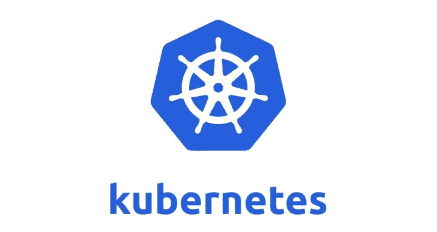

# 跨云提供商比较 Kubernetes、AWS、Azure)

> 原文：<https://dev.to/bnevilleoneill/comparing-kubernetes-across-cloud-providers-gcp-aws-azure-3lc2>

### 概述

在本文中，当决定在哪里运行 Kubernetes 时，我将分解所有相关的关注点。显然，这假设您已经决定 Kubernetes 是正确的选择。

我将描述主要云提供商的主要特性和功能，并介绍我认为选择目标平台(您自己的本地数据中心、虚拟服务提供商或流行的云平台之一)的一些清晰标准。

如果你需要更多关于 Kubernetes 的信息，请随时查阅我的书[掌握 Kubernetes 第二版](https://www.packtpub.com/application-development/mastering-kubernetes-second-edition)。

### 要云还是不要云？

Kubernetes 是如此模块化、灵活和可扩展，以至于它可以部署在第三方数据中心、任何流行的云提供商，甚至跨多个云提供商。怎么办？怎么办？

答案当然是“视情况而定”以下是几个场景:

1.  您可以在本地或第三方数据中心运行您的系统。您在定制基础架构上投入了大量时间、金钱和培训。自有基础架构的挑战变得越来越沉重
2.  您在一个云提供商上运行您的非 Kubernetes 系统。你想从 Kubernetes 的善良中获益，并向你的朋友吹嘘你有多酷。他们会印象深刻的

您会注意到，在这两个场景中，我都没有提到容器。如果你已经集装箱化了——对你有好处。如果没有，就当是入场费吧。

1.  **本地或第三方数据中心**

您可能有非常充分的理由在您严密控制的环境中运行(安全性、法规、合规性、性能、成本)。如果是这种情况，云提供商可能会失败。但是，你仍然可以通过自己运营来获得 Kubernetes 的所有好处。因为您已经在管理底层基础架构，所以您拥有管理底层基础架构的专业知识、技能和经验。

但是，如果您选择投资您的本地基础架构，或者您部署在多个虚拟服务提供商之间，只是因为您在云成为企业的可靠解决方案之前就开始了，那么情况就不同了。您有机会在一个复杂的镜头中升级一切…切换到云中的托管基础架构，将您的系统打包到容器中，并使用 Kubernetes 协调它们！

**2。你已经在云端了**

在场景#2 中，选择运行由云提供商管理的 Kubernetes 可能是显而易见的。你已经在云端运行了。Kubernetes 让您有机会用一种流畅的体验(每三个月 Kubernetes 发布另一个版本时，它就会变得越来越好)来取代您必须构建、集成和维护的许多管理层、监控层和安全性层。

事实上，有相当多的云提供商支持 Kubernetes，但我在这里将重点放在三大巨头:谷歌的 GKE，微软的 AKS 和亚马逊的 EKS。

### 谷歌 GKE (Google Kubernetes 引擎)

当然，Kubernetes 来自谷歌。GKE 是由谷歌管理的 Kubernetes。Google SREs 将为您管理 Kubernetes 的控制面板，您可以获得自动升级。由于谷歌对 Kubernetes 有如此大的影响力，并且它从第一天起就将其用作谷歌云平台的容器编排解决方案，如果它没有最佳的集成，那将是非常奇怪的。

同样，你可以相信 GKE 是最新的。与其他云提供商相比，GKE 对 Kubernetes 新特性和功能的测试要多得多。在 GKE，你不必为 Kubernetes 控制飞机付费。谷歌将覆盖你，你只需支付工人节点。您还可以获得 GCR (Goole Container Registry)，通过 Stackdriver 日志记录和 Stackdriver 监控集成中央日志记录和监控，如果您有兴趣与 CI/CD 管道进行更紧密的集成，您可以使用 Google Code Build。

与其他云提供商相比，谷歌网络被认为是顶级的，你也可以从中受益。如果您需要运行能够利用 GPU 的高性能工作负载，那么 GKE 现在就有测试版支持。

GKE 还有其他一些巧妙的技巧。例如，它利用通用的 Kubernetes 概念，如服务和入口，对负载平衡进行细粒度控制。如果你的 Kubernetes 服务是负载均衡器类型，GKE 将通过一个普通的 L4 (TCP)负载均衡器公开它。但是，如果您在服务之前创建一个 Ingres 对象，那么 GKE 将创建一个 L7 负载平衡器，它能够为您完成 SSL 终止，如果您正确地对其进行注释，甚至允许 gRPC 流量。

Kubernetes 本身是平台不可知的。*理论上*，你可以轻松地从任何一个云平台切换到另一个平台，也可以在你自己的基础设施上运行。*在实践中*，当您选择平台提供商时，您通常希望利用并受益于他们的特定服务，这将需要一些工作来迁移到不同的提供商或本地。

[GKE 本地](https://cloud.google.com/gke-on-prem/)提供工具、集成和访问来帮助统一体验，并将本地集群视为在云中运行。它不是完全透明的(也不应该是)，但它有所帮助。

### 微软 Azure AKS (Azure Kubernetes 服务)

微软 Azure 最初有一个名为 ACS 的解决方案，支持 Apache Mesos、Kubernetes 和 Docker Swarm。但是，2017 年 10 月，它推出了 AKS 作为专门的 Kubernetes 托管服务，其他选项都失败了。

AKS 与 GKE 非常相似。它还免费为您管理了一个 Kubernetes 集群。它还被 CNCF 认证为符合 Kubernetes(无定制黑客)。微软在 Kubernetes 上投资了很多，特别是 AKS。它与 ActiveDirectory 紧密集成，支持身份验证和授权、集成监控和日志记录以及 Azure 存储。您还可以获得内置的容器注册表、网络和支持 GPU 的节点。

AKS 最有趣的特性之一是它使用 virtual-kublet 项目来集成 [ACI (Azure 容器实例)](https://azure.microsoft.com/en-us/resources/samples/virtual-kubelet-aci-burst/)。ACI 消除了为集群配置节点的需要，如果您要处理高度可变的负载，这将是一个巨大的负担。

**批评**

有一些对 AKS 的批评，特别是与 GKE 的金本位制相比。在 AKS 上设置一个集群需要很长时间(平均 20 分钟)，并且启动时间具有很大的波动性(在极少数情况下超过一个小时)。

开发者体验相对较差。您需要 web UI (Azure Portal Manager)、PowerShell 和普通 CLI 的某种组合来供应和设置一切。

**改进**

不过，AKS 越来越好了。例如，监控很难设置，最近 AKS 推出了用于容器的 Azure 监控器:

*   让您知道每个节点上正在运行哪些程序，以及它们的平均 CPU 和内存利用率
*   让您知道哪些容器驻留在控制器或 pod 中(这可以帮助您监视整体性能)
*   检查主机上运行的工作负载的资源利用率，这些工作负载与支持 pod 的标准流程无关
*   了解集群在平均负载和最大负载下的行为。这些知识可以帮助您确定容量需求，并确定集群可以承受的最大负载

### 亚马逊 AWS(弹性 Kubenetes 服务)

亚马逊有点像最近来到库伯内特现场的张诗钟。它总是有自己的 ECS(弹性容器服务)容器编排平台。但是，客户对 Kubernetes 的需求是压倒性的。许多组织使用 Kops 或类似工具在 EC2 上运行他们的 Kubernetes 集群。AWS 决定为官方集成提供适当的支持。今天，EKS 与 IAM 集成，用于身份管理、AWS 负载平衡器、网络和各种存储选项。

一个有趣的转折是承诺与 [Fargate](https://aws.amazon.com/fargate/) 的集成(类似于 AKS + ACI)。这将消除供应工作节点的需要，并有可能让 Kubernetes 通过其 HPA 和 VPA 功能自动扩展和缩减，以实现真正灵活的体验。

请注意，在 EKS 上，您必须为托管控制平面付费。如果你只是想玩玩 Kubernetes 或者有很多小集群，这可能是一个限制因素。

就性能而言，EKS 处于中间位置。启动集群需要 10-15 分钟。当然，复杂分布式系统的性能是非常微妙的，不能用单一的指标来衡量。尽管如此，EKS 本身仍相对较新，可能需要一段时间才能充分利用 AWS 的强大基础。

如果你能等得起，我相信 EKS 会进步很快。如果您想现在就开始运行，您可能更愿意使用 Kops 直接在 EC2 上部署 Kubernetes。如果您选择这条路线，您甚至可以使用 Fargate，如这里的[所示](https://aws.amazon.com/blogs/opensource/aws-fargate-virtual-kubelet/)。

### 结论

Kubernetes 赢得了容器编排战。对你来说最大的问题是你应该在哪里运行它。通常，答案很简单。如果您已经在某个云提供商上运行，只需将您的系统迁移到该云平台上的 Kubernetes。如果您有特殊的需求，并且在自己的硬件上运行，您可以运行自己的 Kubernetes 集群，或者利用这样一个大型基础设施迁移项目的机会，迁移到云。

* * *

### Plug: [LogRocket](https://logrocket.com/signup/) ，一款适用于网络应用的 DVR

<figure>

<figcaption></figcaption>

</figure>

LogRocket 是一个前端日志工具，可以让你回放问题，就像它们发生在你自己的浏览器中一样。LogRocket 不需要猜测错误发生的原因，也不需要向用户询问截图和日志转储，而是让您重放会话以快速了解哪里出错了。它可以与任何应用程序完美配合，不管是什么框架，并且有插件可以记录来自 Redux、Vuex 和@ngrx/store 的额外上下文。

除了记录 Redux 操作和状态，LogRocket 还记录控制台日志、JavaScript 错误、堆栈跟踪、带有头+正文的网络请求/响应、浏览器元数据和自定义日志。它还使用 DOM 来记录页面上的 HTML 和 CSS，甚至为最复杂的单页面应用程序重新创建像素级完美视频。

免费试用。

* * *

比较不同云提供商(GCP、AWS、Azure)的 Kubernetes 的帖子首先出现在[的 LogRocket 博客](https://blog.logrocket.com)上。