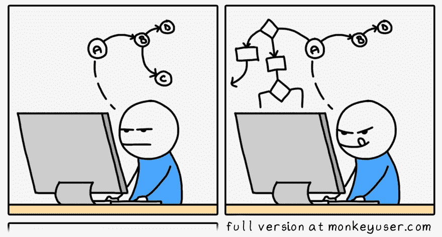
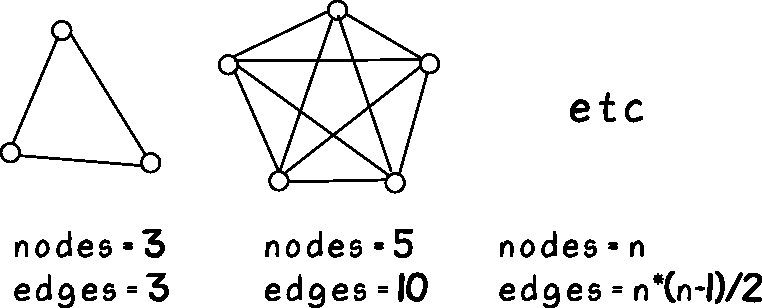
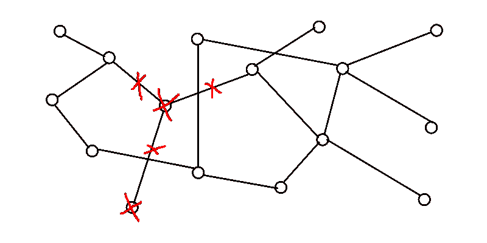
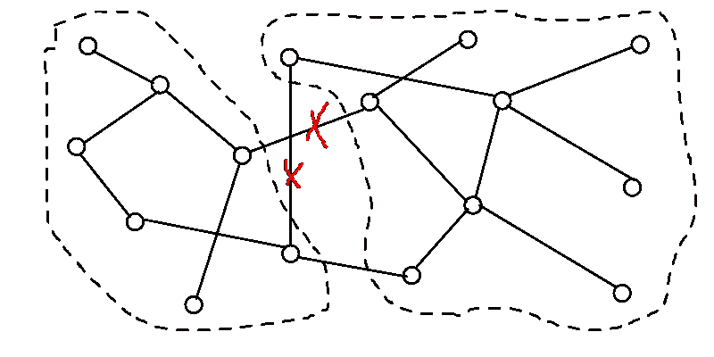
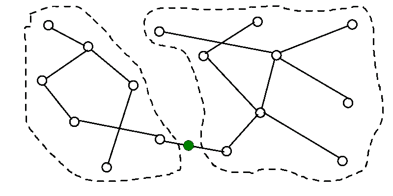

# 复杂性

> 原文：<https://dev.to/stereobooster/complexity-5d62>

**澄清**:这篇文章不是关于计算复杂性的，比如大 O 符号等等。

关于复杂性的经典著作有:

*   小佛瑞德·P·布鲁克斯文章“[没有银弹:软件工程的本质和事故](http://www.cs.nott.ac.uk/~pszcah/G51ISS/Documents/NoSilverBullet.html)”，1987
*   Rich Hickey talk " [简单易行](https://www.infoq.com/presentations/Simple-Made-Easy)"，2011

同样值得一提的是:

*   2015 年，贾斯汀·希尔斯演讲“[如何停止讨厌你的测试套件](https://www.youtube.com/watch?v=VD51AkG8EZw)”。它是关于测试的，但也触及了复杂性背后的一些想法，例如，来自组合学的[乘积法则](http://cse.unl.edu/~choueiry/S06-235/files/Combinatorics-HandoutNoNotes.pdf)。
*   杰拉尔德·m·温伯格著《一般系统思维》，1975 年。我还没有读过，但我知道它谈到了复杂性(特别是关于“有组织的复杂性”)。

复杂性是软件开发的核心。计算机是一个非常复杂的东西，它有数十亿个“继电器”(以晶体管的形式)。最复杂的机械表有多少细节？我想更少。

计算机和计算机网络是人类有史以来建造的最复杂的东西。软件应该能处理这种复杂性。显然，我们不编写软件来直接操作所有继电器，相反，我们处理“抽象”的塔，晶体管形成逻辑门，逻辑门形成处理器，处理器与机器代码一起工作，机器代码由通常来自高级语言的程序生成，塔的顶部是库、框架、范例等。

我们建造这座塔是为了隐藏复杂性。你可以停留在一个“抽象”的层次上，如果你幸运的话，你可以避免复杂性，但是你很可能会面临复杂性。你听说过“分而治之”、“紧耦合”或者封装吗？它们是关于管理复杂性的。

## 什么是复杂性？

> 复杂的-由许多不同的和连接的部分组成。
> 
> -牛津词典

复杂性是系统的特性。它的(独特的)部分越多，部分之间的联系就越多，系统就越复杂。

希基关注的是人脉。事实上,(独特的)项目的数量并不重要，只要你能一次考虑到这个小群体，但是如果大量的事物以一种严格的方式联系在一起，你需要将它们“拖”在一起，考虑这个群体，推理这个群体。

此外，Hickey 定义了零件的复杂性。如果一件事有不止一个责任，不止一个角色，那它就是复杂的。它可以被解释为不止一个东西被包装在一起，因此它是复杂的。

### 为什么复杂是难的？

Hickey 区分了难-简单和复杂-简单。布鲁克斯用“难”而不是硬。那么为什么复杂系统很难呢？

米勒定律(这是一个经验定律)指出，人们可以保持 7 (+/- 2)个焦点。例如，如果实验者说出一些数字，并要求以相反的顺序重复，如果有 7 个(+/- 2)项，人们很可能会成功。所以当时我们的大脑容纳不下很多物体。

要理解一些复杂的想法，你需要在大脑中“启动”它。通常这需要一些时间和“外部”内存(笔记本电脑，膝上型电脑等)。你知道[这个关于专注和你如何不应该打扰程序员的漫画](https://www.monkeyuser.com/2018/focus/)。它说明了“启动”一个复杂想法(系统、模型)的概念。

)

所以真正的问题是，如果你要处理复杂的系统，从长远来看，它会“杀死”你。每次你需要改变什么，每次你需要解释它(其他人需要学习它)，这种复杂系统的缓慢评估就会重复。

### 本质与偶然的复杂性

> 按照亚里斯多德的说法，我将它们分为*本质*，软件本质中固有的困难，以及*事故*，这些困难今天伴随着它的产生，但不是固有的。
> 
> -小佛瑞德·P·布鲁克斯

布鲁克斯谈论的是“困难”，而不是复杂性。我认为困难是一个更广泛的术语，所以软件产品的困难包括复杂性。

本质复杂性——是你实际试图解决的问题的复杂性，除非你同意改变最初任务的范围，否则它是不可简化的。

偶然复杂性——是解决问题的工具或选择的路径所增加的复杂性，它们不是初始的，并且可以(理论上)在不改变初始任务范围的情况下被移除。

例如:我需要写一个前端应用程序做“的事情”。“事物”是本质的复杂性。需要配置 webpack，babel，遭受 JS 疲劳(选择框架)，争论分号，手动格式化代码(除非有更漂亮的)都是偶然的困难。

**重要的**。什么是本质的，什么是偶然的复杂性，并不总是很明显。人们有时会混淆它们，关注偶然的复杂性。

本质和偶然是相对的范畴，它们取决于上下文。

如果我需要在代码中捕获一些业务规则，选择数据结构(如何实现记录，是罗宾汉散列表还是相对论散列表)和算法(例如 quicksort 或 timsort)是非常复杂的。但是如果我需要为编程语言编写一个标准库，选择数据结构和算法是非常复杂的。(一些)高级编程语言仍然需要选择数据结构，因为还没有简单的方法来自动化它，但是有[在这个方向工作](https://blog.acolyer.org/2018/12/14/darwinian-data-structure-selection/)。

### 偶然复杂性的例子

基本复杂性因任务而异，但意外复杂性会因任务而异。我想在复杂的领域中找出一系列“坏习惯”是可能的。我将列举一些(非详尽清单)。

**错误的抽象**。比如 CSS 位置模型。第一次尝试:`position`、`flow`、`margin`——很难描述布局，你需要使用 CSS hacks，因为那些原语与布局无关。第二次尝试:Flexbox——更容易描述布局，因为它提供了列、对齐等原语。第三次尝试:网格布局——现在说的是布局。但是所有这些解决方案的复杂性都相当大(大量的配置)。布局的基本任务是描述块的大小以及空间如何在块之间分配。Kevin Lynagh 提出的解决方案更简单。使用“ [spacer gif](https://spacergif.org/) ”的人直观地发现这个问题是关于空间分配的。

**抽象层次违规**。正如我上面提到的，我们使用抽象层次将复杂性相互隔离。有时会发生违反抽象的情况——当低层次的抽象潜入更高的层次时。比如`goto` command，它存在于高级编程语言中，直到[被 Dijkstra](https://homepages.cwi.nl/~storm/teaching/reader/Dijkstra68.pdf) 批评。

**遗留问题** -当我们需要使用一些旧标准、传统方法等时。这类似于**错误的抽象**问题，除了它可能发生初始抽象是好的，它只是超出了它的初始目的(按照 Brooks 的说法，它是“再利用的”)。即使它不再合适，你也需要保留它。

### 运动对抗偶然的复杂性

总的来说，人类对抗偶然的复杂性，因此我们可以投入更多的精力来解决本质的复杂性。这就是高级编程语言存在的原因——使用机器代码与机器进行交互是乏味且容易出错的，因此我们创建了从可读性更强的语言翻译成机器代码的程序(编译器和 co)。通过这样做，我们实际上增加了总的复杂性，因为编译器本身的复杂性是相当高的。我们增加了整体复杂性，以减少某些情况下的意外复杂性(这是我们非常感兴趣的)。同时，这个额外的工件(编译器和它的标准)可能最终成为**遗产**。Welp，生活充满了取舍。

不管怎样，我们参加了一个对抗意外复杂性的课程，这样我们就可以交付得更快、更多，这样我们就可以解决越来越大的问题。

今天，我们很少编写算法，而是从货架上拿现成的东西，我们很少实现数据结构，我们很少创建标准等(从统计上来说，有人这样做，但与使用它的人相比，人数明显较少)。开源在这里是必不可少的。

> 如今，我们通过戳来编程。
> 
> 杰拉德·让伊·萨斯曼

有些事情可以被认为是偶然的复杂性，但仍然存在于更高的层次，只是因为我们还没有找到一种通用的方法来解决它。例如:

*   手动内存管理。我们已经接近解决方案，有有效的 GC 实现，例如在 Ponylang 中。
*   空问题。我们也许可以用单子或者[也许不用](https://www.youtube.com/watch?v=YR5WdGrpoug)。
*   需要选择算法和数据结构，而不是一般的数据类型，并让机器来计算给定用例的最佳实现。
*   并行性。有很多尝试。

我们朝着更高层次的抽象，更具声明性的解决方案，更恰当的抽象的方向前进。声明式解决方案的便利之处在于，我们可以在不触及高层的情况下交换低层的实现。

我们爬得越高，错误抽象的代价就越高，我们就越陷在遗产中。因此，当我们回到几个级别并重新评估最佳实践时，有时会发生回归。

当人们习惯了一些偶然的复杂性，并且不再把它视为偶然的复杂性时，会产生有趣的影响:

*   他们认为这是一个恰当的抽象。如果很难理解，你只需要更努力地学习
*   他们认为这是表演所需要的。例如，这个论点被用来保护`goto`
*   他们认为真正的程序员应该知道这一点。我想指针是一个很好的例子
*   他们不相信没有这种偶然的复杂性就能解决。例如，长期以来认为，你需要使用手动管理的内存来写低级的东西，像数据库。有一个用 Go 写的数据库[，公平地说，用 Go 写 Memcached 是不可能的，但我相信用 Ponylang 是可能的。](https://github.com/cockroachdb/cockroach)

更令人不安的是，那些人可能有很多经验和权威，所以要改变那些观点需要很大的努力。

### 很难做出简单的东西

很难找到一个简单的解决方案，但使用起来很容易。而且很容易产生复杂的解决方案，很难使用(有时候可以看做很容易使用，但是这种印象很快就消失了)。

示例:

*   Rich Hickey 花了 2 年时间设计 Clojure(闭门造车)。被批评的功能添加得非常慢
*   Elm 添加功能非常慢
*   React 出现在 5 年前(大概是这样)。它没有良好的可组合状态管理。人们发明了各种各样的解决方案(肯定超过 20 种)。只是今年他们展示了钩子，但这还不是最终版本，我们仍在等待最终版本和缓存版本，然后有可能基于这些抽象构建一个合适的解决方案。

这是因为很难找到合适的抽象，要找到合适的抽象，你可能需要写(并使用)10 个错误的抽象。犯错误是可以的，只要你从错误中学习，并且你不坚持你的解决方案是正确的，只是其他人需要学习它。

## 如何应对复杂性？

### 复杂性从何而来？

复杂性来自于相互联系、纠缠、扭曲、复杂(用吻痕来说)的事物。随着项目数量的增加，这些联系的增长(通常)超过了线性方式。这个 can 思想可以认为是组合学的[积法则的推导。](http://cse.unl.edu/~choueiry/S06-235/files/Combinatorics-HandoutNoNotes.pdf)

> 组合学是对对象集合的研究。
> 确切地说，是清点物体、排列、错乱等。沿着
> 的物体及其数学属性。
> 
> 如果两个事件不是互斥的(也就是说，我们分别做
> ，那么我们应用**乘积规则**。

如果你增加一件事，复杂性很有可能会增加一倍以上，通常比线性增长要快。

所以如果你想再加一个...一个函数的参数，一个应用程序的配置，一个项目的多一个特性，一个你的库的消费者的多一个选择。

### 如何管理复杂性？

为了降低复杂性，我们可以减少事物的数量(图中的节点)。在实践中，这意味着我们拒绝从一些功能，缩小范围等。这是降低复杂性的唯一方法，所有其他方法都有助于管理它。

为了管理复杂性，我们可以减少连接的数量(图中的边)。在实践中，这意味着我们进行更严格的隔离，典型的例子是“分而治之”，封装，缩小类型(减少基数)。通过隔离和隐藏一些节点，我们可以确保不会有“意外”的连接。

我们可以通过引入额外的中间节点来减弱“连接”。实际上，这意味着我们引入一些接口或类型(带有结构化子类型)，或者引入消息队列等来代替直接调用。节点的数量增加了(因此复杂性增加了)，但是连接变弱了，所以我们可以把图分解成子图，并且只对其中的一部分进行推理。

