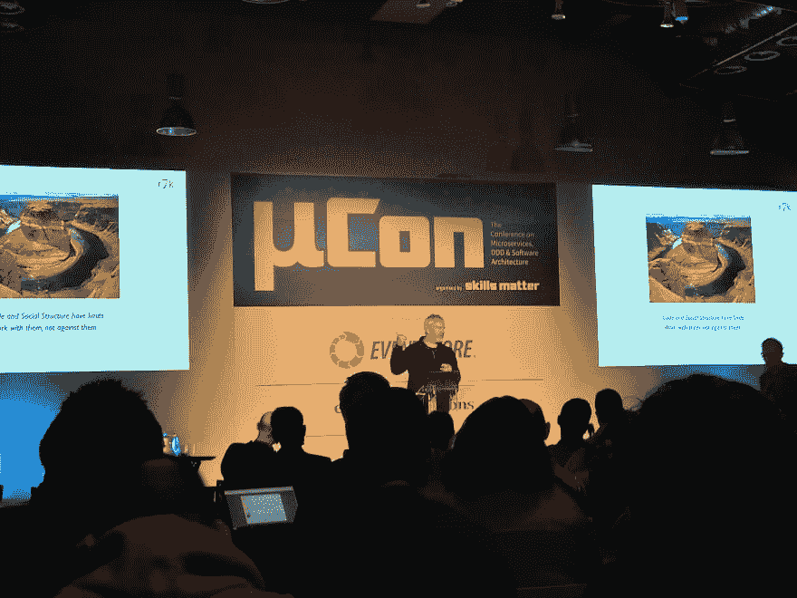

# Con 2019 -第一天和第二天

> 原文：<https://dev.to/csmacnz/con-2019-day-1-2-1cmb>

在伦敦酒店度过一个宁静的夜晚(我从上次参加伦敦会议中吸取了教训)后，在伦敦商业设计中心喝了咖啡并吃了早餐，muCon 2019 开幕了。muCon 是一个关于微服务、DDD 和软件架构的会议。据我所知，今年首次将 DDD 和微服务会议合二为一。我在这里呆三天。在这一点上，我已经进入了写博客记录我的会议经历的节奏，所以我们再来一次！

## 第 1 天

我们从 Michael Feathers 的精彩主题演讲开始，该演讲捕捉了应用于团队和代码架构的各种意识形态和原则，包括类级别、微服务级别以及人际个人和团队级别。

> NEW[# muCon](https://twitter.com/hashtag/muCon?src=hash&ref_src=twsrc%5Etfw)London 2019[# keynote](https://twitter.com/hashtag/keynote?src=hash&ref_src=twsrc%5Etfw)[# skills cast](https://twitter.com/hashtag/SkillsCast?src=hash&ref_src=twsrc%5Etfw):[@ m feathers](https://twitter.com/mfeathers?ref_src=twsrc%5Etfw)探索设计中存在的系统结构，以创造更简单的系统。
> 
> 点这里看视频:[https://t.co/y2Y7F63BrB](https://t.co/y2Y7F63BrB)[#系统架构](https://twitter.com/hashtag/SystemStructure?src=hash&ref_src=twsrc%5Etfw)[# legacy code](https://twitter.com/hashtag/LegacyCode?src=hash&ref_src=twsrc%5Etfw)[#微服务架构](https://twitter.com/hashtag/MicroserviceArchitecture?src=hash&ref_src=twsrc%5Etfw)[#架构](https://twitter.com/hashtag/Architecture?src=hash&ref_src=twsrc%5Etfw)[pic.twitter.com/ApXVjdgbNA](https://t.co/ApXVjdgbNA)
> 
> —技能很重要(@ Skills Matter)[2019 年 5 月 29 日](https://twitter.com/skillsmatter/status/1133735092554272769?ref_src=twsrc%5Etfw)

像往常一样，这一天被分成几个部分，所以我只能给出我去过的地方的经验，以及我未来会关注哪些演讲者和演讲的指导。

接着我的主题演讲是来自 Richard Rodger 的“从第一天开始的微服务”。在[写了一本关于微服务](https://www.manning.com/books/the-tao-of-microservices)开发的书之后，有了在一家新建的公司上构建微服务的第一手经验，这是一个实践他所宣扬的东西的机会。我喜欢的一个有趣的观点是设计一个以消息为中心的组件系统(微服务)，然后传输/路由层无关紧要(从技术角度来看)。这引起了我的共鸣，因为它与端口和适配器架构配合得很好。

> NEW[# muCon](https://twitter.com/hashtag/muCon?src=hash&ref_src=twsrc%5Etfw)London 2019[# skills cast](https://twitter.com/hashtag/SkillsCast?src=hash&ref_src=twsrc%5Etfw):[@ rj Rodger](https://twitter.com/rjrodger?ref_src=twsrc%5Etfw)分享了初创公司[https://t.co/GHuVLEqlZA](https://t.co/GHuVLEqlZA)如何在最初 18 个月的发展中成功使用微服务，以及为什么会成功。
> 
> 点这里看视频:[https://t.co/JJtjx7ccLj](https://t.co/JJtjx7ccLj)[#微服务](https://twitter.com/hashtag/microservice?src=hash&ref_src=twsrc%5Etfw)[#架构](https://twitter.com/hashtag/architecture?src=hash&ref_src=twsrc%5Etfw)[pic.twitter.com/jnCmbL15zL](https://t.co/jnCmbL15zL)
> 
> —技能很重要(@ Skills Matter)[2019 年 5 月 29 日](https://twitter.com/skillsmatter/status/1133746086038913024?ref_src=twsrc%5Etfw)

接下来，填补午餐前空档的是来自 [Daniel Bryant](https://twitter.com/danielbryantuk) 的“为云原生应用创造有效的开发者体验”。DevEx 的一个很好的介绍和概述，这是一个为开发人员在云原生、Kubernetes 和无服务器的现代世界中从编码到生产等构建一个很好的体验的想法。无论是“构建还是购买”，云还是内部托管，开发人员构建、调试、测试、部署和监控的故事应该是开发软件的首要考虑因素。

> NEW[# muCon](https://twitter.com/hashtag/muCon?src=hash&ref_src=twsrc%5Etfw)London 2019[# skills cast](https://twitter.com/hashtag/SkillsCast?src=hash&ref_src=twsrc%5Etfw):[@ danielbryantuk](https://twitter.com/danielbryantuk?ref_src=twsrc%5Etfw)探讨了云原生开发者体验的核心概念和学到的经验教训。
> 
> 点击此处观看视频:[https://t.co/xaBmX4xpgL](https://t.co/xaBmX4xpgL)[#连续交付流程](https://twitter.com/hashtag/continuousdeliveryprocesses?src=hash&ref_src=twsrc%5Etfw)[# dx](https://twitter.com/hashtag/dx?src=hash&ref_src=twsrc%5Etfw)[# devex](https://twitter.com/hashtag/devex?src=hash&ref_src=twsrc%5Etfw)[# developer experience](https://twitter.com/hashtag/developerexperience?src=hash&ref_src=twsrc%5Etfw)[pic.twitter.com/Ls2iTsagua](https://t.co/Ls2iTsagua)
> 
> —技能很重要(@ Skills Matter)[2019 年 5 月 29 日](https://twitter.com/skillsmatter/status/1133757416120692737?ref_src=twsrc%5Etfw)

Alberto Brandolini 文化的重要性以及建筑对文化的影响。非常有趣，从许多方面对康威定律有很好的看法，并思考影响变化。

> NEW[# muCon](https://twitter.com/hashtag/muCon?src=hash&ref_src=twsrc%5Etfw)London 2019[# skills cast](https://twitter.com/hashtag/SkillsCast?src=hash&ref_src=twsrc%5Etfw):[@ zio Brando](https://twitter.com/ziobrando?ref_src=twsrc%5Etfw)分享了如何通过有效使用 DevOps 方法来面对一个棘手的问题。
> 
> 点这里看视频:[https://t.co/4ZSESd9uCx](https://t.co/4ZSESd9uCx)[# devo PS](https://twitter.com/hashtag/devops?src=hash&ref_src=twsrc%5Etfw)[#软件架构](https://twitter.com/hashtag/softwarearchitecture?src=hash&ref_src=twsrc%5Etfw)[#流程](https://twitter.com/hashtag/processes?src=hash&ref_src=twsrc%5Etfw)[#微服务](https://twitter.com/hashtag/microservices?src=hash&ref_src=twsrc%5Etfw)[#架构](https://twitter.com/hashtag/architecture?src=hash&ref_src=twsrc%5Etfw)[pic.twitter.com/VV92qAgS9G](https://t.co/VV92qAgS9G)
> 
> —技能很重要(@ Skills Matter)[2019 年 5 月 30 日](https://twitter.com/skillsmatter/status/1134014101695467520?ref_src=twsrc%5Etfw)

Nick Tune 的“战略领域驱动的设计模式”是关于 DDD 分组的一个有趣的讨论。这绝对是我需要阅读(蓝皮书)的一个主题，无论是字面上还是象征性的。(尽管有人告诉我，人们不会简单地“阅读”Eric Evans 的域驱动器设计...)一些非常高级的模式和方法来帮助在您的系统中找到分组。

> NEW[# muCon](https://twitter.com/hashtag/muCon?src=hash&ref_src=twsrc%5Etfw)London 2019[# skills cast](https://twitter.com/hashtag/SkillsCast?src=hash&ref_src=twsrc%5Etfw):[@ nt coding](https://twitter.com/ntcoding?ref_src=twsrc%5Etfw)分享了理解领域模式如何帮助你调整你的微服务和业务领域。
> 
> 点击这里看视频:[https://t.co/9d6ClArZJA](https://t.co/9d6ClArZJA)[#领域模式](https://twitter.com/hashtag/domainpatterns?src=hash&ref_src=twsrc%5Etfw)[# DDD](https://twitter.com/hashtag/ddd?src=hash&ref_src=twsrc%5Etfw)#微服务#架构[pic.twitter.com/8MOMVOS8FG](https://t.co/8MOMVOS8FG)
> 
> —技能很重要(@ Skills Matter)[2019 年 5 月 30 日](https://twitter.com/skillsmatter/status/1134044301514674177?ref_src=twsrc%5Etfw)

Ian Cooper 的“事件驱动的协作”从另一个角度看了一下[的参考数据概念](https://blog.csmac.nz/geeking-out-at-altnetbrum-2018/#referencedataarchitecture)，并提供了一些实际的例子来说明你可以做什么以及如何实现它。对内部可变数据与外部不可变数据、事件、消息和缓存概念的修正。

> NEW[# muCon](https://twitter.com/hashtag/muCon?src=hash&ref_src=twsrc%5Etfw)London 2019[# skills cast](https://twitter.com/hashtag/SkillsCast?src=hash&ref_src=twsrc%5Etfw):[@ ICooper](https://twitter.com/ICooper?ref_src=twsrc%5Etfw)分享活动如何帮助我们整合服务架构。
> 
> 点这里看视频:[https://t.co/H7WMrEJtwF](https://t.co/H7WMrEJtwF)[# eventdrivencollaboration](https://twitter.com/hashtag/eventdrivencollaboration?src=hash&ref_src=twsrc%5Etfw)[#微服务](https://twitter.com/hashtag/microservices?src=hash&ref_src=twsrc%5Etfw)[#架构](https://twitter.com/hashtag/architecture?src=hash&ref_src=twsrc%5Etfw)[pic.twitter.com/j4MBsnHeo5](https://t.co/j4MBsnHeo5)
> 
> —技能很重要(@ Skills Matter)[2019 年 5 月 30 日](https://twitter.com/skillsmatter/status/1134059400367419393?ref_src=twsrc%5Etfw)

这一天随着几次闪电般的谈话而结束。对我来说，最突出的一点是“持续可见性，不再需要仪表盘！”来自詹姆斯·布朗的《持续可见性》。更多地使用警报和通知，并且仅选择性地将趋势和 CI 状态添加到空间宝贵的物理仪表板中(但是不要忘记添加 gif！).

> NEW[# muCon](https://twitter.com/hashtag/muCon?src=hash&ref_src=twsrc%5Etfw)London 2019[# skills cast](https://twitter.com/hashtag/SkillsCast?src=hash&ref_src=twsrc%5Etfw):James Brown 分享了他和他的团队如何发展系统健康可见性的旅程。
> 
> 点击此处观看视频:[https://t.co/H7WMrEJtwF](https://t.co/H7WMrEJtwF)[#运营支持](https://twitter.com/hashtag/operationalsupport?src=hash&ref_src=twsrc%5Etfw)[#故障恢复](https://twitter.com/hashtag/failurerecovery?src=hash&ref_src=twsrc%5Etfw)[#综合监控](https://twitter.com/hashtag/syntheticmonitoring?src=hash&ref_src=twsrc%5Etfw)[pic.twitter.com/DLu8EtKUkV](https://t.co/DLu8EtKUkV)
> 
> —技能很重要(@ Skills Matter)[2019 年 5 月 30 日](https://twitter.com/skillsmatter/status/1134112268600401921?ref_src=twsrc%5Etfw)

## 第二天

第二天以另一个主题开始:“去 DDD:务实还是有原则？”来自

[朱莉·勒曼](https://twitter.com/julielerman)。Julie 讨论了 DDD 之旅，与新采纳者互动，以及如何在一个团队中慢慢建立概念，这是一种吸引更多人加入的好方法，而不必过于坚持原则或必须立即了解 DDD 的一切。

来自[的“为未来的微服务之旅做准备”

Susanne Kaiser](https://twitter.com/suksr)展示了一个从定制构建到微服务再到无服务器的旅程，涵盖了托管软件的各个方面，其基础架构问题从构建到购买再到商品化。

> "软件交付性能对于今天做生意的技术组织来说是至关重要的."与 [@suksr](https://twitter.com/suksr?ref_src=twsrc%5Etfw) 的微服务经验教训正在发生！😎pic.twitter.com/Ti4xehAkZC[#微服务](https://twitter.com/hashtag/microservices?src=hash&ref_src=twsrc%5Etfw)
> 
> —技能很重要(@ Skills Matter)[2019 年 5 月 30 日](https://twitter.com/skillsmatter/status/1134036801491034113?ref_src=twsrc%5Etfw)

来自 [Maria Gomez](https://twitter.com/mariascandella) 的“可观察的微服务”经历了可观察性的内容(日志、警报和跟踪),以及一旦您的服务投入生产，它为您提供价值的“原因”。

午餐后， [David Leitner](https://twitter.com/duffleit) 发表了“微前端——为完全垂直化的系统而努力”。一个很好的微前端定义和示例架构，可以添加到您的“视情况而定”解决方案工具箱中。非常清楚地概述了不同方法适用的时间和地点。如果你想垂直分割你的前端，一定要看看他的作品。

这导致了下午的研讨会:与[刘易斯·登汉姆-帕里](https://twitter.com/denhamparry)和[萨尔曼·伊克巴尔](https://twitter.com/SoulmanIqbal)一起“给我看看库伯内特”。他们带领我们在 github.com/CloudNativeWales/ShowMeTheKubernetes[进行演示，这些演示在 Azure 上的临时集群或本地 Minikube 上运行良好(两种情况下都有说明)。我们承诺了更多的示例，因此可能会有比我们在会议中讨论的三个更多的示例。](https://github.com/CloudNativeWales/ShowMeTheKubernetes)

第二天的最后一个主题是戴安娜·蒙塔琳关于概念完整性的演讲。我不太骄傲地承认，我最后没有理解“概念完整性”这个术语，无法给你定义。然而，这个主题非常有趣，讨论的达到给定定义的步骤本身非常有用和有趣，对我来说这并不重要。也许我在这个阶段缺乏准确理解这一点的经验，而其他有更多系统咨询经验和经验的人做到了。

> 仅仅是今天下午举行的 [#muCon](https://twitter.com/hashtag/muCon?src=hash&ref_src=twsrc%5Etfw) 研讨会之一， [@soulmaniqbal](https://twitter.com/SoulmanIqbal?ref_src=twsrc%5Etfw) 和 [@denhamparry](https://twitter.com/denhamparry?ref_src=twsrc%5Etfw) 的 the kubernetes 为刚接触 [#kubernetes](https://twitter.com/hashtag/kubernetes?src=hash&ref_src=twsrc%5Etfw) 的人提供实践经验！[#软件架构](https://twitter.com/hashtag/SoftwareArchitectures?src=hash&ref_src=twsrc%5Etfw)[pic.twitter.com/4yiwC0CbEy](https://t.co/4yiwC0CbEy)
> 
> —IkeAtSM(@ IkeAtSM)[2019 年 5 月 30 日](https://twitter.com/IkeAtSM/status/1134096839723163648?ref_src=twsrc%5Etfw)

## 总结

当然，大部分(如果不是全部的话)的演讲都被录制下来，并出现在网上(在可用的地方添加了链接)，但像往常一样，你因为不在这里而错过了走廊上的谈话。这些通常是任何会议中最精彩的部分，这次也不例外。一次精彩的对话引出了这样一句话:从来没有人说过或见过一个系统被描述为镀金太多或测试太好。相反，大多数系统苦于质量不够好或者缺乏测试覆盖率。

在其他对话中，能够分享结构和策略可以让你深入了解哪些对其他团队和公司有用，哪些对其他团队和公司没用，还可以让你看到他们与你的团队和公司相比处于什么位置。但是根据这里其他人的指导和经验，我们似乎都在朝着一个相似的方向前进，通过 SOA 到 DDD 和微服务。

请继续关注我第三天经历的总结。