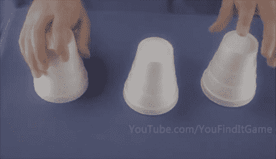

# 概念代码:冒泡排序

> 原文：<https://dev.to/willvelida/concepts-as-code-bubble-sort-53l3>

你好。这篇“作为代码的概念”的博文是我试图用最简单的方式解释计算机科学概念的系列文章的第一篇。

作为一个没有受过正规计算机科学教育的人，我一直觉得我错过了学习每个软件工程师都应该知道的数据结构和算法的内部工作原理(我从来没有在面试中测试过它们！也许这是件好事？).

[](https://res.cloudinary.com/practicaldev/image/fetch/s--ZUe9jHXJ--/c_limit%2Cf_auto%2Cfl_progressive%2Cq_auto%2Cw_880/https://cdn-images-1.medium.com/max/245/0%2A38a9ZdPljG0w6w2i)

因此，我的博客抱负之一就是写一些简短而甜蜜的帖子，介绍我正在学习的、可以教给别人的特定概念。

[](https://res.cloudinary.com/practicaldev/image/fetch/s--0AVCxiW4--/c_limit%2Cf_auto%2Cfl_progressive%2Cq_66%2Cw_880/https://cdn-images-1.medium.com/max/490/0%2AuyknTcvY3iCwMkLB.gif)

我将用 Java 来编写这些概念，因为这是我最熟悉和使用最多的语言。我可能会时不时地改变它，使用 Python，但我们会看到我们如何前进。

现在，让我们从一个叫做冒泡排序的简单排序算法开始。

**引入冒泡排序**

<figure>[](https://res.cloudinary.com/practicaldev/image/fetch/s--coP-hovp--/c_limit%2Cf_auto%2Cfl_progressive%2Cq_66%2Cw_880/https://cdn-images-1.medium.com/max/444/0%2AXoFS-bhw1Q1msyZa.gif) 

<figcaption>这些不是我们要找的泡沫</figcaption>

</figure>

在所有的排序算法中，冒泡排序是最简单的。

基本上，我们有一个输入数组，冒泡排序将对其进行多次遍历。在每一遍中，该算法将比较两个相邻的元素，如果它们未排序，则交换它们。它被称为冒泡排序，因为排序是从列表的底部“冒泡”出来的。

让我们进一步分析一下。冒泡排序执行三个简单的任务:

1.  反复检查列表进行排序。
2.  比较列表中相邻的元素(彼此相邻的元素)并对它们进行排序。
3.  如果第一个元素大于第二个元素，就交换它们。

让我们看一些伪代码来更好地形象化这个过程:

```
bubbleSort(inputArray)
  n = length(inputArray)
  for (k = 1 until n)
    for (j = 0 until -1)
      if(array[j] > array[j + 1])
        swap(array, j, j + 1) 
```

在这个伪代码中，n 是数组的长度。为了确保我们的整个列表被排序，我们需要对列表进行 n-1 次遍历。如果我们有一个包含 10 个条目的列表，我们将需要比较列表的第二个元素(在数组中的位置 1 ),并继续遍历 9 次，直到我们对整个列表进行了排序。一个排序的泡泡正在列表的末尾建立，这就是为什么我们需要在列表上进行 n-1 次遍历。

在 if 语句中，我们将数组中 j 位置的数字与 j + 1 位置的数字(列表中相邻的数字)进行比较。

**在 Java 中实现冒泡排序**

让我们把我们的伪代码变成一些真正的 Java 代码。我们的冒泡排序方法应该是这样的。

```
public void sortV1(int[] numbers) {
    for (int i = 1; i < numbers.length; i++) {
        for (int j = 0; j < numbers.length - 1; j++) {
            if (numbers[j] > numbers[j + 1]) {
                int temp = numbers[j];
                numbers[j] = numbers[j + 1];
                numbers[j + 1] = temp;
            }
        }
    }
} 
```

就像我们的伪代码一样，我们需要遍历列表 n-1 次。如果位置 j 的数字大于位置 j + 1 的数字，我们使用一个临时变量来交换数字的位置。

让我们看看它的实际效果。我们将创建一个可以在 Main 方法中排序的数字列表。

```
// Program entry
public static void main(String[] args) {
    // Instantiate a new instance of our BubbleSort class
    BubbleSort sort = new BubbleSort();

    // Define the input array that we wish to sort
    int[] inputArray = new int[]{6,4,3,6,4,7,9,2,4,3,1};

    // Call our sortV1 method and pass in our inputArray
    sort.sortV1(inputArray);

    // Print out the results to the console
    System._out_.println(Arrays._toString_(inputArray));
} 
```

我们基本上是在创建 BubbleSort 类的一个新实例，并在我们的列表上应用 Sort 方法。然后，我们将排序后的列表打印到控制台，应该会得到以下结果。

```
[1, 2, 3, 3, 4, 4, 4, 6, 6, 7, 9]

Process finished with exit code 0 
```

如你所见，冒泡排序很容易实现。然而，这也是一种较慢的排序方法。我将在以后的博客文章中讨论复杂性和运行时，但现在让我们关注如何改进冒泡排序的运行时。

<figure>[](https://res.cloudinary.com/practicaldev/image/fetch/s--TgnntZkp--/c_limit%2Cf_auto%2Cfl_progressive%2Cq_66%2Cw_880/https://cdn-images-1.medium.com/max/500/0%2ASoc5noHbxYPt2LnD.gif) 

<figcaption>冒泡排序是挺慢的，但大概没这么慢……</figcaption>

</figure>

**改进我们的冒泡排序运行时间**

在我们开始改进我们的冒泡排序之前，重要的是要注意，这些改进在最坏的情况下仍然会导致较差的运行时复杂性。知道如何提高性能仍然很重要，所以我将在这里介绍一种方法。

首先，让我们创建一个私有交换方法来为我们进行交换。

```
// swap helper method
private void swap(int[] numbers, int a, int b) {
    int temp = numbers[a];
    numbers[a] = numbers[b];
    numbers[b] = temp;
} 
```

我们也可以减少单子上的传球次数。目前，如果我们给我们的排序方法一个已经排序的列表，我们仍然要对它进行多次遍历。

为了防止这种情况发生，我们可以在列表完全排序后移除外部循环。在我们的内部循环中，我们将遍历列表 n-1 次，而不是遍历列表 n-1 次。这将在排序气泡之前停止气泡排序算法。

在新的外部循环中，我们通过检查在上一次循环中是否执行了任何交换来检查数组是否已排序。这样，如果我们的列表已经排序了，我们只需对列表进行一次遍历，然后就不管它了。

我们的新方法应该是这样的:

```
// Bubble Sort improvement
public void sortV2(int[] numbers) {
    int i = 0;
    boolean hasSwappedOccured = true;
    while (hasSwappedOccured) {
        hasSwappedOccured = false;
        i++;
        for (int j = 0; j < numbers.length - i; j++) {
            if (numbers[j] < numbers[j + 1]) {
                swap(numbers, j, j + 1);
                hasSwappedOccured = true;
            }
        }
    }
} 
```

我们现在可以将新的排序方法实现到我们的主方法中，如下所示:

```
// Program entry
public static void main(String[] args) {
    // Instantiate a new instance of our BubbleSort class
    BubbleSort sort = new BubbleSort();

    // Define the input array that we wish to sort
    int[] inputArray = new int[]{6,4,3,6,4,7,9,2,4,3,1};

    // Call our sortV2 method and pass in our inputArray
    sort.sortV2(inputArray);

    // Print out the results to the console
    System._out_.println(Arrays._toString_(inputArray));
} 
```

如你所见，我们得到了相同的结果:

```
[1, 2, 3, 3, 4, 4, 4, 6, 6, 7, 9]

Process finished with exit code 0 
```

**结论**

在这篇文章中，我们讨论了冒泡排序。这是您可以使用的最简单的排序算法之一，但也是性能最差的算法之一。在以后的文章中，我们将介绍比冒泡排序性能更好的排序技术。

<figure>[](https://res.cloudinary.com/practicaldev/image/fetch/s--QLLwn4lI--/c_limit%2Cf_auto%2Cfl_progressive%2Cq_66%2Cw_880/https://cdn-images-1.medium.com/max/455/0%2AkIexCEt-vR6mco2Z.gif) 

<figcaption>虽然不是这种类型的排序…</figcaption>

</figure>

如果你想仔细看看这篇文章中的代码，请点击这里查看我的 GitHub 报告。