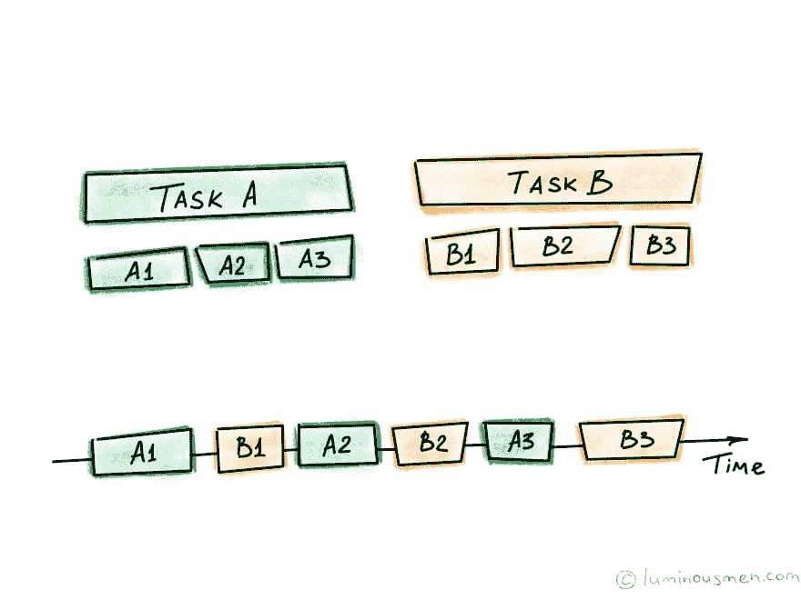
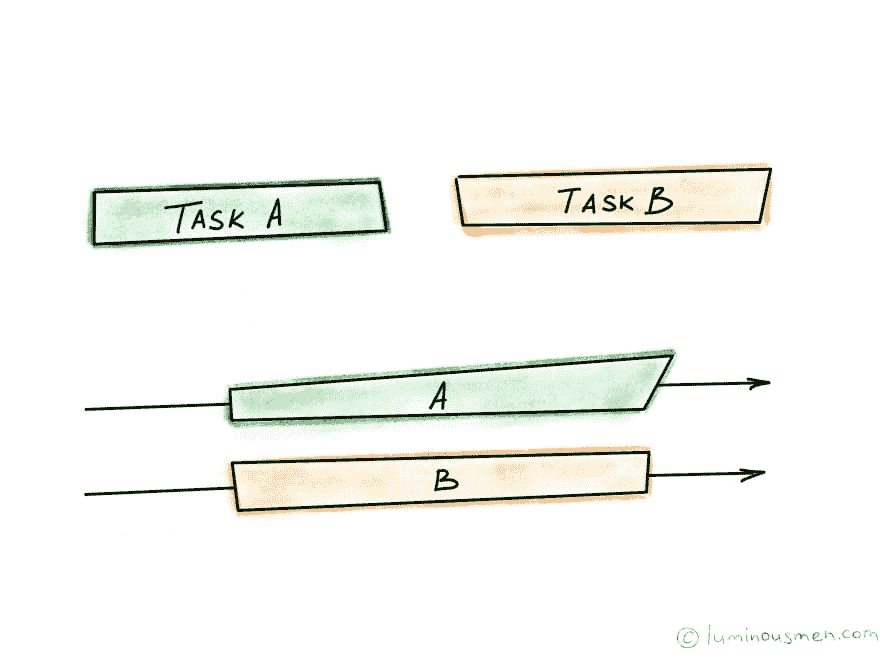

# 并发和并行是两回事

> 原文：<https://dev.to/luminousmen/concurrency-and-parallelism-are-two-different-things-lpg>

看起来并发性和并行性没有区别，但这是因为你没有理解事情的本质。让我们试着去理解它们有什么不同。

**并发**是指在应用程序中同时执行多个任务。一个重要的细节是，任务是**不一定同时执行**(但有可能)，所以可以分成更小的任务，交替执行。在这种情况下，线程可以在物理上同时执行，但这不是必需的。

任务之间没有联系。因此，哪一个更早结束，哪一个更晚结束，都无关紧要。因此，可以通过多种方式实现并发性——使用绿色线程或进程，或者在一个 CPU 或其他设备上工作的异步操作。

让我们打个比方:秘书接听电话，有时检查约会。他需要停止接听电话，以便走到办公桌前检查约会，然后开始接听并重复这个过程，直到工作日结束。

正如您已经注意到的，并发性与后勤联系更紧密。如果不是，那么秘书会等到约定的时间做必要的事情，然后去接听电话。

**并行**是任务同时执行(比如有 5 个任务，每个任务都在 60 分钟内完成)。这个名字本身就意味着它们是并行执行的。并行性是通过突出工作线程或进程的抽象来实现并发执行的方法之一。此外，为了实现真正的并行，必须至少有两个 CPU 内核。

回到办公室:现在我们有两个秘书了。一个看电话，另一个安排约会。工作是分开的，因为现在有两个秘书在办公室工作。

并行性是并发性的一个子类:在执行几个并发任务之前，您必须首先正确地组织它们。

我也建议你去读/看[罗布·派克](https://blog.golang.org/concurrency-is-not-parallelism)。

* * *

**感谢您的阅读！**

有什么问题吗？请在下面留下您的评论，开始精彩的讨论！

查看我的博客或来打个招呼👋在[推特](https://twitter.com/luminousmen)或订阅[我的电报频道](https://t.me/iamluminousmen)。
做好你的计划！