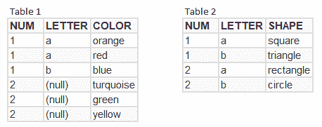
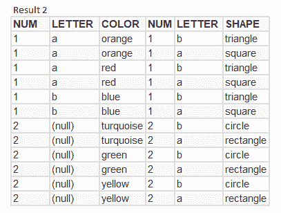
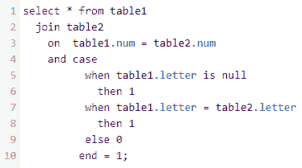
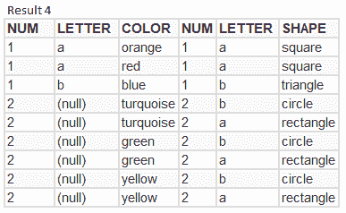

# SQL 中的条件列连接

> 原文：<https://dev.to/gschro/conditional-column-join-in-sql-5g03>

有时候，在遗留企业系统的世界里，你的任务听起来就像是在[代码信号](https://app.codesignal.com/)或类似平台上的问题。我今天遇到的任务有点像这样:

给定写一个查询，从下表中找出数字和字母匹配的所有行/列。如果字母为空，则在输出中包含所有颜色和形状的组合。

首先想到的是字母和数字列上的两个表的连接:

这导致了:

嘿，数字 1 和字母 a 和 b 看起来不错！但是我们的 2 号去哪了？啊，是的，表 1 中 2 的字母是空的，所以当连接到 2 有字母的表 2 时，它们将被删除。

所以让我们再试一次，但是忘记连接字母:

结果是:

是的，2 回来了！嗯，我们好像有很多排...看起来每一种形状、颜色和字母的组合对 2 来说都很好，但对 1 来说就不太好了。

所以我们真正需要的是对 1 的数字和字母进行连接，对 2 的数字进行连接。

条件列连接是一种奇特的方式，它允许我们在一个查询中连接到一个列和两个(或更多)列。我们可以通过在连接的 on 子句中使用 case 语句来实现这一点。

case 语句允许我们测试多个条件(比如 if/else if/else)来产生一个值。通常选择 1 或 0(真/假)作为结果值。

然后，我们检查 case 语句的输出是否等于 1(连接的“end = 1”部分)，如果是，则两行之间进行连接，如果不是，则删除该行。

所以在这种情况下:)case 语句执行以下操作:

*   检查表 1 的字母列是否为空。
    *   如果是，我们将保留该行(实际上返回值 1，等于 1)。
*   如果表 1 的字母列不为空，则检查表 1 的字母列是否等于表 2 的字母列。
    *   如果是，我们保留该行，如果不是，我们删除该行。
*   如果两者都不成立，我们将删除该行(返回不等于 1 的 0)。

基本上，如果表 1 字母列为空，那么我们只在数字列上连接表 1 和表 2，如果表 1 的字母列不为空，那么在数字和字母上连接。

这就是我们的最终答案:

在 [SQL Fiddle](http://sqlfiddle.com/#!4/17f36/8) 中尝试一下，进行更多的练习！