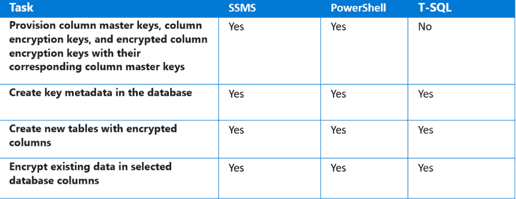
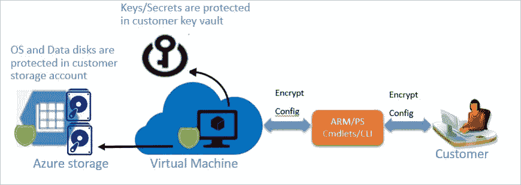

# 为静态数据配置加密

> 原文：<https://dev.to/cheahengsoon/configure-encryption-for-data-at-rest-4l1h>

**实现 SQL 数据库始终加密**

*   总是加密的 SQL 数据库的主要特征:
    *   保护静态、传输中和使用中的数据
    *   确保只能从客户端应用程序和应用程序服务器访问数据
*   实现 SQL 数据库始终加密:
    *   使用 SSMS 的“始终加密向导”创建始终加密的密钥:
        *   创建列主密钥
        *   创建列加密密钥
    *   创建数据库表并加密列
    *   创建一个从加密列中插入、选择和显示数据的应用程序

**实现数据库加密**

**实现 SSE**

*   Azure 存储服务加密的主要特征:
    *   自动应用于所有 Azure 存储帐户，并且无法禁用
    *   写时加密，读时解密
    *   支持所有四种存储服务(Blob、队列、表和文件)
    *   支持两种存储性能层(标准和高级)
    *   支持两种部署模型(资源管理器和经典)
*   配置 SSE:
    *   默认情况下，SSE 使用平台分配的密钥
    *   顾客可以选择使用他们自己的钥匙

**实现 Azure 磁盘加密**

*   磁盘加密的主要特征:
    *   在 Windows 虚拟机上使用 BitLocker，在 Linux 虚拟机上使用 DM-Crypt
    *   为操作系统和数据磁盘提供加密
    *   将加密密钥存储在客户管理的密钥库中
    *   需要授予 Azure 平台对密钥库的访问权限
*   实施磁盘加密:
    *   Azure 资源管理器模板
    *   PowerShell
    *   Azure CLI

**实施 Azure 备份加密**

*   Azure 备份的主要特征:
    *   支持 Windows 和 Linux 操作系统
    *   能够保护内部和云驻留工作负载
    *   允许备份和恢复文件、文件夹、系统状态和应用程序
*   实施 Azure 备份加密:
    *   对于内部工作负载，加密基于客户提供的密码
    *   对于 Azure 虚拟机，加密使用 SSE