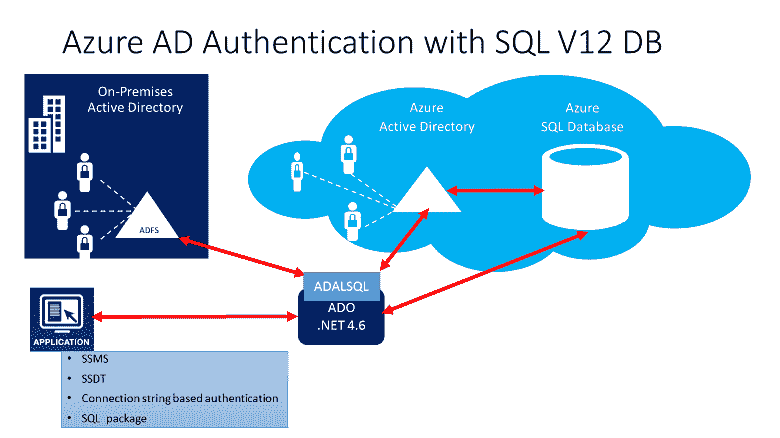
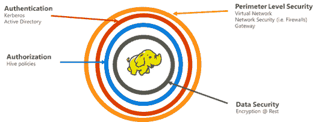
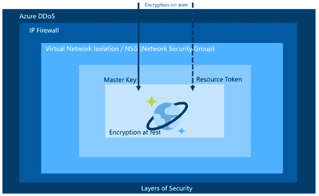

# 为数据基础架构配置安全性

> 原文：<https://dev.to/cheahengsoon/configure-security-for-data-infrastructure-5fc4>

**配置 SQL 数据库防火墙**

*   SQL 数据库防火墙的主要特征:
    *   支持 SQL 数据库和 Azure SQL 数据仓库
        *   SQL 数据库支持服务器级和数据库级防火墙(首先评估)
        *   SQL 数据仓库仅支持服务器级防火墙
    *   默认拒绝(入站)
    *   显式允许(入站):
        *   来自互联网:基于源 IP 地址范围
        *   来自 Azure:所有连接
        *   来自 Azure 虚拟网络:基于来自各个子网的虚拟网络服务端点
*   实施 SQL 数据库防火墙:
    *   包括创建一个或多个允许规则
    *   支持从 Azure 门户创建服务器级规则
        *   该平台提供添加客户端 IP 功能
    *   要求对数据库级规则使用 T-SQL

**启用数据库认证和授权**

*   SQL 数据库身份验证
    *   支持两种类型的身份验证:
        *   SQL 身份验证:基于本地存储的用户名和密码
        *   Azure 活动 AD 身份验证:基于 Azure AD 凭据
    *   支持两种类型的用户:
        *   在 master 数据库中定义的用户，在用户数据库中引用
        *   直接在用户数据库中定义的用户(包含数据库用户)
*   Azure Cosmos DB 授权:
    *   支持基于主密钥、资源令牌和用户的授权
        *   用户是代表对数据库资源的自定义权限的资源
        *   主密钥用于创建用户资源
        *   资源令牌代表与用户资源相关联的权限

**为 SQL 数据库启用 Azure AD 身份验证**

1.  创建一个新的或标识一个现有的 Azure AD 用户以指定为 Azure SQL 数据库服务器管理员在混合方案中，该帐户应来自 Active Directory
2.  如果需要，将托管 SQL 数据库的 Azure 订阅与 Azure AD 租户相关联
3.  为 SQL 数据库服务器、Azure SQL 托管实例或 SQL 数据仓库创建 Azure AD 管理员
4.  配置客户端电脑
5.  创建映射到 Azure AD 身份的包含数据库用户
6.  使用 Azure AD 身份连接到数据库

**启用数据库审计**

*   Azure SQL 数据库审计的主要特征:
    *   便于跟踪指定事件、报告数据库活动和事件分析
    *   可通过服务器和数据库审计策略进行配置
*   实现数据库审计:
    *   启用服务器策略来审核所有现有的和新创建的数据库
    *   启用数据库策略来审核单个数据库，以便:
        *   为特定数据库配置不同的存储帐户或保留期
        *   不同于服务器上其他数据库的特定数据库的审核事件类型或类别
    *   您可以使用 Azure 门户来:
        *   启用和禁用服务器和数据库级策略
        *   配置审核日志目标(Azure 存储、Azure 日志分析、Azure 事件中心)和保留期(仅存储)
    *   您必须使用 Azure PowerShell 或 REST API 来自定义审计事件

**配置 SQL 数据库威胁检测**

*   SQL 数据库威胁检测的主要特征:
    *   帮助检测和响应可疑的数据库活动、潜在漏洞、网络攻击和异常访问模式
    *   与 Azure 安全中心集成
    *   协助调查和缓解威胁
    *   作为高级数据安全产品的一部分提供，包括:
        *   数据发现和分类
        *   脆弱性评估
        *   威胁检测
*   实施 SQL 数据库威胁检测:
    *   在每台服务器或数据库级别启用高级数据安全性
    *   指定用于保存漏洞检查扫描结果的存储帐户
    *   配置重复扫描
    *   指定将接收扫描结果的电子邮件地址

**为存储帐户配置访问控制**
Azure 存储帐户访问控制:

*   基于 Azure 广告的身份验证和授权(截至 2019 年 3 月的预览版)
*   基于存储访问密钥的授权
*   基于 SAS 的授权
*   匿名访问(仅限 blobs 和容器)

**为存储账户配置密钥管理**

*   重新生成存储访问密钥是推荐的安全做法
*   这需要更新您的审计策略:
    1.  修改策略以使用辅助密钥
    2.  重新生成主键
    3.  修改策略以使用主键
    4.  重新生成二级密钥

**创建和管理 SASs**

*   情景应用程序的主要特征:
    *   代表目标存储资源的数字签名 URIs
    *   支持两种类型的访问:
        *   服务 sa:仅访问单个存储服务中的资源(Blob、队列、表或文件)
        *   客户服务协议:访问一个或多个存储服务中的资源
    *   基于以下标准提供对存储帐户资源的精细访问:
        *   有效期，包括开始和到期时间
        *   权限集
        *   指定访问请求来源的 IP 地址范围
        *   协议(HTTP 或 HTTPS)
*   实现基于 SAS 的场景:
    *   前端代理服务
    *   SAS 提供商服务 

**为 Azure HDInsight 配置安全性**

*   周边安全:
    *   网络安全组
    *   虚拟网络
    *   Azure VPN 网关
*   认证:
    *   Azure AD DS
    *   内部活动目录
*   授权:
    *   RBAC
    *   配置单元策略
*   数据安全:静态加密

**为 Cosmos DB 配置安全性**

*   周界保护:
    *   Cosmos DB 端口的定期扫描和渗透测试
    *   Azure DDoS
*   IP 防火墙保护
*   虚拟网络安全:
    *   虚拟网络服务端点
    *   网络安全组
*   基于钥匙的访问控制:
    *   万能钥匙
    *   只读键

**为 Azure 数据湖配置安全性**

*   管理平面安全:RBAC 与 Azure AD 集成
*   数据平面安全性:
    *   内置 SSE
    *   RBAC 与 Azure 广告集成
    *   通过使用 SAS 对数据对象的委托访问
    *   灵活的对象级权限分配和继承:
        *   基于 ACLs 和 POSIX 风格的模型
        *   可通过 Hive、Spark 和 Azure Storage Explorer 进行配置