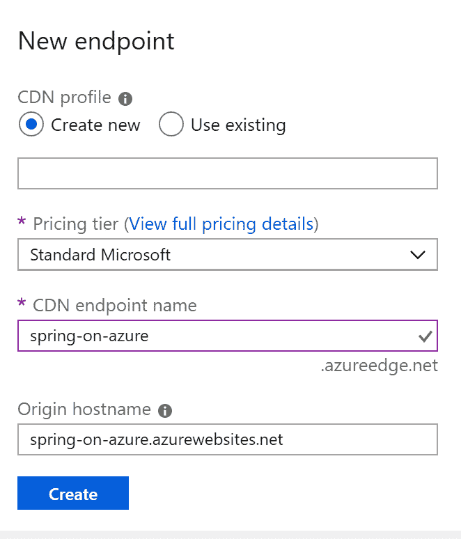

# 配置 Azure CDN 以提升角度性能(6/7)

> 原文：<https://dev.to/azure/configuring-azure-cdn-to-boost-angular-performance-6-7-5ebe>

这篇博客文章是“在 Azure 上部署 Spring Boot 和 Angular 应用程序”系列文章的一部分，下面是完整的文章列表:

*   [为 Azure (1/7)创建 Spring Boot 和角度应用程序](https://dev.to/jdubois/creating-a-spring-boot-and-angular-application-for-azure-1-7-2mb8)
*   [创建和配置 Azure Web App 和 MySQL 来托管 Spring Boot 应用程序(2/7)](https://dev.to/jdubois/creating-and-configuring-azure-web-app-and-mysql-to-host-a-spring-boot-application-2-7-1n13)
*   [使用 Azure Pipelines 构建、测试和部署 Spring Boot 和 Angular 应用程序(3/7)](https://dev.to/azure/using-azure-pipelines-to-build-test-and-deploy-a-spring-boot-and-angular-application-3-7-593j)
*   [与 Spring Boot 一起使用 Azure Application Insights(4/7)](https://dev.to/azure/using-azure-application-insights-with-spring-boot-4-7-263i)
*   [使用 Azure Application Insights 和 Angular (5/7)](https://dev.to/azure/using-azure-application-insights-with-angular-5-7-4kej)
*   配置 Azure CDN 以提升角度性能(6/7)
*   [配置 Azure Redis 缓存以提升启动性能(7/7)](https://dev.to/azure/configuring-azure-redis-cache-to-boost-spring-boot-performance-7-7-52dl)

每次发布帖子后，链接都会更新。

## 角度应用的性能问题

我们目前的 Angular 应用程序运行得非常好，事实上，当用 Chrome 审计工具测试它时，它的生产版本甚至得到了完美的“100”分。JHipster 团队一直在努力为您提供最好的应用，但我们仍然可以做得更好！

由于我们已经将所有内容生成到同一个项目中，所有客户端代码都由 Spring Boot 提供服务。这是我们经常听到的关于“全栈”项目的批评之一，通常是由 JHipster 产生的，由那些没有仔细研究这应该如何被托管的人产生的。

首先，这对于小项目来说完全没问题，而且更具成本效益，因为没有其他相关成本。

其次，这可以通过添加 HTTP/2 支持来改善:在 JHipster 中默认是禁用的，但是有一个`jhipster.http.version`属性可以设置为使用 HTTP/2。这是一个仅适用于 JHipster 的解决方案，所以如果你直接使用 Spring Boot，你需要做一些手动设置。

最后但同样重要的是，这里的最佳解决方案是使用内容交付网络(CDN ),因为:

*   它将提供现成的 HTTP/2 支持
*   它将使资产本地化，更接近您的用户，从而为他们带来更好的性能

## 天蓝色 CDN

在这篇文章中，我们将使用 [Azure CDN](https://azure.microsoft.com/en-us/services/cdn/?WT.mc_id=spring-on-azure-blog-judubois) ，因为它与 Azure Web App 完全集成，并且非常易于使用。

就价格而言，它是市场上较便宜的产品之一，每月花费不到 30 美元。再说一次，如果你预算有限，不要一开始就使用 CDN:“普通的”Spring Boot + Angular 应用程序(像 JHipster 创建的那些)开箱即用真的很好。重要的是以后能够扩展，并在需要时添加 CDN。

## 正确使用 CDN 的条件

CDN 将缓存所有资产:这意味着在向您的服务器发出一些请求后，所有请求都将直接从 CDN 得到服务，并从中受益。这意味着您的应用程序需要专门编码，以便与缓存配合使用:

*   静态资产的名称中应该有一个 hash，这样当一个新版本发布时，客户端浏览器将获取新的内容。
*   必须从服务器发送正确的 HTTP 头，因此只缓存正确的内容。
*   当对我们的 Spring Boot 后端进行 HTTP 调用时，请求不应该通过 CDN。

Angular 应用程序通常满足这三个条件，因为这些最佳实践现在在社区中是众所周知的。当然，JHipster 一直在密切关注这些，所以当您使用 JHipster 进行“生产”构建时:

*   所有资产都将被缩小，并且在它们的名称中有一个特定的散列。
*   Spring Boot 将发送正确的 HTTP 报头。
*   Webpack 构建中有一个名为`SERVER_API_URL`的参数，指向一个特定的 API 服务器。

## CORS 的注意事项

由于我们的内容和数据不在同一个服务器上，所以应该存在 CORS(跨源资源共享)问题。这意味着，默认情况下，您的 API 服务器将不会响应来自另一个域的请求:这对您的 API 服务器是好的(否则其他人可能会使用它)，但最重要的是对您的用户(因为这为许多攻击打开了大门)。

在 Spring Boot，你默认有这种保护。JHipster 在其基础上提供了一个易于使用的配置机制，但这只是简化了 Spring Boot 所提供的。

在生产中，你应该只允许你的角度应用在下面的`allowed-origins`参数中——我们使用的是`*`,因此接受来自任何地方的请求，这里是因为它更容易测试:

```
jhipster:
  cors:
    allowed-origins: '*'
    allowed-methods: '*'
    allowed-headers: '*'
    exposed-headers: 'Authorization,Link,X-Total-Count'
    allow-credentials: true
    max-age: 1800 
```

## 配置 Azure CDN

在您的 Azure Web 应用中，选择“网络”，然后选择“Azure CDN”。

然后，您可以创建一个新的 CDN 端点，它将在您现有的 Azure Web 应用程序上运行。当然，您还应该配置您的 DNS 服务器指向该 CDN，这样您的用户将在这里使用您自己的域名。

[](https://res.cloudinary.com/practicaldev/image/fetch/s--gVme1Vfo--/c_limit%2Cf_auto%2Cfl_progressive%2Cq_auto%2Cw_880/https://thepracticaldev.s3.amazonaws.com/i/curv5nia3mt6r0sz5jft.png)

这就是要做的全部工作，现在您可以测试一切工作正常:

*   使用您的浏览器，您可以检查您现在是否正在使用 HTTP/2 访问您的 web 应用程序。做 Chrome 审计也应该表明你现在尊重这个最佳实践。
*   如果您正在使用 JHipster，您可以访问“Metrics”屏幕，该屏幕允许您监控发送到您的服务器的 HTTP 请求的数量。您可以直接使用 CDN 和 Web 应用程序对应用程序进行一些“强制重载”:使用 CDN 时，您的应用程序应该会收到较少的 HTTP 请求。

在我们的应用程序中为这篇博文所做的更改都可以在这个提交中得到[。](https://github.com/jdubois/spring-on-azure/commit/f7e4390ba6e0905fc08a1def916a43bfebe25dfa)