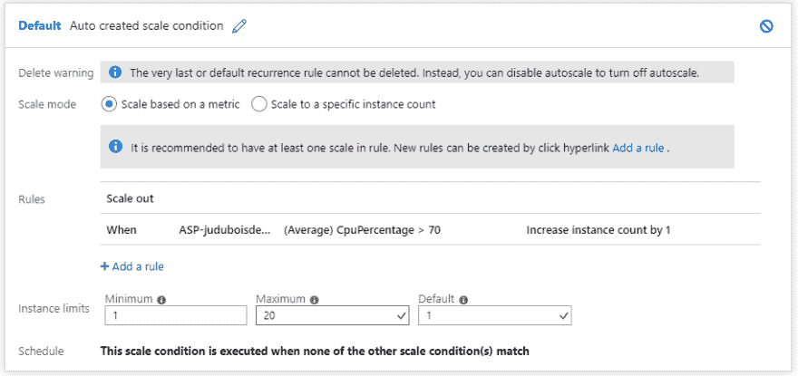
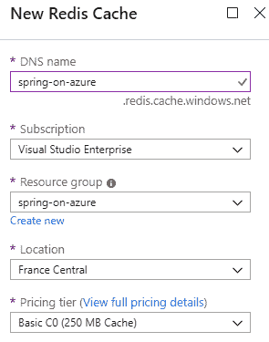
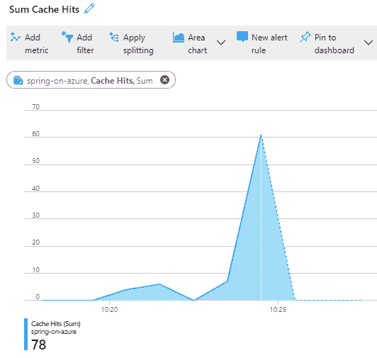

# 配置 Azure Redis 缓存以提升 Spring Boot 性能(7/7)

> 原文：<https://dev.to/azure/configuring-azure-redis-cache-to-boost-spring-boot-performance-7-7-52dl>

这篇博客文章是“在 Azure 上部署 Spring Boot 和 Angular 应用程序”系列文章的一部分，下面是完整的文章列表:

*   [为 Azure (1/7)创建 Spring Boot 和角度应用程序](https://dev.to/jdubois/creating-a-spring-boot-and-angular-application-for-azure-1-7-2mb8)
*   [创建和配置 Azure Web App 和 MySQL 来托管 Spring Boot 应用程序(2/7)](https://dev.to/jdubois/creating-and-configuring-azure-web-app-and-mysql-to-host-a-spring-boot-application-2-7-1n13)
*   [使用 Azure Pipelines 构建、测试和部署 Spring Boot 和 Angular 应用程序(3/7)](https://dev.to/azure/using-azure-pipelines-to-build-test-and-deploy-a-spring-boot-and-angular-application-3-7-593j)
*   [与 Spring Boot 一起使用 Azure Application Insights(4/7)](https://dev.to/azure/using-azure-application-insights-with-spring-boot-4-7-263i)
*   [使用 Azure Application Insights 和 Angular (5/7)](https://dev.to/azure/using-azure-application-insights-with-angular-5-7-4kej)
*   [配置 Azure CDN 以提升角度性能(6/7)](https://dev.to/azure/configuring-azure-cdn-to-boost-angular-performance-6-7-5ebe)
*   配置 Azure Redis 缓存以提升 Spring Boot 性能(7/7)

## 使用 Azure Web 应用进行横向扩展

从这个系列开始，我们就使用了 Azure Web Apps 的“向上扩展”选项。正如我们在第 3 部分中看到的[，我们能够动态地改变我们使用的实例，因此我们可以根据我们的负载和预算来扩大(或缩小)规模。这也是为什么我们在第 4 部分](https://dev.to/azure/using-azure-pipelines-to-build-test-and-deploy-a-spring-boot-and-angular-application-3-7-593j)设置了 Azure Application Insights [，以便更好地了解我们的需求。](https://dev.to/azure/using-azure-application-insights-with-spring-boot-4-7-263i)

现在，一个更好的扩展解决方案是“向外扩展”:我们不是用一个更大的实例来替换我们的实例，而是添加更多的实例。这允许更大的可伸缩性(在某些情况下，您不能购买更大的实例...)，而且更具成本效益，因为我们将只自动运行所需数量的实例。

为此，Azure 提出了一个“向外扩展”选项，就在“向上扩展”选项下，你可以在这里设置向外扩展的规则。例如，我们在这里定义了一个规则:当 70%的 CPU 被使用超过 10 分钟时，我们将自动启动新的实例，最多 20 个实例:

[](https://res.cloudinary.com/practicaldev/image/fetch/s--VcAFNNT5--/c_limit%2Cf_auto%2Cfl_progressive%2Cq_auto%2Cw_880/https://thepracticaldev.s3.amazonaws.com/i/n1x4vo4knuakbkmksm8d.png)

这种设置将允许我们的应用程序根据我们的工作负载自动伸缩。但这只是问题的一部分。

## 数据库有问题

向外扩展很棒，但是大多数时候性能问题来自数据存储。由于我们在这个问题上已经工作了几十年，这就是 JHipster 团队如此关注使用缓存的原因，因为这是消除这个数据存储问题的最佳方式。

让我们看看我们在数据存储性能方面有哪些选择:

*   我们可以为我们的数据存储购买一个更贵的实例:当然这至少在一段时间内是可行的，就像我们用 Azure Web App 研究的“向上扩展”机制一样。这里的主要问题是，我们希望有预算意识，快速查看高端数据库实例的价格会让您寻找其他解决方案。
*   我们可以使用 NoSQL 的数据库，通常是 CosmosDB。CosmosDB 是一个非常高效的分布式数据库，可以自动向外扩展。这是一个很好的选择，但它需要改变我们当前的数据库并依赖于 Azure:这不是本系列的主题，但请确保我们将在未来做一个具体的 CosmosDB 帖子，因为它是一项非常令人兴奋的技术。
*   使用 Hibernate 二级缓存:这是 Hibernate 中包含的缓存机制，如果使用正确，它会非常强大。这将是我们推荐的解决方案，但是这里的问题是我们将进行横向扩展(参见上一节)，这要求我们拥有分布式缓存。
*   使用 Spring Cache 抽象:这是一个非常简单但非常强大的机制，允许您缓存方法调用。正确使用时，这可能比 Hibernate 二级缓存更强大，因为它在业务级工作，所以可以缓存更复杂的对象。至于 Hibernate，这将要求我们使用分布式缓存解决方案。

最后两个选项显然是我们用例的最佳选择，但它们都要求我们有一个分布式缓存解决方案，否则一旦我们的 Azure Web App 实例向外扩展，我们就会看到一些无效数据。

## 缓存选项和问题

在 Java 中，我们通常有三种缓存:

*   本地 JVM 缓存:它们是最快的，因为获取数据通常只需使用指向该数据的指针，该指针可直接在内存中获得。但是它们从 JVM 堆中获取内存:随着缓存的增长，JVM 的垃圾收集器将会遇到越来越多的麻烦，导致应用程序性能下降。
*   堆外缓存:它们运行在 JVM 旁边的另一个进程中。因此，他们不使用网络，但是当数据在两个进程之间移动时，他们需要对数据进行序列化/非序列化，这是非常昂贵的。所以这个缓存比本地 JVM 缓存慢得多，但是它可以增长到千兆字节的数据而不会影响 JVM。
*   远程缓存:它们类似于堆外缓存，但是运行在另一个服务器上。这通常允许有更大的缓存(因为它们是在特定的高内存实例上设置的)，但是由于它们需要网络访问，所以会比较慢。

存在几种众所周知的解决方案，并且通常得到 JHipster 的支持:

*   Ehcache，不幸的是它没有一个可扩展的 API(一旦创建了集群，就不能添加新的节点)。
*   Hazelcast 和 Infinispan，它们可以使用 API 进行扩展，但需要一种机制，以便新节点注册到现有集群。这就是 JHipster 通过 [JHipster 注册中心](https://www.jhipster.tech/jhipster-registry/)提供的功能。

这里，我们将使用 Redis，这是一个众所周知的内存中数据存储，通常用作缓存。与 Hazelcast 和 Infinispan 相比，它有一些独特的选项:

*   它只是作为一个“远程缓存”，所以可以存储更多的数据，也不会污染你的 JVM，但是对于非常频繁使用的数据会比较慢。
*   作为托管服务，它将自动“向外扩展”,不再需要像 [JHipster Registry](https://www.jhipster.tech/jhipster-registry/) 这样的东西在集群中注册节点。
*   它是完全开源的，所以你可以用它来存储大量的数据，而不需要为“企业版”付费。

## 什么是 Redis 的 Azure 缓存

[Azure Cache for Redis](https://azure.microsoft.com/en-us/services/cache/?WT.mc_id=devto-blog-judubois) 是一个完全托管的 Redis 缓存，由 Azure 托管。

它有一个非常便宜的第一层，因为你可以每月花大约 16 美元获得一个缓存，当然，如果你花更多的钱，它可以增长到一个巨大的分布式缓存和地理复制。您可以在此找到所有[定价详情。](https://azure.microsoft.com/en-us/pricing/details/cache/?WT.mc_id=devto-blog-judubois)

对于我们当前的使用情形，这是一个非常好的选择，因为我们试图节省预算，而且它可以毫无困难地向外扩展。

如果你想了解更多信息，[这里是关于 Redis 的 Azure Cache 的完整文档](https://docs.microsoft.com/en-us/azure/azure-cache-for-redis/?WT.mc_id=devto-blog-judubois)。

使用 [Azure portal](https://portal.azure.com/?WT.mc_id=devto-blog-judubois) 为 Redis 设置 Azure 缓存很容易，只需使用搜索框来创建它(注意选择正确的实例，因为价格可能会很快上涨！):

[](https://res.cloudinary.com/practicaldev/image/fetch/s--fceA3D0E--/c_limit%2Cf_auto%2Cfl_progressive%2Cq_auto%2Cw_880/https://thepracticaldev.s3.amazonaws.com/i/nnvrb5m7tte7ve847q4v.png)

## Redis 采用 Hibernate 二级缓存和 Spring 缓存抽象

使用 Redis，有几个 Java 库可以支持 Hibernate 二级缓存和 Spring 缓存抽象:

*   [Redisson](https://github.com/redisson/redisson) 支持 Hibernate 二级缓存和 Spring 缓存抽象。如果你想解锁它最好的功能，你将需要购买“pro”版本，但开源版本已经足够满足大多数需求。
*   Jedis 是一个非常著名的 Redis 客户端，它只支持 Spring 缓存抽象。它通常被视为 Java 中“事实上的”标准 Redis 客户机。
*   [莴苣](https://lettuce.io/)是 Spring Boot 使用的默认库，只支持 Spring Cache。它基于 Netty 并且是线程安全的(不像 Jedis ),所以它可以支持更多的连接并且性能更好。

在这篇文章中，我们将使用莴苣，因为它是 Spring Boot 的默认选项，而且看起来确实是最好的完全开源选项。

## 为 Redis 配置 Spring Boot 和 Azure 缓存

首先，我们将`spring-boot-starter-data-redis`库添加到我们的`pom.xml` :

```
<dependency>
    <groupId>org.springframework.boot</groupId>
    <artifactId>spring-boot-starter-data-redis</artifactId>
</dependency> 
```

然后我们添加了一个特定的 Spring Boot 配置类，所以 Redis 只在生产模式下工作。在开发模式中，没有缓存，一切都一样，这将使我们的开发设置更容易:

```
package io.github.jdubois.bugtracker.config;

import io.github.jhipster.config.JHipsterConstants;

import org.springframework.cache.annotation.EnableCaching;
import org.springframework.context.annotation.Configuration;
import org.springframework.context.annotation.Profile;

@Configuration
@EnableCaching
@Profile(JHipsterConstants.SPRING_PROFILE_PRODUCTION)
public class CacheConfiguration {
} 
```

我们在我们的`application-prod.yml` Spring Boot 配置文件:
中配置 Redis

```
spring:
  cache:
    type: redis
  redis:
    ssl: true
    host: spring-on-azure.redis.cache.windows.net
    port: 6380
    password: Y27iYghxMcY1qoRVyjQkZExS8RaHdln4QfLsqHRNsHE= 
```

**重要提示:**许多人使用不安全的 Redis 实例，通常是因为他们的 Redis 库不支持 SSL。上面的 Yaml 配置向您展示了如何正确地做到这一点:请注意，Azure Cache for Redis 使用端口 6300 进行 SSL，并且它的非安全端口在默认情况下是禁用的(但现在没有借口启用它！).

为了测试我们的代码，我们还在`ProjectResource`类的 REST 方法中添加了一些缓存:

```
@GetMapping("/projects")
@Cacheable("projects")
public List<Project> getAllProjects() {
    log.error("REST request to get all Projects");
    return projectRepository.findAll();
} 
```

这只是为了测试，因为这段代码很快就会出现缓存失效的问题(您需要使用`@CacheEvict`注释来获得一个工作的缓存)，但是这将使您很容易测试您的缓存是否工作正常。

一旦完成，你应该能够通过 [Azure 门户](https://portal.azure.com/?WT.mc_id=devto-blog-judubois)监控你的缓存:

[](https://res.cloudinary.com/practicaldev/image/fetch/s--ELzSxeGW--/c_limit%2Cf_auto%2Cfl_progressive%2Cq_auto%2Cw_880/https://thepracticaldev.s3.amazonaws.com/i/tk2i4v1e4mijpawo9zcg.png)

对这篇博客文章所做的所有修改都可以在[提交](https://github.com/jdubois/spring-on-azure/commit/cfdf1e361bbd8d986d4bf5ab80b8ee6b98c8883c)时获得。