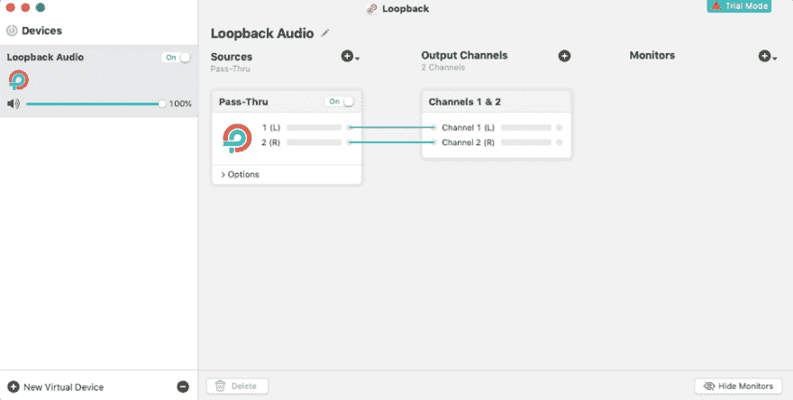
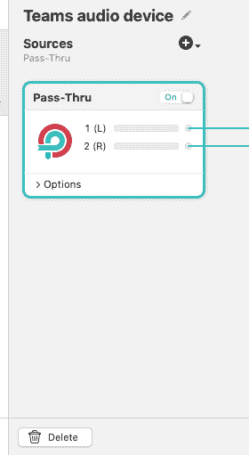
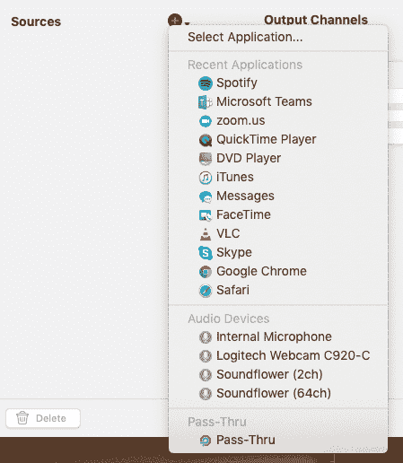
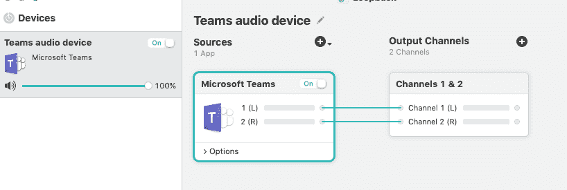
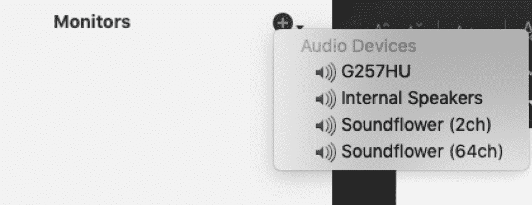

# 为 OBS 上的音频记录配置环回

> 原文：<https://dev.to/eatskolnikov/configuring-loopback-for-audio-recording-on-obs-4fk6>

今天我要说一点题外话。在 Megsoft，我们使用这个叫做 [Loopback](https://rogueamoeba.com/loopback/) 的工具，它允许你将音频输出从一个应用程序路由到一个虚拟音频设备。如果你要做流媒体，这个功能非常有用。我们用它来制作两个在线节目，分别叫做 DevBorrachos 和 the。网络星期五秀。

这里有一个关于[环回](https://rogueamoeba.com/loopback/)如何工作以及如何用 [OBS](https://obsproject.com/) 设置它的小指南:

首先你要下载安装[回环](https://rogueamoeba.com/loopback/)。有一个免费版本，使用 20 分钟后会降低音频质量，还有一个付费许可证，价格为 99 美元。

启动它，您会看到类似这样的内容:

**Pass-Thru** source 允许其他应用程序将音频直接发送到这个虚拟设备，但这不是我们现在想要的，因此我们将删除它。要移除**直通**设备，选择它并点击下面的**删除**按钮。

接下来，我们将为我们希望它收听的应用程序重命名虚拟设备，在这种情况下，我将把它命名为**“Teams Audio Device”**，因为我想收听 Microsoft Teams 视频通话进行采访等。要重命名音频设备，您必须单击音频设备名称旁边的铅笔按钮。

若要选择您想要收听的应用程序，请点按“来源”标题旁边的加号(+)按钮，并从出现的列表中选取应用程序。

您可以将信号源设置为收听音频设备或任何应用程序，如 Skype、Zoom、Chrome、Spotify 等。在本练习中，我们将使用 Microsoft Teams。选择应用程序后，您会看到如下内容:

注意从信号源到输出通道的蓝色线条。这些将立体声输出从应用音频映射到虚拟设备的输出。你可以在你空闲的时候移除或者交换它们。现在，在大多数情况下，你想离开他们。

设置完成后，来自所选应用程序的所有音频将通过我们映射的输出通道运行，我们将无法听到来自我们的标准输出设备(如耳机或计算机内部音频设备)的音频。

为了让我们能够从本地机器上听到应用程序的声音，我们需要设置一个**监视器**。

监视器是音频设备，我们可以在其中检查输出通道捕获的音频。我们可以添加一个监视器，方法是按下监视器标题旁边的加号(+)，然后选择我们想要输出音频的设备。

到最后我们会得到这样的东西:

现在我们的设备已经配置好了。要创建新的虚拟设备，请单击“New Virtual Device button ”(新建虚拟设备按钮),并遵循与之前相同的步骤。

**设置 OBS**

我们打开 OBS，为了使用新创建的虚拟设备，我们从 Sources 选项卡添加了一个新的**音频输入捕获**。

从对话框中，我们选择我们创建的设备，该设备的名称是我们从一开始就给它起的。在这种情况下是“团队音频设备”

包含音频输入捕获后，我们可以确认音频是从混音器选项卡接收的

现在，您可以像往常一样进行流媒体播放或录制，音频应该可以正确反映您配置的应用程序。就我们在 Megsoft 的情况而言，我们采访了科技界的知名人士，并与他们进行了一些闲聊。我们使用微软团队等网络会议应用程序，该工具已被证明有助于提供高质量的音频。如果你想查看流媒体，你可以在 Youtube 上查找。如果你觉得这个指南有用，我鼓励你和你妈妈分享，她很想你，可能会很高兴收到你的来信。

帖子[为 OBS](https://blog.torib.io/2019/04/05/configuring-loopback-for-audio-recording-on-obs/) 上的音频记录配置环回首先出现在 [Enmanuel Toribio](https://blog.torib.io) 上。