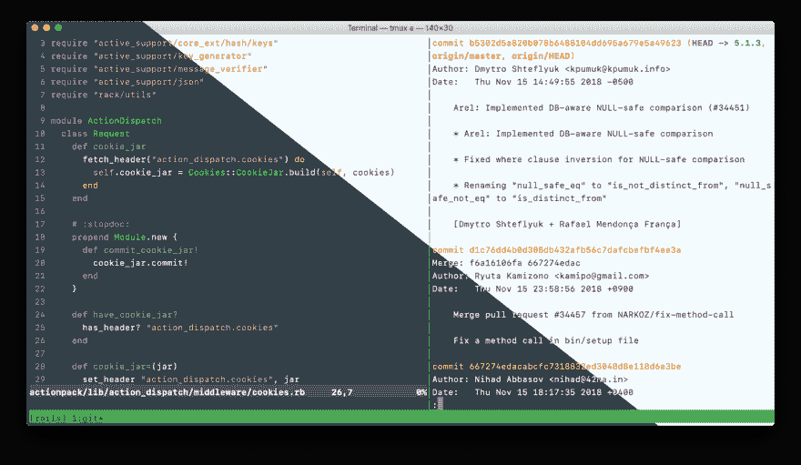
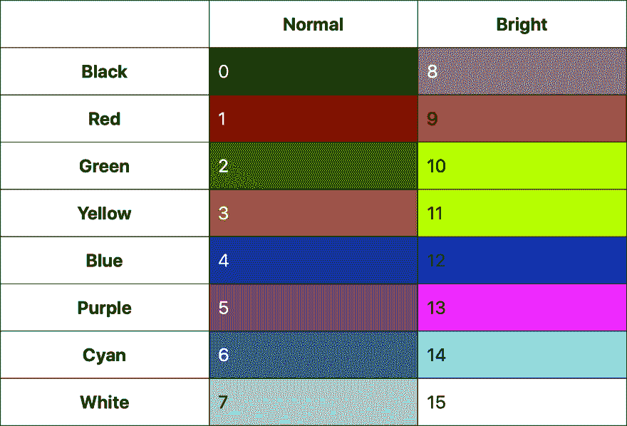
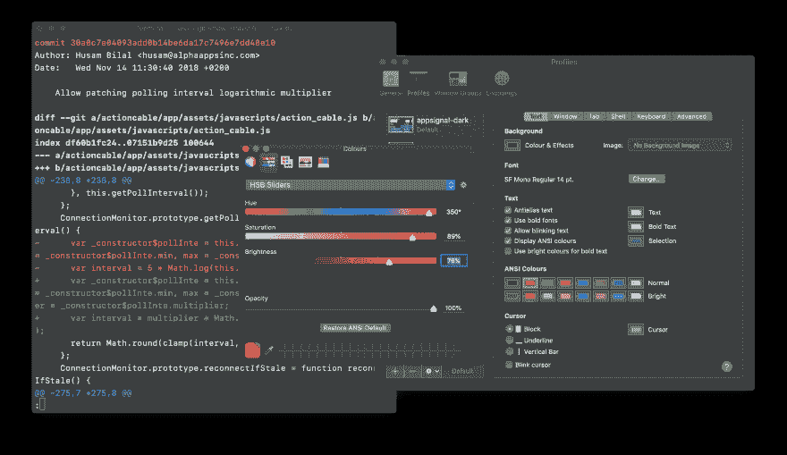
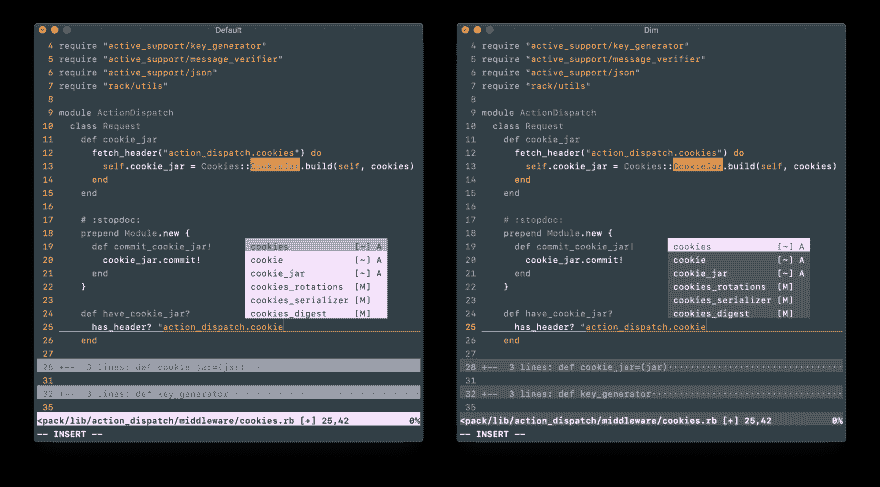

# 具有 16 种 ANSI 颜色 Vim 主题的一致终端颜色

> 原文：<https://dev.to/jkreeftmeijer/consistent-terminal-colors-with-16-ansi-color-vim-themes-32a1>

*最初发表于 2018 年 11 月 29 日[jeffkreeftmeijer.com/vim-16-color](https://jeffkreeftmeijer.com/vim-16-color/)。*

将 Vim 的配色方案限制为 16 种 ANSI 颜色，而不是分别为 Vim 和终端的其余部分配置颜色，这允许在终端的主题中设置所有的颜色首选项。这样做的结果是，终端实用程序中的颜色一致，颜色主题可以很快替换为另一个。

<figure>

[](https://res.cloudinary.com/practicaldev/image/fetch/s--pL-ZXWGM--/c_limit%2Cf_auto%2Cfl_progressive%2Cq_auto%2Cw_880/https://thepracticaldev.s3.amazonaws.com/i/d452kmnpzl2va7mmsxgy.png)

<figcaption>Figure 1\. Vim and a git log side by side in tmux in Terminal.app. By using [Dim](https://github.com/jeffkreeftmeijer/vim-dim) as Vim’s color scheme, all color values are set by the [terminal theme](https://github.com/jeffkreeftmeijer/appsignal.terminal) (showing both dark and light mode). The font is SF Mono, 14pt, with a line spacing of 1.2.</figcaption>

</figure>

在过去的几年里，我一直在使用[Vim 默认配色方案的定制版本。与 Vim 的默认值不同，它专门使用 16 种 ANSI 颜色，将每种颜色设置为 0 到 15 之间的值。终端模拟器的主题设置特定的颜色值，而不是将它们硬编码到 Vim 配色方案中并依赖真彩色支持。](https://github.com/jeffkreeftmeijer/vim-dim)

通过独占使用终端主题，所有实用程序都使用相同的颜色值。例如，我不配置 tmux 的颜色，因为终端主题使用的绿色已经是我喜欢的颜色了。

## 终端颜色和 ANSI 转义序列

终端模拟器使用 ANSI 转义序列在打印输出时读取所需的文本和背景颜色，以及控制光标的位置。

```
$ echo -e "\033[31mred\033[m" # Prints “red” in red.
```

虽然大多数终端模拟器，包括苹果的 Terminal.app，现在都支持真彩色，但大多数实用程序都使用 16 种主要颜色中的一种(黑色、红色、绿色、黄色、蓝色、品红色、青色、白色，以及每种颜色的一种*高亮度*或*明亮*版本)。

例如，git 用绿色显示添加，红色显示删除，大多数测试框架打印通过测试的绿点和失败的红点。

[](https://res.cloudinary.com/practicaldev/image/fetch/s--O5JuUibF--/c_limit%2Cf_auto%2Cfl_progressive%2Cq_auto%2Cw_880/https://thepracticaldev.s3.amazonaws.com/i/t1yvudpz4t0je5i42jlj.png)

我们今天使用的终端模拟器给这些*相对*命名的颜色分配一个 24 位颜色值。这将实用程序的*意图*(“用红色打印该错误”)与终端模拟器的*风格*(“# c 31633 是一种不错的红色”)。这些颜色可在终端模拟器的设置中配置，以及所用的字体和其他选项。

> ### 8 位和 24 位 ANSI 颜色
> 
> 除了编号为 1 到 16 的前十六种命名颜色，我们到达了绝对颜色领域。从 16 到 255 的颜色代码用于打印 8 位颜色，其中 232 到 255 是从黑到白的灰度值。
> 
> ```
> # prints “hotpink” in #205 (HEX: #f69, RGB: 255, 102, 153)
> $ echo -e "\033[38;5;205mhotpink\033[m"
> ```
> 
> 然后，有 24 位颜色，也称为*真彩色*，它有 16.777.216 个不同的颜色值。
> 
> ```
> # prints “giant goldfish” in 24-bit orange (HEX: #F38630, RGB: 243, 134, 48)
> $ echo -e "\033[38;2;243;134;48mgiant goldfish\033[0m"
> ```
> 
> 作为绝对颜色值，它们不能在终端模拟器的设置中配置。

## 终端主题

通过改变终端主题，使用一个像 [appsignal.terminal](https://github.com/jeffkreeftmeijer/appsignal.terminal) 或其他可用主题中的任何一个[数百个](https://github.com/lysyi3m/osx-terminal-themes)，终端模拟器可以显示你喜欢的任何真彩色值的相关颜色。例如，使用红色的`#C31633`将 git 的 diff 输出中的删除部分用那种颜色着色。



> **提示:**在 Terminal.app 中，使用``⌘` + `I`` 打开检查器，改变当前窗口的主题，无需打开新的终端窗口。

在终端模拟器的配置文件中设置精确的颜色值或使用终端主题，允许实用程序将某些输出标记为“黄色”，而不必提供精确的色调。色调取决于终端或用户的偏好。

## Vim 配色方案

与其他实用程序不同，Vim 使用 8 位或 24 位配色方案，这些配色方案对每个高亮组使用绝对颜色，试图使每个配置的颜色看起来都一样。这些方案不使用任何命名的颜色，因此终端的颜色偏好不会影响它们。

当在终端模拟器中使用 Vim 时，要使 Vim 和终端的其他部分具有一致的颜色，需要重复的颜色设置。首先，Vim 配色方案为每个高亮组使用一个绝对颜色值。然后，终端模拟器需要一个主题，该主题使用与 Vim 方案相同的颜色来自定义相对颜色。

例如，如果 Vim 配色方案使用`#C31633`作为红色，终端主题需要使用该颜色作为“红色”ANSI 颜色，以便在 Vim 之外的 git diffs 中使用相同的颜色。

### dim:16 色 Vim 配色方案

为了在所有终端实用程序中实现一致的颜色，而不需要重复的颜色设置，4 位 Vim 配色方案，如 [Noctu](https://github.com/noahfrederick/vim-noctu) 和 [Dim](https://github.com/jeffkreeftmeijer/vim-dim) 专门使用前 16 种相对 ANSI 颜色。这使它们与 16 色终端兼容，但也使终端实用程序之间的颜色一致。

Dim 基于 Vim 的默认配色方案。尽管 Vim 的默认设置大多使用相对颜色，但它对一些高亮组使用 8 位绝对颜色。默认情况下，它将行号和语句涂成棕色，将浅蓝色和深蓝色区分开来，将完成菜单涂成粉红色，将注释涂成 ANSI 蓝色。因为那会分散注意力，Dim 对这些都使用灰色。

<figure>

[](https://res.cloudinary.com/practicaldev/image/fetch/s---WcdeyCz--/c_limit%2Cf_auto%2Cfl_progressive%2Cq_auto%2Cw_880/https://thepracticaldev.s3.amazonaws.com/i/gddgeea70iw53wg8aza7.png)

<figcaption>Figure 2\. Vim’s default color scheme (left) and Dim, both with appsignal.terminal as the terminal theme. Dim has dimmed colors for secondary features like completion menus, line numbers and folds.</figcaption>

</figure>

通过将目的与终端主题中的样式和特定颜色值分开，终端中的每个工具都使用一致的颜色。这使得改变主题——比如在主题的暗版本和亮版本之间切换——只需按下``⌘` + `I`` 并选择另一个，而不必为 Vim 找到匹配的配色方案。