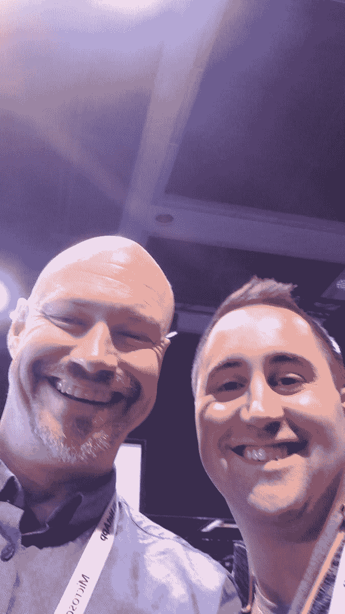

# 为 OSS 做贡献:开始

> 原文：<https://dev.to/jimbuck/contributing-to-oss-getting-started-5dm0>

软件开发最美好的一面是有机会为开源软件做贡献。很长一段时间以来，我想为我每天使用的库或框架做点贡献。

唯一的问题是，每当我有尝试的动力时，我很容易被看似高压的情况吓倒(剧透:其实不必如此)。通过从小处着手并保持专注，为一个广泛使用的项目做你的第一次公关对社区来说既有趣又有益。

> Jon Galloway@ jongalloway周一晚上与 [@jimbuckio](https://twitter.com/jimbuckio) 谈论了如何通过向 [@docsmsft](https://twitter.com/docsmsft) 贡献小补丁来开始为 [@dotnet](https://twitter.com/dotnet) 开源做出贡献。他在路边停下来。NET 开源 booth 告诉我他的第一个 pull 请求刚刚被合并。[# MSBuild](https://twitter.com/hashtag/MSBuild)2019 年 05 月 08 日下午 19:1405

所以在和乔恩·盖洛威聊过之后。NET Foundation 之后，我坐下来解决了我在 ASP.NET 核心文档中发现的一个问题。我创建了拉取请求，第二天早上醒来发现它已经合并了！这并不总是那么容易，但是遵循这些简单的步骤，你很快就会成为一个受人尊敬的贡献者。

## 第一步:发现问题

虽然看起来很明显，但最重要的一步是找到问题。不是一般的问题，而是好问题。什么使一个问题变得好？只要找到一些看起来不对的地方，问自己这些问题:

1.  变化有清楚明显的原因吗？如果一个改变修复了一个致命的错误，那么它是一个值得追求的修复。如果有无可争议的证据表明文档的某个部分是错误的，那么就值得进行修复。关键是确保用户和维护者都有改变的动机。如果你想对 API 进行修改，因为你认为它会更好，那么也许你应该在花费更多时间之前，首先从创建一个问题开始，从维护者那里获得一些输入。
2.  **能不能简洁明了的搞定？对一些人来说，重构/重写可以是一种宣泄。但是仅仅因为重写后你感觉更好并不意味着这是个好主意。保持最小和特定的变化将在两个方面有所帮助。首先，它将使你的修改易于阅读，这将有助于加快审查过程。第二种方法是最大限度地减少出现新错误或问题的机会。如果引入了新的 bug，再多的清理也是不值得的。**
3.  已经有解决方案了吗？在深入研究解决方案之前，确保其他人没有尝试过。如果有，请再次检查状态。在这一点上，它可能是待定的，被放弃的，或者仅仅是过时的。开源进展很快，所以先调查一下以免浪费时间。

## 第二步:叉&搞定

信不信由你，你的第一份开源贡献中最简单的部分应该是分叉和修复。GitHub 让分叉变得超级简单，只需导航到库并点击“Fork”按钮！

 

<figcaption>GitHub 的资源库交互选项</figcaption>

一旦您有了自己的 repo 分支，您就可以将其克隆到您的开发环境中进行编辑。从技术上来说，你可以选择从 GitHub 在线编辑它，但正如我在下一步中提到的，最好克隆回购，这样你就可以确保更改通过测试和编码标准。

最后，在应用修复时，尽量将更改限制在修复所需的范围内。小变化意味着快速审核，这可能会增加合并的机会。如果你觉得变化像滚雪球一样越滚越大，就去找项目维护人员寻求一些指导。

## 第三步:测试&拉动请求

如果每个人都测试他们的代码，这个世界将会变得更加美好。对我来说，人们在没有验证它是否有效的情况下就做出改变并提交，这绝对是疯狂的！持续集成是一种福气，它允许团队快速移动，同时保持稳定的分支。但这并不意味着我们应该只依赖 CI。在做公关之前，尽可能严格地测试你的改变是至关重要的。它有助于确保您所做的更改是正确的，并且有助于避免浪费维护人员的宝贵时间。

一旦你成功地测试了你的改变，你就可以[创造你的公关](https://help.github.com/en/articles/creating-a-pull-request)！一定要提供一个清晰简洁的标题，这样维护人员可以很容易地对 PR 进行分类。在描述中，一定要包括关于变更动机的细节，问题是如何解决的，以及任何其他有助于维护者回顾变更的支持细节。

创建 PR 时，有时存储库会有一个贡献者许可协议(CLA)。这只是一个协议，意味着社区可以使用您的更改。这通常需要不到 5 分钟，只需要做一次，所以不要被它吓倒。

## 第四步:耐心倾听并坚持下去

通过一些运气和努力工作，一旦维护者看到你的 PR 就会被合并进去。他们也可以提供更多的变更请求或者简单地问一些问题。

> 开源软件的一个重要部分是能够一起工作并接受批评。在一个社区中，尊重是最重要的。

花时间了解他们的反馈，并与他们一起努力，以达到最佳结果。如果结果是合并的公关，那就太好了！但是如果他们仍然不满意这些改变，不要因此而沮丧。坚持下去，把它作为学习和成长的机会。

最后，如果他们关闭了它(或者更糟的是，从不回复它),那么不要担心！任何为开源软件做出贡献的人都会在职业生涯的某个时刻获得一份封闭的 PR。我的建议是从第一步开始，找到一个好的问题来修复。GitHub 项目通常会有类似于`good first issue`或`help wanted`标签的问题，这对新贡献者来说是很好的。

## 结论

为开源软件做贡献是所有开发人员都应该尝试的一项工作。我们每天都在免费使用这么多奇妙的工具和框架。但是对于维护者和他们的家庭来说，它们不是免费的。回报那些努力工作的人，让你的社区变得更好。

如果您有任何问题，请[在 twitter 上联系我](https://twitter.com/jimbuckio)！我很乐意帮助任何人的第一次(或第 100 次)公关！