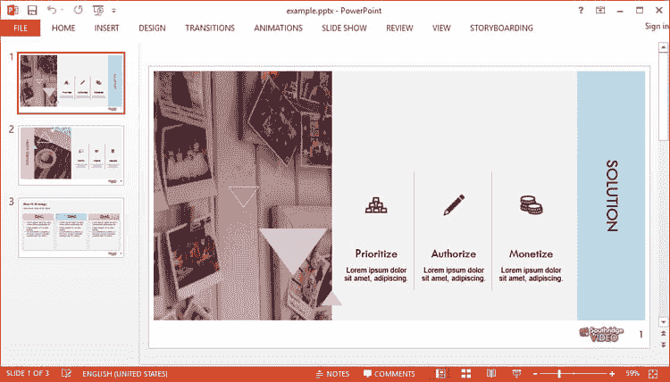
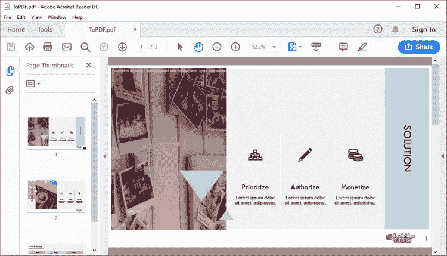
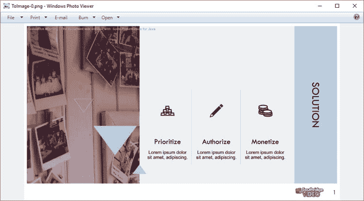

# 用 Java 将 PPT(X)转换成 PDF 和图像

> 原文：<https://dev.to/eiceblue/convert-pptx-to-pdf-and-images-in-java-49cc>

与 PowerPoint 相比，PDF(或图像)文件格式的优势在于:

*   更适合归档，因为 PDF/图像文件在页面布局上是固定的，很难修改。
*   更便于交付，因为 PDF/图像文件与大多数设备兼容。

出于上述原因，您可能会将 PowerPoint 文档转换为 PDF 文件或多个图像文件。本文将向您展示如何使用 [Spire 来完成这项任务。Java 的演示文稿](https://www.e-iceblue.com/Introduce/presentation-for-java.html)。

下面是输入 PowerPoint 文档的屏幕截图。

[](https://res.cloudinary.com/practicaldev/image/fetch/s--uQ9Y0t7o--/c_limit%2Cf_auto%2Cfl_progressive%2Cq_auto%2Cw_880/https://thepracticaldev.s3.amazonaws.com/i/w8e1wjix66kjpbj4hu2n.jpg)

## PPT(X)到 PDF

使用 Spire.Presentation 可以非常容易地将 PowerPoint 转换为 PDF。只需创建一个 Presentation 类的对象来保存要转换的 PowerPoint 文件，然后调用同一对象的 saveToFile()方法将您的文档保存为 PDF 文件。

```
import com.spire.presentation.Presentation;
import com.spire.presentation.FileFormat;

public class PPTXtoPDF {

    public static void main(String[] args) throws Exception {

        //create a Presentataion instance
        Presentation presentation = new Presentation();

        //load the sample PowerPoint file
        presentation.loadFromFile("C:/Users/Administrator/Desktop/template.pptx");

        //save to PDF file
        presentation.saveToFile("ToPDF.pdf", FileFormat.PDF);
        presentation.dispose();
    }
} 
```

[](https://res.cloudinary.com/practicaldev/image/fetch/s--2LCwoSPA--/c_limit%2Cf_auto%2Cfl_progressive%2Cq_auto%2Cw_880/https://thepracticaldev.s3.amazonaws.com/i/d5i8p8gwuyppqp97uqlw.jpg)

## [t1(x)像素是 PNG](#pptx-to-png)

要将 PowerPoint 幻灯片导出为图像，首先需要使用 saveAsImage()方法将每张幻灯片保存为 BufferdImage，然后将图像数据写入。png 文件格式。

```
import com.spire.presentation.Presentation;

import javax.imageio.ImageIO;
import java.awt.image.BufferedImage;
import java.io.File;

public class ConvertPPTXtoPNG {

    public static void main(String[] args) throws Exception {

        //create a Presentation object 
        Presentation presentation = new Presentation();

        //load an example PPTX file 
        presentation.loadFromFile("C:/Users/Administrator/Desktop/template.pptx");

        //loop through the slides 
        for (int i = 0; i < presentation.getSlides().getCount(); i++) {

            //save each slide as a BufferedImage 
            BufferedImage image = presentation.getSlides().get(i).saveAsImage();

            //save BufferedImage as PNG file format 
            String fileName =  String.format("ToImage-%1$s.png", i);
            ImageIO.write(image, "PNG",new File(fileName));
        }
        presentation.dispose();

    }
} 
```

[](https://res.cloudinary.com/practicaldev/image/fetch/s--WUPEUdzv--/c_limit%2Cf_auto%2Cfl_progressive%2Cq_auto%2Cw_880/https://thepracticaldev.s3.amazonaws.com/i/l0uzyc459ktdd17mvz84.jpg)