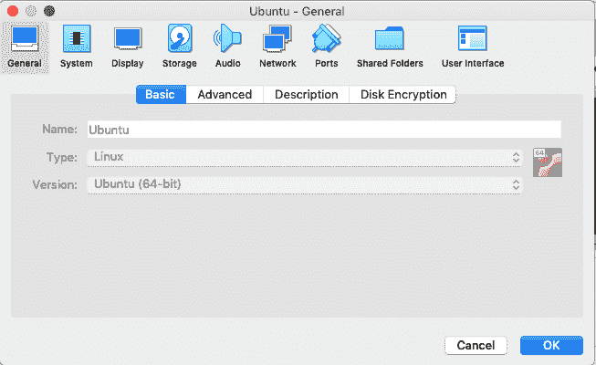
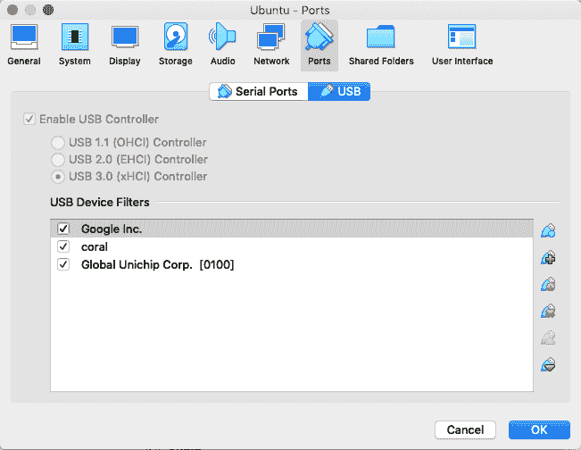
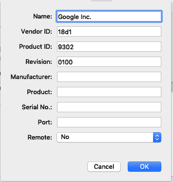

# Coral EdgeTPU USB 加速器和 VirtualBox

> 原文：<https://dev.to/0xkoji/coral-edgetpu-usb-with-virtualbox-57e1>

我上个月买了珊瑚 u 盘。我一直在用覆盆子 Pi3 玩那个。这是一款非常酷的产品，因为 Coral USB 的性能非常好。

[https://www . insta gram . com/p/bxsmi 5 qfiz/](https://www.instagram.com/p/BxSmI5QFIUZ/)

但是，问题是 Raspberry Pi3B+不能使用 USB3.0，这意味着 Pi 和 Coral 之间的数据传输是有限的。

所以我很想用 Coral 搭配 USB3.0，然而，不幸的是最近 Parallel Desktop lite 拿到了一个付费软件，我没有安装在 Mac 上(不确定为什么)。

在这篇文章中，我将解释如何为`Coral`设置 VirtualBox env。我想距离我上次使用 VirtualBox 已经有一段时间了。

[https://www.instagram.com/p/BxYIPQzFbfI/](https://www.instagram.com/p/BxYIPQzFbfI/)

## 1 获取 VirtualBox

你需要得到最新的版本，因为我尝试使用 5.2.22(不是最新版本)，花了这么多时间，然后它不工作。有一次我从 5.2.22 换到 6.0.6。一切都很完美。
[https://www.virtualbox.org/wiki/Downloads](https://www.virtualbox.org/wiki/Downloads)

## 2 获取 Ubuntu (LTS 版)

我觉得你可以用 16.04 或者 18.04。我使用 18.04，因为我用它来训练模型。也许可以用 19.04，但不确定。

[https://www.ubuntu.com/download/desktop](https://www.ubuntu.com/download/desktop)

## 3 在 VirtualBox 上安装 Ubuntu

如果你没有任何使用 VirtualBox 的经验，这篇文章非常有用。

[https://medium . com/@ tushar 0618/install-Ubuntu-16-04-lts-on-virtual-box-desktop-version-30 dc6 f 1958d 0](https://medium.com/@tushar0618/install-ubuntu-16-04-lts-on-virtual-box-desktop-version-30dc6f1958d0)

## 4 添加 USB 设备过滤器

`This is the most important part of this article.`
`When you do this, you have to turn off your virtual machine`
设置>端口>USB
T5T7】

(机器正在运行。抱歉，我很懒...)
[T3】](https://res.cloudinary.com/practicaldev/image/fetch/s--oh83Jarb--/c_limit%2Cf_auto%2Cfl_progressive%2Cq_auto%2Cw_880/https://thepracticaldev.s3.amazonaws.com/i/elvq26ww57ah4np367vq.png)

如果关闭机器电源，可以选择`USB3.0`。~~然后你需要添加 2 个 USB 设备过滤器。~~大概你只需要加上下面一条。

3-1.点击添加按钮
3-2。选择`Global Unichip Corp [0100]`
3-3。再加一个
3-4。选择一个您添加的滤镜并编辑滤镜设置
[](https://res.cloudinary.com/practicaldev/image/fetch/s--B7WmDU5x--/c_limit%2Cf_auto%2Cfl_progressive%2Cq_auto%2Cw_880/https://thepracticaldev.s3.amazonaws.com/i/cgdf9a5vnm8abo9ai8ll.png)

名称:可以放任何你想要的东西
供应商编号:18d1
产品编号:9302

## 5 设置 EdgeTPU

我们快到了。你可以点击链接。
[https://coral.withgoogle.com/docs/accelerator/get-started/](https://coral.withgoogle.com/docs/accelerator/get-started/)

似乎 Google 更新了 edgetpu，所以我们不再需要更改安装 shell 脚本了，但我认为 edgetpu 是针对 python3.5 优化的。
所以我为此建立了一个虚拟环境。正如你所知，有一些方法来建立虚拟环境。virtualenv、virtualenvwrapper、pyenv、pipenv 和 anaconda。为此，我决定使用 Anaconda，因为它只需要键入几个命令来设置 python3.5 环境。

数字海洋有一篇很好的文章。
[https://www . digital ocean . com/community/tutorials/how-to-install-anaconda-on-Ubuntu-18-04-quick start](https://www.digitalocean.com/community/tutorials/how-to-install-anaconda-on-ubuntu-18-04-quickstart)

激活你的虚拟环境后，你可能需要这个。

```
$ pip install edgetpu-1.9.2-py3-none-any.whl 
```

Enter fullscreen mode Exit fullscreen mode

## 6 运行演示

跟着官方指南走就行了(easy easy easy)

```
$ cd /usr/local/lib/python3.6/dist-packages/edgetpu/demo

$ python3 classify_image.py \
--model ~/Downloads/mobilenet_v2_1.0_224_inat_bird_quant_edgetpu.tflite \
--label ~/Downloads/inat_bird_labels.txt \
--image ~/Downloads/parrot.jpg

---------------------------
Ara macao (Scarlet Macaw)
Score :  0.761719 
```

Enter fullscreen mode Exit fullscreen mode

Github 上的珊瑚回购
[https://github.com/google-coral](https://github.com/google-coral)

## 附加信息

我刚刚注意到这个帖子只在第一次起作用，因为有些东西会改变珊瑚边缘 TPU USB 的`Vender ID`和`Product ID`

### `The solution`

1.  删除第一个设置

    供应商 ID: 18d1

    产品 ID: 9302

2.  添加一个新的

    厂商 ID: 1a6e

    产品 ID: 089a

    大概这些都能用，但是要确保你在 Mac 上运行`lsusb`的时候你的终端 app 显示出来。

3.  重启 VirtualBox

4.  设备- > USB ->谷歌公司