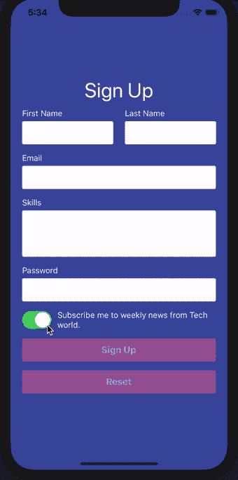

# 在 React Native 中创建一个 FormBuilder 组件(第 7 部分)

> 原文：<https://dev.to/dev_nope/create-a-formbuilder-component-in-react-native-part-7-32c7>

本系列内容:

*   [第 1 部分:创建新的 React 原生应用](https://dev.to/dev_nope/create-a-formbuilder-component-in-react-native-intro--part-1-1m84)
*   [第 2 部分:创建一个简单的工资计算器表单](https://dev.to/dev_nope/create-a-formbuilder-component-in-react-native-part-2-2dec)
*   [第 3 部分:创建自定义表单输入和按钮组件](https://dev.to/dev_nope/create-a-formbuilder-component-in-react-native-part-3-1aib)
*   [第四部分:关于`FormBuilder`组件的工作](https://dev.to/dev_nope/create-a-formbuilder-component-in-react-native-part-4-5gc3)
*   [第 5 部分:即时启用/禁用表单按钮](https://dev.to/dev_nope/create-a-formbuilder-component-in-react-native-part-5-535h)
*   [第 6 部分:创建注册表单](https://dev.to/dev_nope/create-a-formbuilder-component-in-react-native-part-6-2ohd)
*   第 7 部分:添加对布尔字段类型的支持(当前)

# 第 7 部分:增加对布尔字段类型的支持

既然我们已经验证了我们的`FormBuilder`在创建新表单时工作得非常好，那么让我们看看如何添加对新字段类型的支持——在我们的例子中是一个`Boolean`字段。

### 创建一个新的`FormBooleanInput`组件

让我们首先创建一个新的自定义组件，它将为我们呈现一个布尔字段。我们称之为`FormBooleanInput`:

```
import React from 'react';
import PropTypes from 'prop-types';
import {
    View, Switch, Text, StyleSheet,
} from 'react-native';

/**
 * A stateless function component which renders a Boolean input (Switch).
 *
 * @param {obj} props
 */
const FormBooleanInput = (props) => {
    const { labelText, ...inputProps } = props;

    return (
        <View style={styles.switchWrapper}>
            <Switch {...inputProps} />
            {labelText && <Text style={styles.label}>{labelText}</Text>}
        </View>
    );
};

FormBooleanInput.propTypes = {
    labelText: PropTypes.string,
};

FormBooleanInput.defaultProps = {
    labelText: null,
};

const styles = StyleSheet.create({
    switchWrapper: {
        flex: 1,
        marginBottom: 15,
        paddingHorizontal: 10,
        flexDirection: 'row',
        alignItems: 'center',
    },
    label: {
        flex: 1,
        color: '#FFF',
        marginLeft: 10,
    },
});

export default FormBooleanInput; 
```

正如你所看到的，这是一个非常基本的组件，它呈现出一个带有标签的[开关](https://facebook.github.io/react-native/docs/switch)反应本地组件(如果提供的话)。

### 向`Sign Up`表单添加一个新字段

让我们使用我们在上一篇文章中创建的注册表单，并向它添加一个新字段，假设这将允许用户订阅邮件列表。该字段的“定义”如下所示:

```
[
    {
        name: 'subscribe',
        label: 'Subscribe me to weekly news from Tech world.',
        type: 'boolean',
        defaultValue: true,
    },
] 
```

您可能已经注意到了新的`defaultValue`字段属性。我们将使用它来为我们的任何表单字段提供默认值。关于我们将如何实现这个逻辑的细节，请参见下一节。

### 在`FormBuilder`组件中添加对`boolean`字段的支持

在这里，我们需要做一些改变:

*   通过使用`defaultValue`字段的属性，允许表单字段具有预定义的默认值。让我们创建一个助手函数，它将为我们检测给定字段的默认值。

```
/**
 * Determine what should be the default value
 * for a given field.
 */
getFormFieldDefaultValue = ({ defaultValue, type }) => {
    if (defaultValue !== undefined) {
        return defaultValue;
    }

    switch (type) {
    case 'boolean':
        return false;
    default:
        return '';
    }
}; 
```

现在我们可以像这样在我们的`constructor()`中使用这个函数:

```
const formFieldNames = formFields.reduce((obj, field) => {
    obj[field.name] = this.getFormFieldDefaultValue(field);
    return obj;
}, {}); 
```

*   更新我们的`hasValidFormData()`助手函数，忽略`boolean`字段类型，因为这种类型的字段总是有一个值(或者是`true`或者是`false`)。更新后的版本如下所示:

```
hasValidFormData = () => {
    const formFields = this.getFormFields();
    const isFilled = formFields
        // filter out Boolean fields because they will always have a value
        .filter(field => field.type !== 'boolean')
        // check if all remaining fields have been filled out
        .every(field => !!this.state[field.name]);

    return isFilled;
}; 
```

*   更新我们的`hasDirtyFormData()`助手函数，并使用不同的方法来检测`boolean`字段是否改变了它的值，如下所示:

```
hasDirtyFormData = () => {
    const formFields = this.getFormFields();
    const isDirty = formFields.some((field) => {
        switch (field.type) {
        case 'boolean':
            // because Boolean fields will have a default value,
            // we need to check if the current value is not the default one
            return this.state[field.name] !== this.getFormFieldDefaultValue(field);

        default:
            return !!this.state[field.name];
        }
    });

    return isDirty;
}; 
```

*   创建一个新的`renderBooleanInput()`助手函数，它将为我们呈现出`FormBooleanInput`组件。功能跟现有的`renderTextInput()`没太大区别。可能主要的区别是使用了 [onValueChange](https://facebook.github.io/react-native/docs/switch#onvaluechange) 道具而不是 [onChangeText](https://facebook.github.io/react-native/docs/textinput#onchangetext) 。

```
renderBooleanInput = ({ name, label, inputProps }) => (
    <FormBooleanInput
        {...inputProps}
        value={this.state[name]}
        onValueChange={(value) => {
            this.setState({ [name]: value });
        }}
        labelText={label}
        key={name}
    />
); 
```

*   最后，让我们更新组件的`render()`函数，并呈现出`boolean`字段(如果有提供的话)。

```
{formFieldsRows.map((formFieldsRow, i) => (
    <View style={styles.row} key={`r-${i}`}>
        {formFieldsRow.map((field) => {
            switch (field.type) {
            case 'boolean':
                return this.renderBooleanInput(field);

            default:
                return this.renderTextInput(field);
            }
        })}
    </View>
))} 
```

就是这样！让我们看看表单在这一点上是如何工作的:

[](https://res.cloudinary.com/practicaldev/image/fetch/s--oeHuJuA8--/c_limit%2Cf_auto%2Cfl_progressive%2Cq_66%2Cw_880/https://thepracticaldev.s3.amazonaws.com/i/bqpahidel51rz5325c0p.gif)

要查看完整的变更列表，请查看 GitHub 上的这个[提交。](https://github.com/vasilestefirta/react-native-form-builder/commit/87d8ca9417c15ead4825fcfe462f051cb3572061)

* * *

就这样，我的朋友们！🙂🚀🚢我认为我们已经介绍了足够多的内容，让您了解如何从头开始构建自己的`FormBuilder`组件。🏗️:尽管我将在这里结束这个系列，但是我们仍然有很多东西可以应用到这个助手组件中(例如，对可选字段的支持，对新字段类型的支持，等等。)，但是让我们把它当作你的家庭作业👨‍💻👩‍💻。

* * *

### 奖励链接🎁

以下是我用来开始使用 React Native 的一些好资源:

*   https://reactjs.org/docs/getting-started.html(在深入 React Native 之前，你必须了解 React 是如何工作的)
*   [https://redux.js.org/basics](https://redux.js.org/basics)(如果你刚刚开始使用 React Native，这是可选的，但是当你要构建更复杂的应用时，你可能需要使用 Redux)
*   [https://facebook.github.io/react-native/](https://facebook.github.io/react-native/)
*   [http://www.reactnativeexpress.com/](http://www.reactnativeexpress.com/)

包装:

*   https://reactnavigation.org(当你想在屏幕间导航或创建某种选项卡式应用程序时，使用这个包。它有很好的文档记录，我使用它没有任何问题。)
*   [https://github.com/react-native-community](https://github.com/react-native-community)(一个了不起的组织，为社区创造了许多伟大的软件包)
*   [https://github.com/zo0r/react-native-push-notification](https://github.com/zo0r/react-native-push-notification)
*   [https://github.com/invertase/react-native-firebase](https://github.com/invertase/react-native-firebase)

应用程序图标+闪屏设置(这总是一个棘手的部分，所以下面的链接肯定帮助了我):

*   [https://medium . com/@ scottian Stewart/react-native-add-app-icons-and-launch-screens-on-IOs-and-Android-apps-3 bfbc 20 b 7d 4 c](https://medium.com/@scottianstewart/react-native-add-app-icons-and-launch-screens-onto-ios-and-android-apps-3bfbc20b7d4c)
*   [https://medium . com/handle-labs/how-to-add-a-splash-screen-to-a-react-native-app-IOs-and-Android-30 a3 CEC 835 AE](https://medium.com/handlebar-labs/how-to-add-a-splash-screen-to-a-react-native-app-ios-and-android-30a3cec835ae)

编码快乐！👨‍💻👩‍💻👍