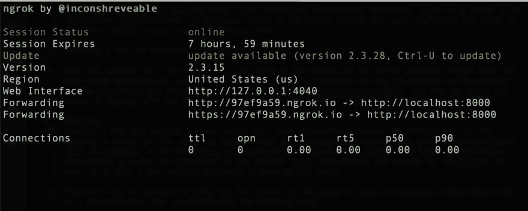

# 用 Python 和 Ngrok 创建一个快速本地 Web 服务器

> 原文：<https://dev.to/stmcallister/create-a-quick-local-web-server-with-python-and-ngrok-k0>

开始一份新工作的好处之一是，你必须从头开始设置所有的开发工具和环境。一些你认为永远不会忘记的事情顽固地隐藏在更容易回忆起来的记忆后面。

这就是我最近的情况。在一台只有几周历史的机器上，我需要制作一个外部世界可以快速访问的 HTML 文件。我以前做过几十次，但无论如何，我都记不起完成这项工作所需要的确切工具。

后来，经过一番搜寻，雾消散了。我只需要运行一个 Python 命令来启动本地 web 服务器。然后，使用一个名为 [ngrok](https://ngrok.com/) 的工具，我可以让全世界都可以访问这个服务器。

这篇博文更多的是针对我错误记忆的保险政策，所以我可以很容易地在未来提醒自己这些事情。然而，如果你对此感兴趣，我们非常欢迎你继续阅读。首先，让 Python web 服务器运行在端口 8000 上。

### 巨蟒

几乎不需要任何配置(尤其是在 macOS 上)就能启动 web 服务器的一个超级快速的方法是使用 Python 的 SimpleHttpServer。在 Python 2.7(这是 macOS 的默认版本)中，服务器是通过运行`python -m SimpleHTTPServer 8000`来启动的。

在 Python 3 中，这可以通过运行`python -m http.server 8000`来完成。

使用这个命令，`SimpleHTTPServer`将在端口 8000 上提供当前目录的内容。可以在这里指定任何端口，但是要确保它不是当前正在使用的端口。通过将浏览器指向 [http://localhost:8000/](http://localhost:8000/) ，可以在本地访问这些内容。既然简单的 web 服务器正在运行，那么是时候配置 ngrok，使这个服务器可以被整个互联网访问。

### ngrok

Ngrok 是一个工具，它为本地应用程序访问 Internet 以及 Internet 访问它提供了一个安全的隧道。当演示或测试网站而不需要部署它们时，这种隧道技术很方便。例如，如果您正在构建一个订阅 webhooks 的应用程序，而这些 webhooks 需要一个回调 URL 来访问您机器上的应用程序，ngrok 将为 webhooks 提供该地址以供调用。就我而言，我只需要一种简单的方法来提供 HTML 文件。

ngrok 有很多特性，但是本文只关注在指定的端口上提供一个简单的 http 隧道。这可以通过以下步骤完成:

*   从 [ngrok 下载页面](https://ngrok.com/download)下载 ngrok。
*   提取 ngrok 可执行文件，放在你觉得有意义的地方。我把它放在`/Applications/Utilities`里。
*   要将`ngrok`可执行文件放入`PATH`中，以便它可以在系统的任何地方执行，在`/usr/local/bin/`中创建一个符号链接，指向`ngrok`保存的位置。如果它在实用程序目录中，如上所述，符号链接命令应该是这样的`ln -s /Application/Utilities/ngrok /usr/local/bin/ngrok`
*   转到运行`SimpleHTTPServer`的目录，运行下面的命令`ngrok http 8000`

然后，ngrok 输出显示以下内容:

您正在寻找的重要部分是`Forwarding`的值。本地 web 服务器现在将在`x.ngrok.io`域中可见。当向此隧道发出请求时，结果会记录在 ngrok CLI 的连接部分。对于 ngrok 的免费版本，这个会话将持续 8 个小时。当 ngrok 进程到期或重新启动时，地址中的子域值将会改变。如果你在寻找一个一致的地址，我相信你可以从 ngrok 购买一个许可证。

现在有了这两个简单的工具，你就可以随心所欲地旋转可公开访问的网络服务器。