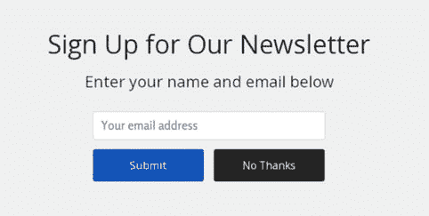
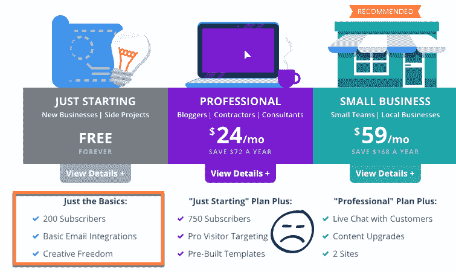
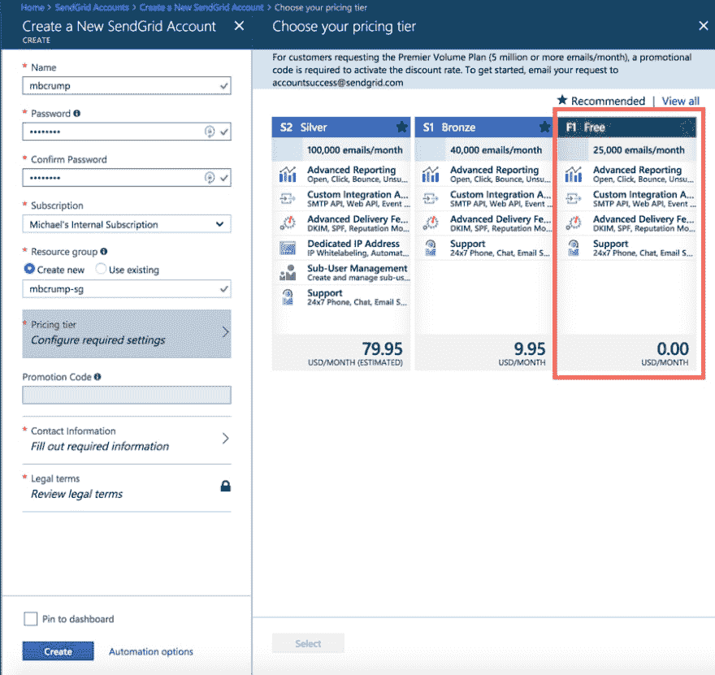
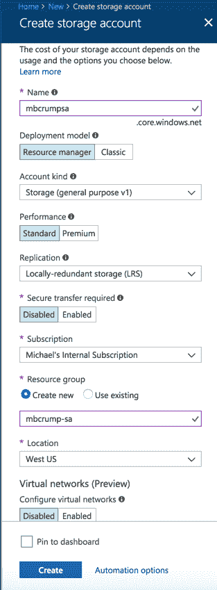
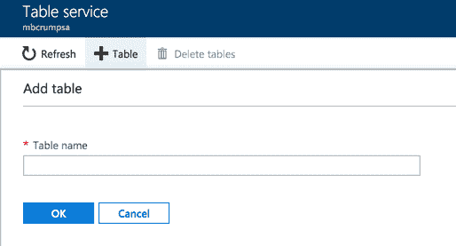
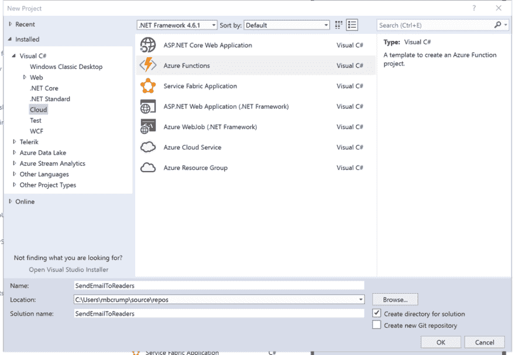
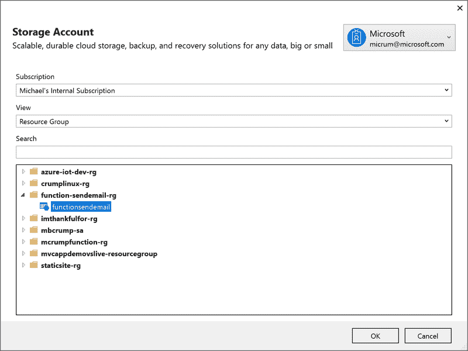
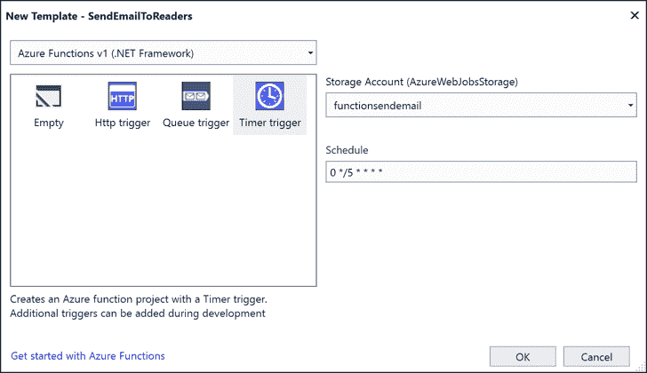

# 使用 Azure 功能创建电子邮件订阅-第 1 部分

> 原文：<https://dev.to/azure/create-an-email-subscription-with-azure-functions-part-1-1m0k>

*我们选择了由[迈克尔·克伦普](https://twitter.com/mbcrump)创造的我们最喜欢的技巧和诀窍，并在整个四月在 Azure 上提供新的技术内容！错过一天(或更多)？[赶上系列](https://dev.to/t/azureapril)。*

**没有天蓝色？** [抢免费订阅](https://azure.microsoft.com/en-us/free?&WT.mc_id=azureapril_devto-blog-cxa)。

这是关于如何使用 Azure 功能构建无服务器电子邮件订阅服务的 4 部分系列文章中的第一篇。

我们以前都见过 then，我必须承认，在我开始写这个 Azure 提示和技巧系列之前，我从未真正研究过它。

我们都忙得不可开交，所以有人给你一个电子邮件地址，通知你有新帖子，这似乎是个好主意。好吧，所以我想这样做，并开始寻找提供这种服务的网站。环顾四周，我不断发现这个:

大多数公司为你提供一定数量的免费用户，一旦超过这个数量，你就会很快进入付费版本。

因为我喜欢时不时地省下一便士，并且意识到我的用户数量已经超过了免费账户的数量(200)，所以我决定推出自己的账户。但是我需要什么呢？

## 我要求滚我自己的

我对创建电子邮件订阅的要求如下:

*   一种免费或非常非常便宜的给人们发邮件的方式。
*   用于保存电子邮件地址的存储器，以及指示他们是否想要退订的方式。
*   人们可以填写的网页，可以进行 POST 呼叫。
*   在云中运行的代码(1)按计划运行，以及(2)基于 POST 请求执行操作。
*   Visual Studio 和 C#因为我对它们很熟悉。

## 我的堆栈

逛了一会儿后，我发现了以下内容:

*   SendGrid 将处理电子邮件(每月 25，000 封免费邮件)
*   Azure 存储表保存电子邮件地址和订阅状态(这给了我无限数量的订户)。
*   带有 Azure 函数的计时器触发器，按计划运行以发送电子邮件。(每周运行并检索我最近 7 天的博客帖子)
*   带有 Azure 函数的 HTTP 触发器收集来自我的网站的帖子数据，其中包含有人键入的电子邮件地址和订阅状态。
*   Azure Functions 支持 Visual Studio 工具和完整的。NET 框架。(万一，我想用以外的东西。网络核心)

## 创建 SendGrid 帐户

转到 Azure 门户并搜索 SendGrid 服务，然后创建一个如下所示的帐户。你会注意到我使用了免费账户，因为它对我想要完成的事情来说已经足够好了。

配置完成后，转到您的 SendGrid 帐户，点击“管理”,它会将您带到[https://app.sendgrid.com/](https://app.sendgrid.com/)。从 SendGrid 门户，您将需要获取您的 API 密钥。您可以在“设置”,然后“API 密钥”下找到它。给你的 API 密匙取一个名字，然后给它完全访问权，点击创建和查看。现在您已经有了 API 密钥，请将它保存在安全的地方。

## 创建 Azure 存储表

返回 Azure 门户，点击创建资源，选择 Azure 存储。我们将保持如下所示的简单来开始。

完成后，进入资源并在服务下查找。

继续点击 Tables，您可以通过门户创建一个新表，如下所示。

继续给表格起一个你能记住的名字，在 Settings 下查看，然后访问 Keys 并复制连接字符串，因为我们很快就会用到它。

现在我们已经创建了 SendGrid 帐户和 Azure 存储表。我们可以继续了。

## 打开 Visual Studio

打开 Visual Studio，选择 Cloud 节点下的模板，创建一个 C# Azure 函数应用，如下图所示:

在“存储”下，将默认模拟器更改为我们之前创建的 Azure 存储帐户:

我们将从使用定时器触发器开始，并将所有内容保留为默认值。

一旦项目启动，我们将使用 NuGet 获取对以下内容的引用:

*   WindowsAzure。使用 Azure 表存储的存储。
*   微软。windows azure . configuration manager 来隐藏我们的 API 键
*   发送网格来发送我们的电子邮件
*   系统。使用 RSS 提要的 ServiceModel . Syndication 使用预发布包来查找它

暂时就这样吧！我们明天做第二部分

想要更多 Azure 功能？查看我们的[快速入门和教程](https://docs.microsoft.com/azure/azure-functions/?WT.mc_id=azureapril_devto-blog-cxa)！

* * *

我们将在 4 月份每天发布文章，所以请继续关注或提前查看更多提示和技巧[现在](http://azuredev.tips)。