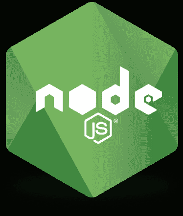
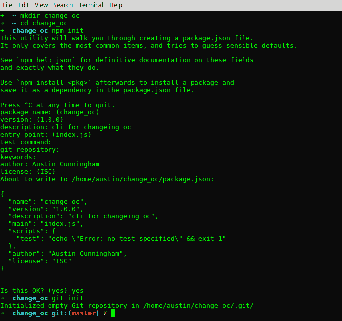
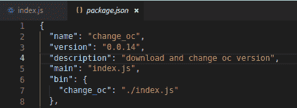

# 创建节点命令行应用程序

> 原文：<https://dev.to/austincunningham/create-node-command-line-app-4a49>

[](https://res.cloudinary.com/practicaldev/image/fetch/s--zxIFlYwS--/c_limit%2Cf_auto%2Cfl_progressive%2Cq_auto%2Cw_880/https://cdn-images-1.medium.com/max/800/1%2AYhe1R94CIotr2se7Wf6TQQ.png%3Fstyle%3Dcenterme)

我想创建一个命令行节点模块。首先，我创建了我的项目目录 change_oc，并用 **npm init** 初始化我的项目，除了缺省值

[](https://res.cloudinary.com/practicaldev/image/fetch/s--7eL73GqD--/c_limit%2Cf_auto%2Cfl_progressive%2Cq_auto%2Cw_880/https://cdn-images-1.medium.com/max/800/1%2AO-eU1pzEijMQpFvBswALkA.png%3Fstyle%3Dcenterme)

我创建了 **index.js** 文件，并给了它以下代码

[](https://res.cloudinary.com/practicaldev/image/fetch/s--GFPL9J1v--/c_limit%2Cf_auto%2Cfl_progressive%2Cq_auto%2Cw_880/https://cdn-images-1.medium.com/max/800/1%2A8umHJmVTwj-3HBt8fcgLlA.png%3Fstyle%3Dcenterme)

我编辑了 **package.json** 文件并添加了 **bin** ，给它起了我的包名并指向我的主节点文件 index.js

[](https://res.cloudinary.com/practicaldev/image/fetch/s--i3gRNR2T--/c_limit%2Cf_auto%2Cfl_progressive%2Cq_auto%2Cw_880/https://cdn-images-1.medium.com/max/800/1%2A1Mb-U9IERFpyiis39bRgaA.png%3Fstyle%3Dcenterme)

我需要更改 index.js 文件的权限，以便它可以在操作系统中运行

```
chmod 775 index.js 
```

Enter fullscreen mode Exit fullscreen mode

就这样，这个包现在可以从命令行执行了，但是它不做任何事情，所以在 index.js 中添加一个 console.log 进行测试。

[](https://res.cloudinary.com/practicaldev/image/fetch/s--HgrKGTT7--/c_limit%2Cf_auto%2Cfl_progressive%2Cq_auto%2Cw_880/https://cdn-images-1.medium.com/max/800/1%2AFpI5Hjbj9nu6Zg4jCdmewQ.png%3Fstyle%3Dcenterme)

从包目录中全局安装这个包，然后可以使用 package.json 中用 bin 设置的值来运行它，例如

```
$ npm install -g
$ change_oc
This is like Echo in the command prompt 
```

Enter fullscreen mode Exit fullscreen mode

在这一点上，你认为伟大的，但我能做什么。Node 有一些内置的组件，对于命令行应用程序非常有用。

> [fs](https://nodejs.org/api/fs.html)
> 
> [子进程](https://nodejs.org/api/child_process.html)

一个简单的例子和用例

```
 #!/usr/bin/env node 
const colors = require('colors/safe');
const readlineSync = require('readline-sync');
const execsync = require('child_process').execSync;
const fs = require('fs');

console.log('This is like Echo in the command prompt');

// npm install colors/safe --save
console.log(colors.yellow('colours work like this'))

// fs has alot of methods but this is one I found useful
// Check to see if /usr/bin/oc exists if not create it
if (!fs.existsSync('/usr/bin/oc')) {
  //execSync can be used to execute any os command
  execsync('sudo touch /usr/bin/oc');
}

// setting up a prompt for user interface 
// npm install readline-sync --save
const result = readlineSync.question(colors.blue('Do you wish to do something else yes/no ? '));
  if (result === 'yes' || result === 'y') {
    // add your logic here
  } 
```

Enter fullscreen mode Exit fullscreen mode

**注意**:我推荐使用同步命令，如果你在等待用户输入或磁盘写进程，异步命令可能不总是按照你希望的顺序执行。
这是你可能想发布给 [npmjs](https://hackernoon.com/publish-your-own-npm-package-946b19df577e) 的基本信息。

**注意**:要在操作系统中使用命令行节点模块，需要全局安装它们。
我的 cli 项目在 [npmjs](https://www.npmjs.com/package/change_oc) 和 [github](https://github.com/austincunningham/change_oc) 供进一步参考。

[我的博客](https://austincunningham.ddns.net)